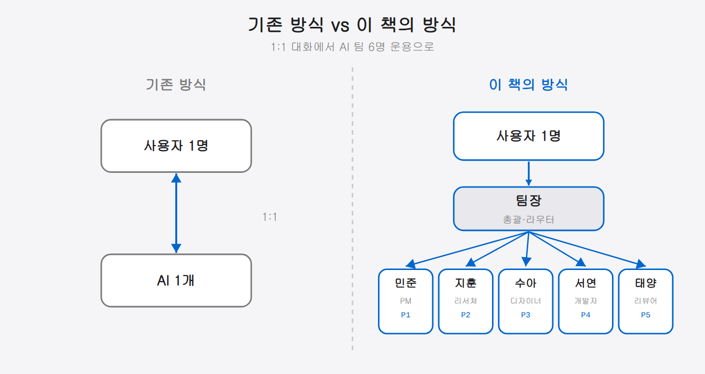

## 01-1. 이 책의 목적과 대상 독자

## 왜 이 책을 쓰게 되었는가

2026년 현재, AI 코딩 어시스턴트는 더 이상 신기한 도구가 아니다. 개발자라면 누구나 한 번쯤 AI에게 코드를 요청해본 경험이 있을 것이다. 그러나 대부분의 사용자는 여전히 **하나의 창에서 하나의 AI와 일대일 대화**를 나누는 방식에 머물러 있다.

만약 AI 에이전트를 **여러 명 동시에 운용**할 수 있다면 어떨까? PM이 설계를 하는 동안 개발자가 코드를 짜고, 리뷰어가 품질을 검토하는 — 마치 실제 개발팀처럼 AI를 구성할 수 있다면?

이 책은 바로 그 질문에서 시작되었다. **Claude Code**와 **TMUX**를 결합하여 멀티에이전트 팀을 구성하고, **Remote-Control** 기능으로 어디서든 이 팀을 지휘하는 실전 방법을 다룬다.

> 💡 **처음 보는 용어 미리보기** (자세한 내용은 본문에서 차근차근 다룬다)
> - **Claude Code**: 터미널에서 AI와 대화하며 코드를 작성하고 실행하는 명령줄 도구.
> - **TMUX**: 하나의 터미널 화면을 여러 칸으로 나눠 여러 작업을 동시에 돌리는 도구. 이 칸 하나하나가 AI 팀원 한 명이 된다.
> - **멀티에이전트**: AI 한 명이 아니라, 역할이 다른 AI 여러 명을 동시에 운용하는 방식.
> - **Remote-Control**: 모바일·웹에서 이 AI 팀을 원격으로 지휘하는 기능.

## 이 책에서 다루는 내용

이 책은 크게 세 가지 영역을 다룬다. 아래 순서대로 한 단계씩 쌓아 올리는 구성이다.

**① 환경 구축**에서 시작해 **② Remote-Control 연동**으로 이어지고, **③ 실전 운용**으로 마무리된다. 세 단계는 따로 노는 주제가 아니라 앞 단계가 다음 단계의 토대가 되는 구조다. 그래서 건너뛰지 말고 위에서 아래로 한 단계씩 쌓아 올리며 따라오는 것이 가장 빠른 길이다.

### 1. 환경 구축

Ubuntu(WSL2 포함) 위에 Claude Code와 TMUX를 설치하고, 6개의 파인(Pane)으로 구성된 팀 에이전트 환경을 만드는 과정을 안내한다.

| Pane | 이름 | 역할 |
|------|------|------|
| 0 | 팀장 | 총괄·라우터 |
| 1 | 민준 | PM·아키텍트 |
| 2 | 지훈 | 리서쳐 |
| 3 | 수아 | 디자이너 |
| 4 | 서연 | 개발자 |
| 5 | 태양 | 리뷰어 |

### 2. Remote-Control 연동

Claude Code의 Remote-Control 기능을 활성화하여 **모바일 앱이나 웹 브라우저에서 팀 에이전트를 원격 제어**하는 방법을 상세히 설명한다. 출퇴근길 지하철에서도, 카페에서도 팀에게 지시를 내릴 수 있다.

### 3. 실전 운용

Remote-Control, Bot Mode, 업무 분담 전략 등 **실제 팀을 운용하면서 축적된 노하우**를 공유한다. 이론이 아닌 실전 경험에 기반한 내용이다.

## 대상 독자

이 책은 다음과 같은 독자를 위해 작성되었다.

| 대상 | 설명 |
|------|------|
| **AI 활용에 관심 있는 개발자** | Claude Code를 사용해본 적 있으나 멀티에이전트 구성은 처음인 분 |
| **팀 생산성을 높이고 싶은 리드** | AI를 팀 단위로 활용하여 개발 속도를 높이려는 테크 리드 |
| **1인 개발자** | 혼자서 여러 역할(PM, 개발, 리뷰)을 AI에게 분담시키고 싶은 분 |
| **DevOps/자동화 엔지니어** | CI/CD 파이프라인에 AI 에이전트를 통합하려는 분 |

### 사전 지식

다음 정도의 기본 지식이 있으면 이 책을 따라가는 데 어려움이 없다.

- **Linux 터미널 기본 조작** — `cd`, `ls`, `cat` 같은 기본 명령어
- **Git 기본 워크플로우** — `commit`, `push`, `branch` 정도
- **마크다운 문법** — CLAUDE.md 파일을 작성해야 하므로

TMUX를 처음 접하더라도 괜찮다. 2장에서 설치부터 기본 명령어까지 차근차근 안내한다.

## 이 책을 읽는 방법

순서대로 읽는 것을 권장하지만, 이미 Claude Code와 TMUX에 익숙하다면 **4장(Remote-Control)**이나 **7장(실전 운용)**부터 시작해도 된다.

독자 유형에 따라 추천하는 읽기 경로는 다음과 같다.

1. **입문자** — 1장부터 순서대로 읽는다. 특히 환경 구축(2장)은 반드시 직접 따라 한다.
2. **Claude Code 경험자** — 2장은 가볍게 훑고 4장(Remote-Control)부터 본격적으로 본다.
3. **빠른 실전 적용형** — 7장(실전 운용)의 예시를 먼저 보고, 필요한 개념이 나오는 장으로 거슬러 올라간다.

세 갈래는 시작점만 다를 뿐 도착점은 같다. 입문자는 1장에서, 경험자는 4장에서, 빠른 실전형은 7장에서 책에 올라타지만, 결국 모두 **직접 굴러가는 나만의 AI 팀**이라는 같은 목적지에서 만난다. 그러니 지금 자신의 위치에 가장 가까운 진입점을 고르면 된다 — 어디서 시작하든 길은 이어져 있다.

각 장의 코드 예시는 **복사하여 바로 실행할 수 있도록** 작성했다. 읽기만 하지 말고, 직접 터미널을 열어 따라 해보길 권한다. AI 팀을 직접 만들어보는 순간, "아, 이게 되는구나" 하는 감각이 올 것이다.

> **한 줄 요약**: 이 책은 Claude Code + TMUX + Remote-Control로 AI 팀 에이전트를 구성하고 원격으로 지휘하는 실전 가이드다.
