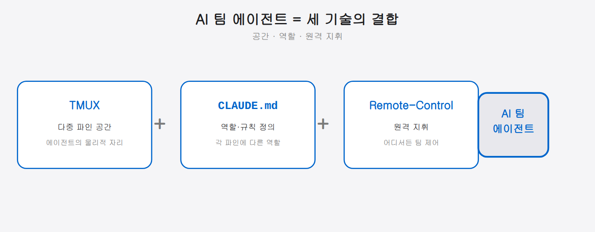
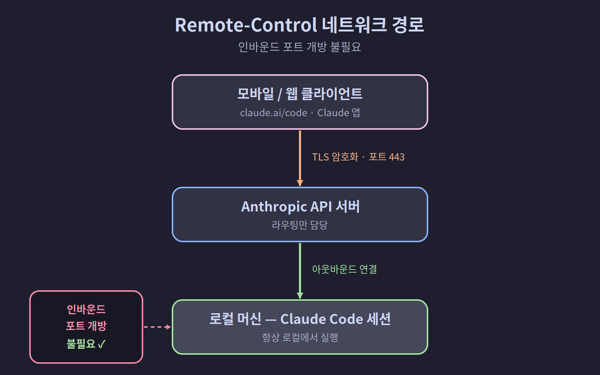

## 01-2. Remote-Control 팀 에이전트란 무엇인가

## 기존 AI 사용 방식의 한계

대부분의 개발자가 AI 코딩 어시스턴트를 사용하는 방식은 이렇다.

```
[개발자] → [AI 챗봇] → [응답]
```

하나의 터미널(또는 웹 인터페이스)에서 하나의 AI와 대화한다. 질문을 던지고, 답을 받고, 다시 질문한다. 이 방식에는 몇 가지 근본적인 한계가 있다.

1. **단일 컨텍스트** — 하나의 대화창에서 설계, 구현, 리뷰를 모두 처리하면 컨텍스트가 뒤섞인다
2. **순차 처리** — 한 번에 하나의 작업만 진행할 수 있다. 리서치가 끝나야 설계를, 설계가 끝나야 구현을 시작한다
3. **디바이스 종속** — 터미널을 닫으면 세션이 끊긴다. 자리를 비우면 작업도 멈춘다

> **컨텍스트(context)란?** AI가 현재 대화에서 기억하고 있는 내용 전체를 말한다. 한 창에서 여러 주제를 섞으면 이 기억이 뒤엉켜, AI가 엉뚱한 답을 내놓기 쉽다.

세 한계는 사실 하나의 전제에서 나온다. **"AI를 한 명만, 한 창에서, 내 앞에서만 쓴다"**는 전제다. 컨텍스트가 섞이는 것도, 작업이 줄서서 기다리는 것도, 자리를 뜨면 멈추는 것도 모두 이 전제의 결과다. 이 전제를 깨면 세 한계가 한꺼번에 풀린다. 그것이 다음 절에서 다룰 팀 에이전트 방식이다.

---

**일대일 방식의 병목을 눈으로 확인하기**

다음 시나리오를 상상해보자. "결제 기능을 구현해줘"라고 하나의 AI에게 맡기면, AI는 다음 작업을 **줄을 세워서** 처리한다.

```
[1] 요건 분석 (10분)
    ↓ 완료 후
[2] 아키텍처 설계 (15분)
    ↓ 완료 후
[3] 코드 구현 (30분)
    ↓ 완료 후
[4] 코드 리뷰 (10분)
총 소요: 65분 (직렬)
```

팀 에이전트 방식에서는 이렇게 바뀐다:

```
[1] 요건 분석 ──────────────────→ (10분, 팀장)
                 ↓ 동시에
[2] 아키텍처 설계 ──→ (15분, PM)
[3] 코드 구현 ──────→ (설계 후 즉시, 개발자)
[4] 코드 리뷰 ──────→ (구현 후 즉시, 리뷰어)
총 소요: ~30분 (부분 병렬)
```

팀 에이전트는 같은 일을 절반 시간에 끝낸다.

<hr>

## Remote-Control 팀 에이전트의 개념

이 책에서 제안하는 방식은 완전히 다르다.


세 가지 기술의 결합이 핵심이다. 아래 세 기술이 각각 "공간 · 역할 · 원격 지휘"를 담당해 하나의 팀 시스템을 이룬다.



### 1. TMUX

TMUX는 하나의 터미널 안에 여러 개의 독립된 창(파인)을 만들 수 있는 터미널 멀티플렉서다. 각 파인에서 별도의 Claude Code 인스턴스를 실행하면, **물리적으로 분리된 여러 AI 에이전트**가 탄생한다.

```bash
# 6개의 파인으로 팀 구성
tmux new-session -s team
tmux split-window -h
tmux split-window -v
# ... 각 파인에 Claude Code 실행
```

각 에이전트는 **독립된 컨텍스트**를 가진다. PM의 대화가 개발자의 코드 작성을 방해하지 않는다.

> **터미널 멀티플렉서(Terminal Multiplexer)란?** "멀티플렉서"는 원래 여러 신호를 하나의 채널로 합치는 통신 장비를 뜻합니다. TMUX는 하나의 터미널 창을 여러 독립된 작업 공간으로 나눠주는 소프트웨어입니다. 화면 분할 외에도 세션을 백그라운드에 유지시켜 SSH 연결이 끊겨도 작업이 계속 돌아가게 해주는 것이 핵심 기능입니다.

---

### 2. CLAUDE.md

CLAUDE.md 파일은 Claude Code의 행동 규칙을 정의하는 설정 파일이다. 각 에이전트에게 서로 다른 역할을 부여할 수 있다.

```markdown
# 서연 (개발자)
## 역할
- 코드 구현 담당
- 팀장의 지시에 따라 기능 개발
- 커밋 전 자체 테스트 수행

## 규칙
- 직접 판단으로 아키텍처 변경 금지
- 구현 완료 시 팀장에게 보고
```

> **CLAUDE.md가 AI 팀원의 "직무 기술서"** CLAUDE.md는 신입사원이 받는 직무 기술서와 같습니다. "당신은 개발자입니다. 이런 규칙을 따르세요"라고 명시해두면, Claude Code는 그 역할에 맞게 동작합니다. 파일 내용을 바꾸면 역할을 즉시 바꿀 수 있습니다. 사람을 채용하지 않아도 됩니다.

각 파인마다 다른 내용의 CLAUDE.md를 두면, 같은 Claude Code 엔진이라도 완전히 다른 역할의 팀원으로 동작한다.

---

### 3. Remote-Control

Claude Code의 Remote-Control 기능은 로컬에서 실행 중인 세션을 **다른 기기에서 제어**할 수 있게 한다.

```bash
# 로컬에서 Remote-Control 활성화
claude --remote-control "팀 에이전트"
```

이후 **claude.ai/code** 웹사이트나 **Claude 모바일 앱**에서 해당 세션에 접속해 지시를 내린다. 세션은 로컬 머신에서 계속 실행되므로, 모바일에서 접속해도 로컬 파일시스템과 모든 도구에 접근 가능하다.

> **Remote-Control과 화면 공유의 차이** 화면 공유(예: TeamViewer)는 원격에서 전체 화면을 조작합니다. Remote-Control은 Claude Code 세션에만 접속합니다. 화면 전체를 넘기는 것이 아니라, 특정 AI와의 대화 채널만 원격으로 열어주는 방식입니다. 훨씬 가볍고 보안 위험도 적습니다.

<hr>

## 전통적 팀 vs. AI 팀 에이전트

| 비교 항목 | 인간 팀 | AI 팀 에이전트 |
|-----------|---------|----------------|
| 가용 시간 | 업무 시간 | 24시간 |
| 역할 전환 | 채용·교육 필요 | CLAUDE.md 수정으로 즉시 |
| 동시 작업 | 인원 수에 비례 | TMUX 파인 수만큼 |
| 커뮤니케이션 | 회의·슬랙 | TMUX `send-keys` |
| 원격 지휘 | 메신저·이메일 | Remote-Control |
| 비용 | 인건비 | API 토큰 비용 |

> **AI 팀이 인간 팀보다 뛰어난 점** "가용 시간 24시간"이 단순히 야근 가능을 의미하는 게 아닙니다. 내가 자는 동안에도, 이동하는 동안에도 팀은 작업을 계속합니다. 지시 한 번으로 새벽까지 팀이 돌아가고, 아침에 결과만 확인하는 운용 방식이 실제로 가능합니다.

<hr>

## 실제 활용 시나리오

### 시나리오: 새 기능 개발

1. **출근길 지하철에서** — 모바일 앱으로 팀장에게 지시: "결제 모듈 리팩토링 시작해줘"
2. **팀장이 분석** — 작업을 분해하여 팀원에게 분배
3. **PM(민준)** — 기존 결제 흐름 분석, 새 아키텍처 설계
4. **개발자(서연)** — PM의 설계에 따라 코드 구현
5. **리뷰어(태양)** — 구현된 코드 리뷰 및 피드백
6. **사무실 도착** — 터미널에서 진행 상황 확인, 필요한 부분만 수정

이 모든 과정이 **하나의 TMUX 세션** 안에서 돌아가고, **Remote-Control**로 어디서든 개입할 수 있다.

여기서 눈여겨볼 것은 **시간의 흐름**이다. 1번(출근길)과 6번(사무실 도착)은 사람이 직접 움직인 시간이지만, 2~5번은 그 사이에 팀이 알아서 굴러간 시간이다. 지시 한 번을 던져두면 이동하는 동안 분석 → 설계 → 구현 → 리뷰가 차례로 진행되고, 도착했을 땐 결과만 확인하면 된다. 사람이 자리를 비운 시간이 곧 팀의 작업 시간이 된다. 일대일 방식과 가장 다른 점이다.

---

**시나리오를 따라 직접 체험해보기**

아직 환경이 구축되지 않았더라도, 아래 순서를 머릿속으로 그려보자. 2장부터 이 흐름을 직접 구현하게 된다.

```
① 스마트폰에서 모바일 앱 열기
② "결제 모듈 분석해줘" 입력
③ 로컬 PC의 팀장(Pane 0)이 메시지 수신
④ 팀장이 PM에게 tmux send-keys로 분석 지시
⑤ PM이 코드베이스를 읽고 분석 보고
⑥ 모바일 앱에서 실시간으로 결과 확인
```

6단계 흐름이 자연스럽게 그려진다면, 이 책을 읽을 준비가 된 것이다.

<hr>

## Remote-Control의 기술적 특징

Remote-Control이 단순한 원격 접속과 다른 점을 짚어두자.

```
[모바일/웹 클라이언트]
        │
        │ TLS 암호화 (포트 443)
        ▼
[Anthropic API 서버] ← 라우팅만 담당
        │
        │ 아웃바운드 연결 (인바운드 포트 개방 불필요)
        ▼
[로컬 머신 — Claude Code 세션]
```



> **왜 인바운드 포트를 안 열어도 될까?** 보통 외부에서 내 컴퓨터에 접속하려면 방화벽에 "문(포트)"을 열어야 하는데, 이는 보안 위험이 된다. Remote-Control은 내 컴퓨터가 먼저 바깥(Anthropic 서버)으로 연결을 맺는 "아웃바운드" 방식이라, 문을 열지 않고도 원격 제어가 된다.

> **TLS 암호화란?** 인터넷에서 데이터를 주고받을 때 제3자가 내용을 볼 수 없도록 암호화하는 기술입니다. 웹사이트 주소가 `https://`로 시작할 때 사용하는 것과 같은 기술입니다. Remote-Control의 모든 통신은 TLS로 암호화되므로, 공개 Wi-Fi에서 사용해도 내용이 노출되지 않습니다.

**Remote-Control의 주요 특성:**

- **로컬 실행**: 세션은 항상 로컬 머신에서 실행된다. 클라우드로 이전되지 않는다
- **인바운드 포트 없음**: 로컬 머신에 포트를 열 필요가 없다. 보안에 유리하다
- **자동 재연결**: 네트워크가 일시적으로 끊겨도 복구되면 자동으로 재연결된다
- **실시간 동기화**: 모바일에서 보내는 메시지가 즉시 로컬 세션에 반영된다

---

**연결 흐름 직접 확인해보기 (4장에서 자세히 다룸)**

Remote-Control을 활성화하면 터미널에 아래와 같은 메시지가 표시된다:

```bash
$ claude --remote-control "팀 에이전트"
✓ Remote Control enabled
  Session: 팀 에이전트
  Connect at: claude.ai/code
  Status: Waiting for connection...
```

이 메시지가 표시되면 모바일 앱이나 웹에서 해당 세션에 접속할 수 있다. 4장에서 이 과정을 직접 따라한다.

<hr>

> **핵심 정리**: Remote-Control 팀 에이전트란, TMUX로 구성된 다중 Claude Code 인스턴스를 Remote-Control을 통해 어디서든 원격 지휘하는 시스템이다.
