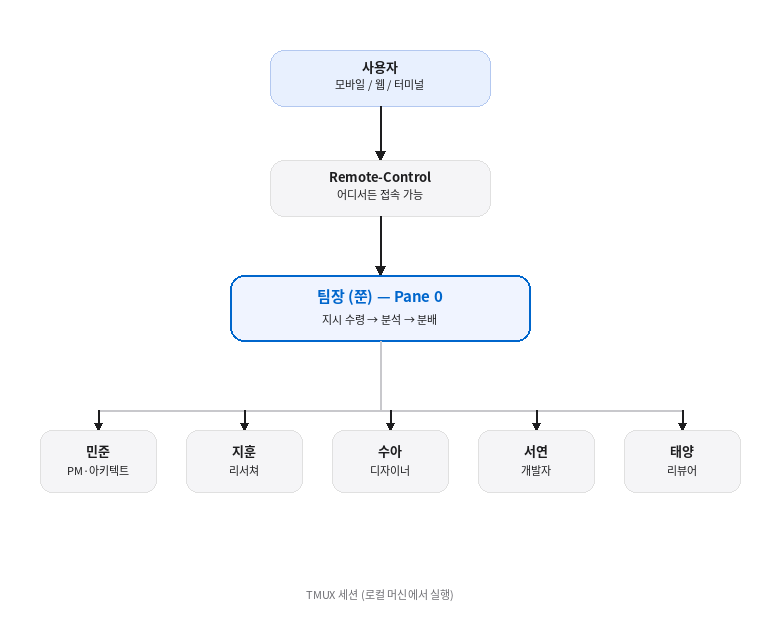

## 1-2. Remote-Control 팀 에이전트란 무엇인가

## 기존 AI 사용 방식의 한계

대부분의 개발자가 AI 코딩 어시스턴트를 사용하는 방식은 이렇다.

```
[개발자] → [AI 챗봇] → [응답]
```

하나의 터미널(또는 웹 인터페이스)에서 하나의 AI와 대화한다. 질문을 던지고, 답을 받고, 다시 질문한다. 이 방식에는 몇 가지 근본적인 한계가 있다.

1. **단일 컨텍스트** — 하나의 대화창에서 설계, 구현, 리뷰를 모두 처리하면 컨텍스트가 뒤섞인다
2. **순차 처리** — 한 번에 하나의 작업만 진행할 수 있다. 리서치가 끝나야 설계를, 설계가 끝나야 구현을 시작한다
3. **디바이스 종속** — 터미널을 닫으면 세션이 끊긴다. 자리를 비우면 작업도 멈춘다

## Remote-Control 팀 에이전트의 개념

이 책에서 제안하는 방식은 완전히 다르다.



핵심은 세 가지 기술의 결합이다.

### 1. TMUX — 다중 에이전트의 물리적 공간

TMUX는 하나의 터미널 안에 여러 개의 독립된 창(파인)을 만들 수 있는 터미널 멀티플렉서다. 각 파인에서 별도의 Claude Code 인스턴스를 실행하면, **물리적으로 분리된 여러 AI 에이전트**가 탄생한다.

```bash
# 6개의 파인으로 팀 구성
tmux new-session -s team
tmux split-window -h
tmux split-window -v
# ... 각 파인에 Claude Code 실행
```

각 에이전트는 **독립된 컨텍스트**를 가진다. PM의 대화가 개발자의 코드 작성을 방해하지 않는다.

### 2. CLAUDE.md — 역할과 규칙의 정의

CLAUDE.md 파일은 Claude Code의 행동 규칙을 정의하는 설정 파일이다. 각 에이전트에게 서로 다른 역할을 부여할 수 있다.

```markdown
# 서연 (개발자)
## 역할
- 코드 구현 담당
- 팀장의 지시에 따라 기능 개발
- 커밋 전 자체 테스트 수행

## 규칙
- 직접 판단으로 아키텍처 변경 금지
- 구현 완료 시 팀장에게 보고
```

### 3. Remote-Control — 어디서든 팀 지휘

Claude Code의 Remote-Control 기능은 로컬에서 실행 중인 세션을 **다른 기기에서 제어**할 수 있게 한다.

```bash
# 로컬에서 Remote-Control 활성화
claude --remote-control "팀 에이전트"
```

이후 **claude.ai/code** 웹사이트나 **Claude 모바일 앱**에서 해당 세션에 접속하여 지시를 내릴 수 있다. 세션은 로컬 머신에서 계속 실행되므로, 모바일에서 접속해도 로컬 파일시스템과 모든 도구에 접근 가능하다.

## 전통적 팀 vs. AI 팀 에이전트

| 비교 항목 | 인간 팀 | AI 팀 에이전트 |
|-----------|---------|----------------|
| 가용 시간 | 업무 시간 | 24시간 |
| 역할 전환 | 채용·교육 필요 | CLAUDE.md 수정으로 즉시 |
| 동시 작업 | 인원 수에 비례 | TMUX 파인 수만큼 |
| 커뮤니케이션 | 회의·슬랙 | TMUX `send-keys` |
| 원격 지휘 | 메신저·이메일 | Remote-Control |
| 비용 | 인건비 | API 토큰 비용 |

## 실제 활용 시나리오

### 시나리오: 새 기능 개발

1. **출근길 지하철에서** — 모바일 앱으로 팀장에게 지시: "결제 모듈 리팩토링 시작해줘"
2. **팀장이 분석** — 작업을 분해하여 팀원에게 분배
3. **PM(민준)** — 기존 결제 흐름 분석, 새 아키텍처 설계
4. **개발자(서연)** — PM의 설계에 따라 코드 구현
5. **리뷰어(태양)** — 구현된 코드 리뷰 및 피드백
6. **사무실 도착** — 터미널에서 진행 상황 확인, 필요한 부분만 수정

이 모든 과정이 **하나의 TMUX 세션** 안에서 이루어지며, **Remote-Control**을 통해 어디서든 개입할 수 있다.

## Remote-Control의 기술적 특징

Remote-Control이 단순한 원격 접속과 다른 점을 짚어두자.

```
[모바일/웹 클라이언트]
        │
        │ TLS 암호화 (포트 443)
        ▼
[Anthropic API 서버] ← 라우팅만 담당
        │
        │ 아웃바운드 연결 (인바운드 포트 개방 불필요)
        ▼
[로컬 머신 — Claude Code 세션]
```

- **로컬 실행**: 세션은 항상 로컬 머신에서 실행된다. 클라우드로 이전되지 않는다
- **인바운드 포트 없음**: 로컬 머신에 포트를 열 필요가 없다. 보안에 유리하다
- **자동 재연결**: 네트워크가 끊겨도 10분 이내에 복구되면 자동으로 재연결된다
- **실시간 동기화**: 모바일에서 보내는 메시지가 즉시 로컬 세션에 반영된다

<hr>

> **핵심 정리**: Remote-Control 팀 에이전트란, TMUX로 구성된 다중 Claude Code 인스턴스를 Remote-Control을 통해 어디서든 원격 지휘하는 시스템이다.
