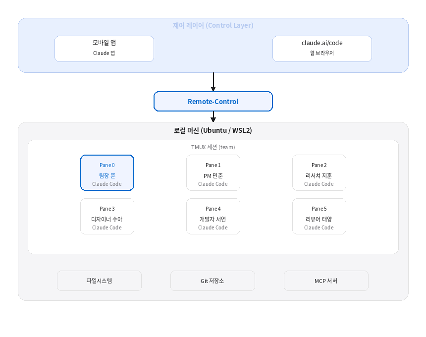

# 1-3. 전체 아키텍처 미리 보기

## 시스템 구성도

이 책에서 구축하는 시스템의 전체 아키텍처를 미리 살펴보자. 각 구성 요소가 어떻게 연결되는지 큰 그림을 먼저 파악하면, 이후 장들을 따라가기가 훨씬 수월하다.



## 계층별 상세 설명

### 1. 제어 레이어 (Control Layer)

사용자가 팀에게 지시를 내리는 인터페이스 계층이다. 두 가지 경로를 지원한다.

| 경로 | 용도 | 프로토콜 |
|------|------|----------|
| **claude.ai/code** | 웹 브라우저에서 세션 제어 | Remote-Control (TLS) |
| **Claude 모바일 앱** | 스마트폰에서 원격 지시 | Remote-Control (TLS) |

Remote-Control은 Anthropic API 서버를 경유하여 로컬 세션과 통신한다. 세션은 항상 로컬 머신에서만 실행되며 로컬 파일시스템과 MCP 서버는 외부로 전송되지 않는다.

### 2. 오케스트레이션 레이어 (Orchestration Layer)

팀장(Pane 0)이 사용자의 지시를 수신하고, 분석하여 적절한 팀원에게 분배하는 계층이다.

```bash
# 사용자의 지시가 팀장에게 도달하는 흐름
[사용자] "결제 모듈 리팩토링해줘"
    │
    ▼
[팀장 — Pane 0]
    │ 분석: 리팩토링 → PM에게 설계, 개발자에게 구현, 리뷰어에게 검토
    │
    ├─→ tmux send-keys -t team:0.1 "설계 작업..." Enter
    ├─→ tmux send-keys -t team:0.4 "구현 작업..." Enter
    └─→ tmux send-keys -t team:0.5 "리뷰 준비..." Enter
```

팀장은 **직접 코드를 작성하거나 파일을 수정하지 않는다**. 지시를 수령하고, 작업을 분해하고, 팀원에게 배분하고, 결과를 종합하여 보고하는 역할만 수행한다.

### 3. 실행 레이어 (Execution Layer)

각 팀원(Pane 1~5)이 할당받은 작업을 실제로 수행하는 계층이다.

| 파인 | 역할 | 주요 작업 |
|------|------|-----------|
| Pane 1 (민준) | PM·아키텍트 | 프로젝트 계획, 시스템 설계, 기술 문서 작성 |
| Pane 2 (지훈) | 리서쳐 | 기술 조사, 라이브러리 비교, 레퍼런스 수집 |
| Pane 3 (수아) | 디자이너 | UI/UX 설계, 사용자 경험 기획, 프로토타입 |
| Pane 4 (서연) | 개발자 | 코드 구현, 테스트 작성, 버그 수정 |
| Pane 5 (태양) | 리뷰어 | 코드 리뷰, 품질 검토, 보안 점검 |

모든 팀원은 **동일한 로컬 파일시스템**에 접근하므로, 한 팀원이 작성한 파일을 다른 팀원이 바로 읽을 수 있다.

### 4. 인프라 레이어 (Infrastructure Layer)

팀 에이전트가 작업하는 환경의 기반이다.

- **파일시스템**: 프로젝트 소스 코드, 설정 파일, 문서 등
- **Git 저장소**: 버전 관리 및 협업. 팀원이 작성한 코드를 커밋·푸시
- **MCP 서버**: Claude Code의 도구 확장. 외부 서비스 연동

## 데이터 흐름 상세

### 지시 전달 흐름

```
1. 사용자가 모바일 앱 또는 claude.ai/code에서 지시 전송
   "결제 API 리팩토링해줘"

2. Remote-Control이 메시지를 로컬 세션(Pane 0)으로 전달

3. 팀장(Pane 0)이 지시 분석
   → 작업 분해: [설계] [구현] [리뷰]

4. 팀장이 각 팀원에게 지시 전달
   → tmux send-keys -t team:0.1 "..."  (PM에게)
   → tmux send-keys -t team:0.4 "..."  (개발자에게)

5. 팀원이 작업 수행 후 결과 보고
   → 각 팀원이 팀장에게 완료 알림

6. 팀장이 결과를 종합하여 Remote-Control을 통해 사용자에게 보고
```

## 핵심 기술 스택 요약

| 기술 | 버전 | 역할 |
|------|------|------|
| **Ubuntu** | 22.04+ (WSL2 가능) | 운영 체제 |
| **Claude Code** | 2.x | AI 에이전트 엔진 |
| **TMUX** | 3.x | 터미널 멀티플렉서 (다중 파인) |
| **Remote-Control** | Claude Code 내장 | 원격 세션 제어 |
| **Git** | 2.x | 버전 관리 |

## 이후 장의 로드맵

```
2장: Ubuntu 환경 구축     ─→ 인프라 레이어 셋업
3장: TMUX 멀티에이전트    ─→ 실행 레이어 구성
4장: Remote-Control 설정  ─→ 제어 레이어 (Remote-Control)
5장: 모바일 원격 제어     ─→ 제어 레이어 (모바일)
6장: 핵심 도구 설치       ─→ 도구 확장
7장: 실전 팀 운용         ─→ 오케스트레이션 + 운용 노하우
8장: 운영 및 문제 해결    ─→ 유지보수
9장: 마치며              ─→ 향후 방향
```

각 장은 아키텍처의 한 계층씩 쌓아올리는 구조다. 2장에서 기반을 만들고, 3~5장에서 팀을 구성하고, 6~7장에서 실전 운용하고, 8장에서 안정적으로 유지하는 방법을 다룬다.

---

> **핵심 정리**: 전체 아키텍처는 제어(Remote-Control) → 오케스트레이션(팀장) → 실행(팀원) → 인프라(파일/Git/MCP)의 4개 계층으로 구성된다.
