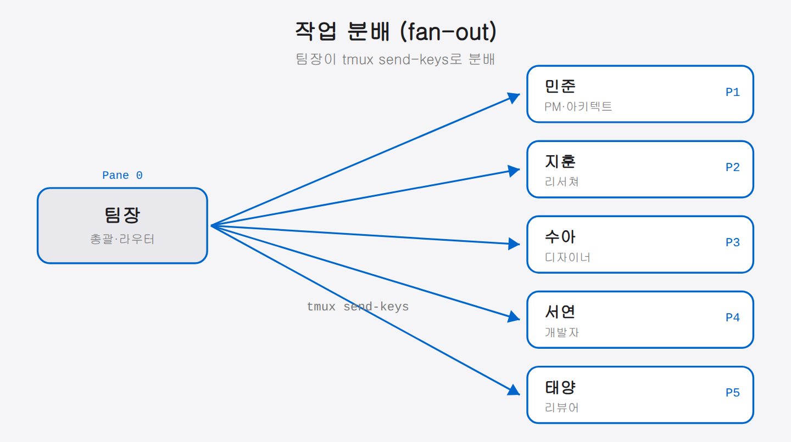
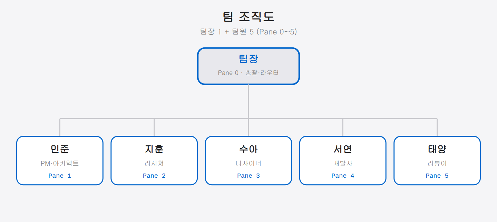
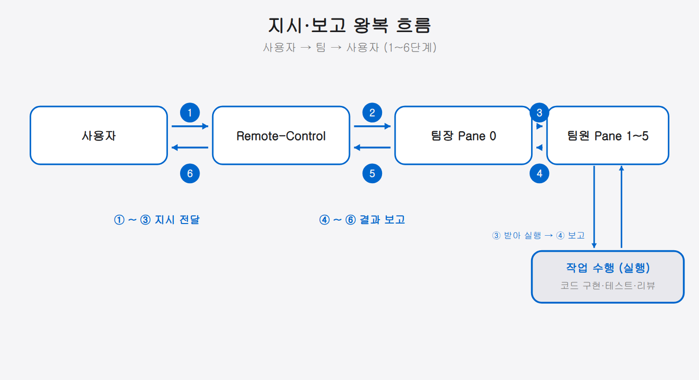

## 01-3. 전체 아키텍처 미리 보기

## 시스템 구성도

이 책에서 구축하는 시스템의 전체 아키텍처를 미리 살펴보자. 각 구성 요소가 어떻게 연결되는지 큰 그림을 먼저 파악하면, 이후 장들을 따라가기가 훨씬 수월하다.


전체 시스템은 4개의 계층으로 나뉜다. 위에서 아래로 내려갈수록 더 기반에 가까운 레이어다.

```
[제어 레이어]     ← 사용자가 지시를 보내는 곳 (모바일·웹)
      ↓
[오케스트레이션]  ← 팀장이 지시를 분석·배분하는 곳 (Pane 0)
      ↓
[실행 레이어]     ← 팀원이 실제 작업을 수행하는 곳 (Pane 1~5)
      ↓
[인프라 레이어]   ← 파일·Git·MCP 등 작업 기반
```

<hr>

## 계층별 상세 설명

### 1. 제어 레이어 (Control Layer)

사용자가 팀에게 지시를 내리는 인터페이스 계층이다. 두 가지 경로를 지원한다.

| 경로 | 용도 | 프로토콜 |
|------|------|----------|
| **claude.ai/code** | 웹 브라우저에서 세션 제어 | Remote-Control (TLS) |
| **Claude 모바일 앱** | 스마트폰에서 원격 지시 | Remote-Control (TLS) |

Remote-Control은 Anthropic API 서버를 경유하여 로컬 세션과 통신한다. 세션은 항상 로컬 머신에서만 실행되며 로컬 파일시스템과 MCP 서버는 외부로 전송되지 않는다.

> **제어 레이어가 "얇은" 이유** 제어 레이어는 사용자의 메시지를 팀장에게 전달하는 역할만 합니다. 실제 처리는 아래 레이어에서 일어납니다. 제어 레이어는 메시지를 전달만 하고, 인터페이스가 웹에서 모바일로 바뀌어도 처리 로직은 그대로입니다.

---

### 2. 오케스트레이션 레이어 (Orchestration Layer)

팀장(Pane 0)이 사용자의 지시를 수신하고, 분석하여 적절한 팀원에게 분배하는 계층이다.

> **오케스트레이션(orchestration)이란?** 오케스트라의 지휘자처럼, 여러 구성원이 제때 맞물려 일하도록 전체를 조율하는 것을 말한다. 여기서는 팀장이 지시를 쪼개 알맞은 팀원에게 나눠 주는 역할이다.

```bash
# 사용자의 지시가 팀장에게 도달하는 흐름
[사용자] "결제 모듈 리팩토링해줘"
    │
    ▼
[팀장 — Pane 0]
    │ 분석: 리팩토링 → PM에게 설계, 개발자에게 구현, 리뷰어에게 검토
    │
    ├─→ tmux send-keys -t team:0.1 "설계 작업..." Enter
    ├─→ tmux send-keys -t team:0.4 "구현 작업..." Enter
    └─→ tmux send-keys -t team:0.5 "리뷰 준비..." Enter
```

팀장은 **직접 코드를 작성하거나 파일을 수정하지 않는다**. 지시를 수령하고, 작업을 분해하고, 팀원에게 배분하고, 결과를 종합하여 보고하는 역할만 수행한다.

> **왜 팀장이 직접 작업하지 않는가?** 팀장이 직접 코드를 짜기 시작하면 팀 지휘 역할을 잊고 개발자처럼 동작합니다. 역할을 분리해두면 각자 자기 역할에 집중할 수 있고, 팀장은 항상 전체 진행 상황을 파악하며 다음 지시를 준비할 수 있습니다.



---

### 3. 실행 레이어 (Execution Layer)

각 팀원(Pane 1~5)이 할당받은 작업을 실제로 수행하는 계층이다.

| 파인 | 역할 | 주요 작업 |
|------|------|-----------|
| Pane 1 (민준) | PM·아키텍트 | 프로젝트 계획, 시스템 설계, 기술 문서 작성 |
| Pane 2 (지훈) | 리서쳐 | 기술 조사, 라이브러리 비교, 레퍼런스 수집 |
| Pane 3 (수아) | 디자이너 | UI/UX 설계, 사용자 경험 기획, 프로토타입 |
| Pane 4 (서연) | 개발자 | 코드 구현, 테스트 작성, 버그 수정 |
| Pane 5 (태양) | 리뷰어 | 코드 리뷰, 품질 검토, 보안 점검 |

모든 팀원은 **동일한 로컬 파일시스템**에 접근하므로, 한 팀원이 작성한 파일을 다른 팀원이 바로 읽을 수 있다.

> **공유 파일시스템이 중요한 이유** PM이 설계 문서를 `/docs/design.md`에 저장하면, 개발자는 그 파일을 읽어서 바로 구현을 시작할 수 있습니다. 팀원 간에 파일을 직접 전달하거나 복사할 필요가 없습니다. 하나의 디렉터리 안에서 모든 팀원이 협업하는 구조입니다.



---

### 4. 인프라 레이어 (Infrastructure Layer)

팀 에이전트가 작업하는 환경의 기반이다.

- **파일시스템**: 프로젝트 소스 코드, 설정 파일, 문서 등
- **Git 저장소**: 버전 관리 및 협업. 팀원이 작성한 코드를 커밋·푸시
- **MCP 서버**: Claude Code의 도구 확장. 외부 서비스 연동

> **MCP 서버란?** Model Context Protocol의 약자로, Claude Code에 외부 도구를 연결하는 표준 방식입니다. 예를 들어 MCP로 GitHub, Slack, 데이터베이스를 연결하면, 팀원이 Claude Code 안에서 이 도구들을 직접 사용할 수 있습니다. 6장에서 자세히 다룹니다.

<hr>

## 데이터 흐름 상세

### 지시 전달 흐름

```
1. 사용자가 모바일 앱 또는 claude.ai/code에서 지시 전송
   "결제 API 리팩토링해줘"

2. Remote-Control이 메시지를 로컬 세션(Pane 0)으로 전달

3. 팀장(Pane 0)이 지시 분석
   → 작업 분해: [설계] [구현] [리뷰]

4. 팀장이 각 팀원에게 지시 전달
   → tmux send-keys -t team:0.1 "..."  (PM에게)
   → tmux send-keys -t team:0.4 "..."  (개발자에게)

5. 팀원이 작업 수행 후 결과 보고
   → 각 팀원이 팀장에게 완료 알림

6. 팀장이 결과를 종합하여 Remote-Control을 통해 사용자에게 보고
```



팀장(Pane 0)은 허브 역할을 한다. 모든 지시는 팀장을 통해 팀원에게 전달되고, 모든 결과는 팀장을 통해 사용자에게 보고된다. 팀원끼리 직접 통신하지 않는 "스타 토폴로지(star topology)" 구조다.

---

**흐름을 직접 따라가 보기**

아직 환경이 없어도, 이 흐름을 텍스트로 시뮬레이션해볼 수 있다.

```bash
# 터미널 1: 팀장 역할 (Pane 0 시뮬레이션)
# "사용자로부터 지시 수령"
echo "[팀장] 지시 수령: 결제 API 리팩토링"
echo "[팀장→PM] 설계 요청 전달"
echo "[팀장→개발자] 구현 준비 요청"

# 터미널 2: PM 역할 (Pane 1 시뮬레이션)
echo "[PM] 설계 시작..."
echo "[PM→팀장] 설계 완료, design.md 작성"
```

실제 환경에서는 `echo` 대신 Claude Code가 이 역할을 수행한다.

<hr>

## 기술 스택 요약

| 기술 | 버전 | 역할 |
|------|------|------|
| **Ubuntu** | 22.04+ (WSL2 가능) | 운영 체제 |
| **Claude Code** | 2.x | AI 에이전트 엔진 |
| **TMUX** | 3.x | 터미널 멀티플렉서 (다중 파인) |
| **Remote-Control** | Claude Code 내장 | 원격 세션 제어 |
| **Git** | 2.x | 버전 관리 |

> **버전 확인 명령어** 아직 설치하지 않았더라도, 나중에 설치 후 아래 명령으로 버전을 확인할 수 있다. 01-4절에서 상세한 사양 확인 방법을 안내한다.

```bash
claude --version   # Claude Code 버전
tmux -V           # TMUX 버전
git --version     # Git 버전
```

<hr>

## 이후 장의 로드맵

```
2장: Ubuntu 환경 구축     ─→ 인프라 레이어 셋업
3장: TMUX 멀티에이전트    ─→ 실행 레이어 구성
4장: Remote-Control 설정  ─→ 제어 레이어 (Remote-Control)
5장: 모바일 원격 제어     ─→ 제어 레이어 (모바일)
6장: 핵심 도구 설치       ─→ 도구 확장
7장: 실전 팀 운용         ─→ 오케스트레이션 + 운용 노하우
8장: 심화 활용            ─→ 실전 사례·자동화·고급 운용
9장: 트러블슈팅           ─→ 문제 해결·복구
10장: 마치며             ─→ 향후 방향·커뮤니티
```

각 장은 이 아키텍처를 한 계층씩 쌓아올리는 순서로 구성된다. 2장은 인프라 레이어(기반)를, 3장은 실행 레이어(팀원 파인)를, 4~5장은 제어 레이어(Remote-Control·모바일)를 만든다. 6장은 도구를 확장하고, 7장은 오케스트레이션 레이어와 실전 운용을, 8장은 실전 사례와 심화 활용을, 9장은 트러블슈팅과 복구를, 10장은 향후 방향과 커뮤니티를 다룬다.

2장이 주춧돌(인프라)이라면 9장은 옥상이고, 그 사이 장들이 실행 → 제어 → 도구 → 오케스트레이션 계층을 한 층씩 올린다. 아래층 없이는 위층이 설 수 없으므로, 순서대로 쌓아야 무너지지 않는다.

---

**로드맵과 현재 위치 확인**

이 절을 읽는 지금, 우리는 **1장(개요)**을 보고 있다. 전체 지도를 펼쳐보는 단계다. 다음 장인 2장에서 인프라 레이어를 실제로 구축하는 것부터 시작한다.

각 장을 마칠 때마다 이 로드맵으로 돌아와 "어느 계층을 완성했는가"를 확인하면 진행 상황을 직관적으로 파악할 수 있다.
