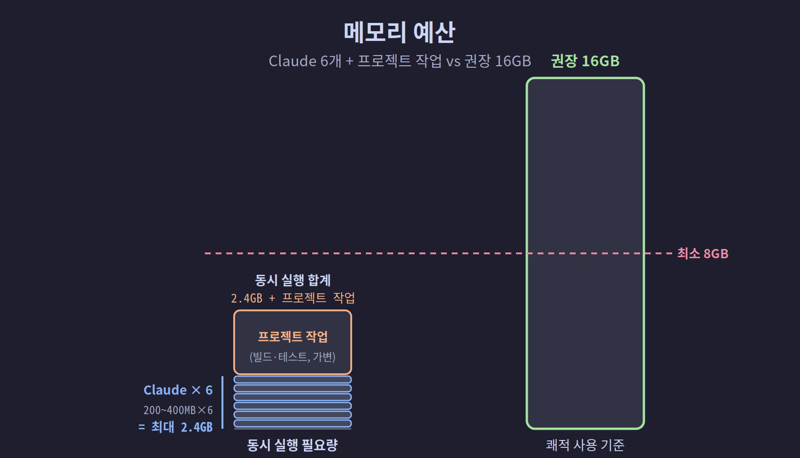
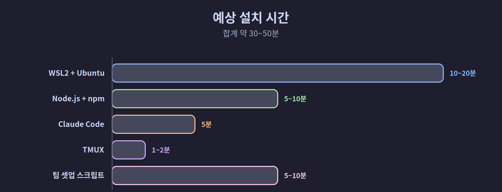

## 01-4. 개발 환경 및 최소 사양

이 챕터에서 구축하는 멀티에이전트 환경을 원활하게 실행하려면 일정 수준의 하드웨어와 소프트웨어가 필요하다. 시작 전에 본인의 환경이 요건을 충족하는지 확인하자.

<hr>

## 하드웨어 사양

6개의 Claude Code 인스턴스가 동시에 실행되므로, 단일 에이전트 사용보다 더 많은 메모리와 CPU가 필요하다.

| 항목 | 최소 사양 | 권장 사양 |
|------|-----------|-----------|
| **CPU** | 4코어 (Intel i5 / Ryzen 5 급) | 8코어 이상 (Intel i7/i9, Ryzen 7/9, Apple M1 이상) |
| **RAM** | 8GB | 16GB 이상 |
| **디스크** | 20GB 여유 공간 | SSD 50GB 이상 |
| **네트워크** | 안정적인 인터넷 연결 | 유선 또는 Wi-Fi 5GHz |

> 💡 **사양 표 읽는 법**: "최소 사양"은 일단 돌아가는 기준, "권장 사양"은 끊김 없이 쾌적하게 쓰는 기준이다. 둘 사이라면 동작은 하되 무거운 작업에서 느려질 수 있다.

> **메모리 참고**: Claude Code 인스턴스 1개당 약 200~400MB를 사용한다. 6개 동시 실행 시 최대 2.4GB가 필요하며, 실제 프로젝트 작업(Node.js 빌드, 테스트 등)을 고려하면 16GB를 권장한다.



<hr>

## 운영 체제

| OS | 지원 여부 | 설치 방법 |
|----|-----------|-----------|
| **Windows 10 (21H2 이상)** | ✅ 지원 | WSL2 + Ubuntu |
| **Windows 11** | ✅ 지원 (권장) | WSL2 + Ubuntu |
| **Ubuntu 22.04 LTS** | ✅ 지원 | 네이티브 |
| **Ubuntu 24.04 LTS** | ✅ 지원 | 네이티브 |
| **Debian 12 이상** | ✅ 지원 | 네이티브 |
| **macOS 13 Ventura 이상** | ✅ 지원 | Homebrew |
| **macOS 12 Monterey** | ⚠️ 제한적 | 일부 기능 미지원 가능 |
| **Windows 10 (20H2 이하)** | ❌ 미지원 | WSL2 미지원 |

> **Windows 사용자**: WSL2는 Windows 10 버전 21H2 이상 또는 Windows 11에서 안정적으로 동작한다. 버전 확인: `시작 → 설정 → 시스템 → 정보 → Windows 사양`

<hr>

## 소프트웨어 버전

| 소프트웨어 | 최소 버전 | 권장 버전 | 확인 명령 |
|------------|-----------|-----------|-----------|
| **Node.js** | 18.x | 22.x LTS | `node --version` |
| **npm** | 9.x | 10.x | `npm --version` |
| **TMUX** | 3.2 | 3.4 | `tmux -V` |
| **Git** | 2.30 | 2.40 이상 | `git --version` |
| **Claude Code** | 2.x | 최신 버전 | `claude --version` |
| **Bash** | 5.0 | 5.2 | `bash --version` |

<hr>

## Claude 계정 및 플랜

Remote-Control 기능과 멀티에이전트 환경을 사용하려면 적절한 Claude 플랜이 필요하다.

| 항목        | 요건                                                 |
| --------- | -------------------------------------------------- |
| **계정**    | Anthropic 계정 (claude.ai 가입)                        |
| **플랜**    | Claude Pro 이상 권장                                   |
| **인증 방식** | claude.ai OAuth 로그인 (API 키 방식은 Remote-Control 미지원) |
| **모바일 앱** | Claude iOS / Android 앱 설치 (Remote-Control 사용 시)    |

> **무료 플랜 사용자**: Claude Code는 실행 가능하지만 요청 한도가 낮아 멀티에이전트 환경에서는 금방 한도에 도달할 수 있다. 장시간 작업이라면 Pro 플랜을 권장한다.

<hr>

## 네트워크 요건

| 항목 | 요건 |
|------|------|
| **인터넷 연결** | 필수 (Claude API는 클라우드 기반) |
| **방화벽** | `api.anthropic.com` (443/TCP) 허용 필요 |
| **VPN** | 대부분 정상 동작하나 일부 기업 VPN에서 차단 가능 |
| **오프라인** | 지원 안 됨 (Claude API 요청 불가) |

<hr>

## 환경별 빠른 확인 체크리스트

본인의 운영체제에 해당하는 항목만 따라 실행하면 된다. 출력된 버전·용량이 앞의 요건을 충족하는지 비교하자.


### Windows (WSL2)

```powershell
# PowerShell에서 WSL2 버전 확인
wsl --list --verbose
# VERSION 열이 2인지 확인

# WSL2 Ubuntu 버전 확인 (Ubuntu 터미널에서)
lsb_release -a
```

### Linux / macOS

```bash
# OS 정보
uname -a

# 메모리 확인
free -h          # Linux
vm_stat          # macOS

# 디스크 여유 공간 확인
df -h ~
```

### 공통 — 소프트웨어 버전 일괄 확인

```bash
echo "Node.js: $(node --version 2>/dev/null || echo '미설치')"
echo "npm:     $(npm --version 2>/dev/null || echo '미설치')"
echo "TMUX:    $(tmux -V 2>/dev/null || echo '미설치')"
echo "Git:     $(git --version 2>/dev/null || echo '미설치')"
echo "Claude:  $(claude --version 2>/dev/null || echo '미설치')"
```

모든 항목이 최소 버전 이상이면 다음 챕터로 진행한다.

<hr>

## 예상 설치 시간

| 단계 | 예상 시간 |
|------|-----------|
| WSL2 + Ubuntu 설치 (Windows) | 10~20분 |
| Node.js + npm 설치 | 5~10분 |
| Claude Code 설치 및 인증 | 5분 |
| TMUX 설치 | 1~2분 |
| 팀 환경 셋업 스크립트 실행 | 5~10분 |
| **전체** | **약 30~50분** |



<hr>

> **핵심 정리**: RAM 8GB 이상, Windows 10 21H2 / Ubuntu 22.04 / macOS 13 이상, Claude Pro 계정이면 이 책의 모든 내용을 따라할 수 있다. 안정적인 인터넷 연결은 필수다.
