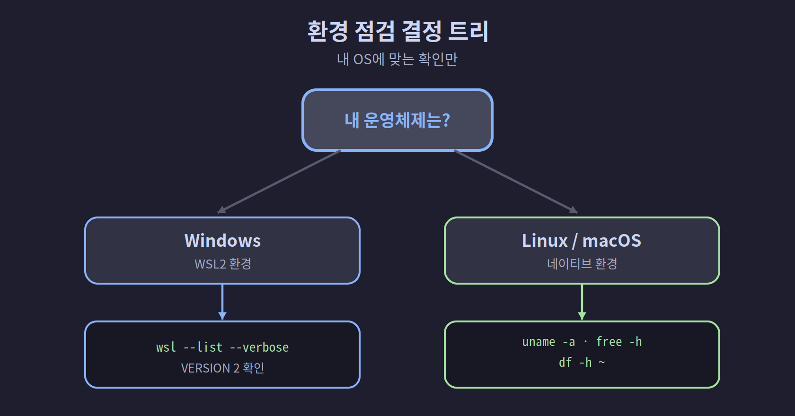

## 01-4. 개발 환경 및 최소 사양

이 챕터에서 구축하는 멀티에이전트 환경을 원활하게 실행하려면 일정 수준의 하드웨어와 소프트웨어가 필요하다. 시작 전에 본인의 환경이 요건을 충족하는지 확인하자. 체크리스트를 따라 실행하면 5분이면 준비 여부를 알 수 있다.

<hr>

## 하드웨어 사양

6개의 Claude Code 인스턴스가 동시에 실행되므로, 단일 에이전트 사용보다 더 많은 메모리와 CPU가 필요하다.

| 항목 | 최소 사양 | 권장 사양 |
|------|-----------|-----------|
| **CPU** | 4코어 (Intel i5 / Ryzen 5 급) | 8코어 이상 (Intel i7/i9, Ryzen 7/9, Apple M1 이상) |
| **RAM** | 8GB | 16GB 이상 |
| **디스크** | 20GB 여유 공간 | SSD 50GB 이상 |
| **네트워크** | 안정적인 인터넷 연결 | 유선 또는 Wi-Fi 5GHz |

> **사양 표 읽는 법**: "최소 사양"은 일단 돌아가는 기준, "권장 사양"은 끊김 없이 쾌적하게 쓰는 기준이다. 둘 사이라면 동작은 하되 무거운 작업에서 느려질 수 있다.

> **메모리 참고**: Claude Code 인스턴스 1개당 약 200~400MB를 사용한다. 6개 동시 실행 시 최대 400MB × 6 = 약 2.4GB가 필요하며, 실제 프로젝트 작업(Node.js 빌드, 테스트 등)을 고려하면 16GB를 권장한다.

숫자로 따져보면 팀 자체가 쓰는 2.4GB는 16GB의 일부일 뿐이다. 남는 메모리에서 Node.js 빌드·테스트·브라우저가 함께 돈다. 그래서 8GB로도 팀은 뜨지만, 무거운 작업을 몇 개 겹치는 순간 금세 빠듯해진다. 16GB를 권장하는 이유가 바로 이 여유 공간에 있다.

---

**내 RAM 확인하기**

```bash
# Linux / WSL2
free -h
# 출력 예시:
#               total  used  free  available
# Mem:           15Gi  5Gi   3Gi   9Gi
# "total" 값이 8GB 이상이면 최소 충족

# macOS
system_profiler SPHardwareDataType | grep Memory
# 출력 예시:
# Memory: 16 GB
```

`total`이 8GB(표시: `7.7Gi` ~ `8Gi`) 이상이면 최소 사양을 충족한다.

<hr>

## 운영 체제

| OS | 지원 여부 | 설치 방법 |
|----|-----------|-----------|
| **Windows 10 (21H2 이상)** | 지원 | WSL2 + Ubuntu |
| **Windows 11** | 지원 (권장) | WSL2 + Ubuntu |
| **Ubuntu 22.04 LTS** | 지원 | 네이티브 |
| **Ubuntu 24.04 LTS** | 지원 | 네이티브 |
| **Debian 12 이상** | 지원 | 네이티브 |
| **macOS 13 Ventura 이상** | 지원 | Homebrew |
| **macOS 12 Monterey** | 제한적 | 일부 기능 미지원 가능 |
| **Windows 10 (20H2 이하)** | 미지원 | WSL2 미지원 |

> **Windows 사용자**: WSL2는 Windows 10 버전 21H2 이상 또는 Windows 11에서 안정적으로 동작한다. 버전 확인: `시작 → 설정 → 시스템 → 정보 → Windows 사양`

> **WSL2란?** Windows Subsystem for Linux 2의 약자로, Windows 위에서 리눅스를 실행할 수 있게 해주는 기능입니다. 가상머신처럼 별도 OS를 설치하는 것이 아니라 Windows 커널과 통합된 방식으로 동작해 성능이 뛰어납니다. 이 책의 대부분 설치 명령어는 WSL2 Ubuntu에서 실행합니다.

---

**Windows 버전 빠른 확인**

```powershell
# PowerShell에서 실행
winver
# 또는
(Get-ItemProperty "HKLM:\SOFTWARE\Microsoft\Windows NT\CurrentVersion").DisplayVersion
# 출력 예시: 22H2
# 21H2 이상이면 WSL2 지원
```

<hr>

## 소프트웨어 버전

| 소프트웨어 | 최소 버전 | 권장 버전 | 확인 명령 |
|------------|-----------|-----------|-----------|
| **Node.js** | 18.x | 22.x LTS | `node --version` |
| **npm** | 9.x | 10.x | `npm --version` |
| **TMUX** | 3.2 | 3.4 | `tmux -V` |
| **Git** | 2.30 | 2.40 이상 | `git --version` |
| **Claude Code** | 2.x | 최신 버전 | `claude --version` |
| **Bash** | 5.0 | 5.2 | `bash --version` |

> **Node.js가 필요한 이유** Claude Code는 Node.js 기반으로 만들어진 프로그램입니다. `npm install -g @anthropic-ai/claude-code` 명령으로 설치하는데, npm은 Node.js의 패키지 관리자입니다. Node.js가 없으면 Claude Code를 설치할 수 없습니다.

<hr>

## Claude 계정 및 플랜

Remote-Control 기능과 멀티에이전트 환경을 사용하려면 적절한 Claude 플랜이 필요하다.

| 항목        | 요건                                                 |
| --------- | -------------------------------------------------- |
| **계정**    | Anthropic 계정 (claude.ai 가입)                        |
| **플랜**    | Claude Pro 이상 권장                                   |
| **인증 방식** | claude.ai OAuth 로그인 (API 키 방식은 Remote-Control 미지원) |
| **모바일 앱** | Claude iOS / Android 앱 설치 (Remote-Control 사용 시)    |

> **무료 플랜 사용자**: Claude Code는 실행 가능하지만 요청 한도가 낮아 멀티에이전트 환경에서는 금방 한도에 도달할 수 있다. 장시간 작업이라면 Pro 플랜을 권장한다.

> **OAuth 로그인 vs API 키의 차이** API 키는 프로그램이 직접 Anthropic 서버에 요청을 보낼 때 사용하는 인증 방식입니다. Remote-Control은 Claude 계정과 연결된 세션을 식별해야 하므로 OAuth(claude.ai 로그인) 방식만 지원합니다. API 키만 있고 claude.ai 계정이 없다면 Remote-Control을 사용할 수 없습니다.

<hr>

## 네트워크 요건

| 항목 | 요건 |
|------|------|
| **인터넷 연결** | 필수 (Claude API는 클라우드 기반) |
| **방화벽** | `api.anthropic.com` (443/TCP) 허용 필요 |
| **VPN** | 대부분 정상 동작하나 일부 기업 VPN에서 차단 가능 |
| **오프라인** | 지원 안 됨 (Claude API 요청 불가) |

> **기업 VPN에서 막히는 경우** 일부 기업 VPN은 Anthropic API 서버로의 연결을 차단할 수 있습니다. 이 경우 VPN을 끄거나, IT 부서에 `api.anthropic.com:443` 허용을 요청해야 합니다. 재택근무 중 VPN이 필수라면 IT 부서와 먼저 확인하세요.

---

**네트워크 연결 빠른 확인**

```bash
# api.anthropic.com 접근 가능 여부 확인
curl -s -o /dev/null -w "%{http_code}" https://api.anthropic.com
# 200 또는 401이면 네트워크 정상
# 000이면 서버에 도달 불가 (방화벽·VPN 확인 필요)
```

<hr>

## 환경별 빠른 확인 체크리스트

본인의 운영체제에 해당하는 항목만 따라 실행하면 된다. 출력된 버전·용량이 앞의 요건을 충족하는지 비교하자.



### Windows (WSL2)

```powershell
# PowerShell에서 WSL2 버전 확인
wsl --list --verbose
# VERSION 열이 2인지 확인

# WSL2 Ubuntu 버전 확인 (Ubuntu 터미널에서)
lsb_release -a
```

### Linux / macOS

```bash
# OS 정보
uname -a

# 메모리 확인
free -h          # Linux
vm_stat          # macOS

# 디스크 여유 공간 확인
df -h ~
```

### 공통 — 소프트웨어 버전 일괄 확인

```bash
echo "Node.js: $(node --version 2>/dev/null || echo '미설치')"
echo "npm:     $(npm --version 2>/dev/null || echo '미설치')"
echo "TMUX:    $(tmux -V 2>/dev/null || echo '미설치')"
echo "Git:     $(git --version 2>/dev/null || echo '미설치')"
echo "Claude:  $(claude --version 2>/dev/null || echo '미설치')"
```

출력 예시 (모두 정상인 경우):
```
Node.js: v22.3.0
npm:     10.8.1
TMUX:    tmux 3.4
Git:     git version 2.43.0
Claude:  2.1.71
```

모든 항목이 최소 버전 이상이면 다음 챕터로 진행한다. 미설치 항목이 있다면 2장에서 설치 방법을 안내한다.

---

**한 번에 통과/실패를 판단하는 빠른 점검 스크립트**

```bash
#!/bin/bash
# env-check.sh — 환경 요건 빠른 점검

PASS=true

check() {
  local name="$1"
  local cmd="$2"
  local min_ver="$3"
  local result
  result=$(eval "$cmd" 2>/dev/null)
  if [ -z "$result" ]; then
    echo "[FAIL] $name: 미설치"
    PASS=false
  else
    echo "[OK]   $name: $result"
  fi
}

check "Node.js"     "node --version"    "v18"
check "npm"         "npm --version"     "9"
check "TMUX"        "tmux -V"           "3.2"
check "Git"         "git --version"     "2.30"
check "Claude Code" "claude --version"  "2"

echo ""
if $PASS; then
  echo "모든 요건 충족 — 2장으로 진행하세요!"
else
  echo "미설치 항목이 있습니다. 2장의 설치 가이드를 따라주세요."
fi
```

저장 및 실행:
```bash
chmod +x ~/env-check.sh
~/env-check.sh
```

<hr>

## 예상 설치 시간

| 단계 | 예상 시간 |
|------|-----------|
| WSL2 + Ubuntu 설치 (Windows) | 10~20분 |
| Node.js + npm 설치 | 5~10분 |
| Claude Code 설치 및 인증 | 5분 |
| TMUX 설치 | 1~2분 |
| 팀 환경 셋업 스크립트 실행 | 5~10분 |
| **전체** | **약 30~50분** |

표를 길이로 바꿔 보면 전체 시간의 절반 안팎이 **WSL2 + Ubuntu 설치**(Windows 사용자 한정)에 쏠려 있다. 나머지 단계는 대부분 명령어 한두 줄이라 금방 끝난다. 대기 시간은 초반 OS 준비에 몰려 있고, 그 고비만 넘기면 이후는 빠르게 흘러간다. macOS·네이티브 리눅스 사용자라면 이 단계가 통째로 빠져 20~30분이면 충분하다.

> **WSL2 설치가 긴 이유** WSL2는 Windows Update를 통해 배포되는 컴포넌트입니다. 설치 중 재부팅이 한 번 필요하고, Ubuntu 이미지를 다운로드하는 데 네트워크 속도에 따라 수 분이 걸릴 수 있습니다. 기다리는 시간이지 직접 무언가를 해야 하는 시간이 아니므로, 설치를 걸어두고 다른 일을 해도 됩니다.

<hr>

> **핵심 정리**: RAM 8GB 이상, Windows 10 21H2 / Ubuntu 22.04 / macOS 13 이상, Claude Pro 계정이면 이 책의 모든 내용을 따라할 수 있다. 안정적인 인터넷 연결은 필수다.
