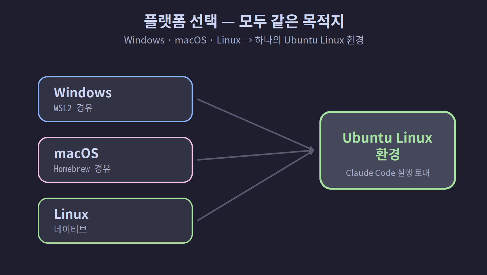
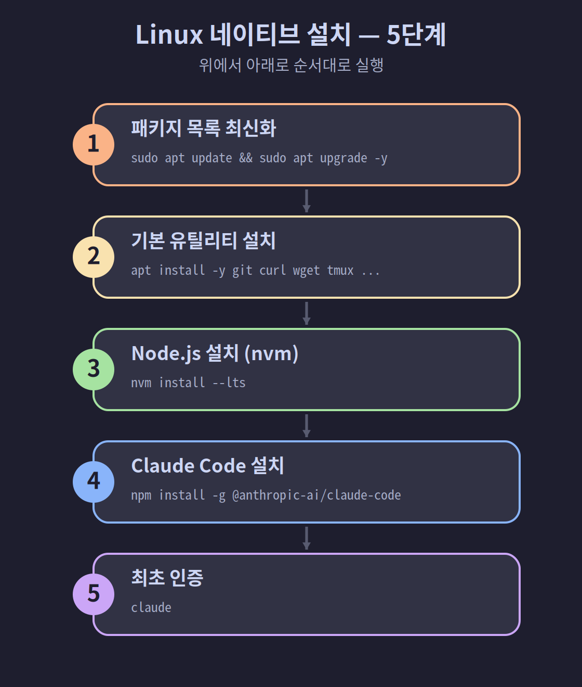
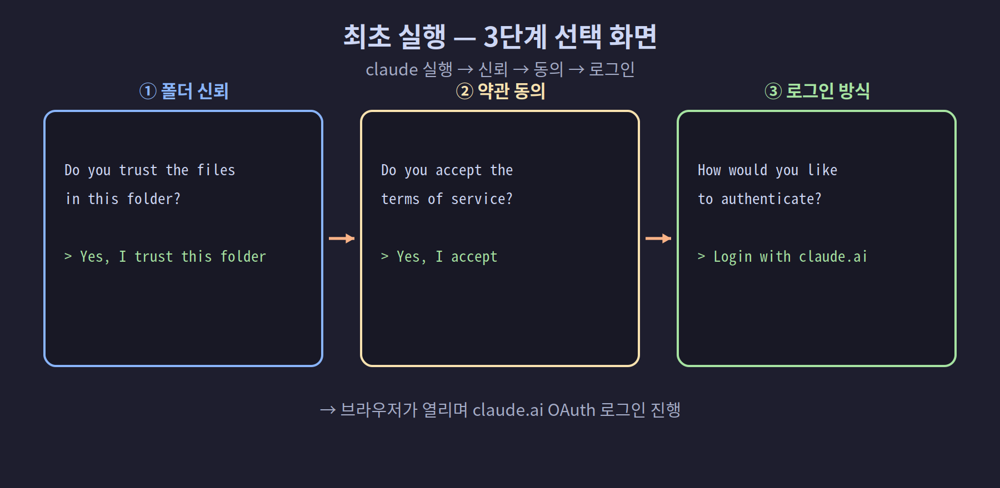

## 02-1. 환경 설치 — 플랫폼 선택

Claude Code 멀티에이전트 환경은 Ubuntu Linux 기반에서 동작합니다. 사용 중인 운영체제에 맞는 가이드를 선택하세요.

처음 개발 환경을 구성한다면 낯선 용어가 많이 보일 수 있습니다. 하지만 걱정하지 마세요. 이 책은 명령어 한 줄마다 "무엇을, 왜" 하는지 함께 설명합니다. 순서대로 따라 하기만 하면 됩니다.

> 💡 **운영체제(OS)란?** 컴퓨터를 움직이는 기본 소프트웨어입니다. Windows, macOS, Linux가 대표적입니다. Claude Code는 Linux 환경에서 가장 안정적으로 동작하기 때문에, Windows·macOS 사용자도 각자 환경 위에 Linux와 비슷한 환경을 얹어 사용합니다.



<hr>

## 플랫폼별 설치 가이드

자신의 컴퓨터 운영체제에 해당하는 길을 따라가세요. 아래 세 갈래 중 하나만 선택하면 됩니다.

### Windows 사용자 → [02-2. WSL2 환경 구성 완전 가이드](02-2-windows-wsl2.md)

WSL2(Windows Subsystem for Linux 2)를 통해 Windows 위에서 Ubuntu 환경을 구성합니다. 쉽게 말해, Windows를 끄지 않고도 그 안에서 진짜 Linux를 함께 돌리는 기능입니다.

- WSL2 활성화 → Ubuntu 설치 → Node.js/Git/TMUX → Claude Code

### macOS 사용자 → [02-3. macOS 설치 완전 가이드](02-3-macos.md)

Homebrew를 사용해 기본 터미널(zsh) 환경에서 바로 구성합니다. Homebrew는 macOS에서 개발 도구를 손쉽게 설치해 주는 "앱 설치 도우미"라고 생각하면 됩니다.

- Homebrew → Node.js/Git/TMUX → Claude Code

### Linux 사용자 → 이 페이지에서 계속

Ubuntu 22.04 이상 또는 Debian 계열 배포판을 이미 사용 중이라면 아래 단계를 따릅니다.

<hr>

## Linux 네이티브 설치

아래 5단계를 순서대로 진행합니다. 각 명령은 터미널(검은 화면의 명령 입력 창)에 붙여 넣고 Enter를 누르면 실행됩니다. 한 단계가 끝난 뒤 다음 단계로 넘어가세요.



### 1단계. 패키지 목록 최신화

설치를 시작하기 전에, 시스템이 알고 있는 프로그램 목록을 최신 상태로 새로고침합니다. 오래된 목록으로 설치하면 옛 버전이 깔리거나 오류가 날 수 있습니다.

```bash
sudo apt update && sudo apt upgrade -y
```

> 💡 `sudo`는 "관리자 권한으로 실행"이라는 뜻이고, `apt`는 우분투의 프로그램 설치 도구입니다. `update`는 목록 새로고침, `upgrade -y`는 설치된 프로그램들을 최신 버전으로 올리는 명령입니다(`-y`는 "예"를 미리 답해 자동 진행).

### 2단계. 기본 유틸리티 설치

이후 작업에 필요한 기본 도구들을 한 번에 설치합니다.

```bash
sudo apt install -y git curl wget unzip build-essential tmux
```

> 💡 `git`은 버전 관리, `curl`·`wget`은 인터넷에서 파일 받기, `unzip`은 압축 풀기, `build-essential`은 프로그램을 빌드할 때 필요한 도구 모음, `tmux`는 화면을 여러 칸으로 나누는 도구입니다(멀티에이전트 팀 구성의 핵심).

### 3단계. Node.js 설치 (nvm 권장)

Claude Code는 Node.js라는 실행 환경 위에서 동작합니다. 버전 관리가 편한 nvm으로 설치하는 것을 권장합니다.

```bash
# nvm 설치
curl -o- https://raw.githubusercontent.com/nvm-sh/nvm/v0.40.5/install.sh | bash
source ~/.bashrc

# Node.js LTS
nvm install --lts
nvm use --lts

# 확인
node --version
npm --version
```

> 💡 nvm(Node Version Manager)은 Node.js 버전을 자유롭게 바꿔 쓰게 해 줍니다. `LTS`는 "오래 안정적으로 지원되는 버전"이라는 뜻으로, 초보자에게 가장 안전한 선택입니다. `source ~/.bashrc`는 방금 설치한 nvm을 현재 터미널에 즉시 적용하는 명령입니다.

### 4단계. Claude Code 설치

이제 핵심인 Claude Code를 설치합니다.

```bash
npm install -g @anthropic-ai/claude-code

# 확인
claude --version
```

> 💡 `npm`은 Node.js의 프로그램 설치 도구이고, `-g`는 "컴퓨터 전체에서 쓸 수 있게 설치"라는 뜻입니다. 설치 후 `claude --version`으로 버전이 출력되면 성공입니다.

### 5단계. 최초 인증

설치가 끝나면 Claude Code를 처음 실행해 로그인합니다.

```bash
claude
```

처음 실행하면 몇 가지 확인 질문이 차례로 나옵니다. 순서대로 선택하세요.

1. `Yes, I trust this folder` 선택 — 현재 폴더를 신뢰할지 묻는 질문
2. `Yes, I accept` 선택 — 이용 약관 동의
3. `Login with claude.ai (recommended)` 선택 — 브라우저가 열리며 로그인 진행



<hr>

## 설치 확인

모든 설치가 끝났다면, 아래 명령으로 각 도구가 제대로 깔렸는지 한 번에 확인합니다. 버전 번호가 출력되면 정상입니다.

```bash
node --version    # v18.0.0 이상
npm --version     # 9.0.0 이상
git --version     # 2.x.x
tmux -V           # tmux 3.x
claude --version  # claude-code x.x.x
```

> 💡 만약 `command not found`가 나온다면 해당 도구가 설치되지 않았거나, 터미널을 새로 열어야 적용되는 경우입니다. 터미널을 닫았다 다시 연 뒤 다시 확인해 보세요.

플랫폼별 환경이 준비되었으면 다음 챕터에서 TMUX 구조와 멀티에이전트 팀을 구성합니다.
