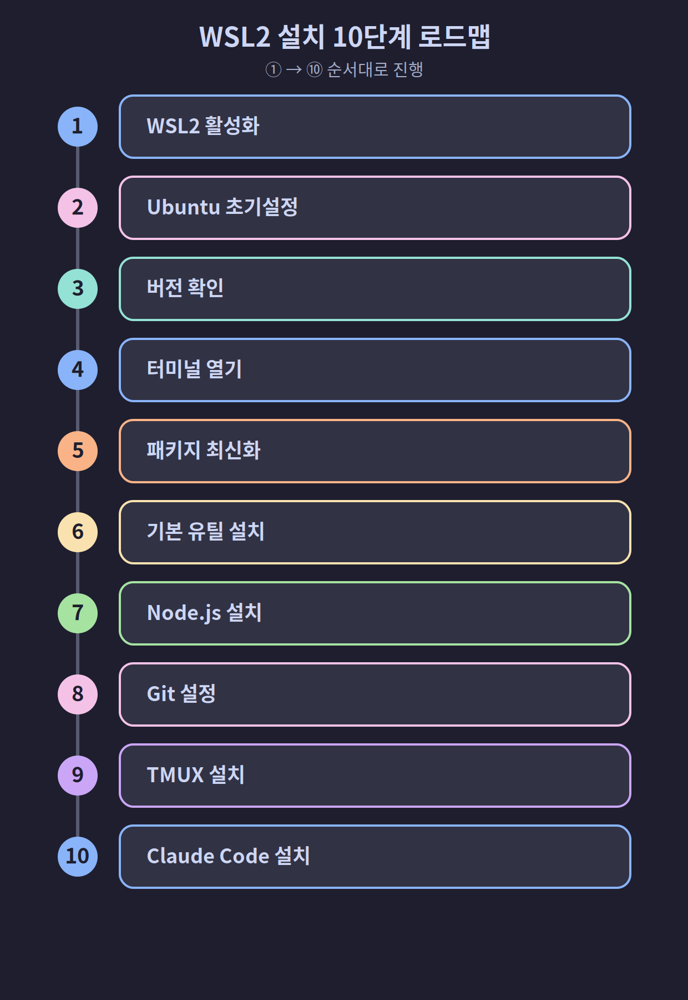
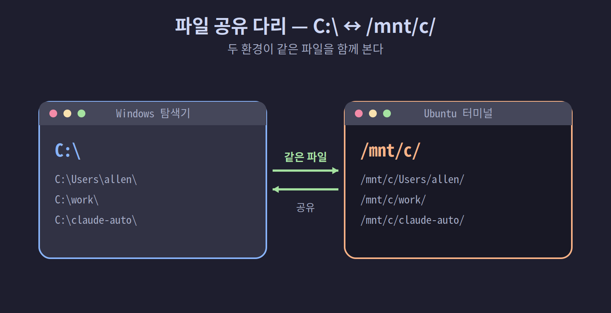
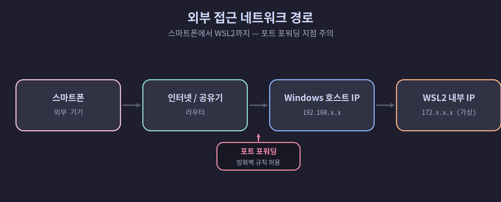

## 02-2. Windows: WSL2 환경 구성 완전 가이드

Windows에서 Claude Code 멀티에이전트 환경을 구성하려면 **WSL2(Windows Subsystem for Linux 2)**가 필요합니다. WSL2는 Windows 10/11 위에서 완전한 Linux 커널을 실행하는 Microsoft 공식 솔루션으로, 성능과 호환성 모두 네이티브에 가깝습니다.

> **이 페이지 범위**: WSL2 활성화 → Ubuntu 설치 → Node.js/Git/TMUX 설치 → Claude Code 설치까지 Windows 사용자가 필요한 모든 단계를 다룹니다.

> 💡 **WSL2를 쉽게 말하면?** Windows 안에 작은 Ubuntu 컴퓨터를 하나 더 띄우는 기능입니다. Windows는 그대로 쓰면서, 개발에 필요한 Linux 환경만 그 안에서 함께 돌리는 것이죠. 두 환경은 파일도 서로 주고받을 수 있습니다(뒤의 `/mnt/c` 설명 참고).


> 아래는 이 페이지에서 진행할 전체 흐름입니다. 1→10단계를 순서대로 따라가면 됩니다.



<hr>

## 1단계: WSL2 활성화 및 Ubuntu 설치

PowerShell을 **관리자 권한**으로 열고 아래 명령 하나를 실행합니다.

> 💡 **PowerShell을 관리자 권한으로 여는 법:** 시작 메뉴에서 `PowerShell`을 검색한 뒤, 마우스 오른쪽 버튼을 눌러 `관리자 권한으로 실행`을 선택합니다. WSL2 설치는 시스템 기능을 켜는 작업이라 일반 권한으로는 진행되지 않습니다.

```powershell
wsl --install
```

이 명령으로 WSL2 기능 활성화, 가상 머신 플랫폼 설치, Ubuntu 최신 LTS 다운로드가 자동으로 처리됩니다. 설치 완료 후 **PC를 재시작**하세요.

> **특정 버전 지정**: Ubuntu 22.04를 사용하려면 `wsl --install -d Ubuntu-22.04`를 사용합니다.

<hr>

## 2단계: Ubuntu 초기 설정

재시작 후 Ubuntu 초기 설정 창이 자동으로 열립니다. 사용자명과 비밀번호를 설정합니다.

```
Enter new UNIX username: allen          # 영문 소문자, 공백 없이
New password: ****                       # 입력 시 화면에 표시되지 않음
Retype new password: ****
```

설정이 완료되면 Ubuntu 터미널 프롬프트가 나타납니다.

```
allen@DESKTOP-XXXX:~$
```

> 💡 비밀번호를 입력할 때 화면에 아무 글자도 보이지 않는 것은 정상입니다(보안을 위한 동작). 그냥 입력하고 Enter를 누르세요. 이 비밀번호는 이후 `sudo` 명령에서 다시 사용하므로 꼭 기억해 두세요.

<hr>

## 3단계: WSL2 버전 확인

PowerShell에서 WSL2로 설치되었는지 확인합니다.

```powershell
wsl --list --verbose
```

출력 결과의 VERSION이 `2`인지 확인합니다.

```
  NAME      STATE    VERSION
* Ubuntu    Running  2
```

VERSION이 `1`이라면 다음 명령으로 업그레이드합니다.

```powershell
wsl --set-version Ubuntu 2
wsl --set-default-version 2
```

<hr>

## 4단계: Ubuntu 터미널 열기

이후 모든 작업은 **Ubuntu 터미널**에서 진행합니다. 두 가지 방법으로 열 수 있습니다.

- 시작 메뉴에서 **Ubuntu** 앱 실행
- Windows Terminal 앱에서 **Ubuntu** 탭 선택 (권장)

> **Windows Terminal 설치**: Microsoft Store에서 무료로 설치할 수 있습니다. 탭 기능과 폰트 렌더링이 기본 Ubuntu 앱보다 훨씬 편리합니다.

<hr>

## 5단계: 패키지 목록 최신화

Ubuntu 터미널에서 패키지 목록을 업데이트합니다.

```bash
sudo apt update && sudo apt upgrade -y
```

비밀번호를 물으면 2단계에서 설정한 비밀번호를 입력합니다.

<hr>

## 6단계: 기본 유틸리티 설치

```bash
sudo apt install -y git curl wget unzip build-essential
```

각 패키지 역할:

| 패키지 | 역할 |
|--------|------|
| git | 프로젝트 버전 관리 |
| curl | URL 기반 파일 다운로드 |
| wget | 파일 다운로드 |
| unzip | 압축 해제 |
| build-essential | C/C++ 빌드 도구 (일부 npm 패키지 컴파일 시 필요) |

<hr>

## 7단계: Node.js 설치

Claude Code는 npm 패키지로 배포되므로 **Node.js 18 이상**이 필요합니다. nvm(Node Version Manager)으로 설치하는 방법을 권장합니다.

### nvm으로 설치 (권장)

```bash
# nvm 설치
curl -o- https://raw.githubusercontent.com/nvm-sh/nvm/v0.40.5/install.sh | bash

# 셸 재로드 (현재 터미널에 즉시 적용)
source ~/.bashrc

# 설치 확인
nvm --version

# Node.js LTS 설치
nvm install --lts

# 기본 버전으로 설정
nvm use --lts

# 버전 확인
node --version
npm --version
```

출력 예시:
```
v22.14.0
10.9.0
```

### apt로 직접 설치 (대안)

nvm 없이 시스템 전역으로 설치하는 방법입니다.

```bash
# NodeSource 저장소 추가
curl -fsSL https://deb.nodesource.com/setup_22.x | sudo -E bash -

# 설치
sudo apt install -y nodejs

# 확인
node --version
npm --version
```

<hr>

## 8단계: Git 초기 설정

Git은 기본 유틸리티 설치 시 포함됩니다. 사용자 정보를 설정합니다.

```bash
git config --global user.name "Your Name"
git config --global user.email "your@email.com"

# 설정 확인
git config --list
```

<hr>

## 9단계: TMUX 설치

TMUX는 하나의 터미널에서 여러 창을 동시에 실행할 수 있는 도구입니다. 멀티에이전트 환경의 핵심입니다.

```bash
sudo apt install -y tmux

# 설치 확인
tmux -V
```

출력 예시:
```
tmux 3.4
```

<hr>

## 10단계: Claude Code 설치

```bash
npm install -g @anthropic-ai/claude-code

# 설치 확인
claude --version
```

출력 예시:
```
claude-code 2.1.170
```

### 최초 인증

```bash
claude
```

처음 실행 시 두 가지 승인 후 브라우저 로그인 화면이 열립니다.

1. **폴더 신뢰**: `Yes, I trust this folder` 선택
2. **이용 약관**: `Yes, I accept` 선택
3. **인증 방식**: `Login with claude.ai (recommended)` 선택

> **중요**: Remote Control 기능을 사용하려면 반드시 `Login with claude.ai`를 선택해야 합니다. API 키 방식으로는 Remote Control이 활성화되지 않습니다.

로그인 후 `>` 프롬프트가 나타나면 인증 완료입니다.

<hr>

## WSL2 고유 설정

### Windows 파일 시스템 접근

WSL2에서 Windows 파일에 접근하려면 `/mnt/c/` 경로를 사용합니다.

```bash
# Windows C 드라이브 접근
ls /mnt/c/Users/

# Windows 바탕화면
ls /mnt/c/Users/사용자명/Desktop/
```

> 💡 Windows의 `C:\` 드라이브가 Ubuntu에서는 `/mnt/c/`로 연결됩니다. 즉 Windows 탐색기에서 보던 파일을 Ubuntu 터미널에서도 그대로 열고 편집할 수 있습니다. 두 환경을 잇는 다리라고 생각하면 됩니다.



### 두 IP 환경 이해하기

WSL2(Ubuntu)는 Windows와 별개의 가상 네트워크 주소를 갖습니다. 그래서 "WSL 내부 IP"와 "Windows 호스트 IP" 두 가지가 존재합니다. 스마트폰 등 외부 기기에서 접근할 때 어떤 IP를 써야 하는지 헷갈리기 쉬우므로 구분해 둡니다.




### 네트워크 IP 확인

WSL2는 Windows 호스트와 별도의 가상 IP를 가집니다. Remote Control 설정 시 참고합니다.

```bash
# WSL2 내부 IP
ip addr show eth0 | grep 'inet '

# Windows 호스트 IP (WSL 내부에서)
cat /etc/resolv.conf | grep nameserver
```

### 포트 포워딩 (외부 접근 시)

스마트폰에서 Remote Control에 접근하려면 Windows 방화벽에서 포트를 허용해야 합니다. PowerShell 관리자 권한으로 실행합니다.

```powershell
# 포트 8080 허용 (예시)
netsh advfirewall firewall add rule name="Claude Remote" dir=in action=allow protocol=TCP localport=8080
```

<hr>

## 원클릭 설치 스크립트

위 단계를 하나의 스크립트로 실행합니다. Ubuntu 터미널에서 실행하세요.

```bash
#!/bin/bash
set -e

echo "=== WSL2 Ubuntu 환경 설치 시작 ==="

# 시스템 업데이트
sudo apt update && sudo apt upgrade -y

# 기본 도구
sudo apt install -y git curl wget unzip build-essential tmux

# nvm 설치
curl -o- https://raw.githubusercontent.com/nvm-sh/nvm/v0.40.5/install.sh | bash
export NVM_DIR="$HOME/.nvm"
[ -s "$NVM_DIR/nvm.sh" ] && \. "$NVM_DIR/nvm.sh"

# Node.js LTS
nvm install --lts
nvm use --lts

# Claude Code
npm install -g @anthropic-ai/claude-code

echo ""
echo "=== 설치 완료 ==="
echo "  node:   $(node --version)"
echo "  npm:    $(npm --version)"
echo "  git:    $(git --version | cut -d' ' -f3)"
echo "  tmux:   $(tmux -V | cut -d' ' -f2)"
echo "  claude: $(claude --version 2>/dev/null || echo '인증 필요')"
echo ""
echo "다음 단계: claude 명령으로 인증을 진행하세요."
```

저장 후 실행:

```bash
chmod +x install.sh
./install.sh
```

<hr>

## 설치 확인 체크리스트

```bash
node --version    # v18.0.0 이상
npm --version     # 9.0.0 이상
git --version     # 2.x.x
tmux -V           # tmux 3.x
claude --version  # claude-code x.x.x
```

모든 항목이 버전을 출력하면 다음 챕터로 넘어갑니다. macOS 사용자는 [02-3. macOS 설치 가이드](02-3-macos.md)를 참고하세요.
