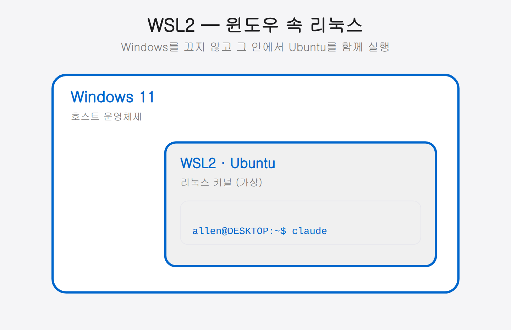

## 02-2. Windows: WSL2 환경 구성 + Docker Desktop

Windows에서 Claude Code 멀티에이전트 환경을 구성하려면 **WSL2(Windows Subsystem for Linux 2)**가 필요합니다. WSL2는 Windows 10/11 위에서 완전한 Linux 커널을 실행하는 Microsoft 공식 솔루션으로, 성능과 호환성 모두 네이티브에 가깝습니다.

> **이 페이지 범위**: WSL2 활성화 → Ubuntu 설치 → 기본 유틸리티 설치 → **Docker Desktop(WSL2 백엔드) 설치**까지. Claude Code·tmux·OpenClaw 등 실제 개발 도구는 **Docker 컨테이너 내부**(02-4·02-5)에서 설치합니다.

> **WSL2를 쉽게 말하면?** Windows 안에 작은 Ubuntu 컴퓨터를 하나 더 띄우는 기능입니다. Windows는 그대로 쓰면서, 개발에 필요한 Linux 환경만 그 안에서 함께 돌리는 것이죠. 두 환경은 파일도 서로 주고받을 수 있습니다(뒤의 `/mnt/c` 설명 참고).



> 아래는 이 페이지에서 진행할 전체 흐름입니다. 1→8단계를 순서대로 따라가면 됩니다.

크게 보면 흐름은 세 묶음입니다 — **WSL2를 켜고 Ubuntu를 올린 뒤**(1~4단계), **시스템을 최신화하고 기본 유틸리티와 Git을 세팅**(5~7단계)한 다음, **Docker Desktop을 설치하고 WSL2와 연결**(8단계)합니다. 이후 Claude Code·tmux는 컨테이너 안에서 설치하므로 02-4로 넘어가면 됩니다.

<hr>

## 1단계: WSL2 활성화 및 Ubuntu 설치

PowerShell을 **관리자 권한**으로 열고 아래 명령 하나를 실행합니다.

> **PowerShell을 관리자 권한으로 여는 법:** 시작 메뉴에서 `PowerShell`을 검색한 뒤, 마우스 오른쪽 버튼을 눌러 `관리자 권한으로 실행`을 선택합니다. WSL2 설치는 시스템 기능을 켜는 작업이라 일반 권한으로는 진행되지 않습니다.

```powershell
wsl --install
```

이 명령으로 WSL2 기능 활성화, 가상 머신 플랫폼 설치, Ubuntu 최신 LTS 다운로드가 자동으로 처리됩니다. 설치 완료 후 **PC를 재시작**하세요.

> **특정 버전 지정**: Ubuntu 22.04를 사용하려면 `wsl --install -d Ubuntu-22.04`를 사용합니다.

<hr>

## 2단계: Ubuntu 초기 설정

재시작 후 Ubuntu 초기 설정 창이 자동으로 열립니다. 사용자명과 비밀번호를 설정합니다.

```
Enter new UNIX username: allen          # 영문 소문자, 공백 없이
New password: ****                       # 입력 시 화면에 표시되지 않음
Retype new password: ****
```

설정이 완료되면 Ubuntu 터미널 프롬프트가 나타납니다.

```
allen@DESKTOP-XXXX:~$
```

> 비밀번호를 입력할 때 화면에 아무 글자도 보이지 않는 것은 정상입니다(보안을 위한 동작). 그냥 입력하고 Enter를 누르세요. 이 비밀번호는 이후 `sudo` 명령에서 다시 사용하므로 꼭 기억해 두세요.

<hr>

## 3단계: WSL2 버전 확인

PowerShell에서 WSL2로 설치되었는지 확인합니다.

```powershell
wsl --list --verbose
```

출력 결과의 VERSION이 `2`인지 확인합니다.

```
  NAME      STATE    VERSION
* Ubuntu    Running  2
```

VERSION이 `1`이라면 다음 명령으로 업그레이드합니다.

```powershell
wsl --set-version Ubuntu 2
wsl --set-default-version 2
```

<hr>

## 4단계: Ubuntu 터미널 열기

이후 모든 작업은 **Ubuntu 터미널**에서 진행합니다. 두 가지 방법으로 열 수 있습니다.

- 시작 메뉴에서 **Ubuntu** 앱 실행
- Windows Terminal 앱에서 **Ubuntu** 탭 선택 (권장)

> **Windows Terminal 설치**: Microsoft Store에서 무료로 설치할 수 있습니다. 탭 기능과 폰트 렌더링이 기본 Ubuntu 앱보다 훨씬 편리합니다.

<hr>

## 5단계: 패키지 목록 최신화

Ubuntu 터미널에서 패키지 목록을 업데이트합니다.

```bash
sudo apt update && sudo apt upgrade -y
```

비밀번호를 물으면 2단계에서 설정한 비밀번호를 입력합니다.

<hr>

## 6단계: 기본 유틸리티 설치

```bash
sudo apt install -y git curl wget unzip build-essential
```

각 패키지 역할:

| 패키지 | 역할 |
|--------|------|
| git | 프로젝트 버전 관리 |
| curl | URL 기반 파일 다운로드 |
| wget | 파일 다운로드 |
| unzip | 압축 해제 |
| build-essential | C/C++ 빌드 도구 (일부 npm 패키지 컴파일 시 필요) |

<hr>

## 7단계: Git 초기 설정

Git은 기본 유틸리티 설치 시 포함됩니다. 사용자 정보를 설정합니다.

```bash
git config --global user.name "Your Name"
git config --global user.email "your@email.com"

# 설정 확인
git config --list
```

<hr>

## 8단계: Docker Desktop 설치 (WSL2 백엔드)

Windows에서 Docker를 쓰는 가장 간단한 방법은 **Docker Desktop**입니다. WSL2 백엔드를 활성화하면 Ubuntu 터미널에서 `docker` 명령을 그대로 쓸 수 있습니다.

### 8-1. Docker Desktop 다운로드 및 설치

[docker.com/products/docker-desktop](https://www.docker.com/products/docker-desktop/) 에서 **Windows용 Docker Desktop**을 내려받아 실행합니다.

설치 화면에서 아래 옵션을 확인합니다.

- **Use WSL 2 instead of Hyper-V** — 반드시 체크
- **Add shortcut to desktop** — 선택 사항

설치가 완료되면 PC 재시작이 필요할 수 있습니다.

### 8-2. WSL2 통합 활성화

Docker Desktop을 실행하고 **Settings(⚙️) → Resources → WSL Integration** 으로 이동합니다.

- **Enable integration with my default WSL distro** — 켜기
- Ubuntu 항목이 보이면 해당 토글도 켜기

**Apply & Restart** 버튼을 클릭합니다.

### 8-3. Ubuntu 터미널에서 확인

WSL2 Ubuntu 터미널을 열고 다음을 실행합니다.

```bash
docker --version
```

출력 예시:
```
Docker version 29.3.1, build ...
```

```bash
docker run hello-world
```

`Hello from Docker!` 메시지가 출력되면 설치 완료입니다.

> `docker: command not found` 오류가 나면 Docker Desktop을 재시작하거나 WSL Integration 설정을 다시 확인하세요. WSL2 Ubuntu 터미널도 닫았다가 새로 열어보세요.

<hr>

## WSL2 고유 설정

### Windows 파일 시스템 접근

WSL2에서 Windows 파일에 접근하려면 `/mnt/c/` 경로를 사용합니다.

```bash
# Windows C 드라이브 접근
ls /mnt/c/Users/

# Windows 바탕화면
ls /mnt/c/Users/사용자명/Desktop/
```

> Windows의 `C:\` 드라이브가 Ubuntu에서는 `/mnt/c/`로 연결됩니다. 즉 Windows 탐색기에서 보던 파일을 Ubuntu 터미널에서도 그대로 열고 편집할 수 있습니다. 두 환경을 잇는 다리라고 생각하면 됩니다.

이 연결은 양방향입니다. Windows 탐색기에서 만든 파일을 Ubuntu 터미널에서 그대로 열 수 있고, 반대로 Ubuntu에서 작업한 결과도 Windows 탐색기에서 바로 확인됩니다. 한쪽에서 복사해 옮길 필요 없이 두 환경이 같은 파일을 공유하므로, 코드는 Ubuntu에서 다루고 결과물은 익숙한 Windows 앱으로 여는 혼합 작업이 자연스럽습니다.

### 두 IP 환경 이해하기

WSL2(Ubuntu)는 Windows와 별개의 가상 네트워크 주소를 갖습니다. 그래서 "WSL 내부 IP"와 "Windows 호스트 IP" 두 가지가 존재합니다. 스마트폰 등 외부 기기에서 접근할 때 어떤 IP를 써야 하는지 헷갈리기 쉬우므로 구분해 둡니다.

외부 기기에서 들어오는 경로를 따라가 보면 이렇습니다. 스마트폰은 먼저 같은 공유기(Wi-Fi)에 접속한 뒤 **Windows 호스트 IP**를 두드립니다. 그러면 Windows가 이 요청을 받아 내부의 **WSL2(Ubuntu) IP**로 넘겨줍니다. 즉 바깥에서는 WSL 내부 IP가 직접 보이지 않으므로, 스마트폰에 입력할 주소는 항상 **Windows 호스트 IP** 쪽입니다. WSL 내부 IP는 재부팅 때마다 바뀔 수 있어, 외부 접속용 기준으로는 호스트 IP가 안전합니다.

### 네트워크 IP 확인

```bash
# WSL2 내부 IP
ip addr show eth0 | grep 'inet '

# Windows 호스트 IP (WSL 내부에서)
cat /etc/resolv.conf | grep nameserver
```

### 포트 포워딩 (외부 접근 시)

스마트폰에서 Remote Control에 접근하려면 Windows 방화벽에서 포트를 허용해야 합니다. PowerShell 관리자 권한으로 실행합니다.

```powershell
# 포트 8080 허용 (예시)
netsh advfirewall firewall add rule name="Claude Remote" dir=in action=allow protocol=TCP localport=8080
```

<hr>

## 원클릭 설치 스크립트

WSL2 Ubuntu 호스트 환경 기본 설정을 한 번에 처리합니다. Node.js·tmux·Claude Code는 02-4 컨테이너 단계에서 설치합니다.

```bash
#!/bin/bash
set -e

echo "=== WSL2 Ubuntu 호스트 환경 설치 시작 ==="

# 시스템 업데이트
sudo apt update && sudo apt upgrade -y

# 기본 도구 (컨테이너 내부 도구는 02-4에서 설치)
sudo apt install -y git curl wget unzip build-essential

# Git 기본 설정
echo "Git 사용자 정보를 입력하세요."
read -p "이름: " git_name
read -p "이메일: " git_email
git config --global user.name "$git_name"
git config --global user.email "$git_email"

echo ""
echo "=== 호스트 기본 설치 완료 ==="
echo "  git: $(git --version | cut -d' ' -f3)"
echo "  curl: $(curl --version | head -1 | cut -d' ' -f2)"
echo ""
echo "다음 단계: Docker Desktop WSL2 Integration을 활성화하고 02-4로 이동하세요."
echo "  docker --version 으로 연동을 확인하세요."
```

저장 후 실행:

```bash
chmod +x install-host.sh
./install-host.sh
```

<hr>

## 설치 확인 체크리스트

```bash
git --version     # 2.x.x
curl --version    # 버전 출력
docker --version  # Docker version 29.x.x 이상
docker run hello-world  # Hello from Docker! 출력
```

모든 항목이 정상이면 다음 단계로 넘어갑니다.

<hr>

## 다음 단계: 02-4 컨테이너 기동

호스트(WSL2 + Docker Desktop) 준비가 완료됐습니다. 이제 Claude Code·tmux·OpenClaw를 설치할 **Docker 컨테이너를 기동**합니다.

[02-4. Docker 컨테이너 기동 + 내부 Claude Code](02-4-claude-install.md)로 이동하세요.
