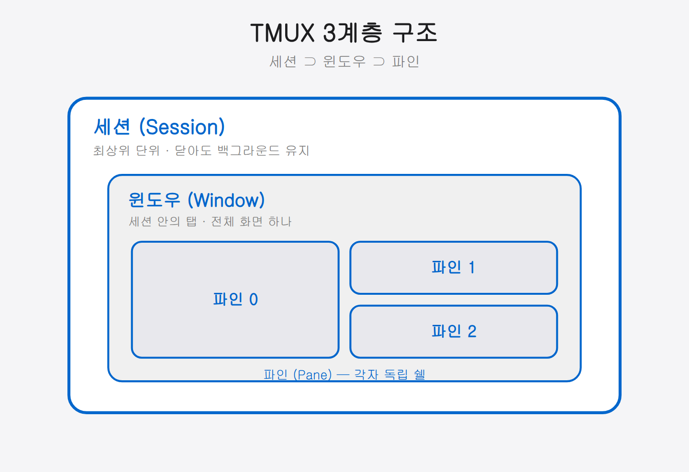
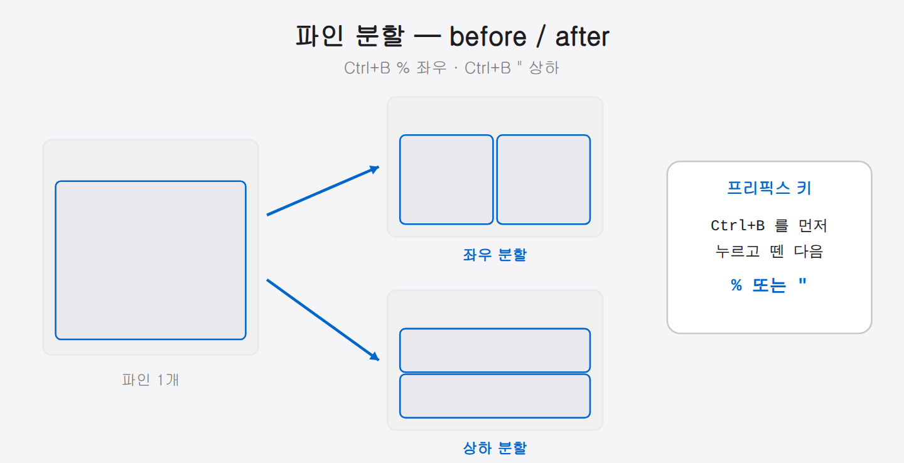

## 02-5. 컨테이너 내부 tmux + OpenClaw 설치

02-4에서 기동한 Docker 컨테이너 **안에서** tmux와 OpenClaw를 설치하고 설정합니다. 호스트 OS에 설치하는 것이 아니라 컨테이너 내부에서 실행하는 점에 주의하세요.

TMUX(Terminal Multiplexer)는 한 터미널 창에서 여러 터미널을 동시에 띄워 관리하는 도구입니다. Claude 멀티에이전트 환경에서는 TMUX의 파인(Pane) 기능을 활용해 여러 에이전트를 동시에 운영합니다.

> TMUX는 한 개의 모니터를 여러 칸으로 나눠 쓰는 "화면 분할 리모컨"입니다. 칸마다 서로 다른 작업을 동시에 돌릴 수 있고, 터미널을 닫아도 그 작업들은 백그라운드에서 계속 살아 있습니다.

> **TMUX가 없다면 어떻게 될까?** 터미널 창 6개를 따로 띄우고 각각에 Claude를 실행해야 합니다. 그리고 에이전트끼리 메시지를 주고받으려면 사람이 직접 복사·붙여넣기를 해야 합니다. TMUX는 이 모든 창들을 하나로 묶고, 스크립트로 각 칸에 명령을 자동 전송합니다.

> **설치 위치**: tmux와 OpenClaw 모두 **컨테이너 내부**에서 설치합니다. `docker exec -it claude-env bash` 로 컨테이너에 진입한 상태에서 아래 단계를 진행하세요.

<hr>

## 1단계: tmux 설치 (컨테이너 내부)

컨테이너 안에서 apt로 설치합니다. ubuntu:22.04 기본 저장소에서 제공합니다.

```bash
# 컨테이너 내부 셸에서 실행
apt-get install -y tmux

# 설치 확인
tmux -V
```

출력 예시:
```
tmux 3.2a
```

<hr>

## 2단계: OpenClaw 설치 (컨테이너 내부)

OpenClaw는 Claude Code와 함께 사용하는 멀티채널 AI 게이트웨이입니다. npm으로 설치합니다.

> ⚠️ **OpenClaw 면책 고지**
>
> OpenClaw는 **Anthropic이 만든 공식 도구가 아닙니다.** 독립 개발자가 제작한 서드파티 소프트웨어입니다.
>
> - 사용은 **전적으로 본인 책임**이며, 공식 지원을 받을 수 없습니다.
> - OpenAI·Anthropic 등 연동하는 **각 서비스의 이용 약관(Terms of Service)을 직접 확인**하고 준수해야 합니다.
> - 이 책은 도구의 존재와 설치 방법을 소개할 뿐이며, 특정 용도로의 사용을 보장하거나 권장하지 않습니다.

위 사항을 확인한 뒤 설치를 진행합니다.

```bash
# 컨테이너 내부 셸에서 실행 (02-4에서 Node.js가 설치되어 있어야 함)
npm install -g openclaw

# 설치 확인
openclaw --version
```

출력 예시:
```
OpenClaw 2026.6.8 (844f405)
```

<hr>

## 핵심 개념

TMUX는 세 가지 계층 구조로 구성됩니다.

```
세션(Session)
  └── 윈도우(Window)
        └── 파인(Pane)
```

- **세션**: TMUX의 최상위 단위. 여러 윈도우를 포함. 터미널을 닫아도 세션은 백그라운드에서 유지됩니다.
- **윈도우**: 세션 내의 탭. 하나의 전체 화면을 차지합니다.
- **파인**: 윈도우를 분할한 공간. 각 파인은 독립적인 쉘을 실행합니다.

> 웹 브라우저에 빗대면, **세션**은 브라우저 프로그램 전체, **윈도우**는 탭, **파인**은 한 탭을 좌우로 나눈 화면 칸과 같습니다.

이 계층 구조를 이해하면 `team:0.1` 같은 주소 표기가 자연스럽게 읽힙니다 — `팀세션 : 0번윈도우 . 1번파인`의 뜻입니다.



<hr>

## 모든 단축키의 시작: Ctrl+B (프리픽스 키)

TMUX 단축키는 모두 **`Ctrl+B`를 먼저 누르고 손을 뗀 다음**, 이어서 기능 키를 누르는 방식입니다. 이 `Ctrl+B`를 "프리픽스 키"라고 부릅니다.

예를 들어 `Ctrl+B c`는 "`Ctrl`과 `B`를 함께 눌렀다 떼고 → `c`를 누른다"는 뜻입니다. 두 키를 동시에 누르는 것이 아닙니다. 이 원리만 익히면 아래 모든 단축키를 똑같이 쓸 수 있습니다.

> **처음에 가장 많이 하는 실수**: `Ctrl+B`와 기능 키를 동시에 누르는 것입니다. 반드시 `Ctrl+B`를 먼저 눌렀다 완전히 뗀 후, 이어서 기능 키를 누르세요. "두 번 탭" 방식으로 생각하면 편합니다.

<hr>

## 기본 명령어

### 세션 관리

```bash
# 새 세션 생성
tmux new-session -s team

# 세션 목록 확인
tmux ls

# 세션 접속 (attach)
tmux attach -t team
tmux a -t team        # 단축 형식

# 세션 분리 (detach, 세션은 백그라운드 유지)
# 단축키: Ctrl+B, D

# 세션 종료
tmux kill-session -t team
```

> `-s`는 세션 이름(session), `-t`는 대상(target)을 지정하는 옵션입니다. "분리(detach)"는 세션을 끄지 않고 잠시 빠져나오는 것으로, 다시 `attach`하면 하던 작업이 그대로 남아 있습니다.

> **detach의 강력함**: 컨테이너 내부에서 tmux 세션을 만들고 detach한 뒤 `docker exec -it claude-env bash`로 다시 들어와 `tmux attach`하면 이전 작업 그대로 이어집니다. 단, 컨테이너 자체가 중지되면 tmux 세션도 함께 사라집니다.

### 윈도우 관리

TMUX 세션 안에서 사용하는 단축키입니다. 모든 단축키는 `Ctrl+B`를 먼저 누른 후 키를 입력합니다.

| 단축키 | 동작 |
|--------|------|
| `Ctrl+B c` | 새 윈도우 생성 |
| `Ctrl+B n` | 다음 윈도우로 이동 |
| `Ctrl+B p` | 이전 윈도우로 이동 |
| `Ctrl+B 0~9` | 번호로 윈도우 이동 |
| `Ctrl+B &` | 현재 윈도우 종료 |
| `Ctrl+B ,` | 윈도우 이름 변경 |
| `Ctrl+B w` | 윈도우 목록 보기 |

### 파인 관리

| 단축키 | 동작 |
|--------|------|
| `Ctrl+B %` | 세로로 분할 (좌우) |
| `Ctrl+B "` | 가로로 분할 (상하) |
| `Ctrl+B 방향키` | 파인 간 이동 |
| `Ctrl+B x` | 현재 파인 종료 |
| `Ctrl+B z` | 현재 파인 전체 화면 토글 |
| `Ctrl+B Ctrl+방향키` | 파인 크기 조절 |
| `Ctrl+B q` | 파인 번호 표시 |
| `Ctrl+B {` / `Ctrl+B }` | 파인 위치 교환 |

> `Ctrl+B q`를 누르면 각 파인에 번호가 잠깐 표시됩니다. 파인이 많을 때 몇 번 파인인지 빠르게 확인하는 방법입니다. 번호가 표시되는 동안 그 숫자 키를 누르면 해당 파인으로 즉시 이동합니다.



<hr>

## 명령으로 파인 제어하기

스크립트에서 특정 파인에 명령을 전송하는 방법입니다. 멀티에이전트 팀이 서로에게 메시지를 보낼 때 이 방식을 사용합니다.

```bash
# 특정 파인에 텍스트 전송 (Enter 없이)
tmux send-keys -t team:0.1 "echo hello"

# 특정 파인에 명령 실행 (Enter 포함)
tmux send-keys -t team:0.1 "echo hello" Enter

# 파인 내용 캡처 (현재 화면 텍스트 읽기)
tmux capture-pane -t team:0.1 -p
```

형식: `세션이름:윈도우번호.파인번호`

> 예를 들어 `team:0.1`은 "team 세션의 0번 윈도우, 1번 파인"을 가리킵니다. `send-keys`로 명령을 보내고 `capture-pane`으로 그 결과 화면을 읽어 오는 것이, 에이전트끼리 소통하는 기본 원리입니다.

> **메시지 전송과 Enter를 분리하는 이유**: 긴 메시지를 보낼 때 텍스트와 Enter를 함께 전송하면 메시지 전달이 완료되기 전에 Enter가 먼저 실행될 수 있습니다. `sleep 0.3` 사이에 Enter를 별도로 보내면 메시지가 온전히 전달된 후 실행됩니다. 이 책의 팀 스크립트는 이 패턴을 표준으로 사용합니다.

```bash
# 안전한 전송 패턴 (텍스트 → 대기 → Enter 분리)
tmux send-keys -t team:0.1 "메시지 내용"
sleep 0.3
tmux send-keys -t team:0.1 "" Enter
```

<hr>

## 레이아웃 설정

TMUX는 파인 배치를 자동으로 정렬하는 레이아웃 기능을 제공합니다.

```bash
# 레이아웃 적용
tmux select-layout -t team:0 even-horizontal   # 좌우 균등
tmux select-layout -t team:0 even-vertical     # 상하 균등
tmux select-layout -t team:0 main-vertical     # 왼쪽 크게, 나머지 세로 배열
tmux select-layout -t team:0 main-horizontal   # 위 크게, 나머지 가로 배열
tmux select-layout -t team:0 tiled             # 격자 배열
```

> 우리 팀 환경은 `main-vertical`을 사용합니다. 팀장(쭌) 파인을 왼쪽에 크게 두고, 나머지 팀원 파인을 오른쪽에 세로로 나열하기 위해서입니다.

각 레이아웃을 머릿속에 그려 보면 이렇습니다.

| 레이아웃 | 배치 설명 |
|----------|----------|
| `even-horizontal` | 파인들을 좌우로 균등하게 나눠 세로 기둥처럼 세움 |
| `even-vertical` | 파인들을 위아래로 균등하게 나눠 가로 줄무늬처럼 쌓음 |
| `main-vertical` | 왼쪽 한 칸을 크게 두고 오른쪽에 나머지를 세로로 나열 |
| `main-horizontal` | 위 한 칸을 크게 두고 아래에 나머지를 가로로 나열 |
| `tiled` | 모든 칸을 바둑판처럼 균등한 격자로 배치 |

팀장 파인 너비를 특정 값으로 고정하려면 레이아웃 적용 후 `resize-pane`을 씁니다.

```bash
# 0번 파인을 가로 158칸 너비로 조절
tmux resize-pane -t team:0.0 -x 158
```

<hr>

## 파인 제목 설정

각 파인에 이름(제목)을 붙여 누가 어떤 파인인지 한눈에 알 수 있게 합니다.

```bash
# 파인 상단 제목 표시 활성화
tmux set-option -t team pane-border-status top
tmux set-option -t team pane-border-format " #{pane_title} "

# 파인 이름 설정
tmux select-pane -t team:0.0 -T "쭌 (팀장)"
tmux select-pane -t team:0.1 -T "민준 아키텍트"
```

> `-T`는 제목(Title)을 지정하는 옵션입니다. 파인마다 담당자 이름을 붙여 두면, 여러 에이전트를 동시에 볼 때 누가 어떤 칸인지 헷갈리지 않습니다.

`pane-border-status top`은 각 파인의 위쪽 테두리에 제목을 표시하고, `pane-border-format`은 그 제목의 표시 형식을 지정합니다. `#{pane_title}`은 TMUX 형식 변수로, 각 파인에 설정한 제목 값이 들어갑니다.

<hr>

## 스크롤 및 복사 모드

TMUX 안에서 마우스 스크롤이 안 될 때는 "복사 모드"로 들어가면 스크롤과 텍스트 선택이 가능합니다.

```
Ctrl+B [        # 복사 모드 진입
방향키 / PgUp   # 스크롤
q               # 복사 모드 종료
```

> 복사 모드에서는 마우스 스크롤처럼 화면을 위아래로 이동하며 이전 출력을 볼 수 있습니다. Claude가 긴 답변을 출력했을 때 올려 보고 싶으면 `Ctrl+B [`로 진입하세요. `q`를 누르면 빠져나옵니다.

마우스 스크롤 자체를 활성화하려면 TMUX 설정에 한 줄을 추가합니다.

```bash
# ~/.tmux.conf (컨테이너 내부)
set -g mouse on
```

설정 파일을 적용하려면 터미널에서 다음을 실행합니다.

```bash
tmux source-file ~/.tmux.conf
```

<hr>

## 실습: 컨테이너 내부 멀티파인 세션

아래 4단계를 순서대로 따라 하면 컨테이너 안에서 좌우로 나뉜 파인 두 개가 각각 메시지를 출력하는 모습을 직접 확인할 수 있습니다.

```bash
# 컨테이너 내부에서 실행

# 1. 새 세션 생성 (백그라운드, 크기 지정)
tmux new-session -d -s team -x 220 -y 50

# 2. 파인 분할 (좌우 2개)
tmux split-window -t team:0.0 -h

# 3. 각 파인에 명령 실행
tmux send-keys -t team:0.0 "echo 'Pane 0 작동 중'" Enter
tmux send-keys -t team:0.1 "echo 'Pane 1 작동 중'" Enter

# 4. 세션 접속하여 확인
tmux attach -t team
```

> 접속 후 빠져나오려면 `Ctrl+B`를 누르고 손을 뗀 다음 `d`를 누르세요(detach). 실습 세션을 완전히 끄려면 `tmux kill-session -t practice`를 실행합니다.

이 실습에서 핵심 패턴을 확인하세요. `new-session -d`로 백그라운드에서 세션을 만들고, `split-window`로 파인을 나누고, `send-keys`로 각 파인에 명령을 주입한 뒤, `attach`로 들어가서 결과를 확인합니다. 3장에서 6명의 에이전트 팀을 구성할 때도 이 흐름을 그대로 반복합니다.

<hr>

## 요약

TMUX의 핵심 흐름은 **세션 생성 → 파인 분할 → 각 파인에 명령 전송**입니다.

| 동작 | 명령 / 단축키 |
|------|--------------|
| 세션 만들기 | `tmux new-session -s 이름` |
| 세션 들어가기 | `tmux attach -t 이름` |
| 세션 나오기 (유지) | `Ctrl+B d` |
| 파인 좌우 분할 | `Ctrl+B %` |
| 파인 상하 분할 | `Ctrl+B "` |
| 파인 이동 | `Ctrl+B 방향키` |
| 파인에 명령 전송 | `tmux send-keys -t 세션:윈도우.파인 "명령" Enter` |
| 파인 화면 읽기 | `tmux capture-pane -t 세션:윈도우.파인 -p` |

### 설치 확인 체크리스트 (컨테이너 내부)

```bash
tmux -V         # tmux 3.2a
openclaw --version  # OpenClaw 2026.6.8
```

다음 챕터에서는 이 구조를 활용해 6명의 Claude 에이전트가 동시에 동작하는 팀 환경을 구성합니다.
