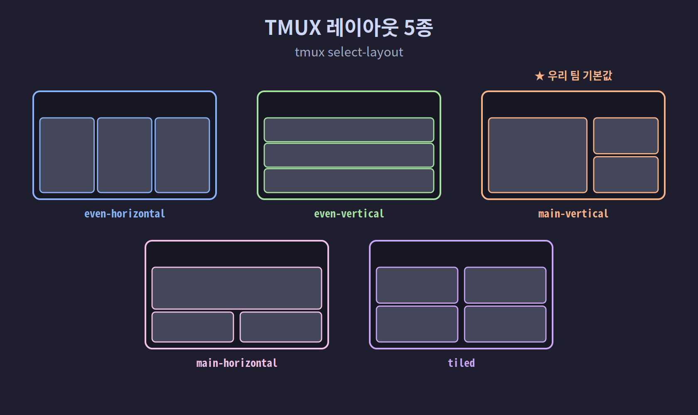

## 02-5. TMUX 기본 명령어 및 활용

TMUX(Terminal Multiplexer)는 하나의 터미널 창 안에서 여러 개의 터미널을 동시에 실행하고 관리할 수 있는 강력한 도구입니다. Claude 멀티에이전트 환경에서는 TMUX의 파인(Pane) 기능을 활용해 6명의 에이전트를 동시에 운영합니다.

> 💡 **비유로 이해하기:** TMUX는 한 개의 모니터를 여러 칸으로 나눠 쓰는 "화면 분할 리모컨"이라고 생각하면 쉽습니다. 칸마다 서로 다른 작업을 동시에 돌릴 수 있고, 터미널을 닫아도 그 작업들은 백그라운드에서 계속 살아 있습니다.

> **설치**: 각 플랫폼 가이드에서 이미 완료됩니다. Windows는 [02-2](02-2-windows-wsl2.md), macOS는 [02-3](02-3-macos.md) 참고.

<hr>

## 핵심 개념

TMUX는 세 가지 계층 구조로 구성됩니다.

```
세션(Session)
  └── 윈도우(Window)
        └── 파인(Pane)
```

- **세션**: TMUX의 최상위 단위. 여러 윈도우를 포함. 터미널을 닫아도 세션은 백그라운드에서 유지됩니다.
- **윈도우**: 세션 내의 탭. 하나의 전체 화면을 차지합니다.
- **파인**: 윈도우를 분할한 공간. 각 파인은 독립적인 쉘을 실행합니다.

> 💡 웹 브라우저에 빗대면, **세션**은 브라우저 프로그램 전체, **윈도우**는 탭, **파인**은 한 탭을 좌우로 나눈 화면 칸과 같습니다.


<hr>

## 모든 단축키의 시작: Ctrl+B (프리픽스 키)

TMUX 단축키는 모두 **`Ctrl+B`를 먼저 누르고 손을 뗀 다음**, 이어서 기능 키를 누르는 방식입니다. 이 `Ctrl+B`를 "프리픽스 키"라고 부릅니다.

예를 들어 `Ctrl+B c`는 "`Ctrl`과 `B`를 함께 눌렀다 떼고 → `c`를 누른다"는 뜻입니다. 두 키를 동시에 누르는 것이 아닙니다. 이 원리만 익히면 아래 모든 단축키를 똑같이 쓸 수 있습니다.

<hr>

## 기본 명령어

### 세션 관리

```bash
# 새 세션 생성
tmux new-session -s team

# 세션 목록 확인
tmux ls

# 세션 접속 (attach)
tmux attach -t team
tmux a -t team        # 단축 형식

# 세션 분리 (detach, 세션은 백그라운드 유지)
# 단축키: Ctrl+B, D

# 세션 종료
tmux kill-session -t team
```

> 💡 `-s`는 세션 이름(session), `-t`는 대상(target)을 지정하는 옵션입니다. "분리(detach)"는 세션을 끄지 않고 잠시 빠져나오는 것으로, 다시 `attach`하면 하던 작업이 그대로 남아 있습니다.

### 윈도우 관리

TMUX 세션 안에서 사용하는 단축키입니다. 모든 단축키는 `Ctrl+B`를 먼저 누른 후 키를 입력합니다.

| 단축키 | 동작 |
|--------|------|
| `Ctrl+B c` | 새 윈도우 생성 |
| `Ctrl+B n` | 다음 윈도우로 이동 |
| `Ctrl+B p` | 이전 윈도우로 이동 |
| `Ctrl+B 0~9` | 번호로 윈도우 이동 |
| `Ctrl+B &` | 현재 윈도우 종료 |

### 파인 관리

| 단축키 | 동작 |
|--------|------|
| `Ctrl+B %` | 세로로 분할 (좌우) |
| `Ctrl+B "` | 가로로 분할 (상하) |
| `Ctrl+B 방향키` | 파인 간 이동 |
| `Ctrl+B x` | 현재 파인 종료 |
| `Ctrl+B z` | 현재 파인 전체 화면 토글 |
| `Ctrl+B Ctrl+방향키` | 파인 크기 조절 |


<hr>

## 명령으로 파인 제어하기

스크립트에서 특정 파인에 명령을 전송하는 방법입니다. 멀티에이전트 팀이 서로에게 메시지를 보낼 때 이 방식을 사용합니다.

```bash
# 특정 파인에 텍스트 전송 (Enter 없이)
tmux send-keys -t team:0.1 "echo hello"

# 특정 파인에 명령 실행 (Enter 포함)
tmux send-keys -t team:0.1 "echo hello" Enter

# 파인 내용 캡처 (현재 화면 텍스트 읽기)
tmux capture-pane -t team:0.1 -p
```

형식: `세션이름:윈도우번호.파인번호`

> 💡 예를 들어 `team:0.1`은 "team 세션의 0번 윈도우, 1번 파인"을 가리킵니다. `send-keys`로 명령을 보내고 `capture-pane`으로 그 결과 화면을 읽어 오는 것이, 에이전트끼리 소통하는 기본 원리입니다.

<hr>

## 레이아웃 설정

TMUX는 파인 배치를 자동으로 정렬하는 레이아웃 기능을 제공합니다.

```bash
# 레이아웃 적용
tmux select-layout -t team:0 even-horizontal   # 좌우 균등
tmux select-layout -t team:0 even-vertical     # 상하 균등
tmux select-layout -t team:0 main-vertical     # 왼쪽 크게, 나머지 세로 배열
tmux select-layout -t team:0 main-horizontal   # 위 크게, 나머지 가로 배열
tmux select-layout -t team:0 tiled             # 격자 배열
```

> 💡 우리 팀 환경은 `main-vertical`을 사용합니다. 팀장(쭌) 파인을 왼쪽에 크게 두고, 나머지 팀원 파인을 오른쪽에 세로로 나열하기 위해서입니다.



<hr>

## 파인 제목 설정

각 파인에 이름(제목)을 붙여 누가 어떤 파인인지 한눈에 알 수 있게 합니다.

```bash
# 파인 상단 제목 표시 활성화
tmux set-option -t team pane-border-status top
tmux set-option -t team pane-border-format " #{pane_title} "

# 파인 이름 설정
tmux select-pane -t team:0.0 -T "쭌 (팀장)"
tmux select-pane -t team:0.1 -T "민준 아키텍트"
```

> 💡 `-T`는 제목(Title)을 지정하는 옵션입니다. 파인마다 담당자 이름을 붙여 두면, 여러 에이전트를 동시에 볼 때 누가 어떤 칸인지 헷갈리지 않습니다.

<hr>

## 실습: 간단한 멀티파인 세션

아래 4단계를 순서대로 따라 하면 좌우로 나뉜 파인 두 개가 각각 메시지를 출력하는 모습을 직접 확인할 수 있습니다.

```bash
# 1. 새 세션 생성 (백그라운드)
tmux new-session -d -s practice

# 2. 파인 분할 (좌우 2개)
tmux split-window -t practice:0.0 -h

# 3. 각 파인에 명령 실행
tmux send-keys -t practice:0.0 "echo 'Pane 0 작동 중'" Enter
tmux send-keys -t practice:0.1 "echo 'Pane 1 작동 중'" Enter

# 4. 세션 접속하여 확인
tmux attach -t practice
```

> 💡 접속 후 빠져나오려면 `Ctrl+B`를 누르고 손을 뗀 다음 `d`를 누르세요(detach). 실습 세션을 완전히 끄려면 `tmux kill-session -t practice`를 실행합니다.

<hr>

## 요약

TMUX의 핵심 흐름은 **세션 생성 → 파인 분할 → 각 파인에 명령 전송**입니다. 다음 챕터에서는 이 구조를 활용해 6명의 Claude 에이전트가 동시에 동작하는 팀 환경을 구성합니다.
