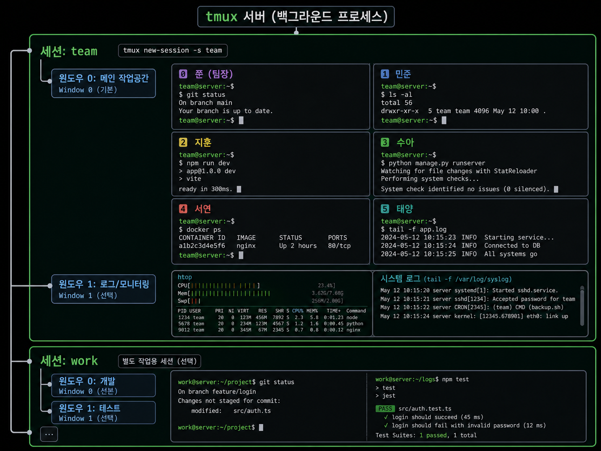
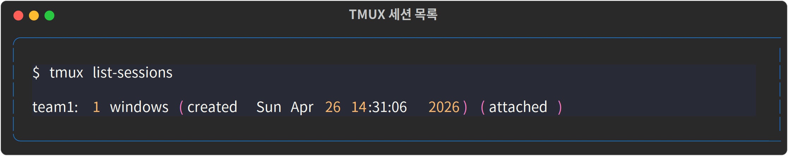

## 3-1. TMUX 세션·윈도우·파인 구조

멀티에이전트 환경을 설계하기 전에 TMUX의 계층 구조를 완전히 이해해야 합니다. 에이전트 간 통신, 레이아웃 구성, 자동화 스크립트 모두 이 구조를 기반으로 작동합니다.

<hr>

## 계층 구조 전체 그림

```
tmux 서버 (백그라운드 프로세스)
│
├── 세션: team                      ← tmux new-session -s team
│     ├── 윈도우 0: 메인 작업공간  ← Window 0 (기본)
│     │     ├── 파인 0: 쭌 (팀장)  ← Pane 0
│     │     ├── 파인 1: 민준       ← Pane 1
│     │     ├── 파인 2: 지훈       ← Pane 2
│     │     ├── 파인 3: 수아       ← Pane 3
│     │     ├── 파인 4: 서연       ← Pane 4
│     │     └── 파인 5: 태양       ← Pane 5
│     └── 윈도우 1: 로그/모니터링  ← Window 1 (선택)
│
└── 세션: work                      ← 별도 작업용 세션 (선택)
```

<hr>

## 세션(Session)

세션은 TMUX의 최상위 단위입니다. 터미널을 닫거나 SSH 연결이 끊겨도 세션은 서버에서 계속 실행됩니다.

```bash
# 세션 생성 (백그라운드)
tmux new-session -d -s team -x 317 -y 85
#                ^백그라운드  ^이름  ^너비  ^높이

# 세션 목록 확인
tmux ls
# team: 1 windows (created ...) (attached)

# 세션 이름 변경
tmux rename-session -t team newname
```

`-x`와 `-y`는 세션의 가상 터미널 크기입니다. 실제 터미널 크기보다 크게 설정하면 파인이 잘리지 않습니다.



<hr>

## 윈도우(Window)

윈도우는 세션 안의 탭입니다. 한 번에 하나의 윈도우만 화면에 표시됩니다.

```bash
# 현재 세션에 새 윈도우 추가
tmux new-window -t team

# 윈도우 이름 설정
tmux rename-window -t team:0 "agents"
tmux rename-window -t team:1 "monitor"

# 특정 윈도우로 전환 (세션 내부에서)
# Ctrl+B 0  → 윈도우 0
# Ctrl+B 1  → 윈도우 1
```

멀티에이전트 환경에서는 보통 윈도우 0 하나만 사용합니다. 6개 파인이 모두 윈도우 0에 배치됩니다.

<hr>

## 파인(Pane)

파인은 윈도우를 분할한 공간으로, 각각 독립적인 쉘 프로세스를 실행합니다. Claude 에이전트 하나당 파인 하나를 할당합니다.

### 파인 분할

```bash
# 세로 분할 (좌우로 나누기, -h = horizontal split)
tmux split-window -t team:0.0 -h

# 가로 분할 (상하로 나누기, -v = vertical split)
tmux split-window -t team:0.0 -v
```

### 파인 번호 체계

파인 번호는 분할 순서에 따라 자동으로 부여됩니다. 6개 파인을 생성하는 표준 순서는 다음과 같습니다.

```bash
# 세션 생성 → Pane 0 자동 생성
tmux new-session -d -s team

# 5번 분할 → Pane 1~5 생성
tmux split-window -t team:0.0 -h  # Pane 1
tmux split-window -t team:0.1 -h  # Pane 2
tmux split-window -t team:0.2 -h  # Pane 3
tmux split-window -t team:0.3 -h  # Pane 4
tmux split-window -t team:0.4 -h  # Pane 5

# 균등 배분
tmux select-layout -t team:0 even-horizontal
```

### 파인 주소 지정

스크립트에서 특정 파인을 지정할 때는 `세션:윈도우.파인` 형식을 사용합니다.

```bash
team:0.0   # team 세션, 윈도우 0, 파인 0
team:0.3   # team 세션, 윈도우 0, 파인 3
```

<hr>

## 파인 정보 조회

```bash
# 모든 파인 목록과 정보
tmux list-panes -t team:0

# 출력 예시:
# 0: [158x84] [history 500/50000, 1234 bytes] %0
# 1: [38x84]  [history 100/50000, 567 bytes]  %1

# 특정 파인의 현재 화면 내용 캡처
tmux capture-pane -t team:0.2 -p

# 특정 파인에서 실행 중인 프로세스 확인
tmux list-panes -t team:0 -F "#{pane_index}: #{pane_current_command}"
```

<hr>

## main-vertical 레이아웃

실제 팀 환경에서 자주 사용하는 레이아웃입니다. 파인 0이 왼쪽에 넓게 자리잡고, 나머지 파인이 오른쪽에 세로로 쌓입니다.

```bash
tmux select-layout -t team:0 main-vertical
tmux set-option -t team main-pane-width 158
```

| Pane | 팀원 | 위치 |
|------|------|------|
| 0 | 쭌 (팀장) | 왼쪽 메인 (너비 158) |
| 1 | 민준 | 오른쪽 상단 |
| 2 | 지훈 | 오른쪽 2번째 |
| 3 | 수아 | 오른쪽 3번째 |
| 4 | 서연 | 오른쪽 4번째 |
| 5 | 태양 | 오른쪽 하단 |

<hr>

## 요약

| 계층 | 생성 명령 | 주소 형식 |
|------|-----------|-----------|
| 세션 | `tmux new-session -s 이름` | `team` |
| 윈도우 | `tmux new-window -t 세션` | `team:0` |
| 파인 | `tmux split-window -t 세션:윈도우` | `team:0.2` |

이 구조를 이해했으면 다음 챕터에서 6명의 에이전트가 배치되는 실제 레이아웃을 설계합니다.
