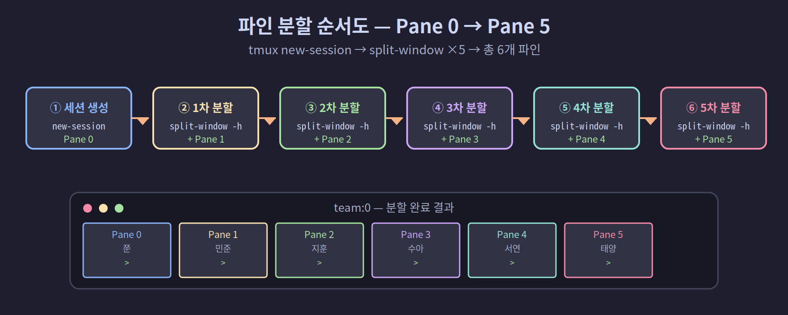
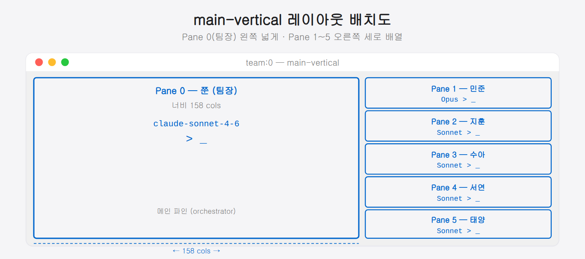

## 03-1. TMUX 세션·윈도우·파인 구조

멀티에이전트 환경을 설계하기 전에 TMUX의 계층 구조를 완전히 이해해야 합니다. 에이전트 간 통신, 레이아웃 구성, 자동화 스크립트 모두 이 구조를 기반으로 작동합니다.

> 💡 **왜 구조부터 배우는가?** TMUX를 처음 보면 명령어가 많아 막막하지만, 세션·윈도우·파인 세 개념만 이해하면 이후 모든 명령이 "어느 계층의 어느 대상에게 무슨 작업"이라는 패턴으로 읽힙니다. 지금 15분 투자가 이후 모든 스크립트를 읽는 시간을 아껴 줍니다.

<hr>

## 계층 구조 전체 그림

```
tmux 서버 (백그라운드 프로세스)
│
├── 세션: team                      ← tmux new-session -s team
│     ├── 윈도우 0: 메인 작업공간  ← Window 0 (기본)
│     │     ├── 파인 0: 쭌 (팀장)  ← Pane 0
│     │     ├── 파인 1: 민준       ← Pane 1
│     │     ├── 파인 2: 지훈       ← Pane 2
│     │     ├── 파인 3: 수아       ← Pane 3
│     │     ├── 파인 4: 서연       ← Pane 4
│     │     └── 파인 5: 태양       ← Pane 5
│     └── 윈도우 1: 로그/모니터링  ← Window 1 (선택)
│
└── 세션: work                      ← 별도 작업용 세션 (선택)
```


> 💡 **건물 비유로 이해하기:** TMUX 서버는 건물 전체이고, 세션은 층, 윈도우는 그 층의 사무실, 파인은 사무실 안에 칸막이로 나눈 책상입니다. 건물(서버)은 전원이 켜진 이상 계속 서 있고, 사람(사용자)이 건물을 잠시 나갔다 와도(detach/attach) 각 책상에서 하던 작업은 그대로입니다.

<hr>

## TMUX 서버란

TMUX는 `tmux` 명령을 처음 실행하는 순간 백그라운드에 **서버 프로세스**를 띄웁니다. 이후 모든 세션·윈도우·파인은 이 서버 위에서 살아갑니다.

```bash
# TMUX 서버가 실행 중인지 확인
pgrep -x tmux && echo "서버 실행 중" || echo "서버 없음"

# 서버에 붙어 있는 세션 목록
tmux ls
```

> 💡 서버 덕분에 터미널 창이나 SSH 연결이 끊겨도 세션은 계속 살아 있습니다. `tmux attach`로 언제든지 돌아올 수 있는 이유가 바로 이 서버 구조입니다. 반면 서버가 완전히 죽으면(`tmux kill-server`) 모든 세션이 함께 사라지므로 주의하세요.

<hr>

## 세션(Session)

세션은 TMUX의 최상위 단위입니다. 터미널을 닫거나 SSH 연결이 끊겨도 세션은 서버에서 계속 실행됩니다.

```bash
# 세션 생성 (백그라운드)
tmux new-session -d -s team -x 317 -y 85
#                ^백그라운드  ^이름  ^너비  ^높이

# 세션 목록 확인
tmux ls
# team: 1 windows (created ...) (attached)

# 세션 이름 변경
tmux rename-session -t team newname
```

> 💡 `-x`와 `-y`는 세션의 **가상 터미널 크기**입니다. 실제 터미널 창 크기보다 크게 설정하는 이유가 있습니다 — 나중에 여러 곳에서 이 세션에 attach할 때 화면 크기가 달라도 파인 배치가 흐트러지지 않습니다. `317x85`는 이 책 팀 환경의 기준값으로, 팀장 파인(너비 158)과 팀원 5칸이 나란히 들어가도록 계산된 크기입니다.

`tmux ls` 출력에서 `(attached)`는 지금 이 세션에 화면이 연결된 상태, `(detached)`는 화면은 없지만 세션이 살아서 돌아가는 상태입니다. `detached` 세션도 목록에 남아 있으며, `tmux attach -t 세션명`으로 언제든 다시 들어갈 수 있습니다.

```bash
# 특정 세션에 접속
tmux attach -t team

# 세션에서 빠져나오기 (세션은 유지)
# 단축키: Ctrl+B, D

# 세션 완전 종료 (안의 작업 모두 종료)
tmux kill-session -t team
```

<hr>

## 윈도우(Window)

윈도우는 세션 안의 탭입니다. 한 번에 하나의 윈도우만 화면에 표시됩니다.

```bash
# 현재 세션에 새 윈도우 추가
tmux new-window -t team

# 윈도우 이름 설정
tmux rename-window -t team:0 "agents"
tmux rename-window -t team:1 "monitor"

# 특정 윈도우로 전환 (세션 내부에서)
# Ctrl+B 0  → 윈도우 0
# Ctrl+B 1  → 윈도우 1
```

> 💡 웹 브라우저의 탭과 같습니다. 탭 여러 개를 열어 두되 한 번에 하나만 보이고, 탭 번호(`Ctrl+B 0`, `Ctrl+B 1`)로 전환합니다. 멀티에이전트 환경에서는 보통 **윈도우 0 하나**에 6개 파인을 모두 배치합니다. 필요하면 윈도우 1을 로그·모니터링 전용으로 추가할 수 있습니다.

<hr>

## 파인(Pane)

파인은 윈도우를 분할한 공간으로, 각각 독립적인 쉘 프로세스를 실행합니다. Claude 에이전트 하나당 파인 하나를 할당합니다.

> 💡 **파인은 독립된 작업 공간입니다.** 같은 윈도우 안에 있어도 각 파인은 서로 다른 프로세스를 실행합니다. 파인 0에서 팀장이 Claude와 대화하는 동안, 파인 4에서 서연이 코드를 작성하는 작업이 완전히 별개로 돌아갑니다. 한 파인이 무거운 작업을 하더라도 다른 파인은 영향을 받지 않습니다.

### 파인 분할

```bash
# 세로 분할 (좌우로 나누기, -h = horizontal split)
tmux split-window -t team:0.0 -h

# 가로 분할 (상하로 나누기, -v = vertical split)
tmux split-window -t team:0.0 -v
```

> 💡 **-h와 -v 헷갈림 주의:** `-h`(horizontal split)는 좌우로 나누는 **세로** 분할선, `-v`(vertical split)는 상하로 나누는 **가로** 분할선입니다. 이름과 결과 방향이 반대로 느껴질 수 있습니다. "`-h`는 한 장면을 좌우로 잘라 세로 기둥을 세운다, `-v`는 위아래로 잘라 가로 줄을 긋는다"로 외우면 덜 헷갈립니다.

### 파인 번호 체계

파인 번호는 분할 순서에 따라 자동으로 부여됩니다. 6개 파인을 생성하는 표준 순서는 다음과 같습니다.

```bash
# 세션 생성 → Pane 0 자동 생성
tmux new-session -d -s team

# 5번 분할 → Pane 1~5 생성
tmux split-window -t team:0.0 -h  # Pane 1
tmux split-window -t team:0.1 -h  # Pane 2
tmux split-window -t team:0.2 -h  # Pane 3
tmux split-window -t team:0.3 -h  # Pane 4
tmux split-window -t team:0.4 -h  # Pane 5

# 균등 배분
tmux select-layout -t team:0 even-horizontal
```

> 💡 **번호는 분할 순서에 따라 결정됩니다.** 세션을 만들면 Pane 0이 자동으로 생깁니다. 이후 분할할 때마다 새 파인이 다음 번호를 받습니다. 중요한 것은 **번호는 화면 위치가 아니라 생성 순서**라는 점입니다. 레이아웃을 바꾸거나 파인을 이동해도 번호는 유지됩니다.



### 파인 주소 지정

스크립트에서 특정 파인을 지정할 때는 `세션:윈도우.파인` 형식을 사용합니다.

```bash
team:0.0   # team 세션, 윈도우 0, 파인 0  (쭌 팀장)
team:0.3   # team 세션, 윈도우 0, 파인 3  (수아 디자이너)
```

> 💡 주소 형식은 우편 주소처럼 읽으면 됩니다. `team(건물):0(층).3(방번호)` — 건물 안의 층 안의 방을 콕 집어 가리킵니다. 이 책의 모든 `send-keys`, `capture-pane` 명령은 이 주소를 받아 정확한 파인에 명령을 보냅니다.

<hr>

## 파인 정보 조회

```bash
# 모든 파인 목록과 정보
tmux list-panes -t team:0

# 출력 예시:
# 0: [158x84] [history 500/50000, 1234 bytes] %0
# 1: [38x84]  [history 100/50000, 567 bytes]  %1

# 특정 파인의 현재 화면 내용 캡처
tmux capture-pane -t team:0.2 -p

# 특정 파인에서 실행 중인 프로세스 확인
tmux list-panes -t team:0 -F "#{pane_index}: #{pane_current_command}"
```

> 💡 **`capture-pane`의 활용:** 이 명령은 파인 화면에 현재 표시된 텍스트를 그대로 읽어 옵니다. 스크립트에서 "파인이 준비됐나?" 확인할 때 이 명령으로 특정 단어(`>`, `trust this folder` 등)가 화면에 있는지 검사합니다. 사람이 눈으로 보는 것을 스크립트가 대신하는 셈입니다.

`list-panes`의 출력에서 `[158x84]`는 해당 파인의 너비×높이(컬럼×줄)이고, `[history N/M]`은 스크롤 히스토리 사용량입니다. `%0`, `%1`은 파인의 내부 고유 ID로, 번호와는 별개입니다.

```bash
# 파인 번호별 현재 명령 목록 보기 (팀 상태 한눈 확인)
tmux list-panes -t team:0 -F "Pane #{pane_index}: #{pane_current_command} (#{pane_title})"
```

<hr>

## main-vertical 레이아웃

실제 팀 환경에서 자주 사용하는 레이아웃입니다. 파인 0이 왼쪽에 넓게 자리잡고, 나머지 파인이 오른쪽에 세로로 쌓입니다.

```bash
tmux select-layout -t team:0 main-vertical
tmux set-option -t team main-pane-width 158
```

| Pane | 팀원 | 위치 |
|------|------|------|
| 0 | 쭌 (팀장) | 왼쪽 메인 (너비 158) |
| 1 | 민준 | 오른쪽 상단 |
| 2 | 지훈 | 오른쪽 2번째 |
| 3 | 수아 | 오른쪽 3번째 |
| 4 | 서연 | 오른쪽 4번째 |
| 5 | 태양 | 오른쪽 하단 |

> 💡 **너비 158의 이유:** 전체 세션 너비를 317로 설정했을 때, 절반인 158이 팀장 파인의 너비입니다. 팀장이 Remote-Control로 수신한 메시지와 팀원에게 보낼 지시를 충분히 볼 수 있는 공간입니다. 나머지 159컬럼을 5명이 나눠 쓰므로 각 팀원은 약 31컬럼씩 갖게 됩니다.



<hr>

## 요약

| 계층 | 생성 명령 | 주소 형식 | 비유 |
|------|-----------|-----------|------|
| 세션 | `tmux new-session -s 이름` | `team` | 건물 층 |
| 윈도우 | `tmux new-window -t 세션` | `team:0` | 층 안의 사무실 |
| 파인 | `tmux split-window -t 세션:윈도우` | `team:0.2` | 사무실 안 칸막이 책상 |

이 구조를 이해했으면 다음 챕터에서 6명의 에이전트가 배치되는 실제 레이아웃을 설계합니다.
