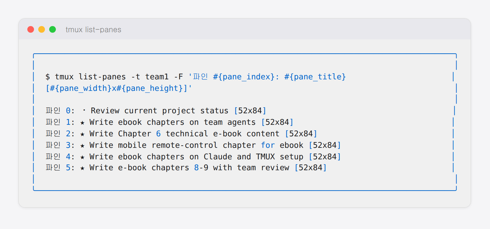

## 3-2. 팀 에이전트 레이아웃 설계

TMUX 구조를 이해했다면 이제 실제로 6명의 Claude 에이전트가 배치될 팀 레이아웃을 설계합니다. 좋은 레이아웃은 각 에이전트의 역할을 명확하게 하고, 시각적으로 팀 전체 상태를 한눈에 파악할 수 있게 합니다.

<hr>

## 팀 구성 설계

이 책에서 사용하는 팀 구성은 실제 소프트웨어 개발팀을 모델로 합니다.

| 파인 | 이름 | 역할 | 모델 |
|------|------|------|------|
| Pane 0 | 쭌 | 팀장 — 지시 수령, 작업 배분, 결과 보고 | Sonnet |
| Pane 1 | 민준 | 아키텍트 — 시스템 설계, 기술 방향 결정 | Opus |
| Pane 2 | 지훈 | 리서쳐 — 정보 수집, 기술 조사 | Sonnet |
| Pane 3 | 수아 | 디자이너 — UI/UX, 사용자 경험 설계 | Sonnet |
| Pane 4 | 서연 | 개발자 — 기능 구현, 코드 작성 | Sonnet |
| Pane 5 | 태양 | 리뷰어 — 코드 리뷰, 품질 검토 | Sonnet |

> 민준(아키텍트)은 복잡한 설계 판단이 많아 Claude Opus를 사용합니다. 나머지는 속도와 비용이 균형 잡힌 Claude Sonnet을 사용합니다.

<hr>

## 레이아웃 구성

main-vertical 레이아웃으로 팀장(Pane 0)이 왼쪽 넓은 공간을 차지하고, 팀원 5명(Pane 1~5)이 오른쪽에 세로로 배열됩니다.

| Pane | 이름 | 역할 | 비고 |
|------|------|------|------|
| 0 | 쭌 | 팀장 | Claude CLI |
| 1 | 민준 | 아키텍트 | |
| 2 | 지훈 | 리서쳐 | |
| 3 | 수아 | UI/UX 디자이너 | |
| 4 | 서연 | 개발자 | |
| 5 | 태양 | QA·리뷰어 | |



<hr>

## 레이아웃 구성 스크립트

```bash
#!/bin/bash
SESSION="team"

# 1. 세션 생성 (백그라운드)
TERM_WIDTH=$(tput cols 2>/dev/null || echo 317)
TERM_HEIGHT=$(tput lines 2>/dev/null || echo 85)
tmux new-session -d -s "$SESSION" -x "$TERM_WIDTH" -y "$TERM_HEIGHT"

# 2. 파인 5개 분할 (좌우, even-horizontal 먼저 적용)
tmux split-window -t "$SESSION:0.0" -h
tmux split-window -t "$SESSION:0.1" -h
tmux split-window -t "$SESSION:0.2" -h
tmux split-window -t "$SESSION:0.3" -h
tmux split-window -t "$SESSION:0.4" -h

# 3. 균등 배치 후 main-vertical로 전환
tmux select-layout -t "$SESSION:0" even-horizontal
tmux select-layout -t "$SESSION:0" main-vertical
tmux set-option -t "$SESSION" main-pane-width 158

# 4. 파인 제목 표시
tmux set-option -t "$SESSION" pane-border-status top
tmux set-option -t "$SESSION" pane-border-format " #{pane_title} "
tmux set-option -t "$SESSION" allow-rename off

# 5. 각 파인에 이름 설정
tmux select-pane -t "$SESSION:0.0" -T "쭌"
tmux select-pane -t "$SESSION:0.1" -T "민준 아키텍트"
tmux select-pane -t "$SESSION:0.2" -T "지훈 리서쳐"
tmux select-pane -t "$SESSION:0.3" -T "수아 UI/UX디자이너"
tmux select-pane -t "$SESSION:0.4" -T "서연 개발자"
tmux select-pane -t "$SESSION:0.5" -T "태양 QA·리뷰어"

echo "✅ 레이아웃 구성 완료"
```

<hr>

## 레이아웃 설계 원칙

### 파인 크기 배분

팀장(Pane 0)은 지시를 받고 팀에 전달하는 주 통신 창구이므로 화면을 넓게 사용합니다. `main-pane-width 158`은 전체 화면(약 317 컬럼)의 절반입니다.

```bash
# 파인 너비 조정
tmux set-option -t team main-pane-width 158

# 더 넓게 (팀장 중심)
tmux set-option -t team main-pane-width 200
```

### 균등 배분 레이아웃

팀원 간 역할이 비슷하고 모든 파인을 동등하게 모니터링하려면 `even-horizontal`을 사용합니다.

```bash
tmux select-layout -t team:0 even-horizontal
```

<hr>

## 레이아웃 저장 및 복원

TMUX는 기본적으로 레이아웃을 저장하지 않습니다. 세션을 종료하면 레이아웃이 사라집니다. 셋업 스크립트를 사용해 언제든지 동일한 레이아웃을 재현합니다.

```bash
# 현재 레이아웃 확인 (저장용)
tmux list-windows -t team -F "#{window_layout}"

# 출력: main-vertical,317x85,158,0[317x16,158,0,0,317x16,158,17,1,...]
```

이 값을 저장해두면 `tmux select-layout -t team:0 "저장된레이아웃값"` 으로 정확한 파인 크기까지 복원할 수 있습니다.

<hr>

## 요약

레이아웃 설계의 핵심은 **역할에 맞는 공간 배분**과 **팀 전체를 한눈에 볼 수 있는 배치**입니다. 다음 챕터에서는 이 레이아웃 위에 Claude Code를 자동으로 실행하는 방법을 설명합니다.
