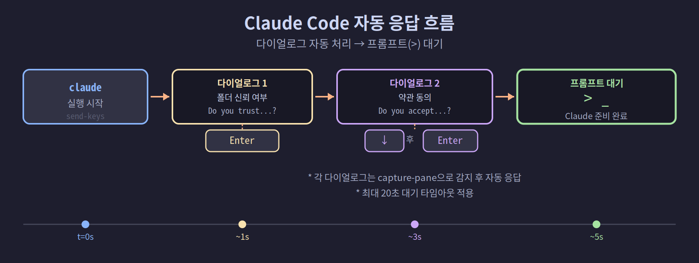
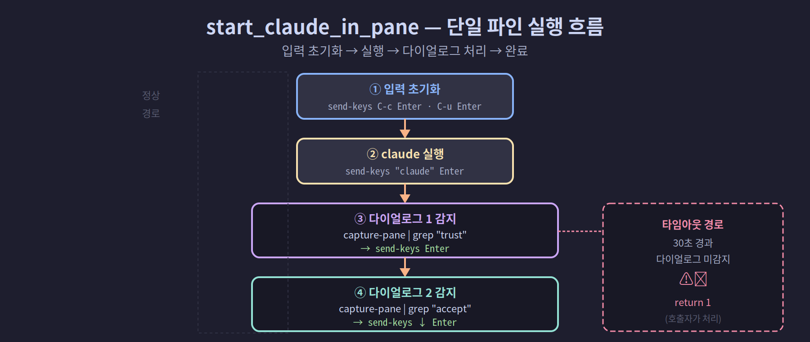
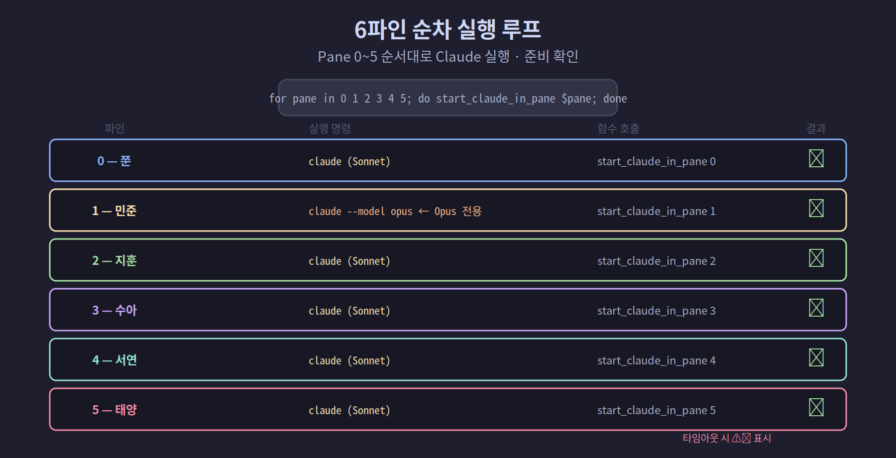

## 3-3. 각 파인에 Claude Code 자동 실행

레이아웃이 준비되었다면 이제 각 파인에 Claude Code를 자동으로 실행하는 방법을 구현합니다. 핵심은 Claude Code 시작 시 나타나는 대화 상자를 자동으로 처리하는 것입니다.

<hr>

## Claude Code 시작 시 나타나는 다이얼로그

Claude Code를 처음 실행하면 두 가지 대화 상자가 순서대로 나타납니다.

```
[다이얼로그 1] Do you trust the files in this folder?
> Yes, I trust this folder (proceed)
  No, exit

[다이얼로그 2] Do you accept the terms of service?
  No, exit
> Yes, I accept
```

- 다이얼로그 1: Enter만 누르면 됩니다 (기본값이 "Yes").
- 다이얼로그 2: 기본값이 "No"이므로 아래 방향키를 한 번 누른 후 Enter가 필요합니다.

자동화할 때는 이 두 단계를 순서대로 처리해야 합니다.



> 💡 다이얼로그 2는 기본값이 "No"라 그냥 Enter를 누르면 거부됩니다. 그래서 반드시 아래 방향키(↓)로 "Yes, I accept"를 고른 뒤 Enter를 눌러야 합니다. 자동화 스크립트도 이 차이를 그대로 반영합니다.

<hr>

## 파인 대기 함수

파인에 특정 텍스트가 나타날 때까지 기다리는 헬퍼 함수입니다.

> 💡 **이 함수가 왜 필요할까요?** Claude 실행은 몇 초가 걸리는데, 화면이 준비되기 전에 키를 보내면 입력이 사라집니다. 그래서 `wait_for_pane`은 화면에 특정 글자(예: "trust this folder")가 보일 때까지 1초 간격으로 확인(폴링)한 뒤 다음 단계로 넘어갑니다.

```bash
# 특정 pane에 패턴이 나타날 때까지 대기
# $1: pane 주소 (예: team:0.1)
# $2: 대기할 텍스트 패턴
# $3: 최대 대기 시간(초, 기본 30)
wait_for_pane() {
    local pane="$1"
    local pattern="$2"
    local timeout="${3:-30}"
    local waited=0

    while [ $waited -lt $timeout ]; do
        if tmux capture-pane -t "$pane" -p 2>/dev/null | grep -q "$pattern"; then
            return 0
        fi
        sleep 1
        waited=$((waited + 1))
    done
    return 1  # 타임아웃
}
```

<hr>

## 파인별 Claude 실행 함수

```bash
# $1: 파인 주소 (예: team:0.2)
# $2: 모델 (기본값: claude-sonnet-4-6)
start_claude_in_pane() {
    local pane="$1"
    local model="${2:-claude-sonnet-4-6}"
    local claude_bin
    claude_bin="$(command -v claude)"

    # 이전 입력 초기화
    tmux send-keys -t "$pane" C-c 2>/dev/null
    sleep 0.3
    tmux send-keys -t "$pane" C-u 2>/dev/null
    sleep 0.2

    # Claude 실행
    tmux send-keys -t "$pane" \
        "cd /home/user && unset CLAUDECODE && $claude_bin --model $model --dangerously-skip-permissions" \
        Enter

    # 다이얼로그 1: "trust this folder" → Enter
    if wait_for_pane "$pane" "trust this folder" 20; then
        tmux send-keys -t "$pane" Enter
        sleep 1
    fi

    # 다이얼로그 2: "I accept" → Down + Enter
    if wait_for_pane "$pane" "I accept" 20; then
        tmux send-keys -t "$pane" Down
        sleep 0.5
        tmux send-keys -t "$pane" Enter
        sleep 1
    fi

    # Claude 프롬프트(>) 나타날 때까지 대기
    wait_for_pane "$pane" ">" 30
}
```

<hr>



## 전체 팀에 Claude 실행

6개 파인 모두에 순서대로 Claude를 실행합니다.

```bash
SESSION="team"

# 파인별 이름과 모델 배열
MEMBER_NAMES=("쭌" "민준" "지훈" "수아" "서연" "태양")
MEMBER_MODELS=(
    "claude-sonnet-4-6"  # 0: 쭌
    "claude-opus-4-8"    # 1: 민준 (복잡한 설계 → Opus)
    "claude-sonnet-4-6"  # 2: 지훈
    "claude-sonnet-4-6"  # 3: 수아
    "claude-sonnet-4-6"  # 4: 서연
    "claude-sonnet-4-6"  # 5: 태양
)

for pane in 0 1 2 3 4 5; do
    model="${MEMBER_MODELS[$pane]}"
    echo -n "  Pane $pane (${MEMBER_NAMES[$pane]}): 시작 중..."

    start_claude_in_pane "$SESSION:0.$pane" "$model"

    # 성공 여부 확인
    if tmux capture-pane -t "$SESSION:0.$pane" -p 2>/dev/null | grep -q ">"; then
        echo " ✅ 준비 완료"
    else
        echo " ⚠️  타임아웃 — 수동 확인 필요"
    fi
done
```

<hr>



## 이미 실행 중인 파인에 메시지 보내기

Claude가 실행 중인 파인에 메시지를 전송하는 방법입니다.

```bash
# 특정 파인에 메시지 전송 (줄바꿈 = Enter)
tmux send-keys -t team:0.1 "민준, 현재 아키텍처 검토해줘" Enter

# 여러 파인에 동시 전송 (브로드캐스트)
for pane in 0 1 2 3 4 5; do
    tmux send-keys -t "team:0.$pane" "모두 현재 상태 보고해줘" Enter
done
```

<hr>

## 파인 상태 확인

각 파인이 Claude 프롬프트 상태인지 확인합니다.

```bash
for pane in 0 1 2 3 4 5; do
    content=$(tmux capture-pane -t "team:0.$pane" -p 2>/dev/null)
    if echo "$content" | grep -q ">"; then
        echo "  Pane $pane: ✅ Claude 대기 중"
    elif echo "$content" | grep -q "trust this folder"; then
        echo "  Pane $pane: ⚠️  다이얼로그 1 대기 중"
    else
        echo "  Pane $pane: ❓ 상태 불명"
    fi
done
```

<hr>

## --dangerously-skip-permissions 주의사항

이 플래그는 파일 읽기/쓰기/실행 권한 요청을 자동 승인합니다. 자동화에 편리하지만 다음 사항을 인지하고 사용하세요.

- 신뢰할 수 있는 로컬 환경에서만 사용
- 외부에서 접근 가능한 서버에서는 주의
- 작업 완료 후 제한된 권한 모드로 전환 가능

<hr>

## 요약

자동 실행의 핵심은 **`wait_for_pane` 함수로 다이얼로그를 감지하고 자동 응답**하는 것입니다. 다음 챕터에서는 각 에이전트에게 고유한 역할을 부여하는 `CLAUDE.md` 파일 작성법을 설명합니다.
