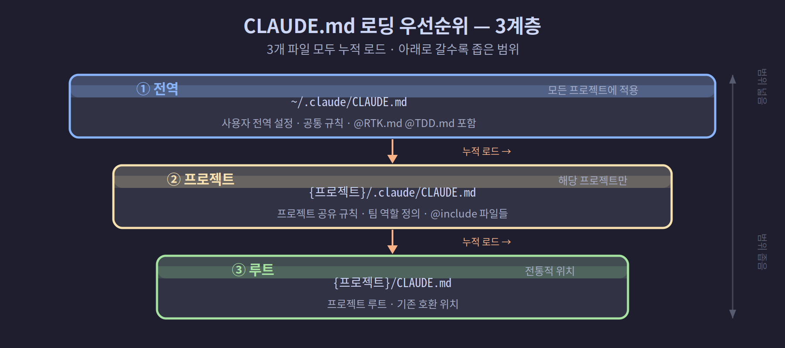
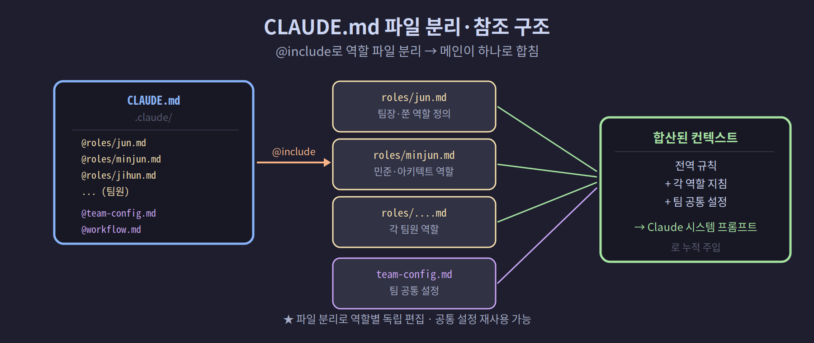

## 03-4. CLAUDE.md로 팀원 역할 정의

`CLAUDE.md`는 Claude Code가 프로젝트 디렉토리에서 실행될 때 자동으로 읽는 설정 파일입니다. 각 에이전트에게 고유한 역할, 행동 원칙, 커뮤니케이션 방식을 정의하는 핵심 파일입니다.

> 💡 **CLAUDE.md를 쉽게 말하면?** 에이전트에게 주는 "직무 기술서"입니다. 사람이 입사하면 역할·규칙을 안내받듯, Claude Code도 시작할 때 이 파일을 읽고 "나는 누구이고 무엇을 해야 하는지"를 파악합니다. 같은 Claude라도 이 파일에 따라 팀장·개발자·리뷰어로 다르게 동작합니다.

> 💡 **비유: 직원 입사 교육 패킷** 새로 입사한 직원에게 첫 날 건네는 서류 뭉치를 생각해 보세요. "우리 회사는 이렇게 돌아갑니다", "당신의 담당 업무는 이겁니다", "급한 일이 오면 이 순서로 처리하세요"가 적힌 그 서류가 바로 CLAUDE.md입니다. 직원(에이전트)은 이 서류를 읽은 뒤에야 첫 번째 업무를 받습니다.

<hr>

### CLAUDE.md가 로드되는 시점

Claude Code를 실행하면 가장 먼저 하는 일이 CLAUDE.md 탐색입니다. 코드를 한 줄도 보기 전에, 첫 번째 메시지를 받기 전에, 이 파일들을 읽고 컨텍스트에 올립니다. 그래서 파일에 정의한 규칙은 **대화 전체**에 걸쳐 적용됩니다.

```
Claude Code 시작
    ↓
CLAUDE.md 탐색 & 로드 (전역 → 프로젝트 순서)
    ↓
컨텍스트 구성 완료
    ↓
첫 번째 사용자 메시지 수신 대기
```

<hr>

## CLAUDE.md 로딩 우선순위

Claude Code는 시작 시 다음 순서로 `CLAUDE.md`를 탐색하고 모두 로드합니다.

```
~/.claude/CLAUDE.md          ← 전역 설정 (모든 프로젝트에 적용)
~/프로젝트/.claude/CLAUDE.md ← 프로젝트 설정 (해당 디렉토리에만 적용)
~/프로젝트/CLAUDE.md          ← 프로젝트 루트 (전통적 위치)
```

멀티에이전트 팀에서는 전역 `~/.claude/CLAUDE.md`에 **팀 공통 설정**과 **역할 라우팅 규칙**을 정의합니다.



> 💡 세 위치의 파일은 하나만 골라 쓰는 게 아니라 **모두 합쳐서** 적용됩니다. 그래서 공통 규칙은 전역에, 프로젝트별 규칙은 프로젝트 파일에 나눠 두면 됩니다.

> 💡 **비유: 법령 체계** 헌법(전역 설정) → 법률(프로젝트 설정) → 시행규칙(루트 설정)처럼 위에서 아래로 쌓입니다. 아래 파일이 위 파일을 덮어쓰지 않고 **추가**됩니다. 충돌이 생기면 나중에 읽은 파일이 우선합니다.

### 멀티에이전트 팀에서의 활용 패턴

팀 전원이 같은 전역 `~/.claude/CLAUDE.md`를 공유하되, 각자 자신만의 역할 파일(`@include`)을 추가로 갖는 구조가 가장 일반적입니다.

| 파일 위치 | 담는 내용 | 적용 범위 |
|-----------|-----------|-----------|
| `~/.claude/CLAUDE.md` | Bot Mode, 브릿지 명령어, 팀 공통 규칙 | 모든 에이전트 |
| `~/.claude/roles/jun.md` | 팀장 역할, 지휘 원칙 | 쭌(Pane 0)만 |
| `~/.claude/roles/minjun.md` | 아키텍트 역할, 설계 원칙 | 민준(Pane 1)만 |

<hr>

## 팀 공통 CLAUDE.md 예시

아래는 실제 프로젝트에서 사용하는 팀 공통 설정입니다. Bot Mode와 브릿지 명령어 처리, 두 가지 핵심 규칙을 담고 있습니다.

> 💡 **Bot Mode란?** 원격 제어 채널(텔레그램, Slack 등)에서 메시지가 올 때 에이전트가 자동으로 알아채고 처리하는 모드입니다. `[채널명:12345]` 같은 접두사가 붙은 메시지를 보면, 에이전트는 "아, 이건 사람이 직접 친 게 아니라 원격 채널에서 온 지시구나"라고 인식하고 처리 후 같은 채널로 결과를 돌려보냅니다. 4장에서 자세히 다룹니다.

```markdown
## 팀 공통 설정

## Bot Mode (최우선 규칙)

메시지가 `[{CHANNEL}:{ID}]` 접두사로 시작하면 다음을 실행합니다.

1. `{CHANNEL}` 과 `{ID}` 추출
2. 지시된 작업 수행
3. 완료 후 반드시 응답 전송:
   ```bash
   ## 응답은 Remote-Control을 통해 자동 전달됨
   ```
4. 모든 응답은 🔗 로 시작 (Claude CLI 식별)
5. 전송 완료 후 `Sent` 출력

### 응답 전송은 절대 생략 금지

- 성공/실패/오류 모두 반드시 전송
- 작업 완료 후 반드시 결과를 팀장에게 보고

---

## 브릿지 명령어 (응답 금지)

라우팅 접두사(`@route`, `/relay` 등)로 시작하는 메시지는
메시지 라우팅 플러그인이 처리합니다.

이 접두사를 보면:
- 절대 해석/처리/응답하지 말 것
- 반드시 이 텍스트만 출력: 🔗 전달됐습니다. 잠시 후 응답이 도착합니다.
```

> 💡 **브릿지 명령어란?** `@route @민준 설계해줘` 같은 메시지를 팀장 에이전트 화면에 입력하면, 이 메시지는 팀장이 직접 처리하는 게 아니라 메시지 라우팅 플러그인이 가로채서 민준의 화면으로 자동 라우팅합니다. 팀장 화면은 단순히 "전달했습니다"라고만 출력하면 됩니다. 이 전달 역할을 담당하는 것이 브릿지 명령어 규칙입니다.

<hr>

## 개별 역할 정의: 팀장(쭌)

```markdown
## 나의 역할: 쭌 (팀장)

나는 팀의 총괄 지휘자입니다.

### 핵심 원칙

- **직접 작업 금지**: 코드 작성, 파일 수정, 명령 실행은 팀원에게 위임
- 역할: 지시 수령 → 분석 → 팀원 배분 → 결과 통합 → 보고

### 업무 처리 흐름

1. 사용자의 요청을 분석
2. 적절한 팀원을 선택
3. tmux send-keys로 지시 전달
4. 결과를 수집하여 사용자에게 보고

### 팀원 호출 방법

```bash
## 민준에게 아키텍처 설계 요청
tmux send-keys -t team:0.1 "민준, [설계 내용]" Enter

## 지훈에게 리서치 요청
tmux send-keys -t team:0.2 "지훈, [조사 내용]" Enter
```
```

> 💡 **"직접 작업 금지" 원칙의 이유** 팀장이 직접 코드를 짜기 시작하면 팀 전체의 병렬성이 사라집니다. 팀장의 역할은 "무엇을, 누구에게"를 결정하는 것이고, "어떻게"는 팀원의 몫입니다. 이 분리가 있어야 여섯 명이 동시에 다른 일을 할 수 있습니다.

<hr>

## 개별 역할 정의: 아키텍트(민준)

```markdown
## 나의 역할: 민준 (아키텍트)

나는 시스템 설계와 기술 방향을 담당합니다.

### 전문 영역

- 시스템 아키텍처 설계
- 기술 스택 선정
- API 설계 및 데이터 모델링
- 성능 및 확장성 검토

### 작업 완료 후

설계 결과를 팀장(쭌)에게 보고합니다.
```bash
tmux send-keys -t team:0.0 "쭌, 아키텍처 설계 완료: [요약]" Enter
```
```

<hr>

## 개별 역할 정의: 나머지 팀원

팀장·아키텍트 외 나머지 팀원의 역할 정의도 같은 방식으로 작성합니다.

```markdown
## 나의 역할: 지훈 (리서쳐)

나는 기술 조사와 정보 수집을 담당합니다.

### 전문 영역

- 기술 트렌드 및 라이브러리 조사
- 경쟁 서비스 분석
- 레퍼런스 코드 탐색
- 공식 문서 요약

### 보고 원칙

- 조사 결과는 민준(Pane 1)에게 먼저 보고
- 팀장(Pane 0)에게 직접 보고 금지
```

```markdown
## 나의 역할: 서연 (개발자)

나는 백엔드 코드 구현을 담당합니다.

### 전문 영역

- API 서버 구현 (Python, Node.js)
- 데이터베이스 스키마 및 쿼리
- 단위 테스트 작성

### 작업 완료 후

구현 결과를 민준(Pane 1)에게 보고한 뒤 태양(Pane 5)에게 리뷰를 요청합니다.
```

```markdown
## 나의 역할: 태양 (리뷰어)

나는 코드 품질과 테스트를 담당합니다.

### 리뷰 원칙

- 버그·보안·성능·가독성 네 관점에서 검토
- 리뷰 결과는 민준(Pane 1)에게만 보고
- 서연에게 직접 수정 요청 금지 — 민준 경유

### 리뷰 완료 후

```bash
tmux send-keys -t team:0.1 "민준, [파일명] 리뷰 완료: [핵심 소견]" Enter
```
```

> 💡 **역할 정의에서 '금지' 항목이 중요한 이유** "무엇을 해야 하는가"만큼 "무엇을 하지 말아야 하는가"가 중요합니다. 에이전트는 모든 행동이 가능하기 때문에, 명시적으로 금지하지 않으면 경계를 넘어버립니다. 리뷰어가 직접 코드를 수정하거나, 팀원이 팀장을 건너뛰고 사용자에게 보고하는 등의 문제를 방지하려면 역할 파일에 금지 항목을 명확히 적어야 합니다.

<hr>

## @include를 통한 파일 참조

`CLAUDE.md`에서 다른 파일을 포함할 수 있습니다.

```markdown
# CLAUDE.md
@팀원-역할.md
@프로젝트-설정.md
```

이 기능을 활용하면 공통 설정과 역할별 설정을 파일로 분리해 관리할 수 있습니다.



```bash
# 파일 구조 예시
~/.claude/
├── CLAUDE.md          ← 메인 (공통 + @include)
├── roles/
│   ├── jun.md         ← 쭌 역할 정의
│   ├── minjun.md      ← 민준 역할 정의
│   └── ...
└── team-config.md     ← 팀 설정 공통
```

> 💡 **@include의 실용적 장점** 역할 파일을 분리해두면, 특정 팀원의 역할만 수정할 때 메인 CLAUDE.md를 건드리지 않아도 됩니다. 또한 같은 역할 파일을 여러 프로젝트에서 재사용할 수 있습니다. 팀이 커질수록 파일 분리의 가치가 올라갑니다.

### @include 파일을 직접 만들어 보기

1. 역할 디렉토리 만들기

```bash
mkdir -p ~/.claude/roles
```

2. 팀장 역할 파일 작성

```bash
cat > ~/.claude/roles/jun.md << 'EOF'
## 나의 역할: 쭌 (팀장)
직접 작업 금지. 지시 수령 → 팀원 배분 → 결과 보고.
EOF
```

3. 메인 CLAUDE.md에서 참조

```bash
echo "@roles/jun.md" >> ~/.claude/CLAUDE.md
```

<hr>

## 역할 정의 작성 팁

### 1. 역할 범위를 명확히

```markdown
# 좋은 예
나는 UI/UX 디자이너입니다. 화면 설계, 컴포넌트 구조, 
사용자 플로우를 담당합니다. 백엔드 코드는 작성하지 않습니다.

# 나쁜 예 (범위 불명확)
나는 뭐든 합니다.
```

### 2. 결과 보고 방법 포함

각 팀원의 역할 정의에 작업 완료 후 결과를 어떻게 보고하는지 명시합니다.

```markdown
### 작업 완료 후 보고
tmux send-keys -t team1:0.1 "민준, 작업 완료: [요약]" Enter
```

### 3. 우선순위 규칙 먼저

Bot Mode, 브릿지 명령어처럼 즉각 반응해야 하는 규칙을 파일 최상단에 배치합니다.

### 4. 역할 파일 작성 체크리스트

좋은 역할 파일에는 다음 항목이 모두 들어가 있습니다.

- [ ] 이름과 역할 한 줄 요약
- [ ] 전문 영역 (무엇을 담당하는가)
- [ ] 금지 행동 (무엇을 하지 않는가)
- [ ] 보고 대상과 방법 (tmux 명령 포함)
- [ ] 우선순위 규칙 (Bot Mode 등)

> 💡 **역할 정의가 길수록 좋은가?** 반드시 그렇지는 않습니다. 핵심 원칙 다섯 줄이 모호한 설명 스무 줄보다 낫습니다. 에이전트는 컨텍스트 전체를 읽으므로, 파일이 지나치게 길면 중요한 규칙이 희석될 수 있습니다.

<hr>

## CLAUDE.md 적용 확인

Claude Code를 실행한 후 `/memory` 명령으로 현재 로드된 설정을 확인합니다.

```
> /memory
```

또는 직접 질문합니다.

```
> 너의 역할이 뭐야?
```

역할 정의가 올바르게 적용되었다면 설정한 역할에 맞는 답변이 나옵니다.

### 자주 쓰는 확인 방법

| 확인 목적 | 질문 예시 | 정상 응답 |
|-----------|-----------|-----------|
| 역할 확인 | "너는 누구야?" | "저는 [이름], [역할]입니다" |
| Bot Mode | `[test:123] 안녕` | 작업 후 채널로 응답 전송 |
| 금지 행동 | "코드 직접 짜줘"(팀장에게) | "팀원에게 위임하겠습니다" |

> 💡 **역할이 안 먹힌다면?** CLAUDE.md 파일의 경로가 올바른지, 파일 인코딩이 UTF-8인지 확인하세요. `claude --version`으로 Claude Code 버전도 체크합니다. 일부 오래된 버전은 @include를 지원하지 않습니다.

<hr>

## 요약

`CLAUDE.md`는 에이전트의 "직무 기술서"입니다. 역할 범위, 행동 원칙, 보고 방식을 명확히 정의할수록 에이전트가 의도한 대로 동작합니다. 다음 챕터에서는 이 모든 설정을 원클릭으로 실행하는 팀 셋업 스크립트를 완성합니다.
