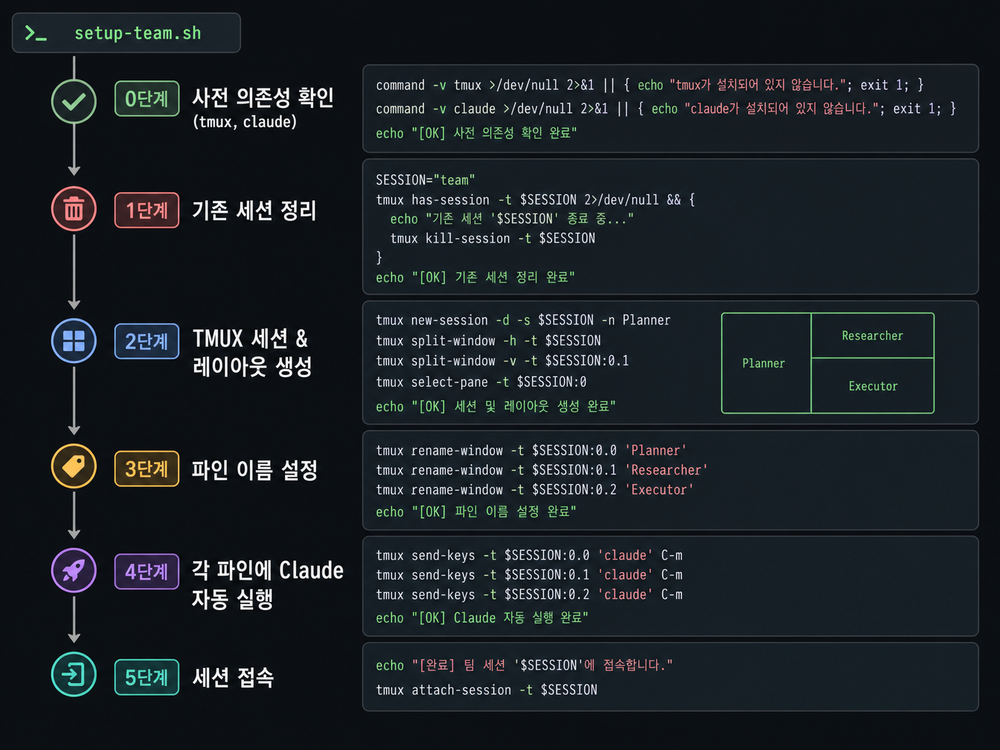

## 03-5. 팀 셋업 스크립트 작성

지금까지 배운 레이아웃 구성, Claude 자동 실행, 역할 정의를 하나의 스크립트로 통합합니다. 이 스크립트를 한 번 실행하면 팀 전체 환경이 자동으로 구성됩니다.

> 💡 **원클릭 셋업이란?** 앞 절들에서 하나씩 익힌 명령(세션 생성·파인 분할·레이아웃·Claude 실행)을 한 파일에 모아, 명령 한 줄로 6인 팀 환경을 통째로 재현하는 것입니다. 컴퓨터를 껐다 켜거나 새 장비로 옮겨도 이 스크립트만 실행하면 같은 환경이 다시 만들어집니다.

> 💡 **비유: 요리 레시피** 처음 요리할 때는 재료 손질 → 냄비 준비 → 불 켜기 → 볶기를 하나씩 익혔습니다. 셋업 스크립트는 이 모든 단계를 "오늘 메뉴: 팀 환경"이라는 레시피 한 장으로 정리한 것입니다. 레시피를 실행하면 매번 같은 결과가 나옵니다.

<hr>

## 스크립트 전체 구조

```
setup-team.sh
│
├── [0단계] 사전 의존성 확인 (tmux, claude)
├── [1단계] 기존 세션 정리
├── [2단계] TMUX 세션 & 레이아웃 생성
├── [3단계] 파인 이름 설정
├── [4단계] 각 파인에 Claude 자동 실행
└── [5단계] 세션 접속
```



각 단계는 독립적으로 실패를 감지하며, 앞 단계가 실패하면 뒤 단계는 실행되지 않습니다(`set -e`).

<hr>

## 완성된 셋업 스크립트

```bash
#!/bin/bash
# setup-team.sh — Claude 멀티에이전트 팀 환경 자동 구성

set -e

GREEN='\033[0;32m'
CYAN='\033[0;36m'
YELLOW='\033[1;33m'
RED='\033[0;31m'
NC='\033[0m'

SESSION="team1"

# ── 유틸: 파인에 패턴이 나타날 때까지 대기 ──────────────────
wait_for_pane() {
    local pane="$1" pattern="$2" timeout="${3:-30}" waited=0
    while [ $waited -lt $timeout ]; do
        tmux capture-pane -t "$pane" -p 2>/dev/null | grep -q "$pattern" && return 0
        sleep 1; waited=$((waited + 1))
    done
    return 1
}

# ── 유틸: Claude 실행 + 다이얼로그 자동 처리 ────────────────
start_claude_in_pane() {
    local pane="$1" model="${2:-claude-sonnet-4-6}"
    local claude_bin; claude_bin="$(command -v claude)"

    tmux send-keys -t "$pane" C-c 2>/dev/null; sleep 0.3
    tmux send-keys -t "$pane" C-u 2>/dev/null; sleep 0.2

    tmux send-keys -t "$pane" \
        "cd /home/user && unset CLAUDECODE && $claude_bin --model $model --dangerously-skip-permissions" Enter

    # 다이얼로그 1: trust folder → Enter
    wait_for_pane "$pane" "trust this folder" 20 && {
        tmux send-keys -t "$pane" Enter; sleep 1
    }

    # 다이얼로그 2: terms of service → Down + Enter
    wait_for_pane "$pane" "I accept" 20 && {
        tmux send-keys -t "$pane" Down; sleep 0.5
        tmux send-keys -t "$pane" Enter; sleep 1
    }

    wait_for_pane "$pane" ">" 30
}

# ── [0/4] 사전 요구사항 확인 ────────────────────────────────
echo -e "${YELLOW}[0/4] 사전 요구사항 확인...${NC}"

MISSING=()
command -v tmux   &>/dev/null || MISSING+=("tmux (sudo apt install -y tmux)")
command -v claude &>/dev/null || MISSING+=("claude (npm install -g @anthropic-ai/claude-code)")

if [ ${#MISSING[@]} -gt 0 ]; then
    echo -e "${RED}❌ 누락된 의존성:${NC}"
    for m in "${MISSING[@]}"; do echo "   - $m"; done
    exit 1
fi

echo "  ✅ tmux $(tmux -V | awk '{print $2}')"
echo "  ✅ claude $(claude --version 2>/dev/null | head -1)"

# ── [1/4] 기존 세션 정리 ────────────────────────────────────
echo -e "\n${YELLOW}[1/4] 기존 세션 초기화...${NC}"
tmux has-session -t "$SESSION" 2>/dev/null && {
    tmux kill-session -t "$SESSION"
    echo "  기존 '$SESSION' 세션 종료"
}

# ── [2/4] TMUX 세션 & 레이아웃 구성 ────────────────────────
echo -e "\n${YELLOW}[2/4] TMUX 세션 & 레이아웃 구성...${NC}"

TERM_WIDTH=$(tput cols 2>/dev/null || echo 317)
TERM_HEIGHT=$(tput lines 2>/dev/null || echo 85)

tmux new-session -d -s "$SESSION" -x "$TERM_WIDTH" -y "$TERM_HEIGHT"

# 파인 5개 분할
tmux split-window -t "$SESSION:0.0" -h
tmux split-window -t "$SESSION:0.1" -h
tmux split-window -t "$SESSION:0.2" -h
tmux split-window -t "$SESSION:0.3" -h
tmux split-window -t "$SESSION:0.4" -h

# main-vertical 레이아웃 (팀장 왼쪽 넓게)
tmux select-layout -t "$SESSION:0" even-horizontal
tmux select-layout -t "$SESSION:0" main-vertical
tmux set-option -t "$SESSION" main-pane-width 158

# 파인 제목 표시 설정
tmux set-option -t "$SESSION" pane-border-status top
tmux set-option -t "$SESSION" pane-border-format " #{pane_title} "
tmux set-option -t "$SESSION" allow-rename off

# 파인 이름 설정
tmux select-pane -t "$SESSION:0.0" -T "쭌"
tmux select-pane -t "$SESSION:0.1" -T "민준 아키텍트"
tmux select-pane -t "$SESSION:0.2" -T "지훈 리서쳐"
tmux select-pane -t "$SESSION:0.3" -T "수아 UI/UX디자이너"
tmux select-pane -t "$SESSION:0.4" -T "서연 개발자"
tmux select-pane -t "$SESSION:0.5" -T "태양 QA·리뷰어"

echo "  ✅ 레이아웃 구성 완료 (6 panes)"

# ── [3/4] Claude 자동 실행 ──────────────────────────────────
echo -e "\n${YELLOW}[3/4] Claude 실행 중... (파인당 최대 1분)${NC}"

MEMBER_NAMES=("쭌" "민준" "지훈" "수아" "서연" "태양")
MEMBER_MODELS=(
    "claude-sonnet-4-6"
    "claude-opus-4-8"
    "claude-sonnet-4-6"
    "claude-sonnet-4-6"
    "claude-sonnet-4-6"
    "claude-sonnet-4-6"
)

for pane in 0 1 2 3 4 5; do
    echo -n "  Pane $pane (${MEMBER_NAMES[$pane]}): "
    start_claude_in_pane "$SESSION:0.$pane" "${MEMBER_MODELS[$pane]}"

    tmux capture-pane -t "$SESSION:0.$pane" -p 2>/dev/null | grep -q ">" \
        && echo -e "${GREEN}✅ 준비 완료${NC}" \
        || echo -e "${RED}⚠️  타임아웃 — 수동 확인 필요${NC}"
done

# ── [4/4] 완료 ──────────────────────────────────────────────
echo -e "\n${GREEN}"
echo "  ╔══════════════════════════════════════╗"
echo "  ║   ✅ 팀 환경 구성 완료!              ║"
echo "  ╚══════════════════════════════════════╝"
echo -e "${NC}"

# 터미널에서 직접 실행한 경우 자동 attach
[ -t 1 ] && tmux attach -t "$SESSION"
```

<hr>

## 스크립트 핵심 함수 해설

스크립트의 두 유틸 함수는 자동화의 핵심입니다. 각 함수가 하는 일을 구체적으로 살펴봅니다.

### wait_for_pane — "응답 올 때까지 기다려"

```bash
wait_for_pane() {
    local pane="$1" pattern="$2" timeout="${3:-30}" waited=0
    while [ $waited -lt $timeout ]; do
        tmux capture-pane -t "$pane" -p 2>/dev/null | grep -q "$pattern" && return 0
        sleep 1; waited=$((waited + 1))
    done
    return 1
}
```

이 함수는 지정한 파인의 화면을 1초마다 캡처해서 원하는 문자열이 나타날 때까지 기다립니다.

| 매개변수 | 설명 | 예시 |
|----------|------|------|
| `pane` | 감시할 파인 주소 | `team1:0.2` |
| `pattern` | 기다릴 문자열 | `">"` (Claude 프롬프트) |
| `timeout` | 최대 대기 시간(초) | `30` |

> 💡 **비유: 택배 도착 알림** 매 1초마다 현관문을 살짝 열어 택배가 왔는지 확인하는 것과 같습니다. 택배(패턴)가 보이면 문을 닫고 다음 일을 합니다. 30초가 지나도 안 오면 "타임아웃"을 반환합니다.

### start_claude_in_pane — "파인에 Claude 띄워"

이 함수는 세 가지 일을 순서대로 합니다.

1. **기존 프로세스 정리** — `C-c`로 혹시 실행 중인 것을 멈추고, `C-u`로 입력창을 비웁니다.
2. **Claude 실행** — 지정 모델로 Claude Code를 실행합니다.
3. **초기화 다이얼로그 자동 처리** — "trust this folder"와 약관 동의 창이 뜨면 자동으로 Enter/Down을 눌러 처리합니다.

```bash
# 다이얼로그 1: trust folder → Enter
wait_for_pane "$pane" "trust this folder" 20 && {
    tmux send-keys -t "$pane" Enter; sleep 1
}

# 다이얼로그 2: terms of service → Down + Enter
wait_for_pane "$pane" "I accept" 20 && {
    tmux send-keys -t "$pane" Down; sleep 0.5
    tmux send-keys -t "$pane" Enter; sleep 1
}
```

> 💡 **--dangerously-skip-permissions 플래그란?** Claude Code는 파일 쓰기·명령 실행 등 위험한 작업을 할 때 사용자에게 확인을 요청합니다. 이 플래그를 쓰면 그 확인창을 모두 생략합니다. 자동화 환경에서는 사람이 키보드 앞에 없으니 이 플래그가 필수입니다. 단, 신뢰할 수 있는 환경에서만 사용해야 합니다.

> 💡 **set -e란?** 스크립트 맨 위의 `set -e`는 "명령 하나라도 실패하면 즉시 전체를 중단하라"는 지시입니다. 덕분에 tmux 설치가 안 됐는데도 계속 진행하다가 이상한 오류가 나는 상황을 막을 수 있습니다. 실패한 단계가 명확하게 보입니다.

<hr>

## 스크립트 실행

```bash
# 실행 권한 부여
chmod +x setup-team.sh

# 실행
bash setup-team.sh
```

### 실행 중 터미널 출력 예시

스크립트를 실행하면 아래와 같은 상태 메시지가 순서대로 출력됩니다.

```
[0/4] 사전 요구사항 확인...
  ✅ tmux 3.4
  ✅ claude 2.1.71

[1/4] 기존 세션 초기화...
  기존 'team1' 세션 종료

[2/4] TMUX 세션 & 레이아웃 구성...
  ✅ 레이아웃 구성 완료 (6 panes)

[3/4] Claude 실행 중... (파인당 최대 1분)
  Pane 0 (쭌): ✅ 준비 완료
  Pane 1 (민준): ✅ 준비 완료
  Pane 2 (지훈): ✅ 준비 완료
  Pane 3 (수아): ✅ 준비 완료
  Pane 4 (서연): ✅ 준비 완료
  Pane 5 (태양): ✅ 준비 완료

  ╔══════════════════════════════════════╗
  ║   ✅ 팀 환경 구성 완료!              ║
  ╚══════════════════════════════════════╝
```

<hr>

스크립트를 실행하면 앞에서 조각조각 살펴본 과정들이 한 번에 자동으로 흘러갑니다 — 세션을 만들고, 파인 6개로 나누고, 레이아웃과 이름을 잡은 뒤, 각 파인에 Claude를 순차로 띄우고 인증 다이얼로그까지 처리합니다. 진행 중에는 단계마다 상태 메시지가 한 줄씩 찍히므로, 지금 어디까지 됐는지 눈으로 따라갈 수 있습니다. 손으로 치던 수십 줄 명령이 명령 한 줄로 압축되는 셈입니다.

## 실행 결과 확인

스크립트 완료 후 TMUX 세션에 접속합니다.

```bash
tmux attach -t team1
```

각 파인 상단에 이름이 표시되고, 모든 파인에 Claude 프롬프트(>)가 나타나면 성공입니다.

성공한 화면은 이렇게 보입니다. 왼쪽 넓은 칸에 팀장(쭌), 오른쪽에 민준·지훈·수아·서연·태양 다섯 파인이 세로로 늘어서고, 각 칸 위에는 이름표가, 칸 안에는 입력 대기를 뜻하는 `>` 프롬프트가 떠 있습니다. 여섯 칸 모두 `>`가 보인다면 팀 전원이 지시를 받을 준비가 된 것입니다. 혹시 어떤 칸이 비어 있거나 멈춰 있다면, 그 파인만 다시 시작하면 됩니다.

### 파인별 빠른 상태 확인

접속 후 아래 명령으로 모든 파인에 `>` 프롬프트가 있는지 한 번에 확인할 수 있습니다.

```bash
for pane in 0 1 2 3 4 5; do
    result=$(tmux capture-pane -t "team1:0.$pane" -p 2>/dev/null | grep -c ">")
    echo "Pane $pane: $( [ "$result" -gt 0 ] && echo '✅' || echo '⚠️  확인 필요' )"
done
```

<hr>

## 특정 에이전트에 작업 전달

팀 환경이 실행 중이면 터미널 어디서든 아래 명령으로 에이전트에게 작업을 전달할 수 있습니다.

```bash
# 지훈에게 리서치 요청
tmux send-keys -t team1:0.2 "지훈, Rust와 Go의 성능 비교 조사해줘" Enter

# 서연에게 코드 작성 요청
tmux send-keys -t team1:0.4 "서연, main.py에 사용자 인증 함수 추가해줘" Enter

# 태양에게 코드 리뷰 요청
tmux send-keys -t team1:0.5 "태양, 방금 작성된 auth.py 코드 리뷰해줘" Enter
```

> 💡 **`team1:0.2` 주소 읽는 법** `세션명:윈도우번호.파인번호` 형식입니다. `team1`이 세션, `0`이 첫 번째 윈도우, `2`가 세 번째 파인(0부터 시작)입니다. 지훈은 Pane 2이므로 `team1:0.2`가 됩니다.

<hr>

## 자주 발생하는 문제와 해결법

### 문제 1: 특정 파인에서 `⚠️ 타임아웃` 메시지가 뜬다

Claude가 초기화 다이얼로그에서 멈춘 경우입니다.

```bash
# 해당 파인으로 이동해서 수동 확인
tmux attach -t team1
# Ctrl+B, q 로 파인 번호 확인 후 해당 파인 클릭
# 화면을 보고 Enter 또는 방향키로 다이얼로그 해결
```

### 문제 2: `claude: command not found`

Claude Code가 설치되어 있지 않거나 PATH에 없는 경우입니다.

```bash
npm install -g @anthropic-ai/claude-code
# 설치 후 경로 확인
which claude
```

### 문제 3: 세션이 이미 존재한다는 오류

스크립트는 기존 세션을 자동으로 정리합니다. 만약 `kill-session`이 실패하면:

```bash
tmux kill-session -t team1
bash setup-team.sh
```

<hr>

## 스크립트 커스터마이징

### 팀원 수 변경

4인 팀으로 줄이려면 `split-window` 호출을 두 개 줄이고, 배열에서 해당 항목을 제거합니다.

```bash
# 4인 팀: Pane 0~3만 사용
MEMBER_NAMES=("쭌" "민준" "서연" "태양")
MEMBER_MODELS=(
    "claude-sonnet-4-6"
    "claude-opus-4-8"
    "claude-sonnet-4-6"
    "claude-sonnet-4-6"
)
```

### 모델 변경

팀원별 모델을 바꾸려면 `MEMBER_MODELS` 배열의 해당 항목만 수정합니다.

```bash
# 민준을 더 강력한 모델로 유지하고 나머지는 기본 모델 사용
MEMBER_MODELS=(
    "claude-sonnet-4-6"  # 쭌
    "claude-opus-4-8"    # 민준 (고성능 모델)
    "claude-sonnet-4-6"  # 지훈
    "claude-sonnet-4-6"  # 수아
    "claude-sonnet-4-6"  # 서연
    "claude-sonnet-4-6"  # 태양
)
```

<hr>

## 요약

셋업 스크립트 하나로 팀 전체 환경을 재현할 수 있습니다. 다음 4장에서는 이 팀 환경을 스마트폰이나 다른 기기에서 원격으로 제어하는 **Remote-Control** 기능을 설명합니다.
