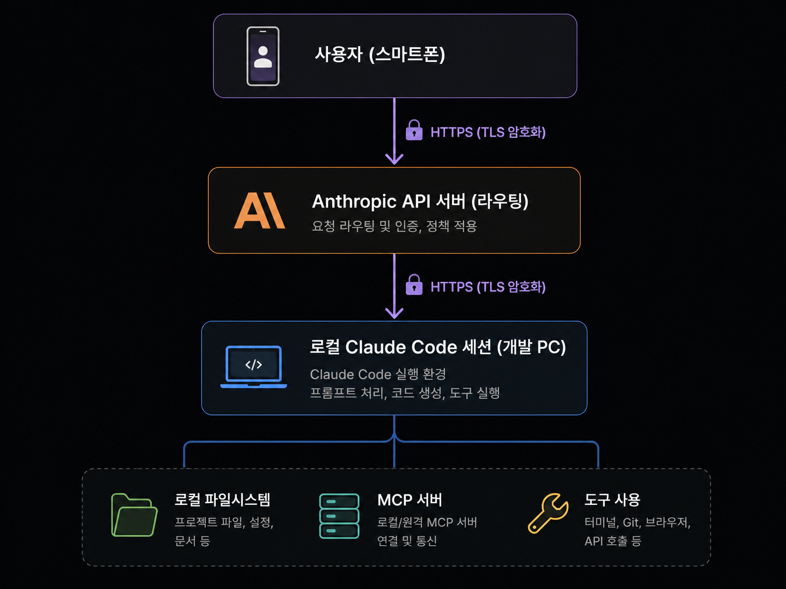
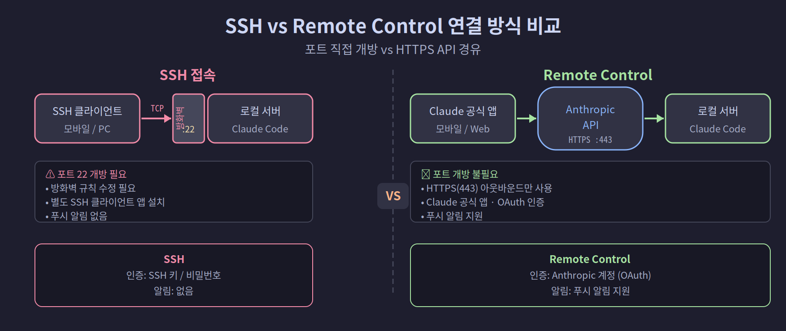
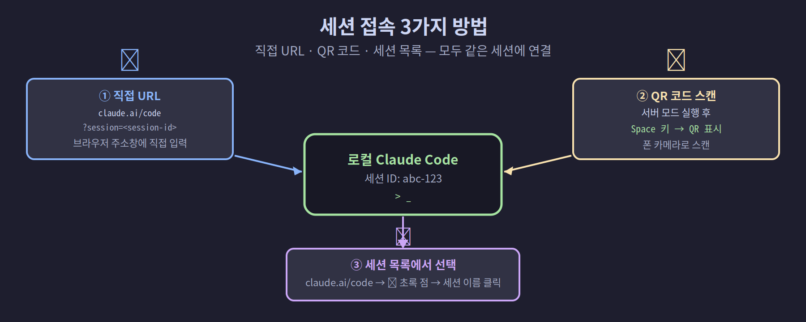

## 4-1. Remote-Control 개요

Claude Code Remote Control은 로컬에서 실행 중인 Claude Code 세션을 **다른 기기**에서 실시간으로 제어할 수 있는 기능입니다. 개발 PC를 켜둔 채로 스마트폰이나 태블릿에서 작업을 이어가거나, 실행 중인 작업을 원격으로 감독할 수 있습니다.

<hr>

## 핵심 원리

Remote Control의 가장 중요한 특징은 **세션이 항상 로컬 머신에서만 실행된다**는 점입니다.

```
사용자 (스마트폰)
      │
      │ HTTPS (TLS 암호화)
      ↓
Anthropic API 서버 (라우팅)
      │
      │ HTTPS (TLS 암호화)
      ↓
로컬 Claude Code 세션 (개발 PC)
      │
      └── 로컬 파일시스템, MCP 서버, 도구 사용
```



클라우드로 이동하는 것은 **통신 경로**뿐입니다. 코드, 파일, 설정은 모두 로컬에 남아 있습니다.

<hr>

## Remote Control의 주요 특징

### 실시간 동기화
연결된 모든 기기에서 대화 내용이 실시간으로 동기화됩니다. PC에서 입력한 내용이 스마트폰에 즉시 반영되고, 반대로도 마찬가지입니다.

### 자동 재연결
네트워크가 끊겨도 재연결 후 자동으로 세션을 복구합니다. 10분 이내의 네트워크 단절은 자동 복구됩니다.

### 보안 통신
모든 트래픽은 TLS로 암호화됩니다. 로컬 머신에 인바운드 포트를 열 필요가 없어 방화벽 설정이 필요하지 않습니다.

> 💡 **인바운드 포트를 안 열어도 되는 이유:** 내 PC가 바깥(Anthropic 서버)으로 먼저 연결을 맺는 "아웃바운드" 방식이기 때문입니다. 외부에서 내 PC로 들어오는 문(인바운드 포트)을 열지 않으므로, 해킹 위험이 큰 포트 개방 없이도 원격 제어가 됩니다.

<hr>

## 활용 시나리오

| 시나리오 | 설명 |
|----------|------|
| 자리 이동 중 작업 이어하기 | 데스크톱에서 시작한 작업을 이동 중 폰으로 계속 |
| 장시간 작업 모니터링 | 배포, 빌드, 테스트가 진행 중일 때 다른 기기에서 상태 확인 |
| 원격 권한 승인 | 자리를 비운 동안 Claude가 도구 실행 권한 요청 시 모바일로 승인 |
| 멀티 디바이스 협업 | 폰으로 입력, PC에서 코드 확인, 태블릿에서 최종 승인 |
| 푸시 알림 | Claude가 입력을 기다릴 때 모바일 앱으로 알림 수신 |

<hr>

## Remote Control vs 일반 SSH 접속

많은 개발자가 SSH로 원격 서버에 접속하는 방식에 익숙합니다. Remote Control은 어떻게 다를까요?

| 비교 항목 | SSH 접속 | Remote Control |
|-----------|----------|----------------|
| 연결 방식 | 직접 TCP (포트 22) | Anthropic API 경유 |
| 방화벽 설정 | 포트 개방 필요 | 불필요 (HTTPS만 사용) |
| 인증 | SSH 키 / 비밀번호 | Anthropic 계정 (OAuth) |
| 모바일 앱 | 별도 SSH 클라이언트 | Claude 공식 모바일 앱 |
| 알림 기능 | 없음 | 푸시 알림 지원 |



<hr>

## MCP 서버와의 차이

`claude mcp serve` 명령과 Remote Control은 다른 기능입니다.

| 비교 | Remote Control | MCP Serve (`claude mcp serve`) |
|------|----------------|--------------------------------|
| 목적 | 세션을 다른 기기에서 제어 | Claude Code를 MCP 도구 서버로 노출 |
| 대상 | claude.ai/code, 모바일 앱 | Claude Desktop 등 MCP 클라이언트 |
| 사용 상황 | 원격에서 Claude와 대화 | 다른 앱에서 Claude의 도구를 사용 |

<hr>

## 필요 조건

Remote Control을 사용하려면 다음이 필요합니다.

```
✅ Anthropic 계정 (claude.ai 로그인)
✅ 구독 플랜: Pro, Max, Team, Enterprise 중 하나
✅ claude auth login으로 OAuth 인증 완료 (API 키 방식 불가)
✅ 포트 443 아웃바운드 허용 (대부분 환경에서 기본 허용)
```

<hr>

## 접속 방법 요약

Remote Control이 활성화된 세션에 다른 기기에서 접속하는 방법은 세 가지입니다.

1. **직접 URL**: 브라우저에서 `https://claude.ai/code?session=<session-id>` 열기
2. **QR 코드**: 서버 모드에서 스페이스바 → 폰 카메라로 스캔
3. **세션 목록**: `claude.ai/code`에서 세션 이름으로 찾기 (컴퓨터 아이콘 + 초록 점)



<hr>

## 요약

Remote Control은 **로컬에서 실행, 원격에서 접근**이라는 원칙을 유지하면서 어디서든 Claude Code 세션에 연결할 수 있게 해줍니다. 다음 챕터에서는 세 가지 활성화 방법을 상세히 설명합니다.
