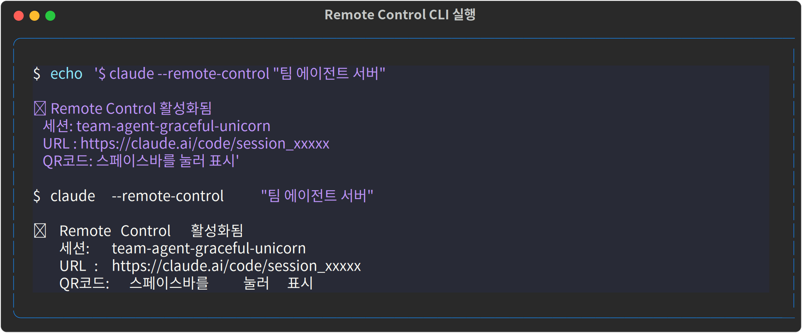
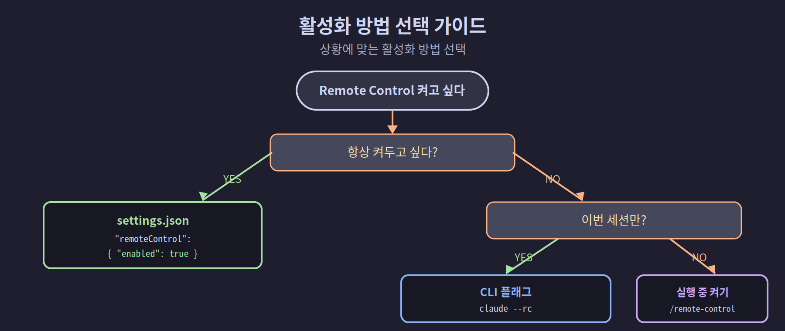

## 4-2. Remote Control 활성화 방법 3가지

Remote Control은 상황에 따라 세 가지 방법으로 활성화할 수 있습니다. 항상 켜두고 싶다면 전역 설정을, 특정 세션에만 적용하려면 CLI 플래그나 세션 내 명령을 사용합니다.

<hr>

## 방법 1: settings.json 전역 설정

모든 Claude Code 세션에서 Remote Control을 자동 활성화합니다. 한 번만 설정하면 됩니다.

### 설정 파일 위치

```
~/.claude/settings.json
```

### 설정 추가

```bash
# settings.json이 없으면 생성, 있으면 편집
cat ~/.claude/settings.json 2>/dev/null || echo "{}"
```

`~/.claude/settings.json` 파일에 다음 내용을 추가합니다.

```json
{
  "remoteControlAtStartup": true
}
```

이 설정이 `true`이면 `claude` 명령을 실행할 때마다 자동으로 Remote Control이 활성화됩니다.

> 💡 **settings.json이란?** Claude Code의 동작을 저장해 두는 설정 파일입니다. 여기에 한 번 적어 두면 매번 옵션을 입력하지 않아도 항상 같은 설정으로 실행됩니다. 반대로, 그때그때만 켜고 싶으면 아래 방법 2(CLI 플래그)를 쓰면 됩니다.

전체 `settings.json`을 세 가지 논리 블록으로 나누어 살펴보겠습니다.


### /config 메뉴로 설정

직접 파일을 편집하는 대신 Claude Code 내부에서 설정할 수도 있습니다.

```
> /config
```

`/config` 메뉴에서 **Enable Remote Control for all sessions** 항목을 `true`로 변경합니다.

<hr>

## 방법 2: CLI 플래그 (일회성)

특정 세션에만 Remote Control을 활성화하려면 실행 시 플래그를 사용합니다.



### 인터랙티브 세션 + 원격 접근

```bash
# 기본 형식
claude --remote-control

# 단축 형식
claude --rc

# 세션 이름 지정
claude --remote-control "백엔드 API 리팩토링"
claude --rc "프론트엔드 작업"
```

세션 이름을 지정하면 `claude.ai/code` 세션 목록에서 쉽게 찾을 수 있습니다.

> 💡 `--rc`는 `--remote-control`의 단축 표기로, 둘은 완전히 같은 옵션입니다. 타이핑을 줄이고 싶을 때 `--rc`를 쓰면 됩니다.

### 서버 모드 실행

```bash
# 기본 서버 모드 (다중 원격 세션 관리)
claude remote-control

# 세션 이름 접두사 지정
claude remote-control --remote-control-session-name-prefix myproject
```

서버 모드는 4-3 챕터에서 자세히 다룹니다.

<hr>

## 방법 3: 실행 중인 세션에서 활성화

이미 실행 중인 Claude Code 세션에서 Remote Control을 켤 수 있습니다.

### 기본 활성화

```
> /remote-control
```

### 세션 이름 지정

```
> /remote-control 내 프로젝트 작업
```

명령을 입력하면 Claude가 Remote Control URL과 QR 코드를 제공합니다.

### VS Code 확장에서도 동일

VS Code의 Claude 확장 내에서도 동일한 명령이 동작합니다.

```
/remote-control
/rc
```

<hr>

## 활성화 확인

Remote Control이 활성화되면 터미널에 다음과 같은 메시지가 표시됩니다.

```
Remote Control active
Session: my-project-graceful-unicorn
URL: https://claude.ai/code?session=abc123...

Press SPACE to show QR code
```

<hr>

## 접속 방법

활성화 후 다른 기기에서 세 가지 방법으로 접속합니다.

```bash
# 방법 1: URL 직접 접속
https://claude.ai/code?session=<session-id>

# 방법 2: QR 코드 (서버 모드에서 스페이스바)
# → Claude 모바일 앱으로 스캔

# 방법 3: claude.ai/code 세션 목록
# → 세션 이름 검색 → 컴퓨터 아이콘 + 초록 점 선택
```

<hr>

## 멀티에이전트 팀에서 활용

팀 셋업 스크립트에서 팀장(쭌) 파인만 Remote Control을 활성화하면 모바일에서 팀장에게 지시할 수 있습니다.

```bash
# 팀장 파인(0)에 Remote Control 포함하여 Claude 실행
tmux send-keys -t team:0.0 \
    "claude --rc '팀장 쭌' --dangerously-skip-permissions" Enter
```

<hr>

## 세 가지 방법 비교

| 방법 | 적용 범위 | 사용 시점 |
|------|-----------|-----------|
| `settings.json` | 모든 세션 | 항상 켜두고 싶을 때 |
| CLI 플래그 (`--rc`) | 특정 세션 1개 | 그때그때 켜고 싶을 때 |
| `/remote-control` | 현재 실행 중 세션 | 실행 후 필요해졌을 때 |



<hr>

## 요약

일상적인 개발 환경이라면 `settings.json`에 `"remoteControlAtStartup": true`를 추가하는 방법 1이 가장 간편합니다. 다음 챕터에서는 여러 원격 세션을 동시에 관리하는 **서버 모드**를 설명합니다.
