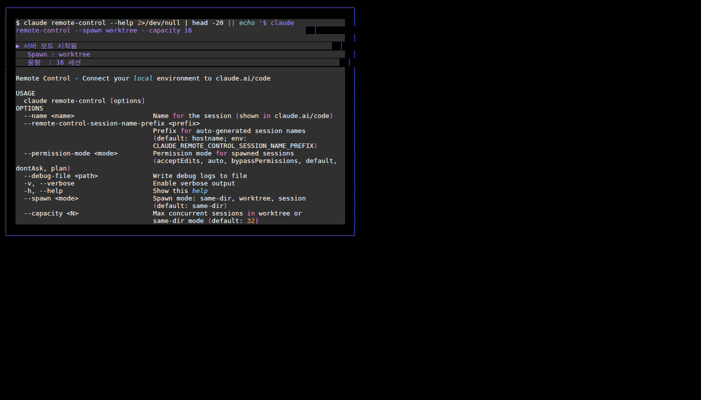

# 4-3. 서버 모드 및 Spawn 모드

Remote Control의 **서버 모드**는 하나의 로컬 머신에서 여러 원격 세션을 동시에 관리할 수 있게 해줍니다. 팀원들이 각자 원격으로 연결하거나, 여러 작업을 병렬로 처리할 때 유용합니다.

---

## 서버 모드 실행

```bash
claude remote-control
```

서버 모드가 시작되면 다음과 같은 화면이 나타납니다.

```
Claude Remote Control Server
Session prefix: hostname-
Spawn mode: same-dir
Capacity: 0/32 sessions

Press SPACE to show QR code
Press W to toggle spawn mode (same-dir ↔ worktree)
```



---

## 서버 모드 옵션

```bash
claude remote-control \
    --name "내 개발 서버" \
    --remote-control-session-name-prefix myproject \
    --spawn worktree \
    --capacity 16 \
    --sandbox \
    --verbose
```

| 플래그 | 설명 | 기본값 |
|--------|------|--------|
| `--name "제목"` | 세션 목록 표시 이름 | hostname 기반 자동 생성 |
| `--remote-control-session-name-prefix` | 세션 이름 접두사 | hostname |
| `--spawn` | 세션 생성 방식 | `same-dir` |
| `--capacity N` | 최대 동시 세션 수 | 32 |
| `--verbose` | 상세 연결/세션 로그 출력 | 비활성 |
| `--sandbox` | 파일시스템·네트워크 격리 | 비활성 |
| `--no-sandbox` | 격리 명시적 비활성화 | — |

---

## Spawn 모드

Spawn 모드는 새로운 원격 접속자가 연결될 때 세션을 어떻게 생성할지를 결정합니다.

### same-dir (기본)

모든 원격 세션이 서버를 실행한 디렉토리를 공유합니다.

```bash
claude remote-control --spawn same-dir
```

```
개발자 A ──┐
개발자 B ──┼── 같은 디렉토리 (/home/user/project)
개발자 C ──┘
```

- 장점: 모든 세션이 같은 파일을 즉시 공유
- 단점: 동시에 같은 파일을 편집하면 충돌 가능

### worktree

접속자마다 별도의 git worktree가 자동으로 생성됩니다.

```bash
claude remote-control --spawn worktree
```

```
개발자 A ── /home/user/project-worktree-abc/  (브랜치: session-abc)
개발자 B ── /home/user/project-worktree-def/  (브랜치: session-def)
개발자 C ── /home/user/project-worktree-ghi/  (브랜치: session-ghi)
```

- 장점: 각 세션이 완전히 독립적으로 작업 가능
- 단점: git 저장소가 있어야 사용 가능, 디스크 공간 추가 사용

### session

단일 세션만 허용합니다. 추가 접속 시도는 거부됩니다.

```bash
claude remote-control --spawn session
```

혼자만 사용하고 실수로 중복 접속하는 것을 방지할 때 유용합니다.

---

## 런타임 단축키

서버 모드 실행 중에 사용할 수 있는 키보드 단축키입니다.

| 키 | 동작 |
|----|------|
| `스페이스바` | QR 코드 표시/숨기기 |
| `W` | `same-dir` ↔ `worktree` 모드 전환 |
| `Q` 또는 `Ctrl+C` | 서버 종료 |

---

## 실용적인 서버 모드 예시

### 개인 개발 서버 (worktree 격리)

```bash
cd ~/projects/myapp

claude remote-control \
    --remote-control-session-name-prefix myapp \
    --spawn worktree \
    --capacity 8
```

스마트폰으로 QR 코드를 스캔하면 독립적인 작업 환경이 생성됩니다.

### 팀 공유 서버 (보안 강화)

```bash
claude remote-control \
    --name "팀 공유 AI 서버" \
    --spawn same-dir \
    --capacity 16 \
    --sandbox \
    --verbose
```

### 단일 사용자 세션

```bash
claude remote-control \
    --spawn session \
    --name "쭌의 작업"
```

---

## 세션 현황 모니터링

서버 모드 실행 중 `--verbose` 플래그를 추가하면 접속/해제 이벤트를 실시간으로 볼 수 있습니다.

```
[2026-04-26 14:00:01] Session connected: myapp-swift-eagle (from mobile)
[2026-04-26 14:02:15] Message received: "코드 리뷰해줘"
[2026-04-26 14:05:30] Session disconnected: myapp-swift-eagle
```

---

## TMUX 팀과 서버 모드 결합

멀티에이전트 팀에서 팀장 파인을 서버 모드로 실행하면 외부에서 팀장에게 접속할 수 있습니다.

```bash
# Pane 0 (팀장)에 서버 모드로 Claude 실행
tmux send-keys -t team:0.0 \
    "cd /home/user && claude remote-control --name '쭌-팀장' --spawn session" Enter
```

이제 스마트폰에서 `claude.ai/code`에 접속해 `쭌-팀장` 세션을 선택하면 팀장에게 직접 지시를 내릴 수 있습니다.

---

## 요약

| Spawn 모드 | 사용 상황 |
|------------|-----------|
| `same-dir` | 같은 파일을 보며 협업 |
| `worktree` | 독립적인 병렬 작업 |
| `session` | 단일 사용자 전용 |

다음 챕터에서는 원격 세션 목록에서 쉽게 찾을 수 있도록 **세션 이름을 설정하는 방법**을 자세히 설명합니다.
