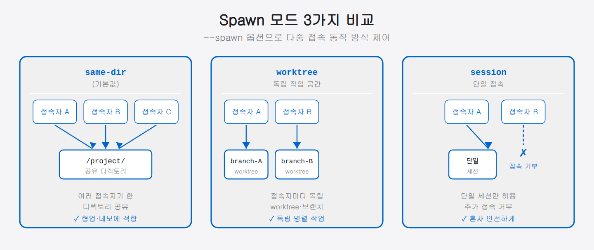

## 04-3. 서버 모드 및 Spawn 모드

Remote Control의 **서버 모드**를 쓰면 한 대의 로컬 머신에서 여러 원격 세션을 동시에 관리할 수 있습니다. 팀원이 각자 원격으로 연결하거나, 여러 작업을 한꺼번에 돌릴 때 쓸모가 큽니다.

> 💡 **비유:** 일반 Remote Control(방법 1~3)이 "내 방에 손님 한 명을 들이는 것"이라면, 서버 모드는 "회의실을 열어 여러 사람이 각자 자리에서 참여하도록 하는 것"입니다. 로컬 머신이 회의실 서버 역할을 합니다.

<hr>

## 서버 모드 실행

```bash
claude remote-control
```

서버 모드가 시작되면 다음과 같은 화면이 나타납니다.

```
Claude Remote Control Server
Session prefix: hostname-
Spawn mode: same-dir
Capacity: 0/32 sessions

Press SPACE to show QR code
Press W to toggle spawn mode (same-dir ↔ worktree)
```

이 화면에서 알아 둘 정보는 세 가지입니다 — **Session prefix**(만들어질 세션 이름 앞에 붙는 머리말), **Spawn mode**(동시 접속을 어떻게 처리할지, 기본 `same-dir`), 그리고 **Capacity**(현재/최대 세션 수). 아래 안내대로 SPACE를 누르면 모바일 연결용 QR 코드가 뜨고, W를 누르면 spawn 모드를 `same-dir`와 `worktree` 사이에서 전환할 수 있습니다.

### 서버 모드와 일반 Remote Control의 차이

| 구분 | 일반 RC (`--remote-control`) | 서버 모드 (`remote-control`) |
|------|-----------------|------------------------------|
| 세션 수 | 단일 세션 | 최대 32개 (기본값) |
| 새 접속자 처리 | 기존 세션 공유 | 새 세션 자동 생성 (Spawn) |
| 용도 | 개인 원격 접속 | 팀 공유, 다중 병렬 작업 |
| QR 코드 | 없음 | 스페이스바로 즉시 표시 |

<hr>

## 서버 모드 옵션

```bash
claude remote-control \
    --name "내 개발 서버" \
    --remote-control-session-name-prefix myproject \
    --spawn worktree \
    --capacity 16 \
    --permission-mode default \
    --verbose
```

| 플래그 | 설명 | 기본값 |
|--------|------|--------|
| `--name "제목"` | 세션 목록 표시 이름 | hostname 기반 자동 생성 |
| `--remote-control-session-name-prefix` | 세션 이름 접두사 | hostname |
| `--spawn` | 세션 생성 방식 | `same-dir` |
| `--capacity N` | 최대 동시 세션 수 | 32 |
| `--verbose` | 상세 연결/세션 로그 출력 | 비활성 |
| `--permission-mode <mode>` | 도구 실행 권한 모드 (default·auto·plan·acceptEdits·dontAsk·bypassPermissions) | default |

### --permission-mode 상세

| 모드 | 설명 | 추천 상황 |
|------|------|-----------|
| `default` | 도구 실행 시 승인 요청 | 일반 사용 (기본) |
| `auto` | 안전하다고 판단된 도구는 자동 허용 | 반자동 환경 |
| `plan` | 계획 단계만 허용, 실행은 승인 필요 | 안전한 검토 환경 |
| `acceptEdits` | 파일 편집은 자동 승인 | 코딩 위주 세션 |
| `dontAsk` | 승인 요청 없이 자동 실행 (제한 없음) | 완전 자동화 |
| `bypassPermissions` | 모든 권한 검사 우회 | 완전 자동화 (주의) |

> 💡 팀 공유 서버라면 `default` 모드가 안전합니다. 자동화 파이프라인에서는 `bypassPermissions`를 쓰되, 신뢰된 환경에서만 사용해야 합니다.

<hr>

## Spawn 모드

Spawn 모드는 새로운 원격 접속자가 연결될 때 세션을 어떻게 생성할지를 결정합니다. 세 가지(`same-dir`·`worktree`·`session`) 중 하나를 `--spawn` 옵션으로 고릅니다.

> 💡 **"Spawn"이란?** 새 세션을 "낳는다(spawn)"는 뜻입니다. 접속자가 늘어날 때 서버가 자동으로 새 Claude 세션을 만들어 배정하는 동작입니다.

### same-dir (기본)

모든 원격 세션이 서버를 실행한 디렉토리를 공유합니다.

```bash
claude remote-control --spawn same-dir
```

```
개발자 A ──┐
개발자 B ──┼── 같은 디렉토리 (/home/user/project)
개발자 C ──┘
```

모든 세션이 같은 파일을 즉시 공유하는 게 장점입니다. 대신 둘 이상이 같은 파일을 동시에 고치면 충돌이 날 수 있습니다. 그래서 같은 파일을 함께 보며 페어 프로그래밍을 하거나, 읽기 전용으로 작업 상황만 공유할 때 잘 맞습니다.

```bash
# 예시: 팀원 모두가 같은 디렉토리에서 리뷰
cd ~/projects/myapp
claude remote-control --spawn same-dir --name "myapp 리뷰 세션"
```

### worktree

접속자마다 별도의 git worktree가 자동으로 생성됩니다.

```bash
claude remote-control --spawn worktree
```

```
개발자 A ── /home/user/project-worktree-abc/  (브랜치: session-abc)
개발자 B ── /home/user/project-worktree-def/  (브랜치: session-def)
개발자 C ── /home/user/project-worktree-ghi/  (브랜치: session-ghi)
```

- 장점: 각 세션이 완전히 독립적으로 작업 가능
- 단점: git 저장소가 있어야 사용 가능, 디스크 공간 추가 사용

> 💡 **git worktree란?** 하나의 git 저장소를 여러 작업 폴더로 동시에 펼쳐 쓰는 기능입니다. 접속자마다 별도 폴더·브랜치를 받으므로 서로의 작업이 섞이지 않습니다. 여러 명이 같은 프로젝트를 동시에 만질 때 충돌을 막아 줍니다.

**추천 상황:** 여러 Claude 세션이 동일 프로젝트에서 서로 다른 기능을 병렬 구현할 때. 각자 브랜치에서 독립 작업하고 나중에 머지합니다.

```bash
# 예시: 기능별 병렬 개발
cd ~/projects/myapp
claude remote-control --spawn worktree --capacity 8 --name "병렬 개발 서버"
# 접속자마다 자동으로 session-abc, session-def... 브랜치 생성
```

### session

단일 세션만 허용합니다. 추가 접속 시도는 거부됩니다.

```bash
claude remote-control --spawn session
```

혼자만 사용하고 실수로 중복 접속하는 것을 방지할 때 유용합니다.

**추천 상황:** 개인 작업 세션인데 서버 모드의 QR 코드·이름 설정 기능을 쓰고 싶을 때. 또는 팀원이 아닌 사람이 실수로 접속하는 것을 막을 때.

```bash
claude remote-control --spawn session --name "쭌의 작업"
```



### Spawn 모드 선택 가이드

```
같은 파일을 보며 협업 (페어 프로그래밍, 코드 리뷰)
  → same-dir

각자 독립적인 기능을 병렬로 개발
  → worktree

혼자만 쓰는 세션, 중복 접속 방지
  → session
```

<hr>

## 런타임 단축키

서버 모드 실행 중에 사용할 수 있는 키보드 단축키입니다.

| 키 | 동작 |
|----|------|
| `스페이스바` | QR 코드 표시/숨기기 |
| `W` | `same-dir` ↔ `worktree` 모드 전환 |
| `Q` 또는 `Ctrl+C` | 서버 종료 |

> 💡 `W` 키로 모드를 전환하면 **새로 접속하는 세션**부터 적용됩니다. 이미 연결된 세션에는 영향을 주지 않습니다.

<hr>

## 실용적인 서버 모드 예시

### 개인 개발 서버 (worktree 격리)

```bash
cd ~/projects/myapp

claude remote-control \
    --remote-control-session-name-prefix myapp \
    --spawn worktree \
    --capacity 8
```

스마트폰으로 QR 코드를 스캔하면 독립적인 작업 환경이 생성됩니다.

### 팀 공유 서버 (보안 강화)

```bash
claude remote-control \
    --name "팀 공유 AI 서버" \
    --spawn same-dir \
    --capacity 16 \
    --permission-mode default \
    --verbose
```

### 단일 사용자 세션

```bash
claude remote-control \
    --spawn session \
    --name "쭌의 작업"
```

### 장시간 실행 (백그라운드 + 로그)

서버 모드를 백그라운드에서 장시간 돌리고 싶을 때는 `nohup`과 리다이렉트를 조합합니다.

```bash
nohup claude remote-control \
    --name "개발 서버" \
    --spawn worktree \
    --verbose \
    > ~/claude-server.log 2>&1 &

echo "서버 PID: $!"
```

로그는 `tail -f ~/claude-server.log`로 실시간 확인할 수 있습니다.

<hr>

## 세션 현황 모니터링

서버 모드 실행 중 `--verbose` 플래그를 추가하면 접속/해제 이벤트를 실시간으로 볼 수 있습니다.

```
[2026-04-26 14:00:01] Session connected: myapp-swift-eagle (from mobile)
[2026-04-26 14:02:15] Message received: "코드 리뷰해줘"
[2026-04-26 14:05:30] Session disconnected: myapp-swift-eagle
```

각 로그 항목의 의미:

| 로그 유형 | 설명 |
|-----------|------|
| `Session connected` | 새 원격 접속자가 연결됨 (세션 이름 + 기기 종류) |
| `Message received` | 원격 접속자가 입력한 메시지 |
| `Session disconnected` | 접속 종료 또는 네트워크 단절 |

> 💡 `--verbose` 없이 실행하면 접속 이벤트 로그가 표시되지 않습니다. 팀 운영 중이거나 접속 문제를 디버깅할 때는 항상 `--verbose`를 켜 두는 것이 좋습니다.

<hr>

## TMUX 팀과 서버 모드 결합

멀티에이전트 팀에서 팀장 파인을 서버 모드로 실행하면 외부에서 팀장에게 접속할 수 있습니다.

```bash
# Pane 0 (팀장)에 서버 모드로 Claude 실행
tmux send-keys -t team:0.0 \
    "cd /home/user && claude remote-control --name '쭌-팀장' --spawn session" Enter
```

이제 스마트폰에서 `claude.ai/code`에 접속해 `쭌-팀장` 세션을 선택하면 팀장에게 직접 지시를 내릴 수 있습니다.

### 팀 셋업 스크립트에 통합하기

팀 구성 시 자동으로 서버 모드를 켜는 패턴입니다.

```bash
#!/bin/bash
# setup-team.sh 일부

# Pane 0: 팀장 (서버 모드, 외부 접속 허용)
tmux send-keys -t team:0.0 \
    "claude remote-control --name '팀장-쭌' --spawn session --verbose" Enter

sleep 1

# Pane 1~5: 팀원 (일반 모드, 내부 작업 전용)
for pane in 1 2 3 4 5; do
    tmux send-keys -t team:0.$pane \
        "claude --dangerously-skip-permissions" Enter
    sleep 0.5
done
```

이렇게 하면 외부에서는 팀장 세션에만 접속하고, 팀원들은 내부 tmux 통신으로만 지시를 받습니다.

<hr>

## 서버 모드 시작 실패 시 점검

| 증상 | 원인 | 해결 |
|------|------|------|
| `git worktree` 오류 | worktree 모드인데 git repo 없음 | `git init`으로 저장소 초기화 |
| `Capacity exceeded` | 최대 세션 수 초과 | `--capacity` 값 늘리기 |
| 서버 시작 후 아무것도 안 뜸 | OAuth 인증 없음 | `claude auth login` 실행 |
| QR 코드가 안 보임 | 터미널 폭이 너무 좁음 | 터미널 창을 넓혀서 재실행 |

<hr>

## 요약

| Spawn 모드 | 사용 상황 |
|------------|-----------|
| `same-dir` | 같은 파일을 보며 협업 |
| `worktree` | 독립적인 병렬 작업 |
| `session` | 단일 사용자 전용 |

다음 챕터에서는 원격 세션 목록에서 쉽게 찾을 수 있도록 **세션 이름을 설정하는 방법**을 자세히 설명합니다.
