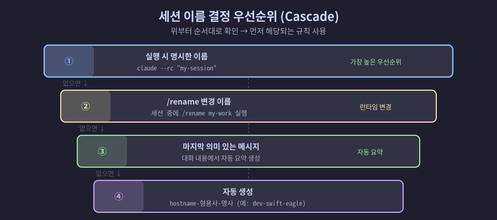
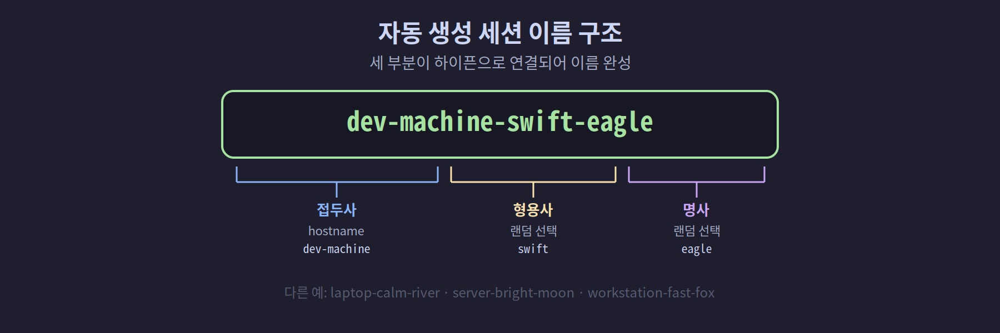

## 4-4. 세션 이름 설정

원격에서 여러 Claude Code 세션에 접속할 때 세션 이름이 중요합니다. 이름을 잘 설정하면 `claude.ai/code` 세션 목록에서 원하는 세션을 빠르게 찾을 수 있습니다.

<hr>

## 세션 이름 결정 우선순위

Claude Code는 세션 이름을 다음 순서로 결정합니다.

| 순위 | 소스 | 예시 |
|------|------|------|
| 1 | 실행 시 명시한 이름 | `claude --rc "백엔드 API 작업"` |
| 2 | `/rename`으로 변경한 이름 | `/rename 프론트엔드 리팩토링` |
| 3 | 대화 기록의 마지막 의미 있는 메시지 | (자동) |
| 4 | `{hostname}-{랜덤형용사}-{랜덤명사}` | `mypc-graceful-unicorn` |



<hr>

## 이름 직접 지정

### CLI 플래그로 지정

```bash
# --remote-control 또는 --rc 다음에 이름 입력
claude --remote-control "백엔드 API 리팩토링"
claude --rc "프론트엔드 로그인 화면"

# 서버 모드에서 --name 플래그
claude remote-control --name "개발 서버"
```

### 실행 중 세션에서 지정

```
> /remote-control 내 프로젝트 작업
```

`/remote-control` 명령어 뒤에 이름을 입력합니다.

### 실행 중 세션 이름 변경

```
> /rename 새 세션 이름
```

<hr>

## 세션 이름 접두사 설정

`--remote-control-session-name-prefix`는 자동 생성 이름의 앞부분을 고정합니다. 여러 세션이 같은 프로젝트임을 알아보기 쉽게 만들 때 유용합니다.

```bash
# 플래그로 접두사 지정
claude remote-control --remote-control-session-name-prefix dev-machine
# 결과: dev-machine-graceful-unicorn
# 결과: dev-machine-swift-eagle
# 결과: dev-machine-calm-river
```



### 환경변수로 설정

매번 플래그를 입력하는 번거로움을 없애려면 환경변수를 사용합니다.

```bash
# ~/.bashrc 또는 ~/.zshrc에 추가
export CLAUDE_REMOTE_CONTROL_SESSION_NAME_PREFIX=myproject

# 적용
source ~/.bashrc

# 이후 접두사 없이 실행해도 자동 적용
claude remote-control
# 결과: myproject-gentle-forest
```

<hr>

> 💡 **환경변수란?** 터미널이 기억하는 "공용 설정값"입니다. `~/.bashrc`(또는 `~/.zshrc`)에 한 줄 적어 두면, 터미널을 새로 열 때마다 자동 적용되어 매번 같은 옵션을 타이핑하지 않아도 됩니다.

## 멀티에이전트 팀에서 세션 이름 관리

팀 환경에서는 각 파인(에이전트)의 세션 이름을 역할로 지정하면 원격에서 누구에게 접속하는지 즉시 알 수 있습니다.

```bash
# 팀 셋업 스크립트에서 각 파인 시작 시
# 파인 0: 팀장
tmux send-keys -t team:0.0 \
    "claude --rc '팀장-쭌' --dangerously-skip-permissions" Enter

# 파인 1: 아키텍트
tmux send-keys -t team:0.1 \
    "claude --rc '아키텍트-민준' --dangerously-skip-permissions" Enter

# 파인 2: 리서쳐
tmux send-keys -t team:0.2 \
    "claude --rc '리서쳐-지훈' --dangerously-skip-permissions" Enter
```

이렇게 하면 `claude.ai/code`에서 세션 목록을 열었을 때 다음과 같이 표시됩니다.

```
● 팀장-쭌           (컴퓨터 아이콘 + 초록 점 = 활성)
● 아키텍트-민준
● 리서쳐-지훈
● 디자이너-수아
● 개발자-서연
● 리뷰어-태양
```

<hr>

## 환경변수 기반 접두사와 역할 이름 결합

```bash
# .env 또는 셋업 스크립트에서
export CLAUDE_REMOTE_CONTROL_SESSION_NAME_PREFIX="team"

# 각 파인에서 역할 이름으로 시작
claude --rc "pane0-팀장"     # → team-pane0-팀장 (접두사 + 이름)
```

<hr>

## 세션 이름 모범 사례

### 프로젝트 + 역할 조합

```
myapp-backend-dev
myapp-frontend-design
myapp-architect
```

### 날짜 포함 (일시적 작업)

```bash
claude --rc "$(date +%Y%m%d)-데이터마이그레이션"
# 결과: 20260426-데이터마이그레이션
```

### 짧고 명확하게

세션 목록에서 잘리지 않도록 이름은 20자 이내로 유지합니다.

<hr>

## 세션 이름 확인

현재 세션 이름은 `/status` 명령으로 확인합니다.

```
> /status

Session: 팀장-쭌
Remote Control: Active
Model: claude-sonnet-4-6
```

<hr>

## 요약

세션 이름 설정 방법 요약:

```bash
# 일회성 이름 지정
claude --rc "세션 이름"

# 접두사 설정 (플래그)
claude remote-control --remote-control-session-name-prefix 접두사

# 접두사 설정 (환경변수, 영구)
export CLAUDE_REMOTE_CONTROL_SESSION_NAME_PREFIX=접두사

# 실행 중 이름 변경
/rename 새이름
```

다음 챕터에서는 프로그램 방식으로 Claude를 제어할 수 있는 **Stream JSON 모드**를 설명합니다.
