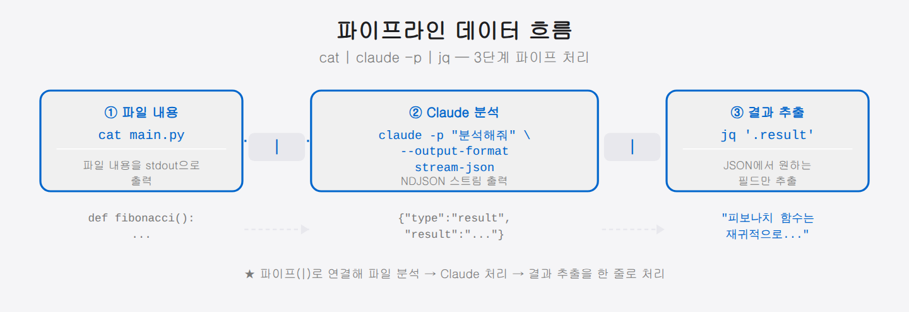

## 04-5. Stream JSON 제어

Remote Control이 사람이 다른 기기에서 직접 접속하는 방식이라면, **Stream JSON**은 프로그램이 Claude Code를 자동으로 제어하는 방식입니다. 스크립트, 파이프라인, 다른 애플리케이션에서 Claude와 구조화된 방식으로 통신할 수 있습니다.

> 💡 **비유:** Remote Control이 "폰으로 TV 채널 바꾸는 것"이라면, Stream JSON은 "방송 제작 시스템이 자동으로 TV에 신호를 보내는 것"입니다. 사람 손이 가지 않고 프로그램끼리 대화합니다.

<hr>

## Stream JSON 모드의 두 가지 방향

| 방향 | 플래그 | 용도 |
|------|--------|------|
| 출력 스트리밍 | `--output-format stream-json` | Claude 응답을 JSON 스트림으로 받기 |
| 입력 스트리밍 | `--input-format stream-json` | JSON으로 메시지를 Claude에게 전송 |

두 방향은 독립적이라 따로 쓸 수도, 함께 쓸 수도 있습니다. **출력 스트리밍**은 Claude가 만들어 내는 응답을 JSON으로 받아 가는 통로이고, **입력 스트리밍**은 반대로 프로그램이 JSON 형태의 메시지를 Claude에게 밀어 넣는 통로입니다. 둘을 동시에 켜면 프로그램과 Claude가 JSON으로 주고받는 양방향 대화가 되어, 사람의 키 입력 없이도 자동화된 왕복 통신이 이뤄집니다.

> 💡 **Stream JSON은 누가 쓸까요?** 사람이 직접 쓰는 게 아니라 **프로그램**이 씁니다. Remote Control이 사람용 원격 조종이라면, Stream JSON은 스크립트가 Claude를 부품처럼 호출해 결과를 받아 가는 자동화용 통로입니다.

### 언제 어떤 방향을 쓸까?

```
Claude에게 묻고 답 받기만 하면 된다
  → 출력 스트리밍만 사용 (--output-format stream-json)

프로그램이 대화형으로 Claude와 여러 번 주고받아야 한다
  → 입출력 모두 사용 (--input-format + --output-format)

최종 결과 텍스트만 필요하고 스트리밍 불필요
  → 단일 JSON 출력 (--output-format json)
```

<hr>

## 출력: Stream JSON

### 기본 사용법

```bash
claude -p "파이썬으로 피보나치 함수를 작성해줘" \
    --output-format stream-json \
    --verbose \
    --include-partial-messages
```

`-p` 플래그는 프롬프트를 직접 전달하고 비대화형 모드로 실행합니다.

| 플래그 | 설명 |
|--------|------|
| `-p "프롬프트"` | 프롬프트를 직접 전달, 사람 입력 없이 바로 실행 |
| `--output-format stream-json` | 응답을 NDJSON 스트림으로 출력 |
| `--verbose` | 도구 호출, 시스템 이벤트 등 상세 이벤트 포함 |
| `--include-partial-messages` | 토큰 단위 부분 응답도 포함 (타이핑 효과처럼 실시간 수신) |

### 출력 형식 (NDJSON)

각 줄이 하나의 JSON 객체인 NDJSON(Newline Delimited JSON) 형식입니다.

> 💡 **NDJSON이란?** 한 줄에 JSON 하나씩 줄바꿈으로 이어 붙인 형식입니다. 응답이 완성되길 기다리지 않고 한 줄씩 도착하는 대로 처리할 수 있어, 실시간 스트리밍과 프로그램 처리에 알맞습니다.

```json
{"type":"stream_event","event":{"type":"message_start","message":{"id":"msg_01...","type":"message","role":"assistant","content":[]}},"session_id":"uuid","uuid":"event-uuid"}
{"type":"stream_event","event":{"type":"content_block_delta","delta":{"type":"text_delta","text":"def "}},"session_id":"uuid","uuid":"event-uuid"}
{"type":"stream_event","event":{"type":"content_block_delta","delta":{"type":"text_delta","text":"fibonacci"}},"session_id":"uuid","uuid":"event-uuid"}
...
{"type":"result","subtype":"success","result":"def fibonacci(n):\n    ...","session_id":"uuid"}
```

### 주요 이벤트 타입

| `type` | 의미 |
|--------|------|
| `stream_event` | Claude 응답 스트림의 개별 조각 |
| `result` | 최종 완성된 응답 (`subtype: "success"` 또는 `"error"`) |
| `tool_use` | Claude가 도구를 호출함 (`--verbose` 필요) |
| `system` | 시스템 메시지 (세션 시작, 컨텍스트 정보 등) |

### jq로 텍스트만 추출

```bash
claude -p "간단한 인사말 작성해줘" \
    --output-format stream-json \
    --verbose \
    --include-partial-messages | \
    jq -rj 'select(
        .type == "stream_event" and
        .event.delta.type? == "text_delta"
    ) | .event.delta.text'
```

출력:
```
안녕하세요! 반갑습니다.
```

### 최종 결과만 추출

```bash
claude -p "2 + 2는?" \
    --output-format stream-json | \
    jq -r 'select(.type == "result") | .result'
```

> 💡 **`jq`란?** JSON 처리 전용 커맨드라인 도구입니다. `jq '.result'`는 JSON에서 `result` 키의 값만 꺼내라는 뜻입니다. `-r`은 문자열 값을 따옴표 없이 출력하는 옵션입니다.

<hr>

## 단일 JSON 출력 (`--output-format json`)

스트리밍이 필요 없고 최종 결과만 필요하다면 단일 JSON 출력을 사용합니다.

```bash
claude -p "Node.js 버전 확인 방법" --output-format json
```

응답:
```json
{
  "result": "node --version 명령을 실행하면 됩니다.",
  "session_id": "uuid-abc123",
  "usage": {
    "input_tokens": 15,
    "output_tokens": 12,
    "cache_read_tokens": 0,
    "cache_creation_tokens": 0
  }
}
```

`usage` 필드는 이번 요청에서 사용한 토큰 수를 알려줍니다. 비용 추적이나 사용량 모니터링에 활용할 수 있습니다.

### stream-json vs json 선택 기준

| 상황 | 추천 형식 |
|------|-----------|
| 실시간으로 답변이 오는 것을 보여줘야 함 | `stream-json` |
| 최종 답변만 다음 단계에 넘기면 됨 | `json` |
| 토큰 수·비용 추적이 필요 | `json` (usage 포함) |
| 파이프라인에서 빠른 처리 필요 | `json` |

### JSON Schema로 구조화된 출력

```bash
claude -p "다음 텍스트에서 이름 목록을 추출해줘: 앨런, 민준, 서연이 회의에 참석했다" \
    --output-format json \
    --json-schema '{
        "type": "object",
        "properties": {
            "names": {
                "type": "array",
                "items": {"type": "string"}
            }
        }
    }'
```

응답:
```json
{
  "result": {"names": ["앨런", "민준", "서연"]},
  "session_id": "uuid",
  "usage": {...}
}
```

> 💡 **JSON Schema란?** 원하는 출력 구조를 미리 정의하는 명세입니다. `--json-schema`로 스키마를 넘기면 Claude가 그 형식에 맞춰 응답을 구성합니다. 이름 추출, 분류, 태그 생성처럼 결과를 코드에서 바로 쓸 때 유용합니다.

<hr>

## 입력: Stream JSON

입력도 JSON 형식으로 보낼 수 있습니다. 복잡한 메시지 구조나 자동화 파이프라인에 유용합니다.

```bash
claude -p \
    --input-format stream-json \
    --output-format stream-json \
    --replay-user-messages
```

이 명령을 실행하면 stdin에서 JSON을 읽습니다. 아래 형식으로 입력합니다.

```bash
echo '{"type":"user_message","content":"안녕하세요!","uuid":"msg-001"}' | \
    claude -p --input-format stream-json --output-format stream-json
```

입력 메시지 구조:
```json
{
  "type": "user_message",
  "content": "메시지 내용",
  "uuid": "고유-이벤트-id"
}
```

| 플래그 | 설명 |
|--------|------|
| `--input-format stream-json` | stdin에서 NDJSON으로 입력 받기 |
| `--replay-user-messages` | 수신한 사용자 메시지를 stdout에 에코 (수신 확인용) |
| `--include-partial-messages` | 부분 토큰 스트림 이벤트 포함 |

### 입력 스트리밍 활용 예시

여러 메시지를 파일에 미리 작성해 두고 한꺼번에 처리할 수 있습니다.

```bash
# messages.ndjson
cat > messages.ndjson << 'EOF'
{"type":"user_message","content":"파이썬이란 무엇인가?","uuid":"q-001"}
{"type":"user_message","content":"Node.js의 장점은?","uuid":"q-002"}
EOF

# 파일로 입력 스트리밍
cat messages.ndjson | \
    claude -p \
    --input-format stream-json \
    --output-format json
```

<hr>

## 실용 예제: 파이프라인에서 활용

### 파일 내용을 Claude에게 분석 요청

```bash
cat main.py | \
    claude -p "이 코드의 버그를 찾아줘" \
    --output-format json | \
    jq -r '.result'
```



> 💡 **파이프(`|`)와 `jq`란?** `|`는 앞 명령의 출력을 다음 명령의 입력으로 넘기는 연결 장치입니다. `jq`는 JSON에서 원하는 값만 골라내는 도구로, 여기서는 Claude의 JSON 응답에서 `.result`(실제 답변)만 추출합니다.

### 여러 질문을 순차 처리

```bash
#!/bin/bash
questions=(
    "파이썬이란 무엇인가?"
    "Node.js의 장점은?"
    "Rust가 인기 있는 이유는?"
)

for q in "${questions[@]}"; do
    echo "=== $q ==="
    claude -p "$q" --output-format json | jq -r '.result'
    echo ""
done
```

### 응답을 파일로 저장

```bash
claude -p "README.md 초안 작성해줘" \
    --output-format json | \
    jq -r '.result' > README.md

echo "README.md 생성 완료"
```

### CI/CD 파이프라인에서 코드 리뷰

```bash
#!/bin/bash
# PR의 변경 파일을 Claude에게 리뷰 요청

DIFF=$(git diff main..HEAD -- '*.py')
REVIEW=$(echo "$DIFF" | \
    claude -p "이 변경사항에서 버그나 보안 취약점을 찾아 JSON으로 응답해줘" \
    --output-format json \
    --json-schema '{
        "type": "object",
        "properties": {
            "issues": {
                "type": "array",
                "items": {
                    "type": "object",
                    "properties": {
                        "severity": {"type": "string"},
                        "description": {"type": "string"},
                        "line": {"type": "number"}
                    }
                }
            }
        }
    }' | jq -r '.result')

echo "$REVIEW"

# 심각한 이슈가 있으면 PR 차단
CRITICAL=$(echo "$REVIEW" | jq '[.issues[] | select(.severity == "critical")] | length')
if [ "$CRITICAL" -gt "0" ]; then
    echo "❌ 심각한 이슈 $CRITICAL 건 발견. 머지 차단."
    exit 1
fi
echo "✅ 이슈 없음. 머지 허용."
```

### 토큰 사용량 모니터링

```bash
#!/bin/bash
# 사용량 누적 집계

TOTAL_INPUT=0
TOTAL_OUTPUT=0

for prompt in "질문1" "질문2" "질문3"; do
    RESPONSE=$(claude -p "$prompt" --output-format json)
    INPUT=$(echo "$RESPONSE" | jq '.usage.input_tokens')
    OUTPUT=$(echo "$RESPONSE" | jq '.usage.output_tokens')
    TOTAL_INPUT=$((TOTAL_INPUT + INPUT))
    TOTAL_OUTPUT=$((TOTAL_OUTPUT + OUTPUT))
    echo "$prompt → 입력: $INPUT, 출력: $OUTPUT"
done

echo "합계 → 입력: $TOTAL_INPUT, 출력: $TOTAL_OUTPUT"
```

<hr>

## Remote Control과 Stream JSON 비교

| 비교 | Remote Control | Stream JSON |
|------|----------------|-------------|
| 사용자 | 사람 (모바일/웹) | 프로그램/스크립트 |
| 입력 방식 | 인터랙티브 대화 | CLI 플래그, stdin |
| 출력 방식 | 실시간 UI | NDJSON, JSON |
| 세션 유지 | 영구 세션 | 요청별 실행 |
| 자동화 | 어려움 | 쉬움 |

### 함께 쓰는 방법

Remote Control과 Stream JSON은 배타적이지 않습니다. 예를 들어, 서버 모드로 세션을 열어 두고 동시에 스크립트에서 `-p` 플래그로 Claude를 호출하는 것도 가능합니다.

```bash
# 터미널 1: 서버 모드 (원격 접속용)
claude remote-control --name "개발 서버" &

# 터미널 2: 스크립트 자동화 (Stream JSON)
claude -p "테스트 결과 분석해줘" --output-format json < test_results.txt
```

<hr>

## 오류 처리

`result` 이벤트의 `subtype`이 `"error"`이면 오류가 발생한 것입니다.

```json
{
  "type": "result",
  "subtype": "error",
  "error": {
    "type": "rate_limit_error",
    "message": "Too many requests. Please retry after 60 seconds."
  },
  "session_id": "uuid"
}
```

오류를 처리하는 기본 패턴:

```bash
RESPONSE=$(claude -p "$PROMPT" --output-format json)
SUBTYPE=$(echo "$RESPONSE" | jq -r '.subtype')

if [ "$SUBTYPE" == "error" ]; then
    ERROR=$(echo "$RESPONSE" | jq -r '.error.message')
    echo "오류 발생: $ERROR"
    exit 1
fi

echo "$RESPONSE" | jq -r '.result'
```

<hr>

## 요약

Stream JSON은 Claude를 자동화 도구로 활용할 때 핵심 기능입니다. 쉘 스크립트, CI/CD 파이프라인, 배치 처리에서 Claude의 응답을 구조화된 데이터로 처리할 수 있습니다. 다음 챕터에서는 Remote Control 사용 시 중요한 **보안 설정**을 설명합니다.
