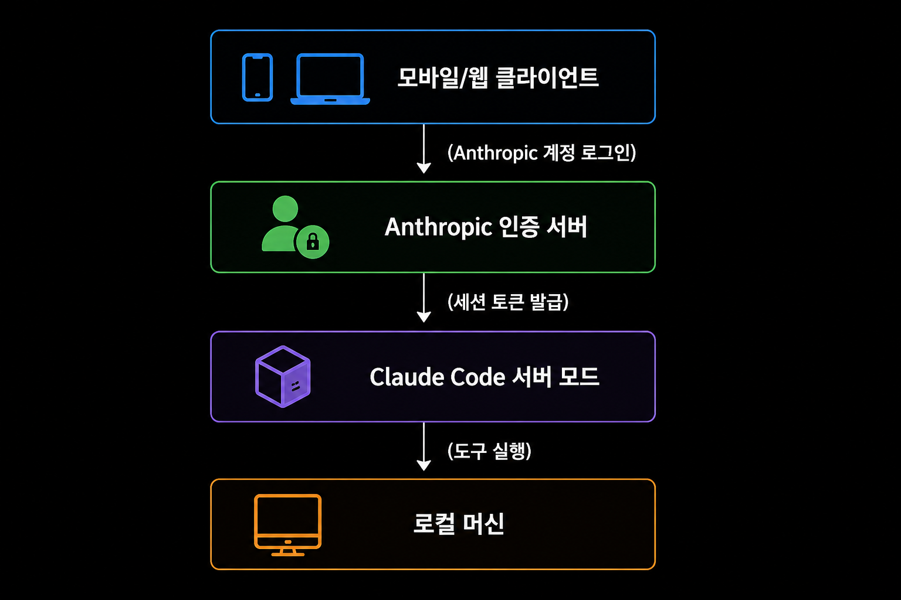
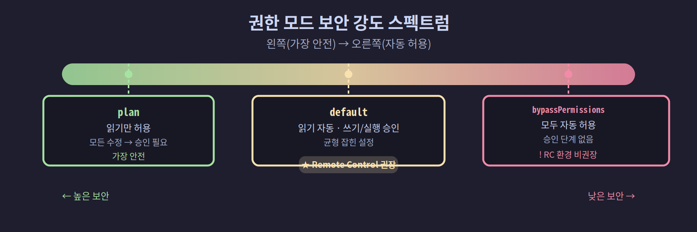
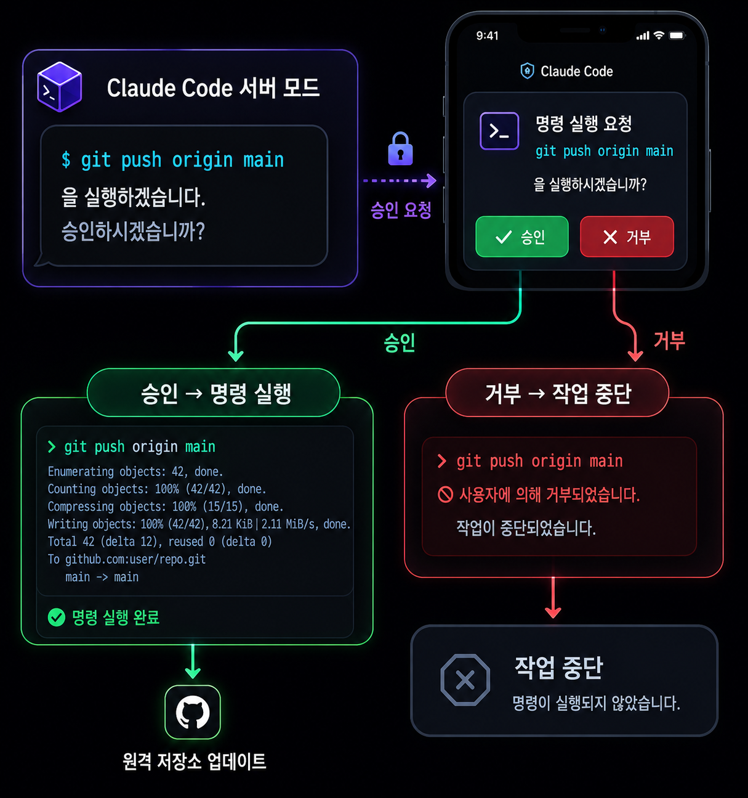
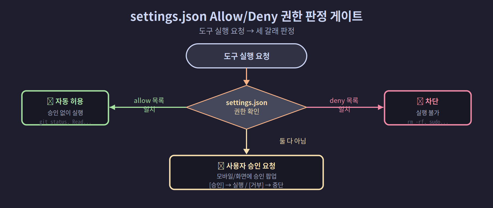

## 04-6. 보안 설정 및 인증 요구사항

Remote Control은 외부에서 Claude Code를 원격 제어하는 기능입니다. 편리하지만 보안 설정을 빠뜨리면 누군가 함부로 접근할 수 있습니다. 이 절에서는 Remote Control의 보안 모델과 권장 설정을 다룹니다.

> 💡 **비유:** Remote Control 보안은 아파트 현관 잠금과 같습니다. 건물 입구를 지나도 내 집 문이 따로 잠겨 있어, 두 겹을 모두 열어야 안으로 들어올 수 있습니다. 어느 잠금이 무엇을 막는지는 아래 표에서 정리합니다.

<hr>

## 인증 구조

Remote Control은 Anthropic 계정 인증을 기반으로 동작합니다. 연결 흐름은 다음과 같습니다.

```
모바일/웹 클라이언트
    │
    ▼ (Anthropic 계정 로그인)
Anthropic 인증 서버
    │
    ▼ (세션 토큰 발급)
Claude Code 서버 모드
    │
    ▼ (도구 실행)
로컬 머신
```



핵심 원칙: **동일한 Anthropic 계정으로 로그인한 기기만 해당 세션에 접근할 수 있습니다.** 타인이 세션 ID를 알더라도 계정 인증 없이는 연결이 불가능합니다.

### 인증 계층별 역할

| 계층 | 담당 | 방어 대상 |
|------|------|-----------|
| Anthropic 계정 인증 | 세션 URL/QR만으로 접근 불가 차단 | 외부 무단 접근 |
| 권한 모드 (Permission Mode) | 허용된 작업 범위 제한 | 의도치 않은 파일 변경·명령 실행 |
| allow/deny 규칙 | 개별 명령어 수준 제어 | 위험 명령 실행 방지 |
| `.claudeignore` | 민감 파일 접근 차단 | 자격증명·비밀키 노출 |

<hr>

## 권한 모드 (Permission Mode)

Claude Code는 도구 실행 시 권한 확인을 거칩니다. Remote Control 환경에서는 이 권한 모드가 더욱 중요합니다.

| 모드 | 설명 | Remote Control 권장 여부 |
|------|------|--------------------------|
| `default` | 읽기 작업 자동 허용, 쓰기/실행은 승인 필요 | [권장] |
| `plan` | 코드 읽기만 허용, 모든 수정은 승인 필요 | [높은 보안] |
| `bypassPermissions` | 모든 작업 자동 허용 | [비권장] |



> 💡 **권한 모드란?** Claude가 파일을 바꾸거나 명령을 실행하기 전에 "어디까지 자동으로 허용할지"를 정하는 단계입니다. 외부에서 접속하는 Remote Control에서는 더 엄격하게 잡는 것이 안전합니다. `default`(권장)는 읽기는 자동으로 허용하고, 쓰기·실행은 사람이 승인하게 합니다.

### 권한 모드 설정 방법

CLI 플래그로 지정합니다.

```bash
# 권장: default 모드
claude --remote-control --permission-mode default

# 높은 보안: plan 모드 (읽기만, 수정은 전부 승인)
claude --remote-control --permission-mode plan

# 완전 자동화 (신뢰된 환경에서만)
claude --remote-control --permission-mode bypassPermissions
```

### 상황별 모드 선택

```
팀 공유 서버 (여러 사람이 접속)
  → default 또는 plan (승인 절차 유지)

개인 자동화 파이프라인 (스크립트가 Claude 호출)
  → bypassPermissions (단, 신뢰된 로컬 환경만)

코드 리뷰 전용 세션 (수정 없이 보기만)
  → plan (가장 안전)
```

### 모바일에서의 권한 승인

Remote Control로 접속하면 Claude가 도구를 실행하기 전에 모바일 기기로 승인 요청이 전달됩니다.

```
Claude: "git push origin main을 실행하겠습니다. 승인하시겠습니까?"
    ↓
모바일 화면: [승인] [거부]
    ↓
승인 → 명령 실행
거부 → 작업 중단
```



`bypassPermissions` 모드는 이 승인 단계를 건너뛰므로 Remote Control 환경에서는 사용하지 않는 것이 좋습니다.

<hr>

## settings.json 보안 설정

### 허용 명령어 제한

`settings.json`에서 자동 허용할 도구와 명령어를 명시적으로 지정합니다.

```json
{
  "permissions": {
    "allow": [
      "Bash(git status)",
      "Bash(git diff*)",
      "Bash(git log*)",
      "Bash(npm test)",
      "Bash(npm run lint)",
      "Read"
    ],
    "deny": [
      "Bash(rm -rf*)",
      "Bash(sudo*)",
      "Bash(curl*|*>*)"
    ]
  }
}
```

| 설정 | 효과 |
|------|------|
| `allow` | 나열된 패턴의 도구는 승인 없이 자동 실행 |
| `deny` | 나열된 패턴은 실행 자체를 차단 |

읽기 전용 명령어(`git status`, `git log`, `Read`)는 자동 허용하되, 시스템 변경 명령어(`rm`, `sudo`)는 차단하는 것이 기본 원칙입니다.



> 💡 **최소 권한 원칙:** 안전하게 운영하는 핵심은 "꼭 필요한 것만 자동 허용"입니다. 되돌릴 수 없는 명령(`rm -rf`, `sudo`, `git push --force` 등)은 deny로 막고, 무해한 읽기만 allow로 풀어 두면 사고를 크게 줄일 수 있습니다.

### allow/deny 패턴 작성 규칙

패턴에서 `*`는 와일드카드(임의 문자열)입니다.

```
"Bash(git log*)"        → "git log", "git log --oneline", "git log -10" 모두 허용
"Bash(rm -rf*)"         → "rm -rf /", "rm -rf ." 등 모두 차단
"Bash(curl*|*>*)"       → curl로 시작하거나 리다이렉트(>)가 포함된 명령 차단
```

### 상황별 권장 allow/deny 설정

**개발 환경 (읽기·테스트 허용)**
```json
{
  "permissions": {
    "allow": [
      "Read",
      "Bash(git status)", "Bash(git log*)", "Bash(git diff*)",
      "Bash(npm test)", "Bash(npm run lint)", "Bash(pytest*)"
    ],
    "deny": [
      "Bash(rm*)", "Bash(sudo*)", "Bash(git push*)",
      "Bash(git reset --hard*)", "Bash(git branch -D*)"
    ]
  }
}
```

**코드 리뷰 전용 (읽기만)**
```json
{
  "permissions": {
    "allow": ["Read"],
    "deny": ["Bash(*)", "Write", "Edit"]
  }
}
```

<hr>

## 네트워크 보안

### SSH 터널을 통한 접속

Remote Control은 Anthropic 서버를 경유하므로 별도의 포트 개방이 필요 없습니다. 하지만 Claude Code 서버 모드 자체는 로컬에서 실행되므로, 서버가 실행되는 머신의 보안도 중요합니다.

```bash
# WSL2 환경에서 SSH를 통한 접근 제한
sudo ufw allow from 192.168.1.0/24 to any port 22
sudo ufw enable
```

### 세션 격리

여러 팀원이 같은 머신에서 각자 Claude Code를 실행할 경우, 세션은 Anthropic 계정 단위로 격리됩니다. A의 계정으로 생성된 세션은 B의 계정으로 접근할 수 없습니다.

> 💡 세션 URL(session ID)을 공유했더라도, Anthropic 계정 로그인이 없으면 접속이 불가능합니다. URL만 유출되었다고 보안 사고가 나지는 않습니다. 단, 계정 자격증명이 유출되면 모든 세션이 위험해지므로 계정 보안을 우선으로 관리해야 합니다.

<hr>

## 팀 환경 보안 체크리스트

팀 에이전트를 운용할 때 확인해야 할 보안 항목입니다.

### 1. 환경 변수 보호

```bash
# .env 파일은 Claude가 읽지 못하도록 설정
echo ".env" >> .claudeignore
echo ".env.local" >> .claudeignore
echo "credentials/" >> .claudeignore
```

`.claudeignore` 파일은 `.gitignore`와 같은 형식으로, Claude Code가 접근하지 않을 파일을 지정합니다.

**`.claudeignore` 권장 항목:**

```
# 자격증명·비밀키
.env
.env.*
*.pem
*.key
*credentials*
*secret*

# 클라우드 설정
.aws/
.gcloud/
.azure/

# 패스워드 파일
*.htpasswd
shadow
passwd
```

### 2. API 키 노출 방지

```json
{
  "permissions": {
    "deny": [
      "Bash(cat*credentials*)",
      "Bash(cat*.env*)",
      "Bash(echo*KEY*)",
      "Bash(echo*TOKEN*)"
    ]
  }
}
```

### 3. Git 보호

```json
{
  "permissions": {
    "deny": [
      "Bash(git push --force*)",
      "Bash(git reset --hard*)",
      "Bash(git branch -D main)"
    ]
  }
}
```

위험한 Git 명령어를 차단하여 실수로 인한 코드 손실을 방지합니다.

### 4. 파일 시스템 경계

```bash
# Claude Code가 접근할 디렉토리를 추가로 허용
claude --add-dir /home/user/my-project
```

`--add-dir` 플래그로 Claude가 접근할 수 있는 디렉토리를 지정합니다. Claude Code는 기본적으로 실행한 디렉토리에서 작업하며, 그 밖의 디렉토리도 다루어야 할 때 이 플래그로 추가 허용합니다.

> 💡 프로젝트 루트 외의 디렉토리는 기본적으로 접근 불가입니다. 예를 들어 `/home/user/secrets/`는 `--add-dir`로 명시하지 않으면 Claude가 읽을 수 없습니다.

<hr>

## 보안 사고 대응

Remote Control 세션에서 의심스러운 동작이 감지되면 다음과 같이 대응합니다.

### 즉시 차단

```bash
# 1. Claude Code 프로세스 종료
pkill -f "claude"

# 2. TMUX 세션 종료
tmux kill-session -t team

# 3. Anthropic 계정에서 세션 로그아웃
# (claude.ai → 설정 → 세션 관리)
```

### 사후 점검

```bash
# 최근 실행된 명령어 확인
cat ~/.claude/projects/*/conversations/*.jsonl | \
    grep "tool_use" | tail -50

# 파일 변경 이력 확인
git log --oneline -20
git diff HEAD~5
```

### 의심 징후 목록

아래 징후가 보이면 즉시 세션을 종료하고 점검합니다.

| 징후 | 의심 원인 |
|------|-----------|
| 지시하지 않은 파일 수정 | 권한 설정 오류 또는 외부 접근 |
| 알 수 없는 네트워크 요청 | `curl`, `wget` 등 외부 통신 |
| `.env` 또는 키 파일 접근 시도 | 자격증명 탈취 시도 |
| 프로세스가 예상보다 오래 실행 | 무한 루프 또는 대기 중인 악성 작업 |

<hr>

## 정기 보안 점검 항목

운영 중인 Remote Control 환경에서 주기적으로 확인할 항목입니다.

```bash
# 1. 실행 중인 Claude 세션 확인
ps aux | grep claude

# 2. 권한 설정 파일 확인
cat ~/.claude/settings.json | jq '.permissions'

# 3. .claudeignore 파일 확인
cat .claudeignore

# 4. 최근 대화 내역 확인 (의심 명령 포함 여부)
ls -lt ~/.claude/projects/*/conversations/ | head -10
```

<hr>

## 요약

Remote Control의 보안은 Anthropic 계정 인증, 권한 모드, `settings.json`의 allow/deny 규칙, `.claudeignore` 파일이 함께 받칩니다. 핵심은 최소 권한입니다. 읽기는 풀어 두고 쓰기·실행만 막거나 승인받게 하세요.

**보안 설정 빠른 체크리스트:**

```
✅ claude auth login (OAuth 인증) 완료
✅ --permission-mode default 또는 plan 사용
✅ settings.json에 deny 목록 설정 (rm, sudo, git push --force 등)
✅ .claudeignore에 .env, 키 파일 추가
✅ bypassPermissions는 로컬 자동화에서만 사용
✅ 정기적으로 대화 내역·파일 변경 이력 점검
```

다음 장에서는 이 설정을 기반으로 **모바일에서 실제로 팀을 제어**하는 방법을 다룹니다.
