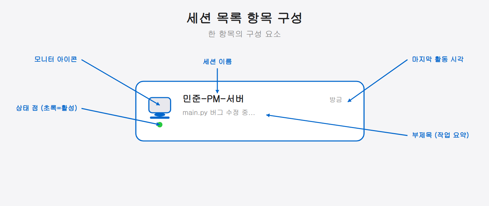

## 05-3. 세션 목록에서 팀 에이전트 선택

## 이 장에서 배울 내용

QR 코드 없이도 세션 목록 화면에서 원하는 세션을 직접 찾아 연결할 수 있습니다. 특히 여러 팀 에이전트를 동시에 운영할 때, 세션 목록을 통해 각 에이전트의 상태를 한눈에 확인하고 빠르게 전환하는 방법을 배웁니다.

> 💡 **비유: 팀원 모니터 화면** 관제 센터에서 여러 화면을 한눈에 보듯, 세션 목록은 지금 몇 명의 에이전트가 일하고 있는지, 누가 입력을 기다리는지, 누가 멈췄는지를 한 화면에 보여줍니다. QR 코드가 "처음 만나는 악수"라면, 세션 목록은 "팀 전체 현황판"입니다.

<hr>

## 세션 목록 화면 열기

### iOS / Android 공통

Claude 모바일 앱에서 하단 탭의 **Code** 를 탭하면 세션 목록 화면이 열립니다.

> 💡 **Code 탭이 안 보인다면?** 구독 등급(Pro 이상)이나 앱 버전을 확인하세요(5-1장 준비 사항 참고). 탭이 있지만 눌러도 반응이 없다면 앱을 완전히 종료 후 재시작합니다.

<hr>

## 세션 목록 화면 구성

세션 목록에는 현재 Remote Control 이 활성화된 모든 세션이 표시됩니다.

각 항목의 구성 요소:

| 아이콘/요소 | 의미 |
|-------------|------|
| [모니터 아이콘] | Remote Control 세션임을 표시 |
| ● 초록색 점 | 세션 활성 중 (연결 가능) |
| ○ 빈 점 | 입력 대기 중 (Claude가 답변을 기다림) |
| 회색 / 없음 | 오프라인 또는 Remote Control 비활성 |
| 세션 이름 | PC에서 지정한 이름 또는 자동 생성 이름 |
| 부제목 | 현재 작업 내용 (마지막 메시지 요약) |
| 시간 | 마지막 활동 시각 |



> 💡 여기서 **세션**이란 PC에서 실행 중인 Claude Code 한 개(= 팀원 한 명)를 가리킵니다. 점의 색으로 그 세션이 지금 일하는 중인지, 내 입력을 기다리는지 한눈에 알 수 있습니다.

### 자동 생성 이름 vs 직접 지정 이름

PC에서 이름을 지정하지 않으면 `mypc-elegant-fox`처럼 호스트명과 임의 단어가 조합된 이름이 자동 생성됩니다. 팀원이 여럿이면 이런 이름이 뒤섞여 누가 누구인지 구분하기 어렵습니다. 아래 세션 이름 규칙 섹션을 참고해 이름을 직접 지정하는 것을 권장합니다.

<hr>

## 팀 에이전트 세션 찾기

여러 팀원(에이전트)이 각자의 Claude Code 세션을 Remote Control 로 노출하고 있다면, 세션 이름으로 구분합니다.

### 세션 이름 규칙 설정 (PC에서)

팀 에이전트별로 알아보기 쉬운 이름을 붙이면 모바일에서 빠르게 찾을 수 있습니다.

예를 들어 `team-minjun`, `team-seoyeon`처럼 역할이 드러나는 이름을 붙여 두면, 모바일 세션 목록에 그 이름들이 나란히 떠 누가 어떤 작업 중인지 한눈에 구분됩니다. 이름 없이 `mypc-graceful-unicorn` 같은 임의 이름만 늘어서면 어느 세션이 누구인지 매번 헷갈리므로, 팀 단위로 쓸 때는 아래처럼 이름 규칙을 정해 두는 편이 좋습니다.

```bash
# 에이전트별 세션 이름 지정 예시 (이름은 --remote-control 뒤 위치 인수로 전달)
claude --remote-control "민준-PM-서버"
claude --remote-control "서연-리서처"
claude --remote-control "태양-리뷰어"
```

> 💡 **이름 규칙 추천 패턴** `[역할]-[담당]` 형태가 가장 직관적입니다. 예: `민준-아키텍트`, `서연-백엔드`, `태양-리뷰어`. 접두사 방식(`team-minjun-`)을 쓰면 팀 세션과 개인 세션을 검색으로 쉽게 구분할 수도 있습니다.

### 셋업 스크립트에서 이름 자동 지정

3장에서 만든 `setup-team.sh`를 수정해 각 파인 실행 시 자동으로 이름을 지정할 수 있습니다.

```bash
# 민준 파인에서 이름 붙여 실행
tmux send-keys -t team1:0.1 \
    "claude --remote-control '민준-아키텍트'" Enter
```

이렇게 하면 팀 환경이 올라올 때마다 세션 이름이 일정하게 유지됩니다.

### 모바일에서 세션 검색

세션이 많을 경우, 목록 상단의 **검색창**을 이용합니다.

세션 이름, 부제목, 호스트명 등 모든 텍스트를 검색할 수 있습니다.

```
검색창에 입력 예시:
  "민준"   → 민준 관련 세션만 표시
  "team-"  → team- 접두사가 붙은 세션만 표시
  "리뷰"   → 부제목에 "리뷰" 포함된 세션만 표시
```

<hr>

## 세션 선택 및 연결

원하는 세션을 탭하면 즉시 해당 세션에 연결됩니다.

**Step 1 — 목록에서 세션 탭**

연결하려는 세션 항목을 탭합니다.

**Step 2 — 세션 화면 진입**

해당 에이전트의 대화 화면이 열립니다. PC에서 진행 중인 실시간 대화 내용이 표시됩니다.

**Step 3 — 입력 또는 모니터링**

- **지시를 내릴 경우**: 하단 입력창에 명령을 적고 전송합니다.
- **진행 상황만 볼 경우**: 대화 기록을 스크롤하며 에이전트의 작업 흐름을 확인합니다.

> 💡 **세션 연결 = PC 세션 공유** 연결 후 입력창에 쓴 내용은 PC 터미널에도 동시에 나타납니다. 모바일에서 "서연, 인증 함수 작성해줘"라고 보내면 PC의 서연 세션이 받아서 처리합니다.

<hr>

## 여러 세션 간 전환

모바일에서는 여러 세션을 동시에 열어두고 빠르게 전환할 수 있습니다.

**iOS:** 상단 타이틀 영역을 탭하거나 왼쪽 스와이프로 세션 목록으로 돌아갑니다.

**Android:** 시스템 뒤로가기 버튼 또는 앱 내 뒤로가기 화살표를 탭합니다.

### 팀 모니터링 워크플로우 예시

외출 중에 팀 상황을 점검하는 전형적인 흐름입니다.

1. Code 탭 열기 → 세션 목록 전체 스캔
2. 초록 점 세션: 작업 중 — 부제목으로 진행 상황 확인
3. 빈 점 세션: 입력 대기 — 탭해서 다음 지시 전달
4. 노란 점 세션: 승인 필요 — 탭해서 도구 실행 승인 (5-4장)
5. 회색 세션: 오프라인 — PC 상태 확인 필요
6. 목록으로 돌아가 다음 세션으로 이동

이 흐름을 반복하면 PC 앞에 앉지 않고도 팀 전체 진행 상황을 스마트폰으로 관리할 수 있습니다.

<hr>

## 세션 상태 해석 가이드

| 상태 표시 | 의미 | 취할 행동 |
|-----------|------|-----------|
| 초록 점 + "실행 중" | Claude가 작업을 처리하는 중 | 진행 상황 확인 |
| ○ 빈 점 + "입력 대기 중" | Claude가 사용자 입력을 기다림 | 지시 입력 |
| 노란 점 + "도구 승인 필요" | 실행 권한 승인 대기 | 5-4장 참고 |
| 회색 + "오프라인" | PC 세션이 종료되었거나 네트워크 불량 | PC 상태 확인 |

색으로 외워 두면 편합니다 — **초록**은 작업 중, **빈 점**은 입력 대기, **노랑**은 도구 승인 필요(5-4장에서 다룹니다), **회색**은 세션이 꺼졌거나 네트워크가 끊긴 오프라인 상태입니다. 신호등과 비슷해서, 노랑이 뜨면 "내가 한 번 손봐 줘야 하는 신호"로 받아들이면 됩니다.

> 💡 점 색깔을 신호등처럼 읽으면 됩니다. 초록은 정상 동작, 노랑은 내 확인이 필요한 상태(도구 승인 등), 회색은 연결이 끊긴 상태입니다.

### 상태별 대응 시간 기준

| 상태 | 권장 대응 시간 | 이유 |
|------|---------------|------|
| 빈 점(입력 대기) | 가능한 빨리 | 에이전트가 멈춘 채 기다리는 중 |
| 노란 점(승인 필요) | 가능한 빨리 | 승인 없이는 작업이 진행되지 않음 |
| 초록 점(실행 중) | 주기적 모니터링 | 정상 작동 중 — 부제목으로 내용 확인 |
| 회색(오프라인) | 편할 때 | PC 세션 재기동 필요 |

<hr>

## 세션이 목록에 보이지 않을 때

**PC에서 확인할 사항:**
- Remote Control이 활성화되어 있는지 확인합니다. (`/remote-control` 명령 실행 또는 설정에서 `remoteControlAtStartup: true` 확인)
- 터미널 창이 닫히지 않았는지 확인합니다.

**모바일에서 확인할 사항:**
- 목록 화면을 아래로 당겨 새로고침합니다.
- 검색창의 텍스트를 지우고 전체 목록을 확인합니다.
- 데스크톱과 동일한 claude.ai 계정으로 로그인되어 있는지 확인합니다.

> 💡 **`remoteControlAtStartup: true` 설정이란?** Claude Code 설정 파일(`~/.claude/settings.json`)에 이 항목을 추가하면, claude 명령을 실행할 때마다 Remote Control이 자동으로 켜집니다. 매번 `/remote-control`을 입력하지 않아도 됩니다. 팀 에이전트처럼 항상 원격 접근이 필요한 환경에서는 이 설정을 켜두는 것이 편합니다.

<hr>

## 다음 장 미리보기

세션에 연결했다면, 이제 모바일에서 직접 지시를 입력하거나 Claude가 요청하는 도구 실행을 승인할 수 있습니다. 다음 장에서 모바일 제어의 핵심 기능을 알아봅니다.
