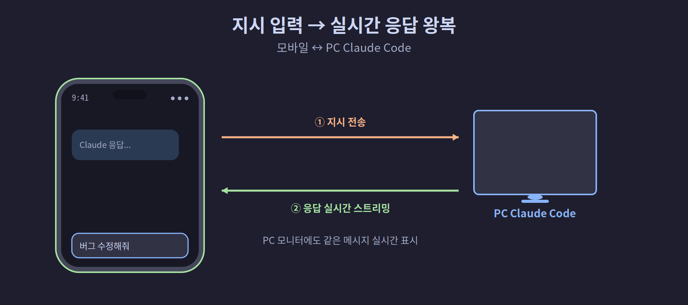

## 5-4. 모바일에서 지시 전달 및 도구 승인

## 이 장에서 배울 내용

세션에 연결된 후, 모바일에서 할 수 있는 두 가지 핵심 작업을 배웁니다. 첫째, 텍스트나 음성으로 Claude에게 지시를 입력하는 방법. 둘째, Claude가 파일 수정이나 명령어 실행을 요청할 때 스마트폰에서 직접 승인하거나 거부하는 방법입니다.

<hr>

## 지시 입력하기

### 텍스트 입력

세션 화면 하단의 입력창을 탭하고 지시 사항을 입력합니다.

입력 후 **전송** 버튼(→ 화살표)을 탭하면 PC의 Claude Code에 메시지가 전달됩니다. PC 모니터에서도 실시간으로 같은 메시지가 나타납니다.

```
[모바일 입력] "현재 main.py 파일에 있는 버그 수정해줘"
        ↓
[PC 터미널] 메시지 수신 → Claude가 작업 시작
        ↓
[모바일 화면] Claude 응답 실시간 스트리밍
```



<hr>

### 음성 입력 (iOS / Android)

긴 지시를 타이핑하기 번거로울 때 음성 입력을 활용합니다.

**iOS:**
1. 키보드의 마이크 아이콘을 탭합니다.
2. 지시 사항을 말합니다.
3. 텍스트로 변환된 내용을 확인하고 전송합니다.

**Android:**
1. 입력창 옆 마이크 아이콘을 탭합니다.
2. 음성 입력 후 자동 변환된 텍스트를 확인합니다.
3. 전송 버튼을 탭합니다.

> **팁:** 한국어, 영어 모두 정확하게 인식됩니다. 명령어나 파일명이 포함된 경우에는 텍스트 입력이 더 정확합니다.

<hr>

## 도구 승인 처리

Claude Code는 파일 쓰기, 터미널 명령어 실행 등 중요한 작업을 하기 전에 사용자 승인을 요청합니다. 모바일에서도 이 승인을 처리할 수 있습니다.

> 💡 **왜 승인을 물어볼까요?** Claude가 파일을 바꾸거나 명령을 실행하면 실제로 컴퓨터에 영향을 줍니다. 그래서 위험할 수 있는 작업은 실행 전에 사용자에게 "해도 될까요?"를 먼저 묻습니다. 이 승인 단계 덕분에 외출 중에도 안전하게 통제할 수 있습니다.

### 승인 요청 알림 확인

Claude가 승인을 기다리는 동안 세션 상태가 **"도구 승인 필요"** 로 변경됩니다. 앱 아이콘에도 배지(숫자)가 표시됩니다.

### 승인 화면 구성

해당 세션에 진입하면 승인 요청 카드가 표시됩니다.

| 요소 | 설명 |
|------|------|
| 도구 이름 | Bash, Edit, Write 등 Claude가 사용하려는 도구 |
| 실행 내용 | 실행할 명령어 또는 변경할 파일 내용 |
| 설명 | Claude가 이 작업이 필요한 이유 |
| 거부 버튼 | 해당 작업을 취소하고 Claude에게 알림 |
| 승인 버튼 | 작업 실행 허가 |

정리하면 승인 카드 한 장에는 **무엇을(도구 이름)·어떻게(실행 내용)·왜(설명)**가 담기고, 그 아래 **거부·승인** 두 버튼이 놓입니다. 즉 PC 화면을 보지 않고도 휴대폰의 이 카드 한 장만으로 "Claude가 지금 무슨 일을 하려는지" 파악하고 곧바로 결정을 내릴 수 있습니다.

<hr>

### 승인하기

**승인** 버튼을 탭하면 PC에서 즉시 해당 도구가 실행됩니다.

<hr>

### 거부하기

**거부** 버튼을 탭하면 Claude에게 "사용자가 이 작업을 허용하지 않았습니다"라는 메시지가 전달됩니다. Claude는 대안을 제시하거나 작업 방향을 수정합니다.

두 버튼은 결과가 정반대로 갈립니다. **승인**을 누르면 그 명령이 PC에서 곧장 실행되고, **거부**를 누르면 실행 대신 "허용하지 않음"이 Claude에게 전달되어 Claude가 다른 방법을 제안하거나 방향을 틀게 됩니다. 즉 거부는 작업을 그냥 막는 게 아니라, Claude에게 "이 길 말고 다른 길로 가라"고 일러 주는 신호인 셈입니다.

<hr>

### "이 세션에서 항상 허용" 옵션

반복적으로 같은 도구 유형을 승인하는 경우, **세션 내 항상 허용** 옵션을 활성화할 수 있습니다. 이 설정은 현재 세션에만 적용되며, 세션이 종료되면 초기화됩니다.

> **보안 주의:** 항상 허용 옵션은 편의성을 높이지만, Claude가 실행하는 모든 명령어를 검토할 수 없게 됩니다. 프로덕션 환경이나 중요한 파일이 있는 디렉토리에서는 사용하지 않는 것을 권장합니다.

<hr>

## 작업 진행 상황 모니터링

지시를 전달하거나 승인을 완료한 후, Claude의 작업 진행 상황을 모바일에서 실시간으로 확인합니다.

**응답 스트리밍:** Claude의 답변이 토큰 단위로 실시간 표시됩니다.

**도구 실행 결과:** Bash 명령어 출력, 파일 편집 내용 등이 접이식 카드로 표시됩니다.

도구 실행 결과 카드를 탭하면 전체 내용을 확인할 수 있습니다.

<hr>

## 사용 가능한 모바일 명령어

일부 Claude Code 명령어는 모바일에서도 사용할 수 있습니다.

| 명령어 | 기능 |
|--------|------|
| `/compact` | 대화 컨텍스트 압축 |
| `/clear` | 대화 내용 초기화 |
| `/context` | 현재 컨텍스트 사용량 확인 |
| `/usage` | 토큰 사용량 확인 |
| `/exit` | 세션 종료 |

> **참고:** `/mcp`, `/plugin`, `/resume` 처럼 인터랙티브 선택이 필요한 명령어는 모바일에서 사용할 수 없습니다.

<hr>

## 문제 해결

**메시지를 보냈는데 PC에 전달되지 않는 경우**
- 세션 상태 아이콘을 확인합니다. 회색이면 세션이 끊겼습니다.
- 모바일 앱을 백그라운드에서 포그라운드로 전환한 뒤 다시 시도합니다.

**승인 버튼이 응답하지 않는 경우**
- 네트워크 연결을 확인합니다.
- 앱을 완전히 종료 후 재실행하고 세션에 다시 연결합니다.

<hr>

## 다음 장 미리보기

이제 모바일에서 지시를 내리고 작업을 승인하는 방법을 알았습니다. 다음 장에서는 Claude가 작업을 완료했을 때 스마트폰으로 알림을 받는 방법, 즉 푸시 알림 설정을 알아봅니다.
