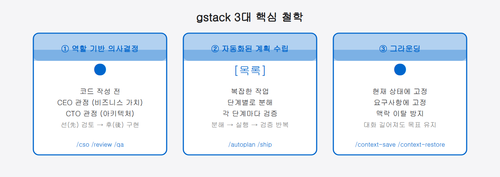
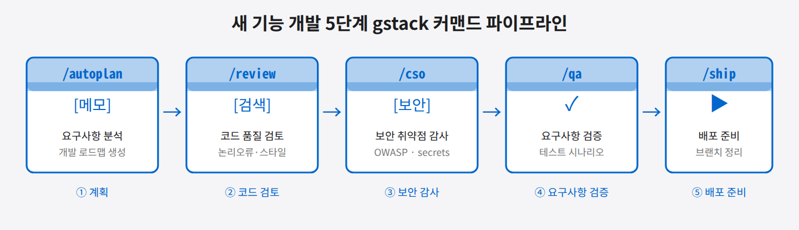

## 06-1. gstack — Claude Code 플러그인 스택 관리

## gstack이란?

**gstack**은 Claude Code를 위한 전문화 워크플로우 스킬 시스템입니다. 단순한 AI 어시스턴트 사용을 넘어, 소프트웨어 개발 사이클 전반을 체계적으로 지원하는 역할 기반 명령어 모음을 제공합니다. `/ship`, `/qa`, `/review`, `/investigate`, `/health` 등 개발 현장에서 바로 쓸 수 있는 슬래시 커맨드를 Claude Code에 추가해줍니다.

> 💡 **슬래시 커맨드란?** Claude 세션 안에서 `/`로 시작해 입력하는 명령입니다. 예를 들어 `/review`라고 치면 "코드 리뷰" 역할의 정해진 작업 흐름이 실행됩니다. 매번 길게 설명하지 않고 한 단어로 전문 작업을 부르는 단축키라고 보면 됩니다.

gstack은 일종의 **조리법 모음집**입니다. Claude라는 요리사가 아무 재료나 자유롭게 요리하게 두는 것이 기본 Claude라면, gstack은 "보안 점검 요리는 이 레시피대로", "배포 준비 요리는 저 레시피대로" 하도록 검증된 절차서를 쥐여줍니다. 개발팀마다 제각각이던 작업 방식이 표준화됩니다.

gstack은 세 가지 철학 위에 서 있습니다.

- **역할 기반 의사결정**: 코드를 작성하기 전에 CEO(비즈니스 가치)나 CTO(아키텍처)의 관점에서 먼저 문제를 검토합니다.
- **자동화된 계획 수립**: 복잡한 작업을 단계별로 쪼개고 각 단계마다 검증을 거칩니다.
- **그라운딩(Grounding)**: 프로젝트의 현재 상태와 요구사항에 에이전트를 강력하게 고정시켜 맥락을 잃지 않게 합니다.



> 💡 **그라운딩이란?** AI가 엉뚱한 방향으로 새지 않도록 "지금 프로젝트의 실제 상태와 요구사항"에 단단히 묶어 두는 것입니다. 덕분에 대화가 길어져도 처음 목표를 잃지 않습니다.

<hr>

## 설치 방법

gstack은 **setup 스크립트**를 통해 설치됩니다. 스크립트가 Claude Code에 스킬을 등록하고 헤드리스 브라우저 바이너리를 빌드합니다. 설치가 완료되면 스킬이 `~/.claude/skills/gstack` 경로에 저장됩니다.

> 💡 **`/gstack`은 설치 커맨드가 아닙니다.** `/gstack`은 헤드리스 브라우저를 구동하는 **browse 스킬**입니다. gstack을 처음 설치할 때 쓰는 명령어가 아니므로 혼동하지 않도록 주의하세요.

업데이트 및 설치 확인:

```bash
# Claude Code 세션 내에서
/gstack-upgrade
```

현재 버전과 최신 버전을 비교하여 업데이트가 필요하면 자동으로 수행합니다. 자동 업데이트를 항상 활성화하려면 다음 명령어를 실행합니다.

```bash
~/.claude/skills/gstack/bin/gstack-config set auto_upgrade true
```

<hr>

## 주요 명령어

| 커맨드 | 역할 | 용도 |
|:---|:---|:---|
| `/cso` | Chief Security Officer | 보안 감사 (secrets, OWASP Top 10, CI/CD 취약점) |
| `/autoplan` | Planner | 요구사항 분석 및 개발 로드맵 자동 생성 |
| `/review` | Peer Reviewer | 코드 논리 오류, 스타일, 잠재 버그 검토 |
| `/qa` | QA Engineer | 구현 기능이 요구사항을 충족하는지 검증 |
| `/ship` | Release Manager | 작업 마무리 및 배포 준비 |
| `/investigate` | Detective | 버그 및 코드베이스 특정 부분 심층 조사 |
| `/learn` | Learner | 새 라이브러리나 스택 도입 전 선행 학습 |
| `/careful` | Senior Dev | 중요한 코드 수정 시 극도로 신중하게 접근 |
| `/context-save` | Checkpoint | 현재 작업 상태 저장 |
| `/context-restore` | Restorer | 저장된 작업 상태 복원 |

### 명령어 심층 이해

각 명령어는 단순한 별명이 아니라 **역할의 전환**입니다. `/cso`를 실행하는 순간 Claude는 "보안 담당 임원"의 관점으로 전환되어, 코드가 동작하는지보다 "이 코드가 안전한지"를 먼저 묻습니다. `/review`는 "동료 시니어 개발자"가 되어 논리 흐름과 잠재 버그를 꼼꼼히 짚습니다. 같은 Claude지만 어떤 역할 슬래시 커맨드를 쓰느냐에 따라 완전히 다른 시각으로 작업을 바라봅니다.

> 💡 **`/careful`은 언제 쓰나요?** 결제 로직, 인증 처리, 데이터베이스 스키마 변경처럼 실수 하나가 심각한 결과를 낳는 코드를 다룰 때 사용합니다. 이 스킬이 활성화되면 Claude는 각 변경사항의 파급 효과를 먼저 분석하고, 변경 전후를 비교하여 의도치 않은 부작용이 없는지 검토합니다.

> 💡 **`/investigate`는 언제 쓰나요?** "왜 이 버그가 생겼지?"처럼 원인 파악이 목적일 때 씁니다. 탐정처럼 코드를 추적하며 가설을 세우고 검증하는 과정을 Claude가 체계적으로 수행합니다.

<hr>

## 따라하기: `/review` → `/cso` → `/qa` 순서 실습

인증 기능을 작성한 뒤 출시 전 점검하는 시나리오입니다. Claude Code 세션에서 아래 순서대로 입력해봅니다.

```
# 1단계: 동료 리뷰
/review
→ "auth.py 파일을 리뷰해줘. 특히 세션 토큰 처리 부분을 집중적으로 봐줘."
→ 논리 오류, 코드 스타일, 잠재 버그 목록이 출력됩니다.

# 2단계: 보안 감사 (리뷰 결과 반영 후)
/cso
→ "인증 모듈 전체를 보안 감사해줘."
→ secrets 노출 여부, OWASP Top 10 항목, 세션 토큰 안전성을 점검합니다.

# 3단계: 기능 검증
/qa
→ "로그인·로그아웃·세션 만료 시나리오가 요구사항을 충족하는지 검증해줘."
→ 각 시나리오별 통과/실패 여부와 미비점을 보고합니다.
```

**동료의 눈, 보안 전문가의 눈, QA의 눈**으로 차례차례 시각을 바꿔가며 코드를 여러 겹으로 들여다보는 흐름입니다. 세 번 모두 통과해야 비로소 `/ship`으로 배포 준비를 시작합니다.

<hr>

## 실전 활용 예시

### 새 기능 개발 흐름

새로운 기능을 개발할 때 gstack 커맨드를 순서대로 활용하면 체계적인 개발이 가능합니다.

```
1단계: /autoplan
   → "사용자 인증 기능을 추가하려 합니다. 개발 계획을 수립해주세요."
   → 세부 태스크 목록과 예상 구현 순서를 자동 생성합니다.

2단계: /review
   → "작성한 auth.py 파일을 리뷰해주세요."
   → 코드 품질, 보안 취약점, 스타일 일관성을 점검합니다.

3단계: (코드 구현 후) /cso
   → "보안 취약점을 점검해주세요."
   → secrets 노출, OWASP Top 10, 의존성 취약점을 감사합니다.

4단계: /qa
   → "인증 기능이 요구사항을 모두 만족하는지 검증해주세요."
   → 테스트 시나리오를 실행하고 결과를 보고합니다.

5단계: /ship
   → "기능 구현이 완료되었습니다. 배포 준비를 해주세요."
   → 브랜치 정리, 변경사항 요약, 배포 체크리스트를 제공합니다.
```



### 컨텍스트 저장 및 복원

긴 세션에서 작업 상태를 저장하고 이어서 작업할 때 유용합니다.

```bash
# 현재 작업 상태 저장
/context-save 인증기능-구현중

# 목록 확인
/context-save list

# 저장된 상태 복원
/context-restore 인증기능-구현중
```

> 💡 **언제 저장해야 하나요?** "오늘은 여기까지"라고 느껴지는 시점, 또는 Claude와의 대화가 길어져 맥락이 복잡해졌을 때 저장합니다. 다음 날 혹은 새 세션에서 `/context-restore`를 실행하면 저장 당시의 작업 배경, 결정 사항, 남은 과제를 그대로 이어받습니다. 긴 프로젝트에서 "어디까지 했더라?"를 방지하는 안전망입니다.

<hr>

## Triple Crown 전략 (권장 워크플로우)

gstack 단독으로도 충분히 쓸 만하지만, GSD(프로젝트 관리)와 Superpowers(품질 관리)를 함께 쓰면 계획·구현·검증이 끊김 없이 이어집니다.

```
gstack (전략·검증)  →  GSD (구조·실행)  →  Superpowers (품질·방법론)
 "무엇을 왜"          "어떤 순서로"         "어떻게 잘"
```

이 세 도구를 파이프라인으로 연결하는 것이 Triple Crown 전략입니다. 구체적인 5단계 사이클, 팀 환경 배분 방법, 실전 예시는 [7-4. Triple Crown 전략](07-4-triple-crown.md)에서 자세히 다룹니다.

<hr>

## 버전 이력

| 버전 | 주요 변경사항 |
|:---|:---|
| 1.58.0.0 | 최신 업데이트 |
| 1.51.0.0 | 안정 릴리스 |
| 1.27.0.0 | artifacts 동기화 시스템 도입 |
| 1.0.0.0 | V1 프롬프트 스타일 개선, `/plan-tune` 추가 |

> **현재 최신 버전**: 1.58.0.0 (2026-06 기준) — `/gstack-upgrade`로 업그레이드 가능
