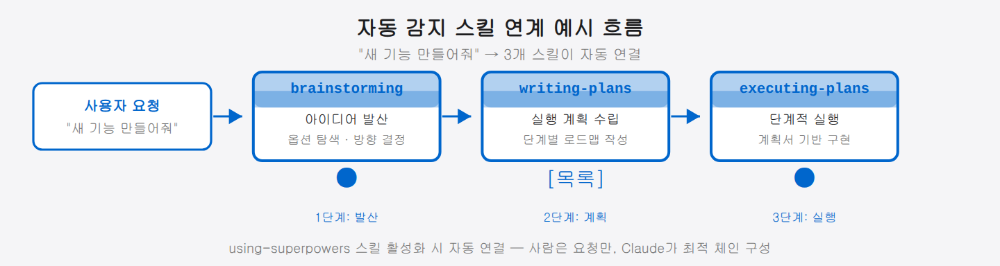

## 06-2. superpowers — 스킬 기반 워크플로우 자동화

## superpowers란?

**superpowers**는 Claude Code에 전문화된 워크플로우 스킬을 주입하는 플러그인 시스템입니다. Claude는 기본 상태에서도 다양한 작업을 수행할 수 있지만, superpowers를 설치하면 테스트 주도 개발, 체계적인 디버깅, 코드 리뷰, 브레인스토밍 등 검증된 개발 방법론을 **그대로 따르도록** Claude를 훈련시킬 수 있습니다.

핵심 개념은 간단합니다. 각 스킬은 특정 상황에서 Claude가 취해야 할 **정확한 행동 지침**을 담고 있으며, Claude는 해당 상황이 되면 스킬을 불러와 그 지침을 따릅니다. "알아서 잘 해줘"에 맡기는 대신 "이 방법론대로 정확히 해줘"라고 못 박아 두는 것, 이것이 superpowers의 작동 원리입니다.

> 💡 **일반 지시와 무엇이 다를까요?** 그냥 부탁하면 Claude가 매번 조금씩 다르게 할 수 있습니다. 스킬은 "검증된 절차서"를 그대로 따르게 하므로, 누가 언제 시켜도 같은 품질의 결과가 나옵니다. 사람으로 치면 "경험에 맡기기" 대신 "표준 작업 절차(SOP)를 지키기"에 가깝습니다.

superpowers 스킬은 **항공기 조종사의 체크리스트**에 가깝습니다. 베테랑 조종사도 이륙 전에는 반드시 체크리스트를 읽습니다. 경험이 쌓여도 절차를 건너뛰지 않는 것, 그것이 안전의 핵심입니다. 이 일을 superpowers 스킬이 대신해줍니다. Claude가 아무리 유능해도 "이 스킬의 절차만큼은 반드시 지킨다"는 보장이 생기는 셈입니다.

<hr>

## 설치 방법

superpowers는 Claude Code 플러그인 마켓플레이스를 통해 설치됩니다. GitHub 소스: `obra/superpowers-marketplace`

Claude Code 세션에서 플러그인 마켓플레이스를 통해 설치합니다. 설치 후 스킬이 `~/.claude/plugins/marketplaces/superpowers-marketplace/superpowers/` 경로에 저장되며, 모든 Claude Code 세션에서 자동으로 사용 가능합니다.

> **현재 최신 버전**: 5.0.7 (2026-04-16 기준)

<hr>

## 스킬 목록 확인

Claude Code 세션에서 현재 사용 가능한 스킬 목록은 시스템이 자동으로 세션 시작 시 알려줍니다. 주요 superpowers 스킬은 다음과 같습니다.

| 스킬 이름 | 용도 |
|:---|:---|
| `superpowers:test-driven-development` | TDD 사이클(Red-Green-Refactor) 강제 적용 |
| `superpowers:systematic-debugging` | 과학적 방법론으로 버그 추적 |
| `superpowers:brainstorming` | 구조화된 아이디어 발산 세션 |
| `superpowers:writing-plans` | 실행 가능한 개발 계획서 작성 |
| `superpowers:executing-plans` | 계획서 기반 단계적 실행 |
| `superpowers:dispatching-parallel-agents` | 병렬 에이전트 작업 분배 |
| `superpowers:code-reviewer` | 심층 코드 리뷰 수행 |
| `superpowers:verification-before-completion` | 완료 전 검증 체크리스트 |
| `superpowers:finishing-a-development-branch` | 개발 브랜치 마무리 절차 |
| `superpowers:using-git-worktrees` | Git Worktree 기반 병렬 작업 |

<hr>

## 스킬 호출 방법

스킬을 호출하는 방법은 두 가지입니다.

### 방법 1: 직접 지시

작업을 요청할 때 스킬 이름을 명시합니다.

```
"superpowers:test-driven-development 스킬을 사용해서
 사용자 로그인 기능을 구현해줘."
```

### 방법 2: 자동 감지 (권장)

superpowers의 `using-superpowers` 스킬이 활성화되어 있으면, Claude는 작업 내용을 보고 **자동으로 적합한 스킬을 선택**합니다. 예를 들어 버그 수정을 요청하면 `systematic-debugging` 스킬이 따라붙고, 새 기능 개발을 부탁하면 `brainstorming` → `writing-plans` → `executing-plans` 순서로 스킬이 차례로 연계됩니다.

두 방법은 쓰임이 다릅니다. **직접 이름을 대는 방법 1**은 정확히 원하는 스킬을 콕 집을 때 좋고, **자동 감지인 방법 2**는 작업만 말하면 Claude가 알맞은 스킬을 알아서 골라(때로는 여러 개를 순서대로 엮어) 줍니다. 평소엔 방법 2가 편하고, 특정 스킬을 꼭 써야 할 때만 방법 1로 지정하면 됩니다.



<hr>

## 핵심 스킬 심층 소개

### test-driven-development

TDD(테스트 주도 개발)를 강제 적용하는 스킬입니다. 이 스킬을 사용하면 Claude는 반드시 다음 순서를 지킵니다.

```
1. 실패하는 테스트 먼저 작성 (Red)
2. 테스트를 통과하는 최소한의 코드 작성 (Green)
3. 리팩토링 (Refactor)
```

단순히 "테스트도 써줘"라고 부탁하는 것과 달리, 이 스킬은 **구현 전 테스트 작성**을 보장합니다. 스킬 없이 "테스트도 포함해서 구현해줘"라고 하면 Claude는 구현 코드를 먼저 짜고 테스트를 나중에 붙이는 경향이 있습니다. TDD 스킬은 그 순서를 뒤집습니다 — 테스트가 없으면 구현 코드를 한 줄도 쓰지 않습니다.

> 💡 **Red-Green-Refactor란?** Red는 실패하는 테스트(빨간 표시), Green은 그 테스트를 통과시키는 최소 코드(초록 표시), Refactor는 동작을 유지하며 코드를 깔끔하게 정리하는 단계입니다. 이 세 단계를 짧게 반복하면 기능이 검증된 채로 조금씩 쌓입니다.

### systematic-debugging

버그를 감(感)으로 고치는 것이 아니라 과학적 방법으로 추적하는 스킬입니다.

```
1단계: 현상 관찰 — 버그를 재현 가능하게 문서화
2단계: 가설 수립 — 가능한 원인 목록 작성
3단계: 가설 검증 — 하나씩 배제하며 원인 특정
4단계: 수정 및 검증 — 수정 후 회귀 테스트
```

"일단 이 부분이 수상하니까 고쳐볼게요"가 아니라 "원인 후보를 나열하고 실험으로 하나씩 지워가는" 방식입니다. 처음엔 느린 것 같아도 결국 근본 원인을 정확히 잡기 때문에 같은 버그가 다시 나오지 않습니다.

> 💡 **언제 특히 유용한가요?** 재현이 불규칙한 버그("가끔 발생함"), 여러 모듈이 엮인 복합 버그, "고쳤더니 다른 데가 터지는" 상황에서 체계적 디버깅 스킬이 빛납니다.

### brainstorming

새로운 기능이나 접근 방식을 탐색할 때 사용합니다. Claude가 즉시 구현에 달려들지 않고, 먼저 다양한 옵션을 발산하고 트레이드오프를 분석한 뒤 방향을 결정합니다.

brainstorming 스킬이 실행되면 Claude는 최소 3가지 접근 방법을 제시하고, 각각의 장단점을 비교한 뒤 최적안을 추천합니다. "그냥 만들어줘"보다 더 나은 설계를 시작점으로 삼을 수 있습니다.

### writing-plans / executing-plans

이 두 스킬은 쌍으로 작동합니다. `writing-plans`는 실행 가능한 단계별 계획서를 작성하고, `executing-plans`는 그 계획서의 각 단계를 체크리스트처럼 이행하며 진행 상황을 추적합니다.

> 💡 **두 스킬을 나눈 이유는?** 계획과 실행을 분리하면 "계획이 맞는지 먼저 확인하고 시작"할 수 있습니다. 계획서를 사람이 검토한 뒤 실행을 허가하는 안전장치 역할도 합니다.

### code-reviewer / verification-before-completion

`code-reviewer`는 PR 병합 전에 심층 검토를 수행합니다. `verification-before-completion`은 "완료"라고 보고하기 전에 실제로 모든 요구사항이 충족됐는지 체크리스트로 확인합니다. 이 스킬 없이는 Claude가 "완료했습니다"라고 답해도 엣지 케이스가 빠져 있을 수 있습니다.

<hr>

## 따라하기: TDD로 간단한 함수 구현

`calculate_discount(price, rate)` 함수를 TDD 방식으로 구현하는 예시입니다.

```
# 스킬 직접 지정
"superpowers:test-driven-development 스킬을 사용해서
 가격(price)과 할인율(rate)을 받아 할인된 금액을 반환하는
 calculate_discount 함수를 구현해줘."

# Claude의 응답 흐름:
# ① 먼저 실패 테스트 작성
#    test_calculate_discount_zero_rate
#    test_calculate_discount_fifty_percent
#    test_calculate_discount_invalid_rate (음수, 100 초과)
#
# ② 테스트 실행 → 모두 실패(Red) 확인
#
# ③ 최소 구현 코드 작성
#    def calculate_discount(price, rate): ...
#
# ④ 테스트 재실행 → 모두 통과(Green) 확인
#
# ⑤ 리팩토링 — 가독성·엣지 케이스 처리 개선
#    테스트 재실행 → 여전히 Green 확인
```

이 과정에서 중요한 점은 Claude가 ③단계로 건너뛰지 않는다는 것입니다. ①②가 완료되기 전에는 구현 코드를 작성하지 않습니다.

<hr>

## 커스텀 스킬 작성

superpowers 스킬은 마크다운 파일로 작성됩니다. 자신만의 스킬을 만들 수 있습니다.

```markdown
---
name: my-deploy-checklist
description: 배포 전 체크리스트를 실행합니다
---

# 배포 전 체크리스트

다음 항목을 순서대로 확인하세요:

1. [ ] 테스트 전체 통과 확인
2. [ ] 환경 변수 설정 확인 (staging vs production)
3. [ ] 데이터베이스 마이그레이션 준비 여부
4. [ ] 롤백 계획 수립
5. [ ] 팀원 배포 승인 획득
```

이 파일을 `~/.claude/skills/` 디렉토리에 저장하면 바로 사용 가능합니다.

커스텀 스킬의 핵심은 **`description` 필드**입니다. Claude는 이 설명을 읽고 어떤 상황에 이 스킬을 자동 선택할지 판단합니다. "배포 전 체크리스트를 실행합니다"라고 써두면, 사용자가 "배포할게요"라고 말하는 순간 이 스킬이 자동 감지됩니다.

> 💡 **팀 스킬 공유**: 커스텀 스킬 파일을 팀 저장소에 올리고, 각자 `~/.claude/skills/`에 설치하면 팀 전체가 동일한 워크플로우를 따를 수 있습니다.

<hr>

## 스킬 우선순위 규칙

여러 스킬이 동시에 적용될 수 있는 상황에서는 다음 순서를 따릅니다.

```
1순위: 프로세스 스킬 (brainstorming, systematic-debugging)
       → 작업 방식 자체를 결정

2순위: 구현 스킬 (test-driven-development, code-reviewer)
       → 실제 실행 방법을 안내
```

즉 "어떻게 접근할지"를 정하는 **프로세스 스킬이 먼저**, "실제로 어떻게 짤지"를 안내하는 **구현 스킬이 그다음**입니다. 예컨대 "새 기능 만들어줘"라면 먼저 brainstorming으로 방향을 잡고, 그 뒤에 test-driven-development로 구현에 들어가는 식입니다. 큰 그림(프로세스)을 먼저 세우고 세부(구현)로 내려가는 순서라고 보면 됩니다.

"기능을 만들어줘" → brainstorming 먼저 → 방향 결정 후 TDD로 구현

"버그를 고쳐줘" → systematic-debugging 먼저 → 원인 파악 후 수정

이 규칙을 이해하면 "Claude가 왜 바로 코드를 짜지 않고 먼저 질문하는가"라는 의문도 자연히 풀립니다. superpowers는 이런 순서로 작동합니다.

<hr>

## 팀 환경에서의 활용

멀티에이전트 팀 환경에서는 각 팀원에게 역할에 맞는 스킬을 부여할 수 있습니다.

```bash
# 서연(개발자) CLAUDE.md에 설정
superpowers:test-driven-development
superpowers:systematic-debugging

# 태양(리뷰어) CLAUDE.md에 설정
superpowers:code-reviewer
superpowers:verification-before-completion

# 민준(PM) CLAUDE.md에 설정
superpowers:brainstorming
superpowers:writing-plans
```

각 팀원이 자신의 역할에 특화된 스킬을 사용하면, 팀 전체의 작업 품질이 일관되게 유지됩니다.

> 💡 **스킬을 역할별로 분리하는 이유**: 서연이 brainstorming 스킬을 가지면 "일단 여러 방법을 검토하자"는 단계가 개발 흐름에 끼어들어 속도가 느려집니다. 반대로 민준이 test-driven-development를 가지면 PM이 테스트를 먼저 작성하는 불필요한 일이 생깁니다. 역할에 꼭 맞는 스킬만 주는 것이 팀 전체 흐름을 매끄럽게 합니다.
