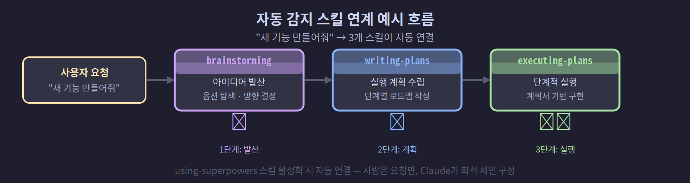

## 6-2. superpowers — 스킬 기반 워크플로우 자동화

## superpowers란?

**superpowers**는 Claude Code에 전문화된 워크플로우 스킬을 주입하는 플러그인 시스템입니다. Claude는 기본 상태에서도 다양한 작업을 수행할 수 있지만, superpowers를 설치하면 테스트 주도 개발, 체계적인 디버깅, 코드 리뷰, 브레인스토밍 등 검증된 개발 방법론을 **그대로 따르도록** Claude를 훈련시킬 수 있습니다.

핵심 개념은 간단합니다. 각 스킬은 특정 상황에서 Claude가 취해야 할 **정확한 행동 지침**을 담고 있으며, Claude는 해당 상황이 되면 스킬을 불러와 그 지침을 따릅니다. "알아서 잘 해줘"가 아니라 "이 방법론대로 정확히 해줘"가 superpowers의 동작 방식입니다.

> 💡 **일반 지시와 무엇이 다를까요?** 그냥 부탁하면 Claude가 매번 조금씩 다르게 할 수 있습니다. 스킬은 "검증된 절차서"를 그대로 따르게 하므로, 누가 언제 시켜도 같은 품질의 결과가 나옵니다. 사람으로 치면 "경험에 맡기기" 대신 "표준 작업 절차(SOP)를 지키기"에 가깝습니다.

<hr>

## 설치 방법

superpowers는 Claude Code 플러그인 마켓플레이스를 통해 설치됩니다. GitHub 소스: `obra/superpowers-marketplace`

Claude Code 세션에서 플러그인 마켓플레이스를 통해 설치합니다. 설치 후 스킬이 `~/.claude/plugins/cache/superpowers-marketplace/superpowers/` 경로에 저장되며, 모든 Claude Code 세션에서 자동으로 사용 가능합니다.

> **현재 최신 버전**: 5.0.7 (2026-04-16 기준)

<hr>

## 스킬 목록 확인

Claude Code 세션에서 현재 사용 가능한 스킬 목록은 시스템이 자동으로 세션 시작 시 알려줍니다. 주요 superpowers 스킬은 다음과 같습니다.

| 스킬 이름 | 용도 |
|:---|:---|
| `superpowers:test-driven-development` | TDD 사이클(Red-Green-Refactor) 강제 적용 |
| `superpowers:systematic-debugging` | 과학적 방법론으로 버그 추적 |
| `superpowers:brainstorming` | 구조화된 아이디어 발산 세션 |
| `superpowers:writing-plans` | 실행 가능한 개발 계획서 작성 |
| `superpowers:executing-plans` | 계획서 기반 단계적 실행 |
| `superpowers:dispatching-parallel-agents` | 병렬 에이전트 작업 분배 |
| `superpowers:code-reviewer` | 심층 코드 리뷰 수행 |
| `superpowers:verification-before-completion` | 완료 전 검증 체크리스트 |
| `superpowers:finishing-a-development-branch` | 개발 브랜치 마무리 절차 |
| `superpowers:using-git-worktrees` | Git Worktree 기반 병렬 작업 |

<hr>

## 스킬 호출 방법

스킬을 호출하는 방법은 두 가지입니다.

### 방법 1: 직접 지시

작업을 요청할 때 스킬 이름을 명시합니다.

```
"superpowers:test-driven-development 스킬을 사용해서
 사용자 로그인 기능을 구현해줘."
```

### 방법 2: 자동 감지 (권장)

superpowers의 `using-superpowers` 스킬이 활성화되어 있으면, Claude는 작업 내용을 보고 **자동으로 적합한 스킬을 선택**합니다. 예를 들어 "버그를 고쳐줘"라고 하면 `systematic-debugging` 스킬이, "새 기능을 만들어줘"라고 하면 `brainstorming` → `writing-plans` → `executing-plans` 순서로 스킬이 연계됩니다.

정리하면 호출법은 둘입니다 — **직접 이름을 대는 방법 1**은 정확히 원하는 스킬을 콕 집을 때 좋고, **자동 감지인 방법 2**는 작업만 말하면 Claude가 알맞은 스킬을 알아서 골라(때로는 여러 개를 순서대로 엮어) 줍니다. 평소엔 방법 2가 편하고, 특정 스킬을 꼭 써야 할 때만 방법 1로 지정하면 됩니다.



<hr>

## 핵심 스킬 심층 소개

### test-driven-development

TDD(테스트 주도 개발)를 강제 적용하는 스킬입니다. 이 스킬을 사용하면 Claude는 반드시 다음 순서를 지킵니다.

```
1. 실패하는 테스트 먼저 작성 (Red)
2. 테스트를 통과하는 최소한의 코드 작성 (Green)
3. 리팩토링 (Refactor)
```

단순히 "테스트도 써줘"라고 부탁하는 것과 달리, 이 스킬은 **구현 전 테스트 작성**을 보장합니다.

### systematic-debugging

버그를 감(感)으로 고치는 것이 아니라 과학적 방법으로 추적하는 스킬입니다.

```
1단계: 현상 관찰 — 버그를 재현 가능하게 문서화
2단계: 가설 수립 — 가능한 원인 목록 작성
3단계: 가설 검증 — 하나씩 배제하며 원인 특정
4단계: 수정 및 검증 — 수정 후 회귀 테스트
```

### brainstorming

새로운 기능이나 접근 방식을 탐색할 때 사용합니다. Claude가 즉시 구현에 달려들지 않고, 먼저 다양한 옵션을 발산하고 트레이드오프를 분석한 뒤 방향을 결정합니다.

<hr>

## 커스텀 스킬 작성

superpowers 스킬은 마크다운 파일로 작성됩니다. 자신만의 스킬을 만들 수 있습니다.

```markdown
---
name: my-deploy-checklist
description: 배포 전 체크리스트를 실행합니다
---

# 배포 전 체크리스트

다음 항목을 순서대로 확인하세요:

1. [ ] 테스트 전체 통과 확인
2. [ ] 환경 변수 설정 확인 (staging vs production)
3. [ ] 데이터베이스 마이그레이션 준비 여부
4. [ ] 롤백 계획 수립
5. [ ] 팀원 배포 승인 획득
```

이 파일을 `~/.claude/skills/` 디렉토리에 저장하면 바로 사용 가능합니다.

<hr>

## 스킬 우선순위 규칙

여러 스킬이 동시에 적용될 수 있는 상황에서는 다음 순서를 따릅니다.

```
1순위: 프로세스 스킬 (brainstorming, systematic-debugging)
       → 작업 방식 자체를 결정

2순위: 구현 스킬 (test-driven-development, code-reviewer)
       → 실제 실행 방법을 안내
```

즉 "어떻게 접근할지"를 정하는 **프로세스 스킬이 먼저**, "실제로 어떻게 짤지"를 안내하는 **구현 스킬이 그다음**입니다. 예컨대 "새 기능 만들어줘"라면 먼저 brainstorming으로 방향을 잡고, 그 뒤에 test-driven-development로 구현에 들어가는 식입니다. 큰 그림(프로세스)을 먼저 세우고 세부(구현)로 내려가는 순서라고 보면 됩니다.

"기능을 만들어줘" → brainstorming 먼저 → 방향 결정 후 TDD로 구현

"버그를 고쳐줘" → systematic-debugging 먼저 → 원인 파악 후 수정

이 규칙을 이해하면 "Claude가 왜 바로 코드를 짜지 않고 먼저 질문하는가"에 대한 답을 얻을 수 있습니다. 그것이 바로 superpowers가 동작하는 방식입니다.

<hr>

## 팀 환경에서의 활용

멀티에이전트 팀 환경에서는 각 팀원에게 역할에 맞는 스킬을 부여할 수 있습니다.

```bash
# 서연(개발자) CLAUDE.md에 설정
superpowers:test-driven-development
superpowers:systematic-debugging

# 태양(리뷰어) CLAUDE.md에 설정
superpowers:code-reviewer
superpowers:verification-before-completion

# 민준(PM) CLAUDE.md에 설정
superpowers:brainstorming
superpowers:writing-plans
```

각 팀원이 자신의 역할에 특화된 스킬을 사용하면, 팀 전체의 작업 품질이 일관되게 유지됩니다.
