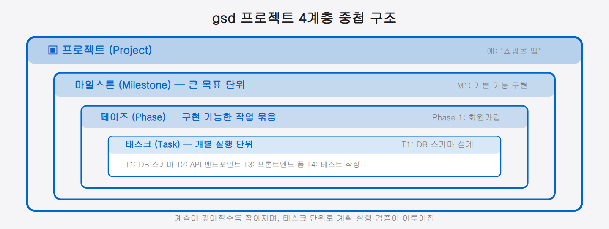
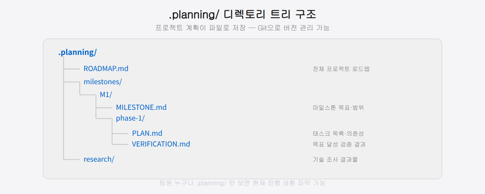

## 06-3. gsd — Get Shit Done 프로젝트 관리

## gsd란?

**gsd(Get Shit Done)**는 Claude Code를 위한 구조화된 프로젝트 관리 플러그인입니다. 단순히 "이걸 만들어줘"라고 요청하는 방식에서 벗어나, 프로젝트를 **마일스톤 → 페이즈 → 태스크**로 분해하고 각 단계를 체계적으로 계획, 실행, 검증하는 워크플로우를 제공합니다.

gsd가 해결하는 핵심 문제는 **컨텍스트 소실**입니다. 복잡한 프로젝트를 단일 대화로 진행하면 Claude는 앞서 논의한 내용을 잃어버리거나 일관성 없는 결정을 내릴 수 있습니다. gsd는 프로젝트 상태를 파일로 저장하여 대화가 바뀌어도 작업을 이어갈 수 있게 합니다.

> 💡 **컨텍스트 소실이란?** AI가 대화 도중 앞 내용을 잊는 현상입니다. 대화가 길어지거나 새 세션을 시작하면 기억이 끊기는데, gsd는 계획·진행 상황을 파일(`.planning/`)에 적어 두어 "기억을 외부에 저장"함으로써 이 문제를 막습니다.

비유하자면 gsd는 **프로젝트 바인더**와 같습니다. 의뢰인이 바뀌어도, 담당자가 휴가를 다녀와도, 바인더만 펼치면 "어디까지 했고 다음은 무엇인지"를 즉시 파악할 수 있습니다. gsd의 `.planning/` 폴더가 그 바인더 역할을 합니다.

> **중요**: gsd는 superpowers와 **별개 플러그인**입니다. superpowers가 설치되어 있더라도 gsd는 따로 설치해야 합니다.

<hr>

## v1 vs v2 — 어떤 버전을 선택할까

gsd는 두 가지 버전이 존재합니다.

| 구분         | v1 (get-shit-done)                 | v2 (gsd-2)                 |
| :--------- | :--------------------------------- | :------------------------- |
| **GitHub** | github.com/gsd:build/get-shit-done | github.com/gsd:build/gsd:2 |
| **스타**     | 61k★                               | 7.4k★                      |
| **인터페이스**  | Claude Code 슬래시 명령어 (`/gsd:*`)     | 장시간 자율 실행 에이전트             |
| **진입 장벽**  | 낮음 — 명령어 하나로 즉시 사용                 | 높음 — 에이전트 자율 실행 환경 필요      |
| **커뮤니티**   | 대규모 검증 완료                          | 소규모, 실험적                   |
| **권장 상황**  | 일반적인 프로젝트 관리 (대부분의 경우)             | 사람 개입 없이 장시간 자율 실행이 필요한 경우 |

**결론: 특별한 이유가 없다면 v1을 사용하세요.** 61k★의 커뮤니티 검증, Claude Code 슬래시 명령어로 바로 사용 가능, 낮은 진입장벽이 v1의 강점입니다.

<hr>

## 설치 방법 (v1 기준)

gsd는 gstack 플러그인 시스템을 통해 설치합니다.

### gstack을 통한 설치 (권장)

```bash
# Claude Code 세션에서
/gsd:help
```

처음 실행 시 gsd가 설치되어 있지 않으면 설치 안내가 표시됩니다.

### 설치 구조 이해

gsd는 단일 폴더 하나가 아니라 **개별 스킬 디렉터리 모음**으로 설치됩니다. 설치가 완료되면 `~/.claude/skills/` 디렉터리 아래에 각 gsd 명령어에 해당하는 폴더가 생성됩니다.

```
~/.claude/skills/
  ├── gsd-new-project/
  │   └── SKILL.md
  ├── gsd-plan-phase/
  │   └── SKILL.md
  ├── gsd-execute-phase/
  │   └── SKILL.md
  ├── gsd-validate-phase/
  │   └── SKILL.md
  └── ... (gsd-* 스킬 디렉터리 다수)
```

> 💡 **왜 개별 폴더로 나뉘어 있나요?** Claude Code의 스킬 시스템은 `/gsd:plan-phase` 같은 슬래시 커맨드를 입력할 때 해당 이름의 폴더를 `~/.claude/skills/`에서 찾아 그 안의 `SKILL.md`를 읽습니다. 각 명령어가 독립된 폴더를 가져야 Claude가 정확히 어떤 스킬인지 구분할 수 있습니다.

### 설치 확인

```bash
# 현재 gsd 버전 확인
/gsd:settings
```

설치 후 사용 가능한 모든 gsd 명령어 목록이 출력되면 정상적으로 설치된 것입니다.

<hr>

## 프로젝트 구조

gsd는 다음 계층으로 프로젝트를 관리합니다.

```
프로젝트 (Project)
  └── 마일스톤 (Milestone)  ← 큰 목표 단위
        └── 페이즈 (Phase)  ← 구현 가능한 작업 묶음
              └── 태스크 (Task)  ← 개별 실행 단위
```



예를 들어 "쇼핑몰 앱"이라는 프로젝트가 있다면:
- 마일스톤 1: 기본 기능 구현 (회원가입, 상품 목록, 장바구니)
- 마일스톤 2: 결제 시스템 연동
- 마일스톤 3: 관리자 대시보드

각 마일스톤은 여러 페이즈로 나뉘며, 페이즈 단위로 계획과 실행이 이루어집니다.

> 💡 **계층 구분의 실익**: "결제 시스템 연동"이라는 마일스톤 하나만 보면 거대해 보입니다. 이것을 "Phase 1: PG사 API 연동 → Phase 2: 주문 처리 로직 → Phase 3: 환불 처리"로 나누면 각 페이즈가 1~3일 안에 완료 가능한 크기가 됩니다. 크고 막막한 목표를 실행 가능한 단위로 쪼개는 것이 gsd 계층의 핵심입니다.

<hr>

## 새 프로젝트 시작

### 1단계: 프로젝트 생성

```bash
/gsd:new-project
```

프로젝트 이름, 목표, 기술 스택 등을 입력하면 초기 구조가 생성됩니다. 프로젝트 정보는 `.planning/` 디렉토리에 저장됩니다.

### 2단계: 마일스톤 생성

```bash
/gsd:new-milestone
```

프로젝트의 주요 목표를 마일스톤으로 정의합니다. Claude가 질문을 통해 마일스톤의 범위와 성공 기준을 함께 도출합니다.

### 3단계: 진행 상황 확인

```bash
/gsd:progress
```

현재 마일스톤의 완료율, 각 페이즈의 상태, 다음 해야 할 일을 한눈에 볼 수 있습니다.

<hr>

## 페이즈 관리

### 페이즈 계획 수립

```bash
/gsd:plan-phase
```

현재 페이즈의 상세 구현 계획을 작성합니다. Claude가 코드베이스를 분석하고 필요한 변경사항을 태스크 목록으로 만들어냅니다.

계획서는 `.planning/milestones/M1/phase-1/PLAN.md`에 저장됩니다. 이 파일을 직접 열어 검토하거나 수정할 수 있으며, 수정 후 실행을 시작하면 됩니다.

> 💡 **계획 검토의 중요성**: `/gsd:plan-phase`가 만든 계획서를 실행 전에 읽어보는 습관이 중요합니다. Claude가 코드베이스를 잘못 이해했거나 요구사항을 다르게 해석한 경우, 이 단계에서 잡을 수 있습니다. 실행 중에 발견하면 이미 작성된 코드를 되돌려야 합니다.

### 페이즈 실행

```bash
/gsd:execute-phase
```

계획서에 따라 실제 구현을 시작합니다. 각 태스크를 순서대로 실행하며 진행 상황을 업데이트합니다.

### 페이즈 검증

```bash
/gsd:validate-phase
/gsd:verify-work
```

페이즈가 완료된 후 목표 달성 여부를 검증합니다. 단순히 태스크 완료 여부가 아니라, **실제로 기능이 의도대로 동작하는지**를 목표 역방향으로 분석합니다.

> 💡 **목표 역방향 분석이란?** "태스크 5개 완료"가 아니라 "이 페이즈의 원래 목적—예: '사용자가 로그인할 수 있다'—이 실제로 달성됐는가"를 출발점으로 삼아 역으로 검증합니다. 태스크를 모두 처리했어도 목표를 놓칠 수 있기 때문입니다.

<hr>

지금까지의 흐름을 하나의 사이클로 묶으면 이렇습니다 — **계획(plan) → 실행(execute) → 검증(verify)**, 그리고 검증을 통과하면 다음 페이즈로 넘어가 같은 고리를 반복합니다. 핵심은 각 페이즈가 "끝났다"가 아니라 "목표를 달성했다"로 닫힌다는 점입니다. 그래서 한 바퀴를 돌 때마다 검증된 결과물이 쌓여, 큰 프로젝트도 검증된 작은 단위들의 연속으로 안전하게 전진합니다.

## 실전 워크플로우 예시

### 일반적인 개발 사이클

```
아침: 어제 어디까지 했나?
  /gsd:progress
  → "Phase 2 진행 중, Task 3/7 완료"

작업 시작:
  /gsd:resume-work
  → 마지막 작업 맥락 복원 및 다음 태스크 안내

구현 완료 후:
  /gsd:validate-phase
  → 완료 기준 체크 및 결과 보고

다음 단계로:
  /gsd:execute-phase
```

### 막혔을 때

```bash
/gsd:discuss-phase
```

현재 페이즈의 접근 방식에 대해 Claude와 논의합니다. 대안적 구현 방법, 트레이드오프 분석, 위험 요소 점검 등을 수행합니다.

<hr>

## 따라하기: 헬스체크 API 개발 전 과정

"서버 상태를 반환하는 `/health` 엔드포인트를 만들어줘"라는 지시가 왔을 때의 전체 gsd 흐름입니다.

```
# 1단계: 진행 상황 확인
/gsd:progress
→ 현재 마일스톤과 어느 페이즈인지 확인

# 2단계: 페이즈 계획 수립
/gsd:plan-phase
→ "헬스체크 API 페이즈를 계획해줘.
   GET /health, 응답 형태는 JSON {status, uptime, version}."
→ .planning/milestones/M1/phase-3/PLAN.md 생성됨

# (계획서 직접 검토 후 실행 승인)

# 3단계: 실행
/gsd:execute-phase
→ routes/health.js 작성, 테스트 추가, 서버 연결

# 4단계: 검증
/gsd:verify-work
→ "GET /health 호출 시 {status: 'ok', uptime: ..., version: ...} 반환하는지 확인"
→ 목표 달성 여부를 역방향으로 분석하여 보고
```

이 흐름의 핵심은 "만들어줘" 한 마디가 아니라 **계획 → 검토 → 실행 → 검증** 4단계를 명시적으로 밟는다는 점입니다. 계획서를 사람이 눈으로 확인한 뒤 실행하므로 방향이 어긋날 위험이 줄어듭니다.

<hr>

## 주요 커맨드 전체 목록

| 커맨드 | 설명 |
|:---|:---|
| `/gsd:new-project` | 새 프로젝트 생성 |
| `/gsd:new-milestone` | 새 마일스톤 추가 |
| `/gsd:plan-phase` | 현재 페이즈 상세 계획 수립 |
| `/gsd:execute-phase` | 현재 페이즈 실행 |
| `/gsd:validate-phase` | 현재 페이즈 검증 |
| `/gsd:verify-work` | 현재 작업의 목표 달성 여부 검증 |
| `/gsd:progress` | 전체 진행 상황 요약 |
| `/gsd:resume-work` | 마지막 작업 맥락 복원 |
| `/gsd:discuss-phase` | 페이즈 접근 방식 토론 |
| `/gsd:review-backlog` | 백로그 검토 |
| `/gsd:milestone-summary` | 마일스톤 요약 보고 |
| `/gsd:complete-milestone` | 마일스톤 완료 처리 |
| `/gsd:audit-milestone` | 마일스톤 품질 감사 |
| `/gsd:health` | 프로젝트 건강 상태 진단 |
| `/gsd:help` | 전체 커맨드 도움말 |

<hr>

## gstack + gsd + superpowers 함께 사용하기

세 도구는 각자의 역할이 명확히 구분됩니다.

```
gstack      → "무엇을 왜 만드나" (전략·검증·보안)
  /qa, /ship, /review, /cso(보안감사)

gsd         → "어떤 순서로 만드나" (구조·실행)
  /gsd:plan-phase, /gsd:execute-phase, /gsd:validate-phase

superpowers → "어떻게 잘 만드나" (방법론·품질)
  TDD, 체계적 디버깅, 코드 리뷰 프로토콜
```

실전 파이프라인:

```
보안 감사:   /cso  (gstack)
계획 수립:   /gsd:plan-phase  (gsd)
구현:        /gsd:execute-phase + superpowers:test-driven-development
검증:        /gsd:verify-work + /qa  (gstack)
완료:        /gsd:complete-milestone + /ship  (gstack)
```

단순한 AI 대화를 넘어, 실제 소프트웨어 팀이 사용하는 수준의 프로젝트 관리가 Claude Code 안에서 가능해집니다.

<hr>

## 파일 시스템 구조

gsd는 프로젝트 루트의 `.planning/` 디렉토리에 모든 상태를 저장합니다.

```
.planning/
  ├── ROADMAP.md          # 전체 로드맵
  ├── milestones/
  │   ├── M1/
  │   │   ├── MILESTONE.md    # 마일스톤 정의
  │   │   ├── phase-1/
  │   │   │   ├── PLAN.md     # 페이즈 계획서
  │   │   │   └── VERIFICATION.md  # 검증 결과
  │   │   └── phase-2/
  │   └── M2/
  └── research/           # 기술 조사 결과
```

이 구조 덕분에 Git으로 프로젝트 계획 자체도 버전 관리할 수 있습니다.



> 💡 계획과 진행 상황이 코드와 같은 저장소에 파일로 남으므로, 팀원 누구나 `.planning/`만 보면 "지금 어디까지 됐는지"를 알 수 있고 Git 이력으로 계획 변경도 추적됩니다.
