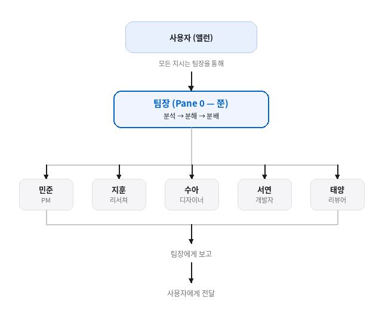

## 7-1. 팀 지시 흐름 설계

## 지시 흐름의 원칙

팀 에이전트를 효과적으로 운용하기 위해서는 **지시가 어떻게 흘러가는지**를 명확히 설계해야 한다. 명확한 흐름이 없으면 팀원 간 작업이 중복되거나, 지시가 누락되거나, 결과가 사용자에게 돌아오지 않는 문제가 발생한다.

이 책에서 채택한 지시 흐름은 **단일 진입점 패턴**이다.



### 왜 단일 진입점인가

사용자가 팀원에게 직접 지시를 내리는 **직접 지시 패턴**도 가능하지만, 다음과 같은 이유로 단일 진입점을 권장한다.

1. **컨텍스트 관리** — 팀장이 전체 작업 상황을 파악하고 있어 중복 방지
2. **우선순위 조정** — 여러 작업이 동시에 들어올 때 순서 조정 가능
3. **진행 상황 추적** — 모든 보고가 팀장에게 집중되므로 현황 파악이 용이
4. **사용자 부담 감소** — 사용자는 팀장에게만 지시하면 됨

## 지시 흐름 상세 설계

### Phase 1: 지시 수신

사용자의 지시가 팀장에게 도달하는 경로는 세 가지다.

```bash
# → Pane 0에 전달

# 경로 2: Remote-Control
# 사용자가 claude.ai/code 또는 모바일 앱에서 직접 입력

# 경로 3: 로컬 터미널
# 사용자가 TMUX Pane 0에서 직접 입력
tmux select-pane -t team:0.0
```

### Phase 2: 분석 및 분해

팀장은 받은 지시를 분석하여 작업 단위로 분해한다.

```markdown
# 팀장의 내부 분석 프로세스

수신 지시: "결제 모듈을 PG사 변경에 대응할 수 있도록 리팩토링해줘"

분석 결과:
1. [리서치] 현재 결제 모듈 구조 파악 → 지훈
2. [설계] 새 PG사 대응 아키텍처 설계 → 민준
3. [구현] 설계에 따른 코드 리팩토링 → 서연
4. [리뷰] 리팩토링된 코드 품질 검토 → 태양

의존성:
- 2번은 1번 완료 후 시작
- 3번은 2번 완료 후 시작
- 4번은 3번 완료 후 시작
```

### Phase 3: 팀원 배분

분해된 작업을 `tmux send-keys` 명령으로 각 팀원에게 전달한다.

```bash
# 팀장이 실행하는 명령들

# 1단계: 리서쳐에게 현황 분석 요청
tmux send-keys -t team:0.2 \
  "현재 /src/payment/ 디렉토리의 결제 모듈 구조를 분석해줘. \
  PG사 연동 부분의 인터페이스와 의존성을 파악해서 \
  /tmp/payment-analysis.md 에 정리해줘." Enter

# 2단계 이후는 1단계 완료 보고를 받은 뒤 진행
```

### Phase 4: 진행 관리

팀장은 각 팀원의 작업 진행 상황을 모니터링한다.

```bash
# 팀원의 작업 상태 확인 (팀장이 수행)
# 각 파인의 최근 출력 확인
tmux capture-pane -t team:0.1 -p | tail -5  # PM 상태
tmux capture-pane -t team:0.2 -p | tail -5  # 리서쳐 상태
tmux capture-pane -t team:0.4 -p | tail -5  # 개발자 상태
```

### Phase 5: 결과 보고

모든 작업이 완료되면 팀장이 결과를 종합하여 사용자에게 보고한다.

```bash
# Bot Mode로 수신한 경우 — 같은 채널로 응답
  -m '🔗 결제 모듈 리팩토링 완료
  
- 아키텍처: Strategy 패턴 적용 (PG사별 어댑터)
- 변경 파일: 12개
- 테스트: 전체 통과
- 리뷰: 태양 승인 완료
  
상세 내용은 커밋 abc1234 참고'
```

## 지시 흐름 CLAUDE.md 설정

이 흐름이 자동으로 작동하려면 CLAUDE.md에 명확한 규칙을 정의해야 한다.

```markdown
# 팀장 CLAUDE.md (Pane 0)

## 행동 원칙
- 직접 코드를 작성하거나 파일을 수정하지 않는다
- 지시를 수령하면 분석 → 분해 → 분배한다
- 각 팀원의 완료 보고를 수합하여 사용자에게 전달한다

## 팀원 배분 기준
| 작업 유형 | 담당 | 파인 |
|-----------|------|------|
| 설계·계획 | 민준 | team:0.1 |
| 조사·분석 | 지훈 | team:0.2 |
| UI/UX     | 수아 | team:0.3 |
| 구현·수정 | 서연 | team:0.4 |
| 리뷰·검토 | 태양 | team:0.5 |

## 팀원에게 지시 전달 방법
tmux send-keys -t {파인} "{지시 내용}" Enter
```

## 병렬 실행과 순차 실행

작업 특성에 따라 병렬 또는 순차로 배분한다.

### 병렬 실행 가능한 경우

```bash
# 독립적인 조사 작업 — 동시 수행
tmux send-keys -t team:0.2 "프론트엔드 프레임워크 비교 조사" Enter
tmux send-keys -t team:0.1 "백엔드 API 스펙 설계" Enter
# 두 작업은 서로 의존하지 않으므로 동시에 진행
```

### 순차 실행이 필요한 경우

```bash
# 의존성이 있는 작업 — 순서대로 수행
# 1. 먼저 리서쳐가 조사
tmux send-keys -t team:0.2 "현재 인증 방식 조사해줘" Enter

# 2. 조사 완료 후 PM이 설계 (팀장이 완료 보고 수신 후 발행)
tmux send-keys -t team:0.1 "지훈의 조사 결과 기반으로 새 인증 설계해줘" Enter

# 3. 설계 완료 후 개발자가 구현
tmux send-keys -t team:0.4 "민준의 설계 기반으로 인증 모듈 구현해줘" Enter
```

## 흐름 장애 처리

팀원의 작업이 실패하거나 지연될 때의 대응 방안이다.

```markdown
# 팀장의 장애 대응 규칙

## 작업 실패 시
1. 실패 원인을 팀원에게 확인
2. 가능하면 재시도 지시
3. 재시도 실패 시 다른 팀원에게 재배분 또는 사용자에게 보고

## 작업 지연 시
1. 팀원에게 현재 진행률 확인
2. 블로킹 요소가 있으면 해결을 위해 다른 팀원 투입
3. 사용자에게 중간 보고
```

<hr>

> **핵심 정리**: 모든 지시는 팀장(Pane 0)을 통해 흐른다. 수신 → 분석 → 분해 → 분배 → 수합 → 보고의 단일 진입점 패턴이 팀 운용의 기본이다.
