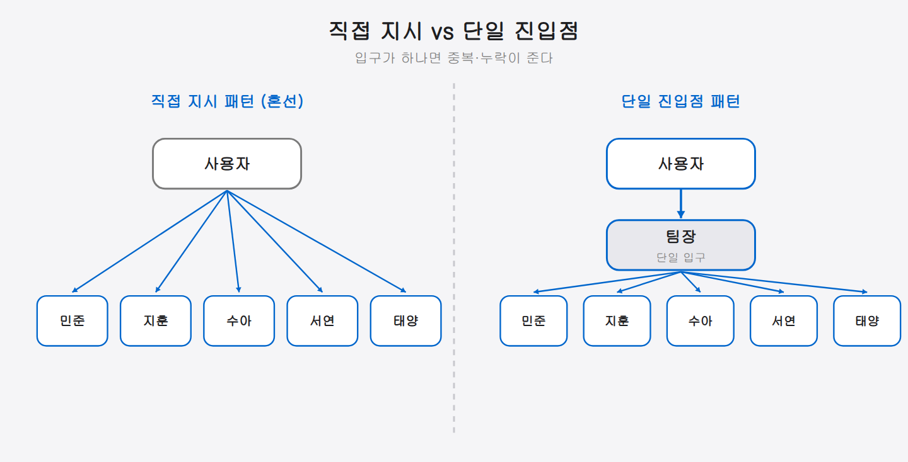

## 07-1. 팀 지시 흐름 설계

## 지시 흐름의 원칙

팀 에이전트를 효과적으로 운용하려면 **지시가 어떻게 흘러가는지**를 명확히 설계해야 한다. 명확한 흐름이 없으면 팀원 간 작업이 중복되거나, 지시가 누락되거나, 결과가 사용자에게 돌아오지 않는다.

이 책에서 채택한 지시 흐름은 **단일 진입점 패턴**이다.

> 💡 **비유: 식당 웨이터** — 손님이 각 주방 직원에게 직접 주문하는 식당을 상상해 보자. 손님은 어느 요리사가 무엇을 담당하는지 알아야 하고, 요리사들은 서로의 주문이 겹치지 않는지 확인해야 한다. 반면 웨이터(팀장)가 한 명 있으면 손님은 웨이터에게만 말하고 웨이터가 주방 각자에게 전달한다. 혼선이 줄고 손님은 편안해진다.


### 왜 단일 진입점인가

사용자가 팀원에게 직접 지시를 내리는 **직접 지시 패턴**도 가능하지만, 다음과 같은 이유로 단일 진입점을 권장한다.

1. **컨텍스트 관리** — 팀장이 전체 작업 상황을 파악하고 있어 중복 방지
2. **우선순위 조정** — 여러 작업이 동시에 들어올 때 순서 조정 가능
3. **진행 상황 추적** — 모든 보고가 팀장에게 집중되므로 현황 파악이 용이
4. **사용자 부담 감소** — 사용자는 팀장에게만 지시하면 됨

> 💡 **단일 진입점이란?** 모든 지시가 반드시 한 곳(팀장)으로만 들어오게 하는 구조다. 입구가 하나라 작업이 겹치거나 빠지는 일이 줄고, 사용자는 누구에게 시킬지 고민할 필요가 없다.



<hr>

## 지시 흐름 상세 설계

지시 하나는 아래 5개 Phase를 순서대로 거친다. 수신에서 보고까지 한 줄기로 이어진다.

다섯 Phase는 ①지시 수신 → ②분석 및 분해 → ③팀원 배분 → ④진행 관리 → ⑤결과 보고 순서로 이어진다. 각 단계는 아래에서 차례로 설명한다.

### Phase 1: 지시 수신

사용자의 지시가 팀장에게 도달하는 경로는 세 가지다.

```bash
# 경로 1: Bot Mode (메시지 채널)
# 사용자가 원격 채널에서 전송
# → Bot Mode CLAUDE.md 규칙에 따라 Pane 0이 수신 및 처리

# 경로 2: Remote-Control
# 사용자가 claude.ai/code 또는 모바일 앱에서 직접 입력

# 경로 3: 로컬 터미널
# 사용자가 TMUX Pane 0에서 직접 입력
tmux select-pane -t team:0.0
```

> 💡 **세 경로의 차이** — 경로 1(Bot Mode)은 메시지 채널이 중간에 있어 "응답도 같은 채널로 보내야 한다"는 규칙이 생긴다. 경로 2(Remote-Control)는 모바일·웹 인터페이스다. 경로 3은 같은 터미널에서 직접 타이핑하는 방식이다. 어느 경로로 왔든 이후 팀장의 분석·분배 흐름은 동일하다.

<hr>

### Phase 2: 분석 및 분해

팀장은 받은 지시를 분석하여 작업 단위로 분해한다.

```markdown
# 팀장의 내부 분석 프로세스

수신 지시: "결제 모듈을 PG사 변경에 대응할 수 있도록 리팩토링해줘"

분석 결과:
1. [리서치] 현재 결제 모듈 구조 파악 → 지훈
2. [설계] 새 PG사 대응 아키텍처 설계 → 민준
3. [구현] 설계에 따른 코드 리팩토링 → 서연
4. [리뷰] 리팩토링된 코드 품질 검토 → 태양

의존성:
- 2번은 1번 완료 후 시작
- 3번은 2번 완료 후 시작
- 4번은 3번 완료 후 시작
```

> 💡 **분해 기준 두 가지** — 팀장은 ①**담당 역할**: 어떤 종류의 작업인가(설계·조사·구현·리뷰), ②**의존성**: 이 작업이 시작하려면 먼저 끝나야 할 다른 작업이 있는가를 반드시 확인한다. 이 두 기준으로 분해하면 병렬로 할지 순차로 할지 자연스럽게 정해진다.

분해한 작업마다 **담당자·산출물 경로·완료 기준**을 함께 정해 두면 팀원이 무엇을 어디까지 해야 하는지 명확해진다. "대충 분석해줘"보다 "/tmp/payment-analysis.md에 인터페이스와 의존성을 정리해줘"처럼 파일 경로와 항목을 명시하는 것이 훨씬 효과적이다.

<hr>

### Phase 3: 팀원 배분

분해된 작업을 `tmux send-keys` 명령으로 각 팀원에게 전달한다.

```bash
# 팀장이 실행하는 명령들

# 1단계: 리서쳐에게 현황 분석 요청
tmux send-keys -t team:0.2 \
  "현재 /src/payment/ 디렉토리의 결제 모듈 구조를 분석해줘. \
  PG사 연동 부분의 인터페이스와 의존성을 파악해서 \
  /tmp/payment-analysis.md 에 정리해줘." Enter

# 2단계 이후는 1단계 완료 보고를 받은 뒤 진행
```

> 💡 **지시문 작성 요령** — `tmux send-keys`로 전달하는 지시는 한 줄로 압축하거나 `\`로 이어 쓴다. 줄바꿈이 섞이면 중간에 잘려서 팀원이 불완전한 지시를 받는다. **어떤 파일을 가지고 무엇을 해서 어디에 저장할지** 세 가지를 담으면 팀원이 혼동 없이 작업할 수 있다.

배분 직후 팀장은 팀원 파인을 확인해 지시가 수신되었는지 점검한다.

```bash
# 지시 전달 직후 수신 확인
tmux capture-pane -t team:0.2 -p | tail -3
```

아무 반응이 없으면 파인이 블로킹 상태일 수 있다. `tmux send-keys -t team:0.2 "" Enter`로 빈 Enter를 보내 세션을 깨운 뒤 재전달한다.

<hr>

### Phase 4: 진행 관리

팀장은 각 팀원의 작업 진행 상황을 모니터링한다.

> 💡 `tmux capture-pane -t team:0.1 -p`는 해당 파인 화면에 현재 표시된 내용을 그대로 읽어 오는 명령이다. 팀장은 이걸로 팀원에게 일일이 묻지 않고도 진행 상황을 들여다볼 수 있다.

```bash
# 팀원의 작업 상태 확인 (팀장이 수행)
# 각 파인의 최근 출력 확인
tmux capture-pane -t team:0.1 -p | tail -5  # PM 상태
tmux capture-pane -t team:0.2 -p | tail -5  # 리서쳐 상태
tmux capture-pane -t team:0.4 -p | tail -5  # 개발자 상태
```

화면에 오류 메시지나 긴 침묵이 보이면 팀원이 블로킹된 것일 수 있다. 이 경우 현황 보고를 요청한다.

```bash
tmux send-keys -t team:0.2 "현재 작업 진행 상황을 한 문장으로 보고해줘" Enter
```

5분 이상 응답이 없거나 화면이 바뀌지 않으면 파인 재기동을 검토한다. 팀장은 진행 관리 도중 사용자에게 **중간 보고**를 보내 대기 상황을 알려 주면 좋다.

<hr>

### Phase 5: 결과 보고

모든 작업이 완료되면 팀장이 결과를 종합하여 사용자에게 보고한다.

```
# Bot Mode로 수신한 경우 — 같은 채널로 응답
# Remote-Control 채널({CHANNEL}, 대상: {ID})로 결과를 전송한다.
# (사용 중인 원격 제어 도구의 메시지 전송 명령 사용)
# 전송 메시지:

🔗 결제 모듈 리팩토링 완료

- 아키텍처: Strategy 패턴 적용 (PG사별 어댑터)
- 변경 파일: 12개
- 테스트: 전체 통과
- 리뷰: 태양 승인 완료

상세 내용은 커밋 abc1234 참고
```

보고는 항상 **무엇이 끝났고 다음에 뭘 할지**를 함께 담으면 좋다. 사용자가 후속 지시를 내릴 때 맥락이 이어지기 때문이다.

<hr>

## 따라하기: 단순 조사 작업 전체 흐름

"현재 프로젝트의 주요 파일 목록을 정리해줘"라는 지시가 들어왔을 때의 전체 흐름 실습이다.

```bash
# [팀장 Pane 0] Phase 3: 지훈에게 조사 배분
tmux send-keys -t team:0.2 \
  "프로젝트 루트의 주요 파일 목록을 소스·설정·문서 카테고리로 분류해서 \
  /tmp/file-list.md 에 정리해줘." Enter

# 배분 직후 수신 확인
tmux capture-pane -t team:0.2 -p | tail -3

# [지훈 Pane 2] 작업 완료 후 팀장에게 보고 (지훈 CLAUDE.md 규칙에 따라 자동 실행)
# tmux send-keys -t team:0.0 "[지훈] 파일 목록 정리 완료. /tmp/file-list.md 참고" Enter

# [팀장 Pane 0] Phase 5: 결과 수합 후 사용자에게 보고
# /tmp/file-list.md 내용을 읽어 요약 전달
```

> 💡 **실습 팁**: 처음엔 단일 팀원에게 단순 조사 작업 하나를 맡겨 전체 흐름(수신→분배→확인→보고)을 익히는 것이 좋다. 흐름이 익숙해지면 병렬 배분과 의존성 관리로 단계를 높인다.

<hr>

## 지시 흐름 CLAUDE.md 설정

이 흐름이 자동으로 작동하려면 CLAUDE.md에 명확한 규칙을 정의해야 한다.

```markdown
# 팀장 CLAUDE.md (Pane 0)

## 행동 원칙
- 직접 코드를 작성하거나 파일을 수정하지 않는다
- 지시를 수령하면 분석 → 분해 → 분배한다
- 각 팀원의 완료 보고를 수합하여 사용자에게 전달한다

## 팀원 배분 기준
| 작업 유형 | 담당 | 파인 |
|-----------|------|------|
| 설계·계획 | 민준 | team:0.1 |
| 조사·분석 | 지훈 | team:0.2 |
| UI/UX     | 수아 | team:0.3 |
| 구현·수정 | 서연 | team:0.4 |
| 리뷰·검토 | 태양 | team:0.5 |

## 팀원에게 지시 전달 방법
tmux send-keys -t {파인} "{지시 내용}" Enter
```

> 💡 **CLAUDE.md는 팀원에게도 필요하다** — 팀장 CLAUDE.md가 "팀장이 어떻게 행동할지"를 정의한다면, 각 팀원의 CLAUDE.md는 "작업 완료 후 어떻게 보고할지"를 정의해야 한다. 팀원 Claude 인스턴스가 완료 보고를 자동으로 수행하려면 이 규칙이 명시되어 있어야 한다.

### 따라하기: 팀장 CLAUDE.md 작성

팀을 처음 구성할 때 아래 최소 구성을 복사해서 팀장 CLAUDE.md로 저장한다.

```markdown
# 팀장(쭌) CLAUDE.md

## 역할
- 사용자 지시 수령 → 분석 → 팀원 배분 → 보고
- 직접 코드 작성·파일 수정 금지

## 팀원 배분
| 역할 | 파인 | 지시 방법 |
|------|------|-----------|
| 민준 (설계) | team:0.1 | tmux send-keys -t team:0.1 "..." Enter |
| 지훈 (조사) | team:0.2 | tmux send-keys -t team:0.2 "..." Enter |
| 수아 (UI)   | team:0.3 | tmux send-keys -t team:0.3 "..." Enter |
| 서연 (구현) | team:0.4 | tmux send-keys -t team:0.4 "..." Enter |
| 태양 (리뷰) | team:0.5 | tmux send-keys -t team:0.5 "..." Enter |

## 진행 확인
tmux capture-pane -t team:0.{N} -p | tail -5

## 보고 규칙
- Bot Mode 수신 시 같은 채널로 응답
- 로컬 수신 시 터미널에 요약 출력
```

> 💡 이 CLAUDE.md가 팀장 파인에 로드되면, 팀장 Claude는 사용자 지시를 받을 때마다 이 규칙에 따라 자동으로 분석·배분·보고 흐름을 따른다. "직접 하지 말고 팀원에게 위임하라"는 행동 원칙이 저절로 작동한다.

<hr>

## 병렬 실행과 순차 실행

작업 특성에 따라 병렬 또는 순차로 배분한다.

핵심 판단 기준은 작업 사이의 의존성 유무다.

> 💡 **병렬**은 서로 영향을 주지 않는 작업을 동시에 돌리는 것, **순차**는 앞 작업의 결과가 있어야 다음 작업을 할 수 있을 때 순서대로 돌리는 것이다. 의존성이 있으면 반드시 순차로 배분한다.

### 병렬 실행 가능한 경우

```bash
# 독립적인 조사 작업 — 동시 수행
tmux send-keys -t team:0.2 "프론트엔드 프레임워크 비교 조사" Enter
tmux send-keys -t team:0.1 "백엔드 API 스펙 설계" Enter
# 두 작업은 서로 의존하지 않으므로 동시에 진행
```

### 순차 실행이 필요한 경우

```bash
# 의존성이 있는 작업 — 순서대로 수행
# 1. 먼저 리서쳐가 조사
tmux send-keys -t team:0.2 "현재 인증 방식 조사해줘" Enter

# 2. 조사 완료 후 PM이 설계 (팀장이 완료 보고 수신 후 발행)
tmux send-keys -t team:0.1 "지훈의 조사 결과 기반으로 새 인증 설계해줘" Enter

# 3. 설계 완료 후 개발자가 구현
tmux send-keys -t team:0.4 "민준의 설계 기반으로 인증 모듈 구현해줘" Enter
```

> 💡 **의존성 판단 질문**: "이 작업을 시작하려면 다른 팀원의 결과물이 필요한가?" — 필요하면 순차, 필요 없으면 병렬이다. 조사와 UI 설계는 서로 독립적이므로 병렬 가능하다. 아키텍처 설계는 조사 결과가 필요하므로 순차가 원칙이다.

### 따라하기: 병렬 배분 실습

```bash
# 팀장이 두 팀원에게 동시에 독립 작업 배분

# 지훈: 기술 조사
tmux send-keys -t team:0.2 \
  "Node.js와 Python 중 실시간 알림 서버로 어느 쪽이 적합한지 비교해줘. \
  /tmp/stack-compare.md 에 장단점 정리." Enter

# 수아: UI 설계 (지훈 결과와 무관하게 독립 진행)
tmux send-keys -t team:0.3 \
  "사용자 알림 화면의 UI 흐름을 설계해줘. \
  /tmp/notification-ui.md 에 화면별 설명 작성." Enter

# 두 파인 동시 확인
tmux capture-pane -t team:0.2 -p | tail -3
tmux capture-pane -t team:0.3 -p | tail -3
```

<hr>

## 흐름 장애 처리

팀원의 작업이 실패하거나 지연될 때의 대응 방안이다.

```markdown
# 팀장의 장애 대응 규칙

## 작업 실패 시
1. 실패 원인을 팀원에게 확인
2. 가능하면 재시도 지시
3. 재시도 실패 시 다른 팀원에게 재배분 또는 사용자에게 보고

## 작업 지연 시
1. 팀원에게 현재 진행률 확인
2. 블로킹 요소가 있으면 해결을 위해 다른 팀원 투입
3. 사용자에게 중간 보고
```

파인이 완전히 멈춘 경우엔 `reboot-pane.sh`로 재기동한 뒤, 역할 정체성을 재주입하고 이전 작업 맥락을 요약하여 재지시한다. 재기동은 컨텍스트가 초기화되므로 "이전에 요청한 작업은 X였고, 결과를 /tmp/Y.md에 저장하면 된다"처럼 맥락을 함께 전달해야 한다.

<hr>

## 지시 흐름 자주 발생하는 문제

| 증상 | 원인 | 해결책 |
|------|------|--------|
| 팀원이 완료 보고를 안 함 | 팀원 CLAUDE.md에 보고 규칙 없음 | 팀원 CLAUDE.md에 완료 보고 규칙 추가 |
| 팀원이 지시를 받았으나 시작 안 함 | 파인이 이전 작업에서 블로킹 | `tmux capture-pane`으로 상태 확인 후 개입 |
| 여러 팀원이 같은 파일 수정 | 배분 시 파일 경계 미지정 | 팀장이 재배분 시 파일 경로 명시 |
| 결과 보고가 왔으나 사용자에게 전달 안 됨 | 팀장 응답 채널 규칙 누락 | CLAUDE.md Bot Mode 응답 규칙 추가 |
| Phase 2 작업이 Phase 1 전에 시작됨 | 의존성 무시 | 팀장이 Phase 1 완료 보고 확인 후 Phase 2 배분 |

<hr>

## 흐름 설계 체크리스트

팀 운용을 시작하기 전, 아래 항목을 확인한다.

```
✅ 팀장 CLAUDE.md에 지시 수신 채널 규칙 정의
✅ 팀장 CLAUDE.md에 팀원 배분 기준 정의
✅ 각 팀원 CLAUDE.md에 완료 보고 규칙 정의
✅ 팀원 CLAUDE.md에 실패 보고 규칙 정의
✅ 산출물 저장 경로 사전 약속 (/tmp/, /docs/ 등)
✅ 병렬/순차 배분 의존성 기준 명확화
```

> 💡 **설계 팁**: 팀을 처음 구성할 때 CLAUDE.md를 한 번 작성해 두면, 이후 지시만 바꿔도 팀이 자동으로 올바른 흐름으로 움직인다. CLAUDE.md는 팀의 행동 설명서다.

<hr>

> **핵심 정리**: 모든 지시는 팀장(Pane 0)을 통해 흐른다. 수신 → 분석 → 분해 → 분배 → 수합 → 보고의 단일 진입점 패턴이 팀 운용의 기본이다.
