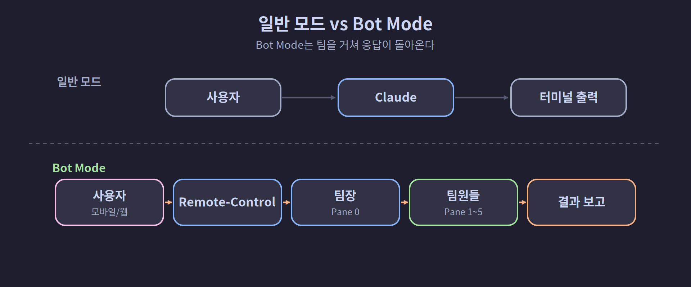
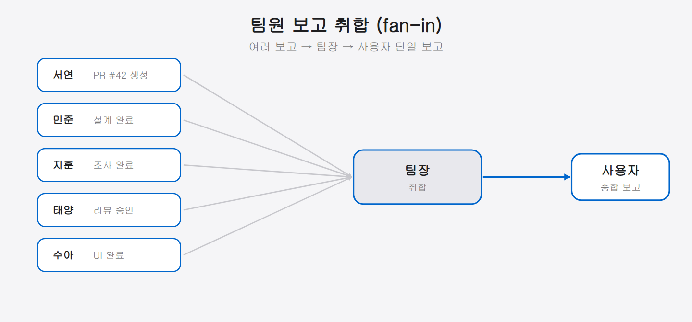

## 07-2. Bot Mode 활용

## Bot Mode란 무엇인가

Bot Mode는 Claude Code가 **메시지 접두사를 기반으로 지시를 수신하고, 작업 완료 후 결과를 자동으로 보고하는** 동작 방식이다. Remote-Control을 통해 모바일이나 웹에서 메시지를 보내면, 팀장(Pane 0)이 이를 수신하고 팀원에게 분배한 뒤 결과를 돌려보낸다.

```
일반 모드:   사용자 → Claude → 터미널에 출력
Bot Mode:   사용자 (모바일/웹) → Remote-Control → 팀장 → 팀원들 → 결과 보고
```

> 💡 **비유: 콜센터 교환원** — 회사 대표번호로 전화하면 교환원이 받아서 담당 부서로 연결한다. 손님이 각 부서 번호를 외울 필요도, 각 부서가 손님 번호를 알 필요도 없다. Bot Mode에서 팀장(Pane 0)이 이 교환원 역할이다. 사용자가 메시지를 보내면 팀장이 받아서 알맞은 팀원에게 분기하고 결과를 취합해 돌려준다.

> 💡 **메시지 접두사란?** 메시지 맨 앞에 붙이는 짧은 표시(예: `[chat:123]`)다. 팀장은 이 접두사를 보고 "어디서 온 지시인지, 어떻게 응답해야 하는지"를 판단한다. 접두사 규칙도 CLAUDE.md에 정의해 둔다.



<hr>

## Bot Mode 동작 절차

Bot Mode는 아래 3단계로 한 바퀴 돈다. 사용자의 한 번의 지시가 팀장→팀원→팀장을 거쳐 다시 사용자에게 응답으로 돌아온다.

세 단계는 ①Remote-Control로 지시 수신 → ②팀원에게 작업 배분 → ③결과 종합 및 보고이며, 아래에서 차례로 살펴본다.

### 1단계: Remote-Control로 지시 수신

모바일 앱 또는 claude.ai/code에서 메시지를 전송하면 Remote-Control을 통해 로컬 세션(Pane 0)에 실시간으로 전달된다.

```
수신 메시지: 결제 API 현황 알려줘

팀장(Pane 0)이 수신 → 분석 → 팀원 배분
```

팀장의 CLAUDE.md에 메시지 접두사 처리 규칙이 정의되어 있어야 한다. 예를 들어 `[채널명:12345]` 접두사가 붙은 메시지는 Bot Mode 지시로 인식하고, 응답도 같은 채널로 보내야 한다는 규칙이다.

> 💡 **응답 채널 일치** — "어디서 왔는지"와 "어디로 답할지"는 항상 같아야 한다. 원격 채널로 온 지시에 답을 터미널에만 출력하면 사용자가 볼 수 없다. CLAUDE.md에 "수신 채널과 동일한 채널로 응답한다"는 규칙을 명시해 두면 이를 방지할 수 있다.

Bot Mode를 시작하려면 팀장 파인에서 Remote-Control 플래그를 함께 써서 Claude를 실행한다.

```bash
# 팀장(Pane 0) Remote-Control 활성화 (세션 이름 포함)
claude --remote-control "팀장-쭌" --dangerously-skip-permissions
```

세션 이름을 명시하면 claude.ai/code 목록에서 해당 세션을 이름으로 찾을 수 있다.

<hr>

### 2단계: 팀원에게 작업 배분

팀장은 `tmux send-keys`로 각 팀원에게 지시를 전달한다.

> 💡 `tmux send-keys -t team:0.4 "..." Enter`는 "team 세션의 0번 윈도우, 4번 파인(서연)에게 따옴표 안의 메시지를 입력하고 Enter를 누르라"는 뜻이다. 즉 팀장이 팀원 화면에 직접 지시를 타이핑해 주는 셈이다.

```bash
# 팀장이 팀원들에게 작업 분배
tmux send-keys -t team:0.4 "결제 API 코드 현황 분석해서 보고해줘" Enter
tmux send-keys -t team:0.1 "현재 결제 모듈 아키텍처 문서 확인해줘" Enter
```

배분 직후 팀장은 각 팀원 파인 화면을 간단히 확인해 지시가 전달되었는지 점검한다. 지시가 도달했다면 Claude가 처리를 시작하는 메시지가 표시된다.

```bash
# 지시 전달 확인
tmux capture-pane -t team:0.4 -p | tail -3
tmux capture-pane -t team:0.1 -p | tail -3
```

<hr>

### 3단계: 결과 종합 및 보고

팀원이 작업 완료 후 팀장에게 보고하면, 팀장이 결과를 종합하여 Remote-Control을 통해 사용자에게 응답한다.

```
서연(Pane 4): 결제 API v2.3 구현 완료, 테스트 커버리지 87%
민준(Pane 1): 마이크로서비스 전환 설계 완료

팀장 → Remote-Control → 사용자에게 종합 보고 전달
```

팀장은 팀원들의 보고를 그대로 전달하는 것이 아니라 **종합·요약**하여 사용자가 한눈에 이해할 수 있는 형태로 가공한다. 기술적 세부사항은 줄이고 "무엇이 됐고, 다음엔 뭘 해야 하는가"로 압축하는 것이 좋다.

> 💡 **보고 품질 기준** — 좋은 보고는 세 가지를 담는다: ①완료된 것(결과), ②확인이 필요한 것(선택·결정 사항), ③다음에 할 것(후속 행동). 이 세 가지가 있으면 사용자가 다음 지시를 내리기가 훨씬 쉬워진다.



<hr>

## CLAUDE.md에서 Bot Mode 규칙 정의

팀장의 행동 원칙을 CLAUDE.md에 명시하면 일관된 팀 운용이 가능하다.

```markdown
## 팀장 행동 원칙

- **직접 작업 금지** — 코드/파일 수정은 팀원에게 위임
- 역할: 지시 수령 → 분석 → 팀원 배분 → 결과 종합 → 보고
- 팀원 지시: tmux send-keys -t team:0.{파인번호} "지시내용" Enter
```

Bot Mode에서 응답을 보낼 채널 규칙도 CLAUDE.md에 함께 포함해야 한다.

```markdown
## Bot Mode 응답 규칙

- `[채널명:{ID}]` 접두사 메시지 → 작업 완료 후 해당 채널로 응답
- 응답은 반드시 🔗로 시작
- 4000자 초과 시 여러 메시지로 분할
- 응답 없이 턴을 종료하는 것은 금지
```

이 규칙이 CLAUDE.md에 있으면 팀장이 어느 채널에서 지시가 왔는지 자동으로 인식하고 같은 채널로 응답한다. 채널 규칙이 없으면 팀장이 매번 응답 방향을 직접 판단해야 해서 혼선이 생길 수 있다.

<hr>

## 팀원 간 비동기 보고 패턴

팀원이 장시간 작업 후 완료를 알릴 때는 팀장 파인에 직접 메시지를 보낸다.

```bash
# 팀원(Pane 4 서연)이 팀장(Pane 0)에게 완료 보고
tmux send-keys -t team:0.0 "[서연] 결제 모듈 리팩토링 완료. PR #42 생성했습니다." Enter
```

팀장은 모든 팀원의 보고를 취합한 뒤 사용자에게 한 번에 결과를 전달한다.

> 💡 **비동기 패턴의 장점** — 팀원들은 자기 속도대로 작업하고 완료되면 보고한다. 팀장은 일일이 체크하는 대신 보고가 오면 그때 수합한다. 이 패턴이 작동하려면 팀원 CLAUDE.md에 "작업 완료 시 반드시 팀장(Pane 0)에게 보고"라는 규칙이 있어야 한다.

팀원 CLAUDE.md에는 아래 규칙을 추가한다.

```markdown
## 완료 보고 규칙

- 작업이 완료되면 반드시 Pane 0(팀장)에게 tmux 보고
- 형식: "[이름] 작업명 완료. 산출물 경로: /tmp/xxx.md"
- 실패한 경우도 반드시 보고: "[이름] 작업명 실패. 원인: ..."
```

<hr>

## 따라하기: Bot Mode 전체 흐름 실습

"서버 상태 확인해줘" 메시지가 모바일에서 도착한 경우의 전체 흐름이다.

```
[수신]
사용자 → 모바일 claude.ai/code → Remote-Control → Pane 0(팀장)

[팀장 분석]
→ 서버 상태 조사: 지훈에게 배분 적합

[배분]
tmux send-keys -t team:0.2 \
  "현재 주요 프로세스 실행 여부와 디스크 사용량을 확인해서 한 문장으로 요약해줘" Enter

[지훈 작업 완료 후 보고]
"[지훈] CPU 정상, 디스크 74% 사용 중, 주요 프로세스 전체 정상 실행 중"

[팀장 → 사용자 보고]
"🔗 서버 상태: CPU 정상 / 디스크 74% / 주요 프로세스 전체 정상"
```

> 💡 **실습 체크리스트**: ①모바일에서 간단한 조회 지시 전송 → ②팀장(Pane 0) 화면에 수신 확인 → ③팀원 배분 완료 확인(`tmux capture-pane`) → ④팀원 완료 보고 확인 → ⑤모바일 앱에서 응답 수신 확인. 이 다섯 단계가 막힘없이 돌아가면 Bot Mode가 정상 동작하는 것이다.

<hr>

## 자주 발생하는 문제

| 증상 | 원인 | 해결 |
|------|------|------|
| 모바일에서 보낸 메시지가 Pane 0에 안 보임 | Remote-Control이 비활성 상태 | `claude --remote-control "팀장-쭌"` 재실행 |
| 팀원에게 지시가 전달됐으나 아무 반응 없음 | 파인이 블로킹 상태 | 빈 Enter 전송 또는 파인 재기동 |
| 팀장이 응답을 터미널에만 출력하고 채널 보고 안 함 | CLAUDE.md Bot Mode 규칙 누락 | 팀장 CLAUDE.md에 응답 채널 규칙 추가 |
| 팀원 보고가 팀장에게 도달하지 않음 | 팀원 CLAUDE.md에 보고 규칙 없음 | 팀원 CLAUDE.md에 완료 보고 규칙 추가 |
