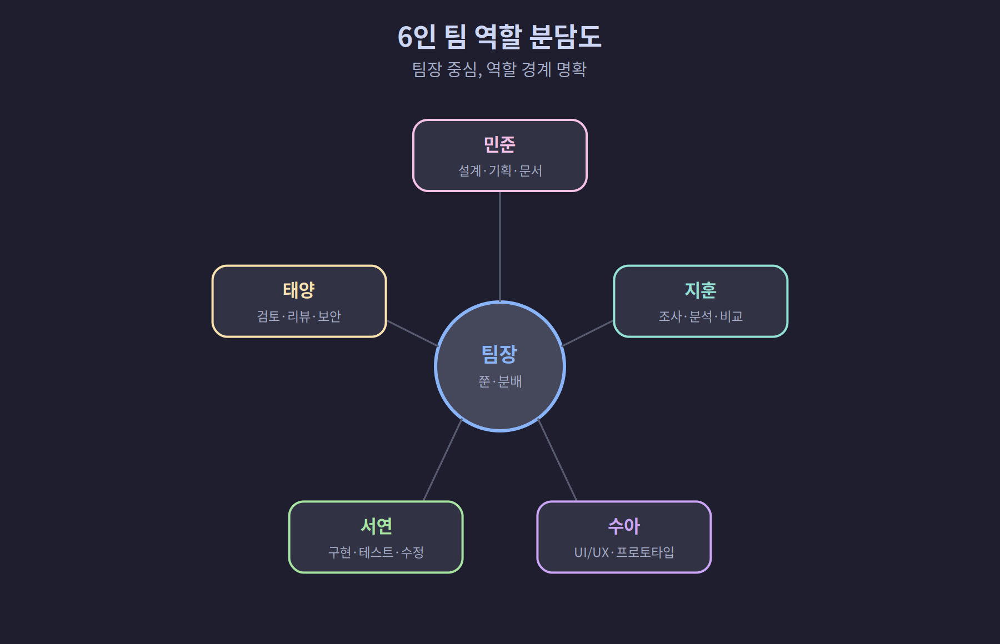
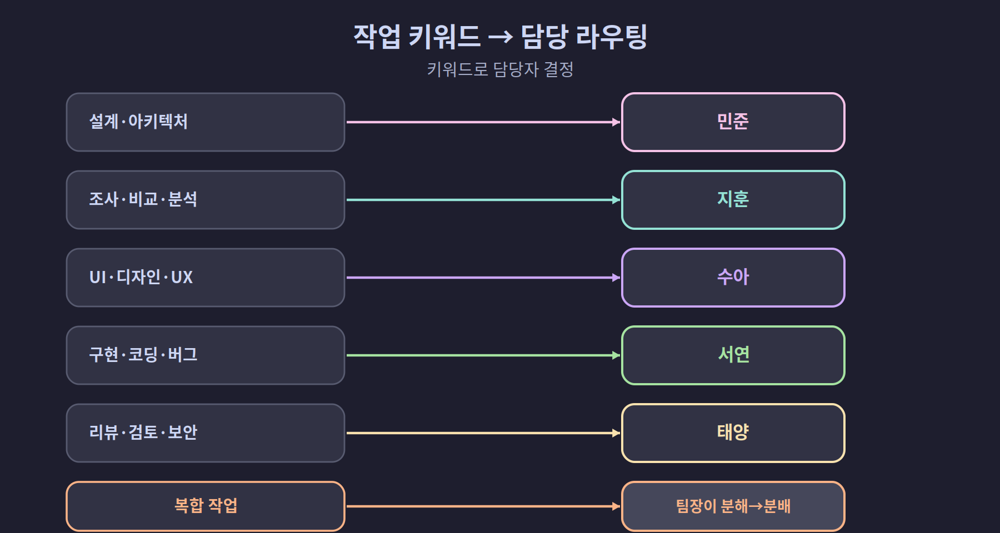

## 07-3. 업무 분담 전략

## 역할 기반 분담의 원칙

6명의 에이전트로 구성된 팀에서 업무를 효율적으로 분담하려면 **역할의 경계**가 명확해야 한다. 역할이 모호하면 일이 겹치거나, 아무도 안 맡은 일이 생긴다.

**팀장 (쭌) — 지시 수령 · 분석 · 분배 · 보고**

| 이름 | 역할 | 담당 업무 |
|------|------|----------|
| 민준 | PM · 아키텍트 | 설계 · 기획 · 문서 |
| 지훈 | 리서쳐 | 조사 · 분석 · 비교 |
| 수아 | 디자이너 | UI/UX · 프로토타입 |
| 서연 | 개발자 | 구현 · 테스트 · 수정 |
| 태양 | 리뷰어 | 검토 · 리뷰 · 보안 |

> 💡 **역할 경계가 왜 중요할까?** 각자 맡은 영역이 분명하면 같은 일을 둘이 하거나(중복), 아무도 안 하는 일(공백)이 줄어든다. 실제 회사 조직처럼 "누가 무엇을 책임지는지"를 먼저 정해 두는 것이다.

> 💡 **비유: 수술실 팀** — 수술실에서는 집도의·마취과 의사·간호사가 같은 공간에 있지만 각자 역할이 완전히 다르다. 집도의가 마취제를 직접 놓거나 간호사가 수술을 결정하지 않는다. 이 팀도 마찬가지다. 팀장(쭌)은 진행을 지휘하고, 민준은 설계를 결정하고, 서연은 구현을 맡는다. 영역을 넘나들면 책임이 불분명해지고 오류가 생긴다.



## 역할 간 협업 흐름 요약

6명이 하나의 작업을 처리하는 기본 흐름은 아래와 같다.

```
사용자 지시
    ↓
팀장 (분석·분해·배분)
    ↓
지훈 (조사) ─────────── 수아 (UI 설계)  ← 병렬
    ↓                       ↓
민준 (설계 — 조사+UI 결과 통합)           ← 순차
    ↓
서연 (구현 — 설계 기반)                   ← 순차
    ↓
태양 (리뷰)                               ← 순차
    ↓
팀장 (결과 보고)
    ↓
사용자
```

> 💡 이 흐름이 항상 전부 필요한 건 아니다. 단순 조회라면 지훈→팀장으로 끝난다. UI가 없는 백엔드 작업이라면 수아는 건너뛴다. 팀장이 상황에 맞게 필요한 단계만 선택해서 배분하는 것이 효율적이다.

<hr>

## 각 역할의 상세 책임

### 팀장 (쭌 — Pane 0)

팀장은 **오케스트레이터**다. 직접 구현하지 않고, 작업의 흐름을 관리한다.

> 💡 **오케스트레이터란?** 오케스트라 지휘자처럼, 각 악기(팀원)가 언제 어떻게 연주할지를 조율하는 역할이다. 지휘자가 직접 바이올린을 켜지 않듯, 팀장도 직접 코드를 작성하지 않는다.

```markdown
# 팀장 CLAUDE.md 핵심 규칙

## 해야 할 것
- 사용자 지시를 수령하고 분석
- 작업을 분해하여 적절한 팀원에게 배분
- 팀원의 완료 보고를 수합하여 사용자에게 전달
- 작업 간 의존성 관리 (순서 조정)

## 하지 말 것
- 직접 코드를 작성하거나 파일을 수정
- 팀원의 작업에 개입하여 직접 수정
- 팀원을 건너뛰고 사용자에게 기술적 세부사항 직접 보고
```

### PM·아키텍트 (민준 — Pane 1)

프로젝트의 **구조와 방향**을 설계한다.

> 💡 **민준의 핵심 가치**: 서연이 코드를 작성하기 전에 "어떤 구조로 만들 것인가"를 결정하는 것이다. 민준의 설계가 명확할수록 서연의 구현 속도가 빠르고 태양의 리뷰 수정 사항이 줄어든다.

```markdown
# 민준 CLAUDE.md

## 담당 영역
- 시스템 아키텍처 설계
- 프로젝트 계획 수립
- 기술 문서 작성
- API 스펙 정의
- 데이터 모델 설계

## 산출물 예시
- /docs/architecture.md
- /docs/api-spec.md
- /docs/data-model.md

## 작업 방식
- 팀장의 지시에 따라 설계 작업 수행
- 설계 완료 시 팀장(Pane 0)에게 보고: "[민준] {설계명} 설계 완료. {파일 경로}"
- 개발자(서연)가 참조할 수 있도록 문서를 명확히 작성
- 서연이 설계 불명확 문의 시 즉시 보완
```

### 리서쳐 (지훈 — Pane 2)

**정보 수집과 기술 조사**를 담당한다.

> 💡 **리서쳐의 핵심 가치**: 구현하기 전에 "이게 가능한지, 어떤 방법이 있는지"를 미리 파악해 두는 것이다. 좋은 조사 결과는 민준의 설계 시간을 절반으로 줄이고, 서연이 잘못된 방향으로 코딩하는 것을 방지한다.

```markdown
# 지훈 CLAUDE.md

## 담당 영역
- 기술 조사 및 비교 분석
- 라이브러리·프레임워크 벤치마크
- 기존 코드 구조 분석
- 레퍼런스·사례 수집

## 산출물 예시
- /docs/research/framework-comparison.md
- /docs/research/current-architecture-analysis.md

## 작업 방식
- 웹 검색, 문서 읽기, 코드 분석 도구 활용
- 조사 결과를 구조화된 문서로 정리
- 결론과 추천을 포함하여 보고
- 조사 완료 시 팀장(Pane 0)에게 보고: "[지훈] {작업명} 조사 완료. {산출물 경로}"
```

### 디자이너 (수아 — Pane 3)

**UI/UX와 사용자 경험**을 설계한다.

> 💡 **수아의 역할 범위**: 수아는 화면 디자인과 사용자 흐름을 담당하며, 백엔드 구조나 코드 구현에는 관여하지 않는다. 수아의 산출물은 서연이 구현할 때 직접 참조하는 '구현 기준서'가 된다.

```markdown
# 수아 CLAUDE.md

## 담당 영역
- UI/UX 설계
- 사용자 흐름(User Flow) 기획
- 컴포넌트 구조 설계
- 스타일 가이드 정의
- 반응형 레이아웃 설계

## 산출물 예시
- /docs/design/user-flow.md
- /docs/design/component-spec.md
- HTML/CSS 프로토타입

## 작업 방식
- 사용자 관점에서 인터페이스 설계
- 개발자(서연)가 구현할 수 있도록 명확한 스펙 제공
- 설계 완료 시 팀장(Pane 0)에게 보고: "[수아] {화면명} UI 설계 완료. {파일 경로}"
```

### 개발자 (서연 — Pane 4)

**실제 코드 구현**을 담당한다.

> 💡 **서연의 원칙**: 서연은 민준(설계)과 수아(디자인)의 결과물을 받아 코드로 바꾸는 역할이다. 설계를 받기 전에 구현을 시작하거나, 아키텍처를 임의로 변경하면 뒤에 오는 리뷰(태양)에서 큰 수정이 발생한다.

```markdown
# 서연 CLAUDE.md

## 담당 영역
- 기능 구현
- 버그 수정
- 테스트 코드 작성
- 리팩토링
- 빌드 및 배포 스크립트

## 작업 방식
- PM(민준)의 설계, 디자이너(수아)의 스펙을 기반으로 구현
- 구현 완료 시 팀장(Pane 0)에게 보고: "[서연] {작업명} 구현 완료"
- 아키텍처 변경이 필요하면 직접 변경하지 말고 팀장에게 보고
- 구현 중 설계 불명확 시 팀장 경유로 민준에게 확인 요청

## 완료 보고 형식
"[서연] {기능명} 구현 완료. 변경 파일: {N}개, 테스트: {결과}"
```

### 리뷰어 (태양 — Pane 5)

**코드 품질과 보안**을 검토한다.

> 💡 **태양의 원칙**: 리뷰는 서연의 작업을 검증하는 마지막 관문이다. 태양이 수정 요청을 보낼 때는 반드시 민준(Pane 1)에게 보고해야 하며, 서연에게 직접 수정을 요청해선 안 된다. 팀장 경유가 원칙이다.

```markdown
# 태양 CLAUDE.md

## 담당 영역
- 코드 리뷰
- 품질 기준 준수 확인
- 보안 취약점 점검
- 성능 이슈 검토
- 테스트 커버리지 확인

## 리뷰 체크리스트
- [ ] 코드 컨벤션 준수
- [ ] 에러 핸들링 적절성
- [ ] 보안 취약점 (인젝션, XSS 등)
- [ ] 성능 저하 요소
- [ ] 테스트 커버리지

## 작업 방식
- 개발자(서연)의 코드를 리뷰
- 문제 발견 시 구체적인 개선안과 함께 민준(Pane 1)에게 보고
- 서연에게 직접 수정 요청 금지 — 반드시 민준 경유
- 승인/반려 판단을 민준(Pane 1)에게 전달

## 완료 보고 형식
"[태양] {기능명} 리뷰 완료. 결과: {승인/수정요청}. {수정 항목 수}건."
```

## 역할 간 업무 이관 패턴

각 역할은 작업을 독립적으로 수행하지만, 결과물은 다음 사람에게 넘어간다. 이 인수인계가 매끄러우려면 **산출물 경로와 형식**을 미리 정해 둬야 한다.

| 이관 방향 | 이관 내용 | 방식 |
|-----------|-----------|------|
| 지훈 → 민준 | 조사 결과 문서 | `/tmp/research-*.md` 파일로 전달 |
| 민준 → 서연 | 설계 문서, API 스펙 | `/docs/architecture.md` 등 |
| 수아 → 서연 | UI 스펙 | `/docs/design/component-spec.md` |
| 서연 → 태양 | 구현 완료 코드 | 변경 파일 경로 목록 |
| 태양 → 민준 | 리뷰 결과 | 승인/수정 항목 목록 |

> 💡 **이관 실패를 막는 규칙**: 이관자(앞 역할)가 결과물을 특정 경로에 저장하고, 수신자(다음 역할)가 그 경로를 직접 읽도록 지시를 구성한다. 팀장이 배분할 때 "지훈의 `/tmp/research.md`를 읽어서 설계해줘"처럼 경로를 명시하면 이관 단절을 방지할 수 있다.

<hr>

## 업무 배분 기준표

팀장이 작업을 배분할 때 참조하는 기준표다.



| 작업 키워드 | 담당 | 예시 |
|-------------|------|------|
| 설계, 아키텍처, 계획, 스펙 | 민준 (PM) | "마이크로서비스 아키텍처 설계해줘" |
| 조사, 비교, 분석, 리서치 | 지훈 (리서쳐) | "Redis vs Memcached 비교해줘" |
| UI, 디자인, 레이아웃, UX | 수아 (디자이너) | "대시보드 화면 설계해줘" |
| 구현, 코딩, 수정, 버그 | 서연 (개발자) | "로그인 API 구현해줘" |
| 리뷰, 검토, 보안, 품질 | 태양 (리뷰어) | "PR #42 코드 리뷰해줘" |
| 복합 작업 | 팀장이 분해 후 분배 | "결제 시스템 만들어줘" |

## 복합 작업의 분배 예시

실제 작업은 단일 역할로 끝나지 않는 경우가 많다. 복합 작업을 분배하는 실전 예시다.

### 예시 1: 새 기능 개발

지시: "사용자 알림 시스템을 만들어줘"

팀장의 분배:

| Phase | 실행 | 담당 | 작업 |
|-------|------|------|------|
| 1 | 병렬 | 지훈 | 알림 시스템 기술 스택 조사 |
| 1 | 병렬 | 수아 | 알림 UI/UX 설계 |
| 2 | 순차 | 민준 | 조사 결과 기반 아키텍처 설계 |
| 3 | 순차 | 서연 | 설계 기반 구현 |
| 4 | 순차 | 태양 | 코드 리뷰 |

위 표처럼 서로 독립적인 조사 단계는 병렬로, 앞 결과가 있어야 하는 설계, 구현, 리뷰는 순서대로 나눈다.

팀장이 실제로 배분할 때의 지시 예시는 다음과 같다.

```bash
# Phase 1: 병렬 배분 (지훈·수아 동시 시작)
tmux send-keys -t team:0.2 \
  "사용자 알림 시스템 기술 스택 조사해줘. 결과는 /tmp/notification-research.md 에 저장." Enter
tmux send-keys -t team:0.3 \
  "사용자 알림 UI/UX 설계해줘. 결과는 /tmp/notification-ui.md 에 저장." Enter

# Phase 2: 지훈·수아 완료 보고 수신 후 민준에게 순차 배분
tmux send-keys -t team:0.1 \
  "/tmp/notification-research.md 와 /tmp/notification-ui.md 를 참고해서 \
  알림 시스템 아키텍처를 설계해줘. 결과는 /docs/architecture.md 에 저장." Enter
```

### 예시 2: 버그 수정

지시: "프로덕션에서 결제 오류 발생, 수정해줘"

팀장의 분배:

| Phase | 실행 | 담당 | 작업 |
|-------|------|------|------|
| 1 | 긴급 | 지훈 | 에러 로그 분석, 원인 파악 |
| 2 | 긴급 | 서연 | 원인 기반 핫픽스 구현 |
| 3 | 긴급 | 태양 | 핫픽스 긴급 리뷰 |

긴급한 경우 PM과 디자이너를 건너뛰고 최소 인원으로 처리한다.

```bash
# 긴급 배분: 지훈에게 즉시 분석 요청
tmux send-keys -t team:0.2 \
  "에러 로그 /var/log/app.log 에서 결제 관련 오류를 분석해서 원인을 파악해줘. \
  결과는 /tmp/bug-analysis.md 에 저장." Enter
```

### 예시 3: 리팩토링

지시: "인증 모듈 리팩토링해줘"

팀장의 분배:

| Phase | 담당 | 작업 |
|-------|------|------|
| 1 | 지훈 | 현재 인증 모듈 구조 분석 |
| 2 | 민준 | 새 아키텍처 설계 |
| 2 | 태양 | 현재 코드 품질 문제점 목록 작성 |
| 3 | 서연 | 리팩토링 구현 |
| 4 | 태양 | 리팩토링 결과 리뷰 |

Phase 2에서 민준과 태양을 병렬로 배분하는 이유는 두 작업이 서로 독립적이기 때문이다. 민준이 새 구조를 설계하는 동시에 태양이 현재 코드의 문제점을 정리하면, 두 결과물을 모아 서연에게 넘겨줄 때 더 완전한 정보가 된다.

```bash
# Phase 2 병렬 배분 예시
tmux send-keys -t team:0.1 \
  "인증 모듈 리팩토링을 위한 새 아키텍처를 설계해줘. \
  /tmp/auth-new-architecture.md 에 저장." Enter
tmux send-keys -t team:0.5 \
  "/src/auth/ 현재 코드의 품질 문제점(중복·복잡도·보안)을 목록으로 정리해줘. \
  /tmp/auth-quality-issues.md 에 저장." Enter
```

## 역할별 배분 키워드 빠른 참조

지시에 포함된 단어로 어느 팀원에게 배분할지 빠르게 판단한다.

### 단일 팀원으로 해결 가능한 경우

| 지시 속 단어 | 즉시 배분 대상 | 이유 |
|-------------|----------------|------|
| "조사", "비교", "현황 파악" | 지훈 | 리서치 역할 |
| "설계", "스펙", "아키텍처" | 민준 | 구조 설계 역할 |
| "화면", "UI", "레이아웃", "UX" | 수아 | 디자인 역할 |
| "구현", "만들어", "수정", "버그" | 서연 | 개발 역할 |
| "리뷰", "검토", "보안", "품질" | 태양 | 리뷰 역할 |

### 복합 지시 분해 패턴

| 지시 예시 | 분해 결과 |
|-----------|-----------|
| "로그인 기능 만들어줘" | 지훈(방식 조사) → 민준(API 설계) → 수아(화면 설계) → 서연(구현) → 태양(리뷰) |
| "버그 수정해줘" | 지훈(원인 분석) → 서연(수정) → 태양(리뷰) |
| "현재 코드 어떻게 생겼어?" | 지훈(코드 구조 파악·보고) |
| "성능 개선해줘" | 지훈(병목 분석) → 민준(개선 방향 설계) → 서연(구현) → 태양(리뷰) |

> 💡 **복합 지시 처리 원칙**: 지시에 여러 역할이 필요한 키워드가 섞여 있으면 Phase로 분해한다. "분석하고 구현하고 리뷰해줘" = Phase1(지훈·조사) + Phase2(서연·구현) + Phase3(태양·리뷰)로 자동으로 나뉜다.

<hr>

## 따라하기: 새 기능 전체 배분 실습

"간단한 헬스체크 API를 만들어줘"라는 지시가 들어왔을 때 팀장이 배분하는 전체 과정이다.

```bash
# [팀장] Phase 1: 지훈에게 기술 조사 배분
tmux send-keys -t team:0.2 \
  "Node.js Express에서 헬스체크 API 구현 방법을 조사해줘. \
  표준 응답 형식과 예시 코드를 /tmp/healthcheck-research.md 에 정리." Enter

# [지훈 완료 보고 수신 후] Phase 2: 민준에게 설계 배분
tmux send-keys -t team:0.1 \
  "/tmp/healthcheck-research.md 를 참고해서 헬스체크 API 스펙을 설계해줘. \
  엔드포인트·응답 형식·에러 케이스를 /docs/healthcheck-spec.md 에 정리." Enter

# [민준 완료 보고 수신 후] Phase 3: 서연에게 구현 배분
tmux send-keys -t team:0.4 \
  "/docs/healthcheck-spec.md 기반으로 헬스체크 API를 구현해줘. \
  /src/routes/health.js 에 작성하고 완료 시 보고." Enter

# [서연 완료 보고 수신 후] Phase 4: 태양에게 리뷰 배분
tmux send-keys -t team:0.5 \
  "태양에게 /src/routes/health.js 코드 리뷰를 요청해줘." Enter
```

> 💡 **배분 패턴 요약**: 팀장은 항상 ①조사(지훈) → ②설계(민준) → ③구현(서연) → ④리뷰(태양) 순서의 기본 파이프라인을 먼저 떠올린다. UI가 있으면 수아를 조사·설계 단계에 병렬로 추가한다. 긴급하면 ①·② 없이 ③·④만으로 단축한다.

<hr>

## 분담 실패를 방지하는 규칙

실전에서 자주 발생하는 분담 실패 사례와 방지책이다.

| 실패 유형 | 원인 | 방지책 |
|-----------|------|--------|
| 작업 중복 | 여러 팀원이 같은 파일 수정 | 팀장이 파일 레벨 담당 명시 |
| 공백 발생 | 아무도 안 맡은 작업 | 분배 시 체크리스트 사용 |
| 순서 무시 | 설계 전에 구현 시작 | Phase 단위 순차 배분 |
| 보고 누락 | 팀원이 완료 보고 안 함 | CLAUDE.md에 보고 의무 명시 |
| 이관 단절 | 다음 역할이 이전 결과물 경로를 모름 | 배분 시 파일 경로 명시 |

<hr>

## 팀원 보고 형식 표준

팀원이 작업 완료 후 팀장(Pane 0)에게 보내는 보고는 일정한 형식을 따른다. 형식이 일치하면 팀장이 보고를 파싱하거나 요약할 때 오해가 줄어든다.

### 기본 보고 형식

```
[팀원 이름] {작업명} {결과}. {산출물 경로 또는 변경 내용}
```

### 역할별 보고 예시

| 역할 | 완료 보고 예시 |
|------|----------------|
| 지훈 (리서치) | `[지훈] Redis 조사 완료. /tmp/redis-research.md 저장` |
| 민준 (설계) | `[민준] 알림 시스템 설계 완료. /docs/architecture.md 저장` |
| 수아 (디자인) | `[수아] 알림 UI 설계 완료. /tmp/notification-ui.md 저장` |
| 서연 (구현) | `[서연] 헬스체크 API 구현 완료. /src/routes/health.js 작성, 테스트 통과` |
| 태양 (리뷰) | `[태양] health.js 리뷰 완료. 승인. 수정 요청 없음` |

### 실패 보고 형식

성공뿐 아니라 실패도 반드시 보고한다.

```
[팀원 이름] {작업명} 실패. 원인: {한 줄 설명}. 다음 단계: {제안}
```

예시:
```
[서연] 인증 모듈 구현 실패. 원인: 민준 설계 문서에 토큰 만료 처리 누락. 
      다음 단계: 민준에게 보완 요청 필요
```

> 💡 **왜 실패 보고가 중요한가?** 팀원이 실패를 숨기거나 스스로 해결하려다 시간을 낭비하는 것보다, 즉시 팀장에게 보고해서 다른 팀원(민준)의 지원을 받는 것이 전체 팀 효율에 유리하다. CLAUDE.md에 "실패 시 즉시 팀장 보고" 규칙을 명시해 두면 이 행동이 자동화된다.

<hr>

## 역할 경계 충돌 대응

실전에서 팀원 간 역할 충돌이 발생할 수 있다. 아래 패턴과 대응책을 참고한다.

| 충돌 상황 | 증상 | 팀장 대응 |
|-----------|------|-----------|
| 서연이 설계 없이 구현 시작 | 민준 설계 미완료 상태에서 서연 작업 시작 | 서연 작업 중단 후 민준 완료 대기 |
| 태양이 서연에게 직접 수정 요청 | 서연이 태양의 지시로 코드 수정 | 태양 보고를 민준 경유로 전환 |
| 두 팀원이 같은 파일 수정 | 충돌 발생 | 파일별 담당자를 팀장이 재명시 |
| 민준이 구현까지 담당 | 설계와 구현 역할 혼용 | 민준에게 설계·스펙만 작성 요청, 구현은 서연에게 분배 |

> 💡 **충돌 예방의 핵심**: 팀장이 배분할 때 "이 작업은 민준 담당, 저 작업은 서연 담당"처럼 파일 또는 영역 단위로 명시하면 충돌이 크게 줄어든다. 애매한 경우엔 팀원이 알아서 정하기보다 팀장에게 물어보는 편이 낫다는 규칙을 CLAUDE.md에 추가하는 것도 효과적이다.

<hr>

> **핵심 정리**: 6명의 에이전트는 각각 명확한 역할 경계를 가지며, 팀장이 작업 키워드와 의존성을 기반으로 적절한 팀원에게 분배한다. 복합 작업은 Phase로 분해하여 순차/병렬 조합으로 처리한다.
