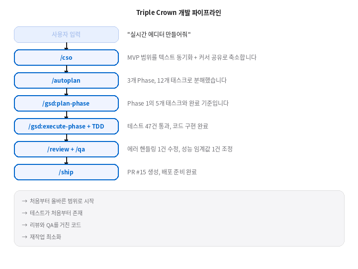
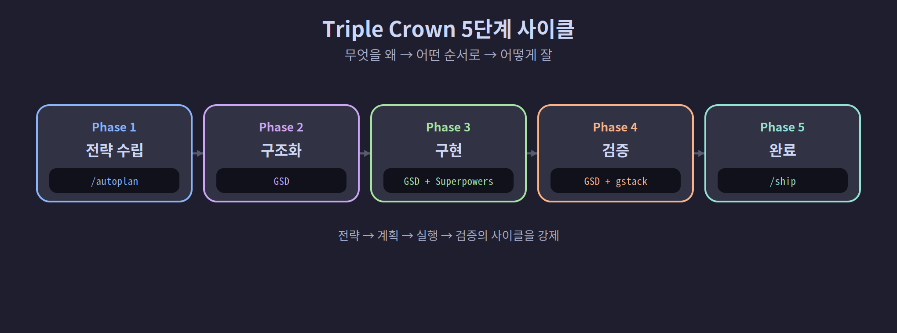
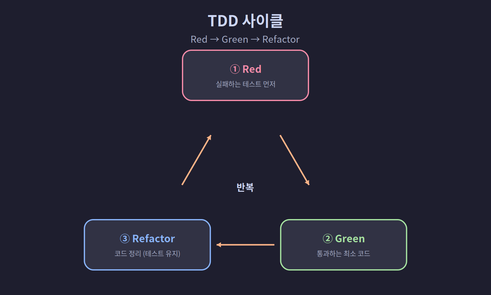
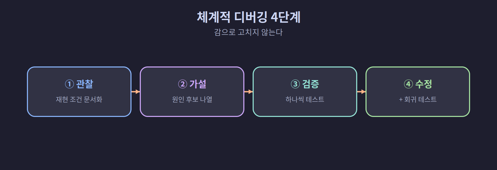
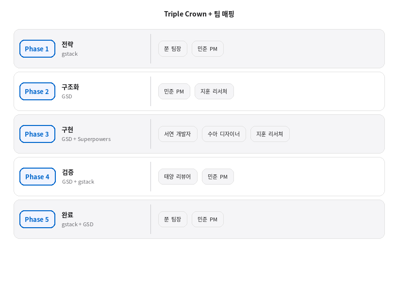
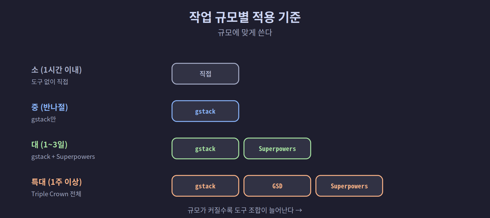

## 7-4. Triple Crown 전략 — gstack + GSD + Superpowers 통합 워크플로우

## Triple Crown이란

6장에서 gstack, GSD, superpowers를 각각 소개했다. 이 세 도구는 독립적으로도 유용하지만, **셋을 하나의 파이프라인으로 연결**할 때 진가를 발휘한다. 이것이 Triple Crown 전략이다.

| 순서  | 도구          | 역할     | 핵심 질문    |
| --- | ----------- | ------ | -------- |
| ①   | gstack      | 전략·검증  | "무엇을 왜"  |
| ②   | GSD         | 관리·실행  | "어떤 순서로" |
| ③   | Superpowers | 품질·방법론 | "어떻게 잘"  |

| 도구 | 역할 | 핵심 질문 |
|------|------|----------|
| gstack | 전략 수립 + 최종 검증 | 이것을 만들 가치가 있는가? 완성도가 충분한가? |
| GSD | 프로젝트 구조화 + 실행 관리 | 어떤 순서로 나누어 진행할 것인가? |
| Superpowers | 구현 품질 보장 | 각 단계를 어떤 방법론으로 수행할 것인가? |

세 도구 없이도 Claude Code는 코드를 작성할 수 있다. 하지만 "일단 코드부터" 접근은 프로젝트 규모가 커질수록 방향을 잃기 쉽다. Triple Crown은 **전략 → 계획 → 실행 → 검증**의 사이클을 강제하여 이 문제를 해결한다.



<hr>

## 전체 흐름 개요

Triple Crown의 전체 사이클은 5단계로 구성된다.

```
Phase 1: 전략 수립 ─────────────────── gstack
  /autoplan
         │
Phase 2: 프로젝트 구조화 ──────────── GSD
  /gsd:new-project → /gsd:new-milestone → /gsd:plan-phase
         │
Phase 3: 구현 ─────────────────────── GSD + Superpowers
  /gsd:execute-phase
    ├── superpowers:test-driven-development
    ├── superpowers:systematic-debugging
    └── superpowers:dispatching-parallel-agents
         │
Phase 4: 검증 ─────────────────────── GSD + gstack
  /gsd:validate-phase → /gsd:verify-work
  /review → /qa
         │
Phase 5: 완료 ─────────────────────── gstack + GSD
  /ship → /gsd:complete-milestone
```



각 단계를 구체적으로 살펴보자.

<hr>

## Phase 1: 전략 수립 (gstack)

코드를 한 줄도 작성하기 전에, **무엇을 왜 만드는지**부터 정한다. 범위, 우선순위, 기술 방향을 먼저 결정해야 나중에 재작업이 없다.

### /autoplan — 개발 계획 자동 생성

요구사항을 설명하면 /autoplan이 CEO 리뷰, 설계 리뷰, 엔지니어링 리뷰를 자동으로 수행하여 실행 계획을 수립한다.

```
/autoplan 실행 후 출력:

  === 개발 계획 ===
  
  Phase 1: CRDT 동기화 엔진 (3일)
    - Yjs 라이브러리 조사 및 선정
    - 기본 텍스트 동기화 구현
    - WebSocket 서버 구현
    - 동기화 충돌 해소 테스트
  
  Phase 2: 커서 공유 (2일)
    - 커서 위치 브로드캐스트
    - 다중 사용자 커서 렌더링
    - 네트워크 지연 처리
  
  Phase 3: 통합 테스트 및 배포 (1일)
    - E2E 테스트 시나리오 작성
    - 성능 테스트 (동시 접속 50명)
    - 배포 파이프라인 구성
```

/autoplan은 단순히 태스크를 나열하는 것이 아니다. CEO 리뷰, 설계 리뷰, 엔지니어링 리뷰를 자동으로 수행하여 계획의 완성도를 높인다.

<hr>

## Phase 2: 프로젝트 구조화 (GSD)

/autoplan의 결과를 GSD의 구조화된 프로젝트 관리 체계로 가져온다.

### 프로젝트와 마일스톤 생성

```bash
# 프로젝트 생성
/gsd:new-project
  → 이름: realtime-editor
  → 목표: 실시간 협업 텍스트 에디터 MVP
  → 스택: React, Node.js, Yjs, WebSocket

# 마일스톤 생성
/gsd:new-milestone
  → M1: MVP 출시 — 텍스트 동기화 + 커서 공유
```

### 페이즈 계획 수립

/autoplan에서 도출된 Phase를 GSD의 페이즈로 변환한다.

```bash
# Phase 1 상세 계획
/gsd:plan-phase 1

Claude의 계획 수립 과정:
  1. 코드베이스 현재 상태 분석
  2. 의존성 라이브러리 조사 (Yjs, y-websocket)
  3. 태스크 분해:
     Task 1: Yjs 문서 모델 초기화
     Task 2: WebSocket 서버 세팅
     Task 3: 클라이언트-서버 동기화 연결
     Task 4: 오프라인 편집 + 재접속 동기화
     Task 5: 동시 편집 충돌 테스트
  4. 각 태스크의 완료 기준 정의
  5. 가정(assumption) 목록 작성
```

GSD의 가장 큰 가치는 이 계획이 `.planning/` 디렉토리에 **파일로 저장**된다는 점이다. 대화가 끊기거나 세션이 바뀌어도 계획은 유지된다.

```
.planning/
  ├── ROADMAP.md
  └── milestones/
      └── M1/
          ├── MILESTONE.md
          ├── phase-1/
          │   └── PLAN.md        ← 여기에 상세 계획 저장
          ├── phase-2/
          │   └── PLAN.md
          └── phase-3/
              └── PLAN.md
```

<hr>

## Phase 3: 구현 (GSD + Superpowers)

여기서 Triple Crown의 핵심이 드러난다. GSD가 **무엇을** 할지 관리하고, Superpowers가 **어떻게** 할지를 강제한다.

### GSD의 실행 관리

```bash
/gsd:execute-phase 1
```

GSD는 PLAN.md의 태스크를 순서대로 실행하며, 각 태스크의 진행 상태를 추적한다.

### Superpowers의 품질 보장

GSD 실행 중 각 태스크에서 superpowers 스킬이 자동으로 개입한다.

### 시나리오 1: 새 기능 구현 시 — TDD 스킬

```
태스크: "WebSocket 서버 세팅"

superpowers:test-driven-development 적용:

  Step 1 (Red): 실패하는 테스트 먼저 작성
    test("클라이언트 연결 시 200 응답", () => {
      const ws = new WebSocket("ws://localhost:3001");
      expect(ws.readyState).toBe(WebSocket.OPEN);
    });
    → 테스트 실행: FAIL (서버 없음)

  Step 2 (Green): 테스트 통과하는 최소 코드
    const wss = new WebSocket.Server({ port: 3001 });
    wss.on("connection", (ws) => { /* 연결 수락 */ });
    → 테스트 실행: PASS

  Step 3 (Refactor): 코드 정리
    에러 핸들링, 연결 제한, 로깅 추가
    → 테스트 실행: PASS (리그레션 없음)
```



> 💡 **TDD(테스트 주도 개발)**는 "테스트 먼저, 구현 나중" 방식이다. 먼저 실패하는 테스트를 쓰고(Red), 그걸 통과시키는 최소 코드를 짜고(Green), 마지막에 코드를 다듬는다(Refactor). 구현이 정말 의도대로 동작하는지 매 단계 자동으로 검증된다.

TDD 스킬이 없으면 Claude는 서버 코드를 먼저 작성하고 "테스트도 추가할까요?"라고 묻는다. TDD 스킬이 있으면 **반드시 테스트를 먼저 쓴다**.

### 시나리오 2: 버그 발생 시 — 디버깅 스킬

```
문제: "두 클라이언트가 동시 편집 시 텍스트가 깨진다"

superpowers:systematic-debugging 적용:

  Step 1 (관찰): 재현 조건 문서화
    → 클라이언트 A: "hello" 입력
    → 클라이언트 B: 동시에 "world" 입력
    → 결과: "hweolrllod" (기대: "helloworld" 또는 "worldhello")

  Step 2 (가설): 원인 후보 나열
    가설 1: Yjs 문서 동기화 지연
    가설 2: WebSocket 메시지 순서 보장 실패
    가설 3: 클라이언트 측 렌더링 타이밍

  Step 3 (검증): 하나씩 테스트
    가설 1: Yjs 로그 확인 → 동기화 정상
    가설 2: WebSocket 메시지 로그 → 순서 뒤바뀜 확인 ✓
    → 원인: WebSocket 메시지 브로드캐스트 순서 미보장

  Step 4 (수정): 시퀀스 넘버 추가 + 회귀 테스트
```



디버깅 스킬이 없으면 Claude는 코드를 보고 "이 부분이 문제인 것 같다"며 바로 수정을 시도한다. 디버깅 스킬이 있으면 **가설을 세우고 검증하는 과정**을 거친다. 감으로 코드를 고치다 다른 곳이 깨지는 악순환을 방지한다.

### 시나리오 3: 병렬 작업 시 — 에이전트 분배 스킬

팀 환경에서 여러 태스크를 동시에 진행할 때 사용한다.

```
superpowers:dispatching-parallel-agents 적용:

  팀장 판단:
    Task 3 (클라이언트-서버 연결) → 서연 (개발자)
    Task 3의 UI 부분 (에디터 컴포넌트) → 수아 (디자이너)
    → 두 태스크는 인터페이스만 공유, 병렬 실행 가능

  분배:
    tmux send-keys -t team:0.4 \
      "src/server/sync.ts 에서 WebSocket 동기화 핸들러를 구현해줘" Enter
    tmux send-keys -t team:0.3 \
      "src/components/Editor.tsx 에서 Yjs 연동 에디터 컴포넌트를 만들어줘" Enter

  결합 조건:
    서연의 서버 + 수아의 컴포넌트가 같은 프로토콜을 사용하도록
    인터페이스 정의를 민준(PM)이 사전에 작성
```

<hr>

## Phase 4: 검증 (GSD + gstack)

구현이 끝나면 두 단계의 검증을 거친다.

### 4-1. GSD 검증 — 계획 대비 완성도

```bash
# 페이즈 목표 달성 여부 확인
/gsd:validate-phase 1

출력:
  Phase 1: CRDT 동기화 엔진
  ─────────────────────────
  Task 1: Yjs 문서 모델 초기화        ✅ 완료
  Task 2: WebSocket 서버 세팅         ✅ 완료
  Task 3: 클라이언트-서버 동기화 연결  ✅ 완료
  Task 4: 오프라인 편집 + 재접속       ✅ 완료
  Task 5: 동시 편집 충돌 테스트        ✅ 완료

  완료율: 5/5 (100%)
  목표 달성: ✅ 텍스트 동기화 정상 동작 확인
```

```bash
# 목표 역방향 분석
/gsd:verify-work

출력:
  목표: "실시간 텍스트 동기화"
  
  검증 항목:
  ✅ 두 클라이언트 간 텍스트 동기화
  ✅ 동시 편집 시 충돌 해소
  ✅ 오프라인 편집 후 재접속 시 동기화
  ⚠️ 3명 이상 동시 편집 미테스트 (Phase 3에서 처리)
```

### 4-2. gstack 검증 — 코드 품질과 기능 완성도

```bash
# 코드 리뷰
/review

출력:
  === 코드 리뷰 ===
  파일: src/server/sync.ts
  ✅ 코드 구조 양호
  ⚠️ 에러 핸들링: WebSocket 비정상 종료 시 cleanup 누락
  ⚠️ 보안: 연결 인증 없음 (Phase 2에서 추가 필요)

# QA 검증
/qa

출력:
  === QA 결과 ===
  테스트 시나리오 12건 실행
  ✅ 통과: 11건
  ❌ 실패: 1건
    → "100자 이상 동시 입력 시 1초 지연" (성능 임계값 초과)
  
  권장 조치: 동기화 배치 간격 조정 (50ms → 100ms)
```

GSD 검증은 "계획한 것을 다 했는가"를 확인하고, gstack 검증은 "만든 것이 제대로 동작하는가"를 확인한다. 관점이 다르기 때문에 둘 다 필요하다.

<hr>

## Phase 5: 완료 (gstack + GSD)

모든 검증을 통과하면 작업을 마무리한다.

```bash
# 배포 준비
/ship

출력:
  === 배포 준비 ===
  브랜치: feature/realtime-sync
  변경 파일: 14개 (+1,245, -32)
  테스트: 전체 통과 (47/47)
  
  PR 생성:
  Title: feat: add real-time text synchronization with CRDT
  Body: [자동 생성된 변경 요약]
  
  체크리스트:
  ✅ 코드 리뷰 완료
  ✅ QA 통과
  ✅ 충돌 없음
  → PR #15 생성 완료

# 마일스톤 상태 업데이트
/gsd:progress

출력:
  M1: MVP 출시
  ████████░░░░░░░░ 33% (Phase 1/3 완료)
  
  다음: Phase 2 (커서 공유)
  /gsd:plan-phase 2 로 시작
```

<hr>

## 팀 환경에서의 Triple Crown 배분

6명의 팀 에이전트에게 Triple Crown의 각 단계를 분담하면 더 효율적이다.


### 팀장의 Triple Crown 실행 스크립트

팀장이 전체 사이클을 오케스트레이션하는 예시이다.

```bash
#!/bin/bash
# triple-crown.sh — 기능 개발 전체 사이클

FEATURE="$1"  # 예: "실시간 협업 에디터"

echo "=== Phase 1: 전략 수립 ==="
# 팀장이 /autoplan 실행 (Pane 0에서 직접)
echo "팀장: /autoplan으로 전략 수립 완료"

echo "=== Phase 2: 구조화 ==="
# 민준에게 프로젝트 구조화 지시
tmux send-keys -t team:0.1 \
  "/gsd:new-project 으로 '$FEATURE' 프로젝트를 생성하고 \
  /gsd:plan-phase 1 까지 완료해줘." Enter

# 지훈에게 기술 조사 지시
tmux send-keys -t team:0.2 \
  "'$FEATURE'에 필요한 기술 스택을 조사하고 \
  /docs/research/ 에 정리해줘." Enter

echo "=== Phase 3: 구현 (Phase 2 완료 후) ==="
# 서연에게 구현 지시
tmux send-keys -t team:0.4 \
  "/gsd:execute-phase 1 을 실행해줘. \
  TDD로 진행하고, 각 태스크마다 테스트 먼저 작성해." Enter

# 수아에게 UI 구현 지시
tmux send-keys -t team:0.3 \
  "에디터 UI 컴포넌트를 구현해줘. \
  src/components/ 디렉토리에서 작업해." Enter

echo "=== Phase 4: 검증 (구현 완료 후) ==="
# 태양에게 검증 지시
tmux send-keys -t team:0.5 \
  "서연과 수아의 구현 결과를 /review 하고 \
  /qa 로 기능 검증해줘." Enter

# 민준에게 GSD 검증 지시
tmux send-keys -t team:0.1 \
  "/gsd:validate-phase 1 로 Phase 1 완료 여부를 확인해줘." Enter

echo "=== Phase 5: 완료 (검증 통과 후) ==="
echo "팀장: /ship 으로 배포 준비"
```

<hr>

## Triple Crown vs 단순 개발 비교

같은 기능을 Triple Crown 없이 만드는 경우와 비교한다.

### 단순 개발
소규모 작업(파일 하나 수정, 간단한 스크립트)에는 Triple Crown이 과하다. 하지만 **여러 파일에 걸친 기능 개발, 팀 단위 프로젝트, 프로덕션 배포가 필요한 작업**에서는 초기 투자 시간을 재작업 감소로 회수할 수 있다.

<hr>

## 적용 기준

모든 작업에 Triple Crown을 적용할 필요는 없다. 상황에 따라 단계를 선택한다.

| 작업 규모 | 권장 조합 | 예시 |
|-----------|-----------|------|
| 소 (1시간 이내) | 도구 없이 직접 | 오타 수정, 설정 변경 |
| 중 (반나절) | gstack만 (/review + /ship) | 버그 수정, 작은 기능 추가 |
| 대 (1~3일) | gstack + Superpowers | 새 기능 모듈, API 추가 |
| 특대 (1주 이상) | **Triple Crown 전체** | 신규 서비스, 대규모 리팩토링 |



> 💡 핵심은 "규모에 맞게 쓰라"는 것이다. 오타 수정에 전체 파이프라인을 돌리면 과하고, 대규모 프로젝트를 도구 없이 진행하면 방향을 잃는다.

<hr>

## 요약

Triple Crown 전략은 gstack(전략·검증), GSD(구조·실행), Superpowers(품질·방법론)를 하나의 파이프라인으로 연결하여 **"무엇을 왜 → 어떤 순서로 → 어떻게 잘"**의 질문에 순서대로 답하는 워크플로우다. 팀 환경에서는 각 Phase를 역할에 맞는 팀원에게 배분하여 병렬로 실행할 수 있다. 모든 작업에 적용할 필요는 없지만, 규모가 큰 프로젝트에서는 초기 구조화 비용을 재작업 감소로 충분히 회수한다.
