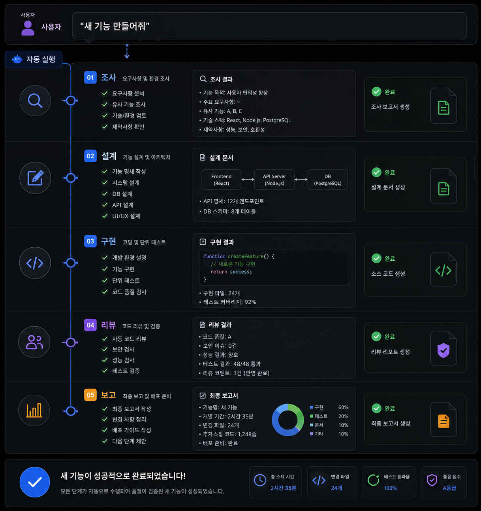

## 7-5. 자동화 워크플로우 예시

## 워크플로우 자동화란

지금까지 팀 구성, Remote-Control, Bot Mode, 업무 분담을 각각 다루었다. 이 장에서는 이 모든 요소를 **하나의 자동화된 워크플로우**로 연결하는 실전 예시를 다룬다.

자동화 워크플로우의 핵심은 **사용자의 한 마디 지시가 여러 단계의 작업으로 자동 전개**되는 것이다.

```
사용자: "새 기능 만들어줘"
    │
    ▼
[자동] 조사 → 설계 → 구현 → 리뷰 → 보고
```



## 워크플로우 1: 기능 개발 파이프라인

가장 일반적인 워크플로우다. 새 기능을 처음부터 끝까지 개발하는 전체 과정이다.

> 💡 **`@cc` 접두사**는 메시지를 팀(Claude CLI)으로 보내는 표시다. `@cc @서연 ...`처럼 특정 팀원을 지정하거나, `@cc ...`만 쓰면 팀장에게 전달된다. (브릿지 라우팅 규칙은 6장·CLAUDE.md 참고)

이 워크플로우는 조사와 디자인을 병렬로 진행한 뒤 설계 → 구현 → 리뷰 → 보고로 이어진다. 아래는 실제 지시와 전개 예시다.

### 사용자 지시

```
@cc 사용자 알림 시스템 만들어줘. 
이메일과 푸시 알림을 지원하고, 
알림 설정 화면도 필요해.
```

### 팀장의 워크플로우 실행

```bash
# ======================================
# Phase 1: 조사 + 디자인 (병렬)
# ======================================

# 지훈에게 기술 조사 지시
tmux send-keys -t team:0.2 \
  "알림 시스템 기술 스택을 조사해줘. \
  이메일(SMTP/SendGrid), 푸시 알림(FCM/APNs), \
  알림 큐(Redis/RabbitMQ) 각각 비교 분석하고 \
  /docs/research/notification-stack.md 에 정리해줘." Enter

# 수아에게 UI 설계 지시
tmux send-keys -t team:0.3 \
  "사용자 알림 설정 화면을 설계해줘. \
  이메일/푸시 알림 on/off 토글, 알림 종류별 설정, \
  알림 이력 목록. \
  /docs/design/notification-ui.md 에 정리해줘." Enter

# ======================================
# Phase 2: 아키텍처 설계 (조사 완료 후)
# ======================================

# 민준에게 설계 지시
tmux send-keys -t team:0.1 \
  "지훈의 조사(/docs/research/notification-stack.md)와 \
  수아의 UI 설계(/docs/design/notification-ui.md)를 참고해서 \
  알림 시스템 아키텍처를 설계해줘. \
  API 엔드포인트, 데이터 모델, 알림 전송 플로우 포함. \
  /docs/architecture/notification-system.md 에 정리해줘." Enter

# ======================================
# Phase 3: 구현 (설계 완료 후)
# ======================================

# 서연에게 구현 지시
tmux send-keys -t team:0.4 \
  "민준의 설계(/docs/architecture/notification-system.md)에 따라 \
  알림 시스템을 구현해줘. \
  1) 알림 서비스 모듈 \
  2) 이메일 전송 어댑터 \
  3) 푸시 알림 어댑터 \
  4) REST API 엔드포인트 \
  5) 알림 설정 UI 컴포넌트 \
  테스트 코드도 함께 작성해줘." Enter

# ======================================
# Phase 4: 리뷰 (구현 완료 후)
# ======================================

# 태양에게 리뷰 지시
tmux send-keys -t team:0.5 \
  "서연이 구현한 알림 시스템 코드를 리뷰해줘. \
  특히 보안(인젝션, 인증), 성능(대량 알림 처리), \
  에러 핸들링을 중점적으로 확인해줘." Enter
```

### 사용자에게 최종 보고

```bash

📋 작업 요약:
- 기술 스택: SendGrid(이메일) + FCM(푸시) + Redis(큐)
- API: POST /api/notifications, GET /api/notification-settings
- UI: 알림 설정 페이지 + 알림 이력 목록

📁 주요 파일:
- src/services/notification.ts
- src/adapters/email.ts, push.ts
- src/pages/NotificationSettings.tsx
- tests/notification.test.ts

✅ 리뷰: 태양 승인 (보안·성능 이슈 없음)
📝 커밋: feat: add notification system with email and push support
```

## 워크플로우 2: 버그 핫픽스

프로덕션 장애 상황에서의 긴급 대응 워크플로우다.

원인 분석 → 핫픽스 구현 → 긴급 리뷰의 3단계로 빠르게 대응한다.

### 사용자 지시

```
@cc 프로덕션 결제 오류 발생. 
사용자가 결제 완료했는데 주문이 생성 안 됨. 
긴급 수정해줘.
```

### 팀장의 긴급 워크플로우

```bash
# ======================================
# Phase 1: 원인 분석 (즉시)
# ======================================

# 지훈에게 긴급 분석 지시
tmux send-keys -t team:0.2 \
  "[긴급] 결제 완료 후 주문 미생성 버그 분석. \
  1) 최근 커밋 중 결제/주문 관련 변경 확인 \
  2) 에러 로그에서 관련 에러 검색 \
  3) 결제 → 주문 생성 코드 흐름 추적 \
  원인을 찾으면 즉시 보고해줘." Enter

# ======================================
# Phase 2: 핫픽스 구현 (원인 파악 후)
# ======================================

# 서연에게 수정 지시
tmux send-keys -t team:0.4 \
  "[긴급] 지훈이 분석한 결제-주문 버그 수정. \
  원인: {지훈의 분석 결과} \
  수정 후 관련 테스트 추가해줘. \
  브랜치명: hotfix/payment-order-creation" Enter

# ======================================
# Phase 3: 긴급 리뷰 (수정 후)
# ======================================

# 태양에게 긴급 리뷰
tmux send-keys -t team:0.5 \
  "[긴급] hotfix/payment-order-creation 브랜치 긴급 리뷰. \
  결제-주문 생성 버그 수정 건. \
  사이드 이펙트 없는지 집중 확인해줘." Enter
```

### 긴급 보고

```bash

🔍 원인: 결제 콜백에서 주문 생성 트랜잭션 커밋 누락
🔧 수정: payment-callback.ts L45 — 트랜잭션 커밋 추가
✅ 리뷰: 태양 긴급 승인
🌿 브랜치: hotfix/payment-order-creation

배포 승인해주시면 즉시 반영합니다.
```

## 워크플로우 3: 코드 리뷰 자동화

PR이 올라올 때마다 자동으로 리뷰를 수행하는 워크플로우다.

사용자가 PR 리뷰를 지시하면 지훈의 변경 분석과 태양의 코드 리뷰가 병렬로 실행되고, 결과를 종합해 GitHub PR 코멘트로 자동 등록된다.

### 사용자 지시

```
@cc PR #42 리뷰해줘
```

### 팀장의 리뷰 워크플로우

```bash
# ======================================
# Phase 1: 변경 사항 분석 (병렬)
# ======================================

# 지훈에게 변경 분석
tmux send-keys -t team:0.2 \
  "PR #42의 변경 사항을 분석해줘. \
  변경된 파일 목록, 변경 라인 수, \
  영향받는 모듈을 정리해줘." Enter

# 태양에게 코드 리뷰
tmux send-keys -t team:0.5 \
  "PR #42 코드 리뷰 수행. \
  gh pr diff 42 로 변경 사항 확인하고 \
  코드 품질, 보안, 성능 관점에서 리뷰해줘. \
  개선점이 있으면 구체적인 코드와 함께 제안해줘." Enter

# ======================================
# Phase 2: 결과 종합 및 보고
# ======================================


📊 변경 요약:
- 변경 파일: 8개 (+245, -89)
- 영향 모듈: auth, user-profile

🔍 리뷰 결과:
✅ 코드 컨벤션: 준수
✅ 보안: 이슈 없음
⚠️ 성능: user-profile 쿼리에 N+1 가능성
  → 제안: eager loading 적용

💬 코멘트 2건 등록 완료
```

## 워크플로우 4: 일일 팀 보고

매일 정해진 시간에 각 팀원의 작업 현황을 수집하여 보고하는 워크플로우다.

팀장이 다섯 팀원에게 현황을 요청(fan-out)하고, 돌아온 보고를 모아(fan-in) 사용자에게 단일 보고로 전달한다.

### 사용자 지시

```
@cc 오늘 팀 현황 정리해줘
```

### 팀장의 현황 수집

```bash
# 모든 팀원에게 현황 보고 요청 (브로드캐스트)
tmux send-keys -t team:0.1 "오늘 작업 현황을 한 줄로 보고해줘" Enter
tmux send-keys -t team:0.2 "오늘 작업 현황을 한 줄로 보고해줘" Enter
tmux send-keys -t team:0.3 "오늘 작업 현황을 한 줄로 보고해줘" Enter
tmux send-keys -t team:0.4 "오늘 작업 현황을 한 줄로 보고해줘" Enter
tmux send-keys -t team:0.5 "오늘 작업 현황을 한 줄로 보고해줘" Enter
```

### 종합 보고

```bash

👤 민준 (PM): 알림 시스템 API 스펙 문서 작성 완료
👤 지훈 (리서쳐): Redis vs RabbitMQ 비교 분석 완료
👤 수아 (디자이너): 알림 설정 UI 와이어프레임 완성
👤 서연 (개발자): 알림 서비스 모듈 구현 중 (70%)
👤 태양 (리뷰어): PR #41 리뷰 완료, #42 대기 중

📌 내일 예정:
- 서연: 알림 서비스 구현 완료 → 태양 리뷰
- 민준: 배포 계획 수립
```

## 워크플로우 5: 셋업 스크립트 자동화

팀 환경 자체를 스크립트로 자동 구성하는 워크플로우다.

세션 생성 → 파인 분할 → 레이아웃 → 타이틀 → claude 실행까지 한 스크립트로 팀 화면을 자동 구성한다. 아래가 그 스크립트다.

```bash
#!/bin/bash
# setup-team.sh — 팀 환경 원클릭 셋업

SESSION="team"

# 1. TMUX 세션 생성
tmux new-session -d -s $SESSION -x 200 -y 50

# 2. 파인 분할
tmux split-window -h -t $SESSION:0
tmux split-window -v -t $SESSION:0.1
tmux split-window -v -t $SESSION:0.2
tmux split-window -v -t $SESSION:0.3
tmux split-window -v -t $SESSION:0.4

# 3. 레이아웃 설정
tmux select-layout -t $SESSION main-vertical

# 4. 파인 타이틀 설정
tmux select-pane -t $SESSION:0.0 -T "쭌"
tmux select-pane -t $SESSION:0.1 -T "민준 PM·아키텍트"
tmux select-pane -t $SESSION:0.2 -T "지훈 리서쳐"
tmux select-pane -t $SESSION:0.3 -T "디자이너 수아"
tmux select-pane -t $SESSION:0.4 -T "서연 개발자"
tmux select-pane -t $SESSION:0.5 -T "태양 리뷰어"

# 5. 각 파인에서 Claude Code 실행
for i in 0 1 2 3 4 5; do
  tmux send-keys -t $SESSION:0.$i "claude" Enter
done

# 6. 파인 테두리에 타이틀 표시
tmux set-option -t $SESSION pane-border-status top

echo "팀 환경 셋업 완료! tmux attach -t $SESSION 으로 접속하세요."
```

이 스크립트를 실행하면 6개의 파인에 각각 Claude Code가 실행된 팀 환경이 자동으로 구성된다.

## 워크플로우 커스터마이징 팁

### 1. 반복 작업은 셸 함수로

```bash
# ~/.bashrc에 추가
team-send() {
  local pane=$1
  shift
  tmux send-keys -t team:0.$pane "$*" Enter
}

# 사용 예시
team-send 4 "로그인 버그 수정해줘"    # 서연에게
team-send 5 "PR #42 리뷰해줘"         # 태양에게
```

### 2. 워크플로우 템플릿 저장

자주 사용하는 워크플로우를 스크립트로 저장해두면 재사용이 편리하다.

```bash
# ~/workflows/feature-dev.sh
#!/bin/bash
FEATURE_NAME=$1

team-send 2 "[$FEATURE_NAME] 기술 조사 시작해줘"
team-send 3 "[$FEATURE_NAME] UI 설계 시작해줘"
echo "Phase 1 시작: 조사 + 디자인 병렬 진행"
```

### 3. 팀원 상태 모니터링

```bash
# 모든 팀원의 마지막 출력 확인
for i in 1 2 3 4 5; do
  echo "=== Pane $i ==="
  tmux capture-pane -t team:0.$i -p | tail -3
  echo ""
done
```

<hr>

> **핵심 정리**: 자동화 워크플로우는 사용자의 단일 지시를 다단계 팀 작업으로 자동 전개한다. 기능 개발, 버그 수정, 코드 리뷰, 일일 보고 등 반복되는 패턴을 워크플로우로 정형화하면 팀 운용 효율이 크게 향상된다.
