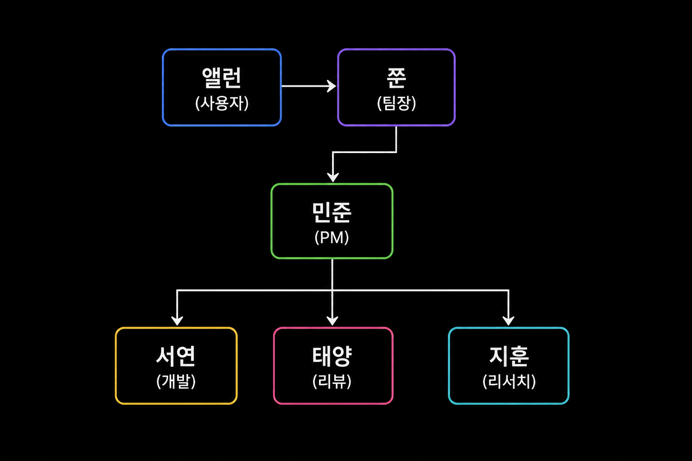
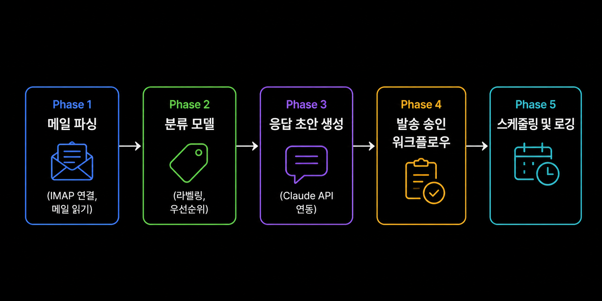
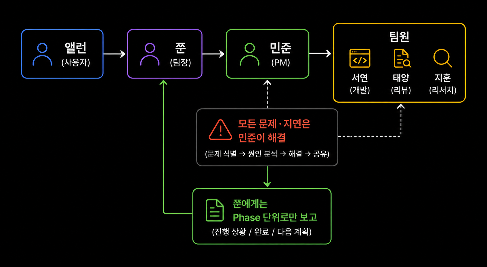
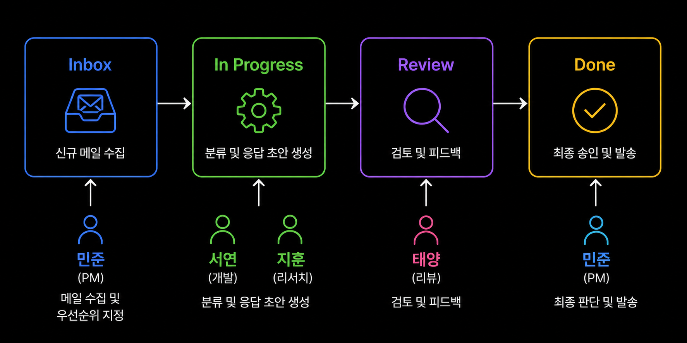

## 08-1. 실제 멀티에이전트 운영 사례

## 이 장에서 배우는 것

이론이 아닌 실제 사례를 통해 멀티에이전트 팀이 어떻게 운영되는지 살펴봅니다. 6인 팀 구성(쭌·민준·지훈·수아·서연·태양)을 기반으로, 다양한 프로젝트에서 발생한 실제 상황과 해결 방법을 소개합니다.

> 💡 **멀티에이전트(Multi-Agent)란?** 여러 AI 에이전트가 각자의 역할을 맡아 동시에 협력하는 방식입니다. 혼자 모든 일을 처리하는 단일 AI와 달리, PM·개발자·리뷰어 등의 역할을 분담해 병렬로 작업합니다. 마치 소규모 스타트업 팀처럼요.

이 장에서 다루는 내용:

- **사례 1**: 쿠팡 상품 분석 AI 도구 — TDD와 역할 분담의 실전
- **사례 2**: 메일 자동화 시스템 — Phase 설계와 5분 체크 루프
- **사례 3**: Rate Limit 대응 — 자동 재개 패턴
- **공통 패턴 정리** — 반복 검증된 성공 방식
- **교훈** — 실패에서 배운 것들

<hr>

## 사례 1: 쿠팡 상품 분석 AI 도구 (cupangs)

### 프로젝트 개요

쿠팡 상품 페이지를 분석하여 가격 히스토리, 경쟁 상품 비교, 일괄 갱신 기능을 제공하는 AI 도구입니다. 229개의 테스트로 검증된 실전 프로젝트입니다.

> 💡 **왜 AI 팀으로 만들었을까요?** 가격 수집(리서치), 비교 로직 구현(개발), 코드 품질 검증(리뷰) — 이 세 역할을 한 에이전트가 연속으로 처리하면 컨텍스트가 금방 가득 찹니다. 역할별로 에이전트를 분리하면 각자의 컨텍스트를 아끼며 병렬로 진행할 수 있습니다.

### 팀 구성 및 역할 분담

```
앨런(사용자) → 쭌(팀장)
                  ↓
              민준(PM) → 서연(개발) + 태양(리뷰) + 지훈(리서치)
```



**민준(PM·아키텍트)**: 3개 Phase 설계 — AI 비교 분석, 가격 히스토리, 일괄 갱신

**지훈(리서쳐)**: 쿠팡 API 구조 조사, 기존 오픈소스 레퍼런스 수집

**서연(개발자)**: Phase별 구현 진행

**태양(리뷰어)**: 각 Phase 완료 후 코드 리뷰 및 품질 검증

> 💡 **비유: 주방 역할 분담** 민준은 주방장(메뉴 설계), 서연은 조리사(실제 요리), 태양은 위생 검사관(품질 확인), 지훈은 식재료 조달자(재료 조사)입니다. 팀장 쭌은 손님(앨런)과 소통하며 주방 전체를 지휘합니다. 조리사가 직접 손님 응대까지 하면 요리 품질이 떨어지듯, 역할 분리가 전체 품질을 높입니다.

### 실제 워크플로우

**Phase 1 — AI 비교 분석 구현**

```bash
# 민준이 서연에게 지시
bash 내부전달스크립트.sh 4 "Phase 1 시작. 상품 2개 URL 입력 받아 
AI가 스펙 비교·추천 이유 출력하는 기능 구현해줘. 
TDD로, 실패 테스트 먼저."

# 서연 작업 완료 후 민준에게 보고
bash 내부전달스크립트.sh 1 "Phase 1 구현 완료. 커밋 eaca3ba. 
테스트 87개 GREEN."

# 민준이 태양에게 리뷰 요청
bash 내부전달스크립트.sh 5 "Phase 1 리뷰 부탁해. 
커밋 eaca3ba 확인해줘."
```

> 💡 **`내부전달스크립트.sh`를 쓰는 이유** 외부 채널 전달 스크립트는 메시지 앞에 채널 접두사를 붙여 원격 채널로 전달을 발동시킵니다. 팀원 간 내부 전달은 `내부전달스크립트.sh`로 직접 해당 pane에 전송해야 합니다. `내부전달스크립트.sh 4`는 Pane 4(서연)에게, `내부전달스크립트.sh 1`은 Pane 1(민준)에게 전달합니다.

**발생한 문제와 해결**

서연이 `catch(e: any)` 패턴을 반복 사용한 것을 태양이 발견했습니다.

> 💡 **`catch(e: any)`가 왜 문제일까요?** 오류를 `any`(아무 타입)로 받으면 타입 검사가 꺼져, 오류 객체에 없는 속성을 잘못 써도 컴파일러가 못 잡습니다. `unknown`으로 받고 `instanceof Error`로 확인하면, 진짜 Error일 때만 안전하게 `.message`에 접근할 수 있습니다.

```typescript
// 태양이 발견한 패턴 (개선 필요)
} catch (e: any) {
  console.error(e.message);
}

// 개선된 패턴
} catch (error: unknown) {
  if (error instanceof Error) {
    console.error(error.message);
  }
}
```

태양이 리뷰 결과를 민준에게 보고하고, 민준이 서연에게 수정 지시를 내려 해결했습니다. **쭌이 직접 개입하지 않고 민준 선에서 처리**된 사례입니다.

> **핵심 패턴**: 문제는 태양→민준→서연 경로로 해결됩니다. 쭌(팀장)이 세부 작업에 개입하면 팀 구조의 장점이 사라집니다.

### 최종 결과

| Phase | 기능 | 커밋 | 테스트 |
|-------|------|------|--------|
| P1 | AI 비교 분석 | eaca3ba | 87개 GREEN |
| P2 | 가격 히스토리 | 3c54464 | +89개 GREEN |
| P3 | 일괄 갱신 | 3cf25a4 | +53개 GREEN |
| **합계** | **전체** | **-** | **229개 GREEN** |

### 따라하기: cupangs 스타일 Phase 지시 작성해보기

아래 템플릿을 참고해 자신의 프로젝트에 맞는 Phase 지시를 작성해보세요.

```bash
# 1단계: PM이 개발자에게 Phase 지시
bash 내부전달스크립트.sh 4 "Phase [번호] 시작.
기능: [구현할 기능 한 줄 설명]
입력: [입력값 형태]
출력: [기대 결과]
조건: TDD로, 실패 테스트 먼저."

# 2단계: 개발자가 PM에게 완료 보고
bash 내부전달스크립트.sh 1 "Phase [번호] 완료.
커밋: [커밋 해시]
테스트: [N]개 GREEN."

# 3단계: PM이 리뷰어에게 요청
bash 내부전달스크립트.sh 5 "Phase [번호] 리뷰 부탁해.
커밋 [커밋 해시] 확인해줘."
```

<hr>

## 사례 2: 메일 자동화 시스템 (mail_auto)

### 프로젝트 개요

수신 메일을 분류하고 자동 응답 초안을 생성하는 시스템입니다. Phase 1~5로 나누어 개발하고, 최종 100개 테스트 모두 GREEN으로 완료했습니다.

> 💡 **왜 5개 Phase로 나눴을까요?** 한 번에 "메일 자동화 시스템 전체 만들어줘"라고 지시하면 에이전트가 컨텍스트 중간에 길을 잃습니다. IMAP 연결 → 분류 → 응답 생성 → 승인 → 스케줄링처럼 기능 단위로 쪼개면, 각 단계에서 테스트로 검증하며 안전하게 쌓아 올릴 수 있습니다.

### TDD 적용 실전

**민준의 Phase 설계:**

```
Phase 1: 메일 파싱 (IMAP 연결, 메일 읽기)
Phase 2: 분류 모델 (라벨링, 우선순위)
Phase 3: 응답 초안 생성 (Claude API 연동)
Phase 4: 발송 승인 워크플로우
Phase 5: 스케줄링 및 로깅
```



**서연의 TDD 실천:**

각 Phase 시작 시 반드시 실패 테스트를 먼저 작성했습니다.

```python
# Phase 1 시작 — 실패 테스트 먼저
def test_imap_connection():
    client = MailClient(host="imap.gmail.com")
    assert client.connect() is True  # 아직 구현 없음 → RED

# 구현 후 테스트 통과 확인 → GREEN
# 리팩토링 → 테스트 여전히 GREEN
```

> 💡 **TDD(Test-Driven Development)란?** 구현 전에 테스트를 먼저 작성하는 개발 방식입니다. "기능이 완성되면 이 테스트가 통과해야 한다"는 목표를 먼저 정하는 셈입니다. 처음엔 당연히 테스트가 실패(RED)하고, 구현 후 통과(GREEN)됩니다. AI 팀에서 TDD가 특히 중요한 이유는, 에이전트가 "완료"라고 보고해도 테스트가 없으면 검증할 방법이 없기 때문입니다.

태양이 "구현을 먼저 작성하고 테스트를 맞추는 역순 TDD" 패턴을 발견하면 즉시 민준에게 보고하여 재작성을 요청했습니다.

> **역순 TDD가 위험한 이유**: 구현에 맞춰 테스트를 쓰면, 테스트가 버그를 검증하는 도구가 아니라 버그를 정당화하는 도구가 됩니다.

### 5분 체크 루프 운용

팀 작업 중 쭌은 5분마다 ScheduleWakeup으로 깨어나 팀 상태를 점검했습니다.

```
[00:00] 쭌 깨어남 → 각 pane 상태 확인
[00:01] 서연 P3 구현 중, 태양 P2 리뷰 중 → 이상 없음
[00:01] 사용자에게 보고: "서연 P3 진행 중, 태양 P2 리뷰 중"
[00:01] ScheduleWakeup 270초 후 재등록
[04:30] 서연 "P3 완료" 보고 → 태양에게 리뷰 지시
[05:01] 쭌 깨어남 → 태양 리뷰 확인 → 앨런 보고
```

쭌은 270초마다 깨어나 각 pane 상태를 확인하고 사용자에게 보고한 뒤 다음 체크를 예약하길 반복한다.

> 💡 **ScheduleWakeup이란?** Claude Code 하니스가 제공하는 기능으로, "N초 후에 나를 다시 깨워줘"라고 예약하는 도구입니다. 5분 체크 루프는 쭌이 `ScheduleWakeup(270초)` 를 실행하고 잠드는 것을 반복하여 구현됩니다. 타이머 없이도 주기적 감시가 가능한 이유입니다.

> 💡 **270초를 쓰는 이유** Claude Code 프롬프트 캐시 TTL이 300초(5분)입니다. 300초를 넘기면 캐시가 만료되어 비용이 올라갑니다. 270초는 캐시를 유지하는 가장 긴 안전한 주기입니다.

### 따라하기: 5분 체크 루프 직접 구성하기

쭌 역할 CLAUDE.md에 아래 패턴을 추가하면 5분 체크 루프가 작동합니다.

```
[체크 루프 패턴]
1. 각 pane 상태 tmux로 확인
2. 이상 없으면 앨런에게 "팀 정상 운영 중" 보고
3. ScheduleWakeup(270초) 재등록
4. 잠든다

[이상 발견 시]
- 팀원 hang → pane 재기동 스크립트 실행
- rate limit → 리셋 시간 확인 후 ScheduleWakeup 등록
- 컨텍스트 70% 초과 → context-save 지시
```

<hr>

## 사례 3: Rate Limit 대응

### 상황

서연이 Phase 3를 구현하던 중 Claude Code rate limit에 도달했습니다.

```
Error: Rate limit exceeded. Reset in 47 minutes.
```

> 💡 **rate limit(요청 한도)이란?** 일정 시간 동안 보낼 수 있는 요청량 상한입니다. 초과하면 리셋 시각까지 멈추는데, 쭌은 그 시각에 맞춰 ScheduleWakeup을 걸어 두어 사람이 챙기지 않아도 자동으로 작업을 이어갑니다.

### 대응 과정

**즉각 대응 (쭌의 역할):**

1. 리셋 시간 확인: 47분 후 리셋
2. 즉시 ScheduleWakeup 등록 (47분 + 여유 2분 = 2940초)
3. 사용자에게 보고

팀장이 사용자에게 현재 상황(rate limit 도달, 재개 예정 시각, 진행률)을 보고한다.

**재개 시점 처리:**

```
[47분 후] 쭌 ScheduleWakeup 깨어남
→ 서연 pane 상태 확인 (idle 확인)
→ 민준에게 서연 재가동 지시
→ 앨런에게 재개 보고
```

리셋 시각에 맞춰 깨어나 팀원 pane 상태를 확인하고 재가동·보고까지 자동으로 이어진다.

> **핵심**: rate limit 발생 시 즉시 ScheduleWakeup을 등록하여 사용자가 물어볼 때까지 기다리지 않고 자동으로 재개합니다.

### 따라하기: rate limit 대응 체크리스트

rate limit 메시지를 받으면 아래 순서로 처리하세요.

```
□ 1. 오류 메시지에서 리셋 시간 추출
      예: "Reset in 47 minutes" → 47분 = 2820초

□ 2. 여유 시간 2분 추가
      2820 + 120 = 2940초

□ 3. ScheduleWakeup(2940) 등록
      "47분 후 서연 재가동" 메모 포함

□ 4. 앨런에게 즉시 보고
      "서연 rate limit 발생. 오후 3시 47분에 자동 재개합니다."

□ 5. 다른 팀원(민준·태양)은 계속 진행
      서연만 멈춘 것이므로 병렬 작업은 이어간다
```

<hr>

## 공통 패턴 정리

실제 운영 사례들에서 공통적으로 나타나는 성공 패턴입니다.

### 1. 민준 중심 지휘 체계

```
앨런 → 쭌 → 민준 → 팀원
              ↑
          모든 문제·지연은 민준이 해결
          쭌에게는 Phase 단위로만 보고
```



> 💡 **왜 쭌이 팀원에게 직접 지시하면 안 될까요?** 쭌이 서연에게 직접 지시하면, 민준이 설계한 전체 Phase 계획과 충돌할 수 있습니다. 민준은 전체 의존성을 알고 있는 유일한 에이전트입니다. 직접 지시는 계획 붕괴로 이어집니다.

### 2. 칸반 기반 진행 관리

```
Inbox → In Progress → Review → Done
  ↑민준    ↑서연/지훈    ↑태양    ↑민준 판단
```



> 💡 **칸반(Kanban)이란?** 작업을 카드 형태로 만들어 진행 상태(할 일→진행 중→리뷰→완료)를 시각화하는 방법입니다. AI 팀에서는 민준이 칸반 등록·완료 판단을 맡아 모든 작업의 상태를 추적합니다. 민준 없이 팀원이 자의로 칸반을 움직이면 전체 진행 상황 파악이 불가능해집니다.

### 3. 실시간 보고

팀원이 작업 중이더라도 2분 이상 소요 시 중간에 보고해 사용자가 기다리지 않게 합니다.

> **실시간 보고 공식**: 작업 시작 직후 "시작 보고", 2분 경과 시 "중간 보고", 완료 시 "완료 보고". 사용자는 AI가 뭘 하는지 볼 수 없습니다. 보고가 신뢰를 만듭니다.

### 4. 컨텍스트 70% 규칙

팀원 컨텍스트가 70%를 넘으면 즉시 context-save 후 /clear를 실행하여 세션을 새로 시작합니다. 저장해 둔 컨텍스트로 끊김 없이 이어갑니다.

> 💡 **컨텍스트 70% 규칙이 왜 필요한가요?** Claude Code의 컨텍스트 창(대화 기억 용량)은 유한합니다. 80~90%를 넘으면 응답이 불안정해지거나 이전 지시를 잊어버립니다. 70%에서 미리 저장하고 초기화하면, 100%에서 갑작스럽게 멈추는 상황을 예방합니다.

> **결론**: 멀티에이전트 팀 운영의 핵심은 **명확한 지휘 체계**, **TDD 기반 품질 관리**, **실시간 상태 모니터링**입니다. 이 세 가지가 갖춰지면 복잡한 프로젝트도 체계적으로 완수할 수 있습니다.

<hr>

## 사례에서 얻은 교훈

여러 프로젝트를 운영하며 축적된 핵심 교훈을 정리합니다.

### 교훈 1: 팀장은 관리에 집중한다

쭌이 직접 코드를 작성하거나 파일을 수정하면 지휘 체계가 무너집니다. 초기에는 "빠르게 내가 직접 하면 되지"라는 생각이 들지만, 이는 팀 에이전트 구조의 장점을 스스로 포기하는 것입니다.

```
❌ 잘못된 패턴: 쭌이 직접 코드 수정
✅ 올바른 패턴: 쭌 → 민준 지시 → 서연 구현
```

처음 몇 번은 느리게 느껴지지만, 워크플로우가 자리 잡히면 팀 전체 처리량이 개인보다 훨씬 높아집니다.

> 💡 **비유: 오케스트라 지휘자** 오케스트라 지휘자는 직접 악기를 연주하지 않습니다. 각 단원에게 정확한 신호를 보내고, 전체 음악이 조화를 이루도록 조율하는 것이 역할입니다. 지휘자가 갑자기 바이올린을 집어들면 오케스트라가 멈춥니다.

### 교훈 2: Phase 단위로 끊어야 한다

한 번에 너무 큰 목표를 설정하면 에이전트의 컨텍스트가 부족해지고 방향을 잃기 쉽습니다. 실제로 cupangs 프로젝트에서 Phase를 3개로 나누지 않고 한 번에 전체 구현을 시도했을 때 서연의 컨텍스트가 중간에 가득 차서 작업이 중단된 적이 있습니다.

**적정 Phase 크기 기준:**
- 구현 시간: 20~40분 이내
- 테스트 수: 20~50개 이내
- 파일 변경: 5개 이내

> 💡 **비유: 코끼리 먹기** "코끼리를 어떻게 먹냐고? 한 번에 한 입씩." Phase 분할은 코끼리를 적당한 크기로 잘라서 에이전트가 소화할 수 있게 하는 것입니다. Phase 하나를 완료하고 테스트로 검증한 뒤 다음으로 넘어가면, 전체 프로젝트가 안전하게 쌓입니다.

### 교훈 3: 리뷰어를 건너뛰면 반드시 후회한다

일정이 급할 때 "이번 Phase는 리뷰 없이 바로 머지하자"는 유혹이 생깁니다. cupangs에서 `catch(any)` 패턴이 반복된 것도 한 Phase에서 리뷰를 생략했을 때 쌓인 문제입니다. 태양의 리뷰는 단순한 형식 검사가 아니라 **다음 Phase에서 발생할 문제를 미리 방지**하는 역할을 합니다.

> **리뷰 없이 머지한 Phase가 10개 쌓이면**: 기술 부채 10개가 동시에 터집니다. 태양이 잡아낸 문제 하나는 미래의 장애 하나를 막은 것과 같습니다.

### 교훈 4: 사용자 보고는 부담이 아니라 신뢰다

앨런(사용자)은 팀이 무엇을 하고 있는지 볼 수 없습니다. 사용자에게 주기적으로 보고하지 않으면 "AI가 제대로 작동하고 있는가?"라는 불안이 생깁니다. 이렇게 2분마다 중간 보고, Phase 완료마다 결과 보고해야 AI 팀에 대한 신뢰가 쌓입니다.

```
# Phase 완료 보고 템플릿 (의사코드)
팀장 → 사용자에게 보고:
  "Phase N 완료.
   구현: 기능명
   커밋: abc1234
   테스트: N개 GREEN
   다음: Phase N+1 시작 예정"
```

### 교훈 5: 실패는 숨기지 않는다

테스트가 실패하거나 구현이 막혔을 때 에이전트가 이를 숨기고 "완료"라고 보고하는 경우가 있었습니다. 이는 다음 Phase에서 더 큰 문제로 이어집니다. 실패 즉시 민준에게 보고하고 방향을 조정하는 것이 전체 일정 단축에 유리합니다.

```bash
# 막혔을 때 보고 예시
bash 내부전달스크립트.sh 1 "Phase 2 진행 중 문제 발생.
증상: IMAP 연결이 WSL 환경에서 타임아웃 발생
시도한 것: 포트 변경(993→143), SSL 비활성화
해결 못함. 다른 접근법 필요."
```

> 💡 **실패 보고가 왜 빠른 해결로 이어질까요?** 민준은 에이전트들의 시도와 결과를 모두 파악하고 있습니다. "포트 변경·SSL 비활성화 모두 실패"라는 정보를 받으면, 민준은 지훈에게 WSL 환경 특이사항 조사를 지시하거나 전략을 바꿀 수 있습니다. 숨기면 민준도 모릅니다.

<hr>

## 핵심 정리

| 상황 | 올바른 대응 |
|------|------------|
| rate limit 발생 | 즉시 ScheduleWakeup 등록, 앨런 보고 |
| 컨텍스트 70% 초과 | context-save → /clear → 재개 |
| 팀원 막힘 | 민준에게 즉시 보고, 전략 조정 |
| Phase 완료 | 태양 리뷰 → 민준 확인 → 앨런 보고 |
| 쭌 개입 요청 | 민준 경유, 직접 실행 금지 |
