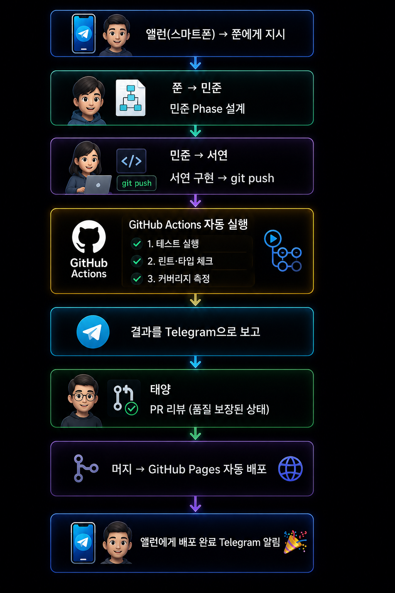

## 8-2. GitHub Actions 기반 자동화

## GitHub Actions란?

**GitHub Actions**는 GitHub에 내장된 CI/CD 자동화 플랫폼입니다. 코드 푸시, PR 생성, 스케줄 등 다양한 이벤트에 반응하여 빌드·테스트·배포 작업을 자동으로 실행합니다.

멀티에이전트 팀과 GitHub Actions를 결합하면 강력한 자동화가 완성됩니다. 서연(개발자)이 코드를 푸시하는 순간 자동으로 테스트가 실행되고, 통과하면 자동으로 배포됩니다. 태양(리뷰어)은 PR에 자동으로 코드 품질 보고서가 달린 상태로 리뷰를 시작합니다.

<hr>

## 기본 워크플로우 구조

GitHub Actions 워크플로우는 `.github/workflows/` 디렉터리에 YAML 파일로 작성합니다.

```yaml
# .github/workflows/ci.yml
name: CI

on:
  push:
    branches: [main, develop]
  pull_request:
    branches: [main]

jobs:
  test:
    runs-on: ubuntu-latest
    steps:
      - uses: actions/checkout@v4
      - name: Setup Node.js
        uses: actions/setup-node@v4
        with:
          node-version: '20'
      - name: Install dependencies
        run: npm ci
      - name: Run tests
        run: npm test
```

워크플로우의 핵심 구성 요소입니다.

| 요소 | 설명 |
|------|------|
| `on` | 워크플로우를 실행할 트리거 이벤트 |
| `jobs` | 병렬 또는 순서대로 실행할 작업 단위 |
| `steps` | 각 job 내에서 순서대로 실행할 단계 |
| `runs-on` | 실행 환경 (ubuntu-latest, windows-latest 등) |

<hr>

## 멀티에이전트 팀과 연동하는 실전 워크플로우

### 1. 테스트 자동화 워크플로우

서연이 코드를 푸시하면 자동으로 테스트가 실행됩니다.

```yaml
# .github/workflows/test.yml
name: TDD Test Suite

on:
  push:
  pull_request:

jobs:
  test:
    runs-on: ubuntu-latest

    steps:
      - uses: actions/checkout@v4

      - name: Setup Python
        uses: actions/setup-python@v5
        with:
          python-version: '3.11'

      - name: Install dependencies
        run: pip install -r requirements.txt

      - name: Run tests with coverage
        run: |
          pytest --tb=short --cov=src --cov-report=term-missing
          
      - name: Report to Telegram on failure
        if: failure()
        run: |
          curl -s -X POST "https://api.telegram.org/bot${{ secrets.TELEGRAM_BOT_TOKEN }}/sendMessage" \
            -d chat_id="${{ secrets.TELEGRAM_CHAT_ID }}" \
            -d text="❌ 테스트 실패: ${{ github.repository }} / ${{ github.ref_name }}"
```

Telegram 알림을 위해 GitHub Secrets에 봇 토큰을 등록합니다.

```bash
# GitHub 저장소 → Settings → Secrets and variables → Actions
# TELEGRAM_BOT_TOKEN: 봇 토큰
# TELEGRAM_CHAT_ID: 앨런의 chat ID
```

### 2. GitHub Pages 자동 배포 워크플로우

도서 집필 프로젝트에서 사용한 실제 배포 워크플로우입니다.

```yaml
# .github/workflows/deploy-pages.yml
name: Deploy to GitHub Pages

on:
  push:
    branches: [main]
    paths:
      - 'pages/**'
      - 'TOC.md'
      - 'build.py'

permissions:
  contents: read
  pages: write
  id-token: write

jobs:
  build:
    runs-on: ubuntu-latest
    steps:
      - uses: actions/checkout@v4

      - name: Setup Python
        uses: actions/setup-python@v5
        with:
          python-version: '3.11'

      - name: Build combined markdown
        run: python3 build.py

      - name: Setup Pages
        uses: actions/configure-pages@v4

      - name: Upload artifact
        uses: actions/upload-pages-artifact@v3
        with:
          path: './dist'

  deploy:
    environment:
      name: github-pages
      url: ${{ steps.deployment.outputs.page_url }}
    runs-on: ubuntu-latest
    needs: build
    steps:
      - name: Deploy to GitHub Pages
        id: deployment
        uses: actions/deploy-pages@v4
```

`paths` 필터를 사용하면 페이지 파일이 변경될 때만 배포가 실행됩니다. 불필요한 배포를 줄여 Actions 사용량을 절약합니다.

### 3. 코드 품질 자동 점검

태양(리뷰어)이 수동으로 확인하기 전에 자동 품질 검사를 실행합니다.

```yaml
# .github/workflows/quality.yml
name: Code Quality

on:
  pull_request:

jobs:
  lint:
    runs-on: ubuntu-latest
    steps:
      - uses: actions/checkout@v4

      - name: Setup Node.js
        uses: actions/setup-node@v4
        with:
          node-version: '20'
          cache: 'npm'

      - run: npm ci

      - name: ESLint
        run: npx eslint . --format=github

      - name: TypeScript type check
        run: npx tsc --noEmit

      - name: Prettier check
        run: npx prettier --check "**/*.{ts,tsx,json}"
```

PR에 자동으로 린트·타입 체크·포맷 검사 결과가 표시됩니다. 태양이 리뷰를 시작할 때 이미 기본 품질이 보장된 상태입니다.

<hr>

## GitHub Actions 시크릿 관리

민감한 정보(API 키, 토큰 등)는 반드시 GitHub Secrets에 등록합니다.

### 시크릿 등록 방법

```bash
# GitHub CLI로 시크릿 등록
gh secret set TELEGRAM_BOT_TOKEN --body "1234567890:AABBcc..."
gh secret set TELEGRAM_CHAT_ID --body "56518471"
gh secret set GITHUB_PAT --body "ghp_xxxxxxxxxxxx"
```

### 워크플로우에서 시크릿 사용

```yaml
steps:
  - name: Deploy
    env:
      API_KEY: ${{ secrets.MY_API_KEY }}
    run: ./deploy.sh
```

> **주의**: 시크릿은 로그에 절대 출력되지 않도록 자동으로 마스킹됩니다. 그러나 시크릿 값을 파일에 쓰거나 다른 방식으로 노출하지 않도록 주의합니다.

<hr>

## 스케줄 기반 자동화

매일 정해진 시간에 작업을 실행하는 워크플로우입니다.

```yaml
# .github/workflows/daily-report.yml
name: Daily Status Report

on:
  schedule:
    # 매일 오전 9시 (UTC 0시, KST 9시)
    - cron: '0 0 * * *'
  workflow_dispatch:  # 수동 실행도 가능

jobs:
  report:
    runs-on: ubuntu-latest
    steps:
      - uses: actions/checkout@v4

      - name: Generate report
        run: python3 scripts/generate-report.py

      - name: Send to Telegram
        run: |
          REPORT=$(cat report.txt)
          curl -s -X POST "https://api.telegram.org/bot${{ secrets.TELEGRAM_BOT_TOKEN }}/sendMessage" \
            -d chat_id="${{ secrets.TELEGRAM_CHAT_ID }}" \
            -d text="📊 일일 리포트\n\n${REPORT}"
```

`workflow_dispatch`를 추가하면 GitHub UI에서 수동으로도 실행할 수 있습니다.

<hr>

## 실전 팁

### 캐시 활용으로 빌드 속도 향상

```yaml
- name: Cache npm packages
  uses: actions/cache@v4
  with:
    path: ~/.npm
    key: ${{ runner.os }}-npm-${{ hashFiles('**/package-lock.json') }}
    restore-keys: |
      ${{ runner.os }}-npm-
```

의존성 캐시를 활용하면 `npm install` 시간을 대폭 줄일 수 있습니다.

### 병렬 job으로 속도 향상

```yaml
jobs:
  test-unit:
    runs-on: ubuntu-latest
    steps: ...

  test-integration:     # 동시에 실행
    runs-on: ubuntu-latest
    steps: ...

  deploy:
    needs: [test-unit, test-integration]  # 둘 다 통과해야 실행
    runs-on: ubuntu-latest
    steps: ...
```

멀티에이전트 팀이 병렬로 작업하듯, GitHub Actions도 job을 병렬로 실행하여 전체 파이프라인 시간을 줄입니다.

### 조건부 실행

```yaml
- name: Deploy to production
  if: github.ref == 'refs/heads/main' && github.event_name == 'push'
  run: ./deploy-prod.sh

- name: Deploy to staging
  if: github.ref == 'refs/heads/develop'
  run: ./deploy-staging.sh
```

브랜치에 따라 다른 환경에 배포하는 조건부 실행입니다.

<hr>

## 멀티에이전트 팀과의 통합 흐름

최종적으로 멀티에이전트 팀과 GitHub Actions가 통합된 전체 흐름입니다.

```
앨런(스마트폰) → 쭌에게 지시
                   ↓
               민준 Phase 설계
                   ↓
           서연 구현 → git push
                   ↓
          GitHub Actions 자동 실행
          ┌─────────────────────────┐
          │ 1. 테스트 실행           │
          │ 2. 린트·타입 체크        │
          │ 3. 커버리지 측정          │
          └─────────────────────────┘
                   ↓
          결과를 Telegram으로 보고
                   ↓
          태양 PR 리뷰 (품질 보장된 상태)
                   ↓
          머지 → GitHub Pages 자동 배포
                   ↓
          앨런에게 배포 완료 Telegram 알림
```


이 흐름이 완성되면 앨런은 스마트폰으로 지시만 내리고, 코드 작성부터 배포·알림까지 전 과정이 자동으로 이루어집니다.

> **핵심 요약**: GitHub Actions는 멀티에이전트 팀의 자동화를 완성하는 마지막 레이어입니다. 팀이 코드를 작성하고 푸시하는 순간부터 최종 배포까지, 사람의 개입 없이 파이프라인이 흘러갑니다.

<hr>

## 워크플로우 디버깅

GitHub Actions 워크플로우가 실패할 때 원인을 찾는 방법입니다.

### 로그 확인

GitHub 저장소 → Actions 탭 → 실패한 워크플로우 선택 → 실패한 step 클릭으로 상세 로그를 확인합니다.

```bash
# GitHub CLI로 워크플로우 실행 목록 확인
gh run list --limit 10

# 특정 실행의 상세 로그
gh run view <run-id> --log-failed
```

### 로컬에서 워크플로우 테스트

`act` 도구를 사용하면 GitHub Actions를 로컬에서 실행하여 빠르게 디버깅할 수 있습니다.

```bash
# act 설치
brew install act  # macOS
# 또는
curl -s https://raw.githubusercontent.com/nektos/act/master/install.sh | bash

# 로컬에서 push 이벤트 시뮬레이션
act push

# 특정 job만 실행
act push -j test
```

### 자주 발생하는 오류

| 오류 | 원인 | 해결법 |
|------|------|--------|
| `Permission denied` | GITHUB_TOKEN 권한 부족 | `permissions` 블록 추가 |
| `Cache miss every run` | 캐시 키 오류 | `hashFiles` 경로 확인 |
| `Artifact not found` | job 간 아티팩트 미전달 | `upload-artifact` 확인 |
| `Environment not found` | 환경 이름 오타 | Settings → Environments 확인 |
| `Secret not available` | 시크릿 미등록 | Settings → Secrets 등록 |

<hr>

## GitHub Actions 비용 최적화

GitHub Actions는 월 2,000분(무료 계정) 또는 3,000분(Pro) 무료로 제공됩니다. 팀이 활발하게 작업하면 빠르게 소진될 수 있습니다.

### 불필요한 실행 줄이기

```yaml
on:
  push:
    branches: [main]
    paths:
      - 'src/**'        # src 변경 시만 실행
      - '!src/**/*.md'  # md 파일은 제외
```

### 조기 종료 설정

```yaml
jobs:
  test:
    timeout-minutes: 10  # 10분 초과 시 자동 취소
    steps:
      - name: Run tests
        run: npm test
```

### 실행 취소 설정

같은 브랜치에서 새 push가 들어오면 이전 실행을 자동으로 취소합니다.

```yaml
concurrency:
  group: ${{ github.workflow }}-${{ github.ref }}
  cancel-in-progress: true
```

개발 중에 빠르게 여러 번 push할 때 이전 실행이 낭비되지 않도록 합니다. 실제로 이 설정 하나로 Actions 사용량을 40% 이상 줄일 수 있습니다.
