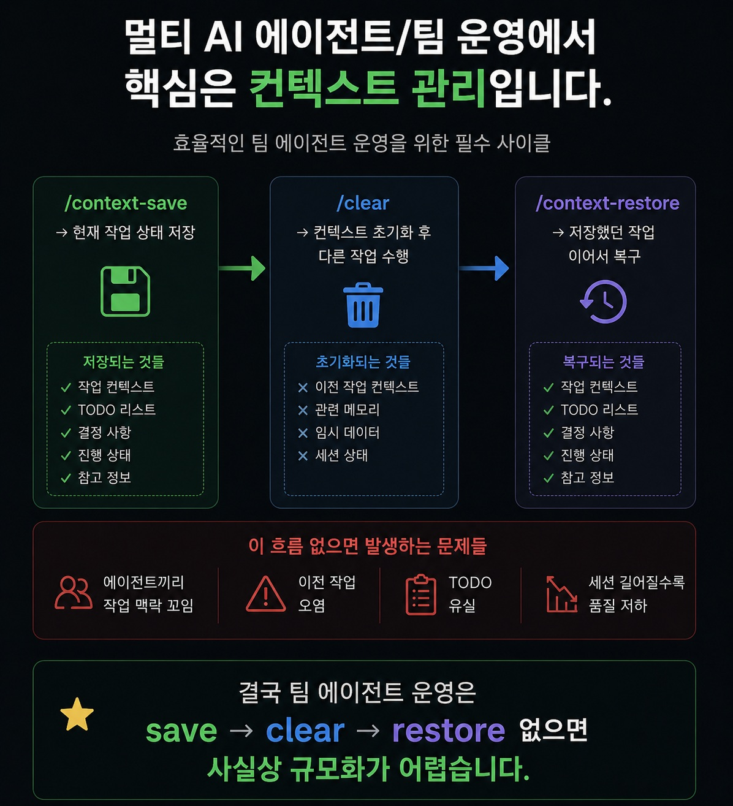
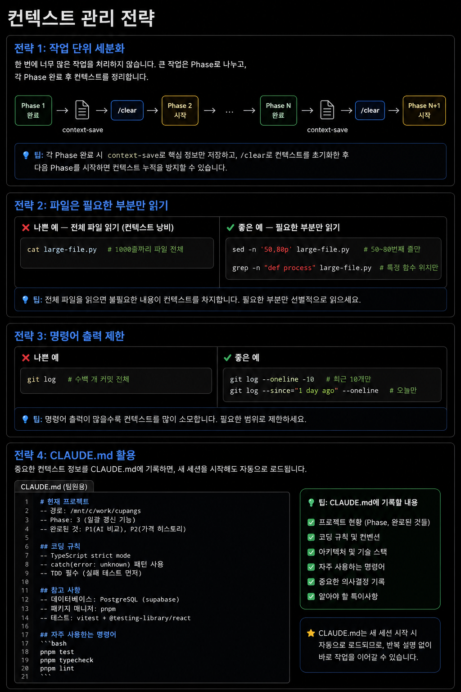

## 8-3. 컨텍스트 관리 기법

## 컨텍스트란 무엇인가?

Claude Code와 대화를 나누면 모든 메시지, 파일 내용, 명령어 출력이 **컨텍스트(Context)**에 쌓입니다. 컨텍스트는 AI가 현재 작업을 이해하는 기억 공간이지만, 크기에 제한이 있습니다. 컨텍스트가 가득 차면 오래된 내용이 밀려나거나 세션이 불안정해집니다.

멀티에이전트 팀에서는 이 문제가 더 심각합니다. 6명의 에이전트가 동시에 작업하면 각자의 컨텍스트가 독립적으로 소비됩니다. 한 명이라도 컨텍스트가 가득 차면 그 팀원의 작업 연속성이 끊깁니다.

Claude Code는 현재 컨텍스트 사용량을 백분율로 표시합니다. **70%를 초과하면 즉각 관리가 필요**합니다.

<hr>

## 컨텍스트 소비 요인

컨텍스트를 빠르게 소비하는 주요 원인입니다.

| 요인 | 설명 | 절약 방법 |
|------|------|----------|
| 대용량 파일 읽기 | `cat` 으로 큰 파일 전체 읽기 | 필요한 줄만 읽기 |
| 긴 명령어 출력 | `git log` 전체, `ls -laR` 등 | RTK로 필터링 |
| 반복 도구 호출 | 같은 파일 여러 번 읽기 | 첫 번째 읽기 결과 활용 |
| 누적 대화 | 긴 작업 세션 | 주기적 context-save + /clear |
| 에러 메시지 | 긴 스택 트레이스 반복 | RTK 필터링 |

<hr>

## RTK를 활용한 컨텍스트 절약

**RTK(Rust Token Killer)**는 Claude Code 훅과 연동하여 명령어 출력을 자동으로 필터링합니다. 개발자가 별도로 신경 쓰지 않아도 `git status`, `ls`, `npm install` 등의 출력이 자동 압축됩니다.

```bash
# RTK 절약 현황 확인
rtk gain

# 출력 예시
Total tokens saved: 847,293 (63.2% reduction)
Commands intercepted: 1,847
Top savers:
  git log        → 89% reduction
  ls             → 71% reduction
  npm install    → 68% reduction
```

RTK가 없다면 `git log`만으로도 수천 줄의 히스토리가 컨텍스트를 채웁니다. RTK는 핵심 정보만 남기고 나머지를 제거하여 **같은 정보를 훨씬 적은 토큰으로 전달**합니다.

<hr>

## context-save / context-restore

Claude Code의 `/context-save`와 `/context-restore` 명령어는 현재 작업 상태를 파일에 저장하고 나중에 불러옵니다. 컨텍스트를 완전히 초기화하고도 작업을 이어갈 수 있습니다.

### context-save 사용 시점

- 컨텍스트가 70% 이상 도달했을 때
- 긴 작업 중간에 세션을 쉬어야 할 때
- 다른 작업으로 잠시 전환해야 할 때

```bash
# 현재 작업 상태 저장
/context-save

# 저장 후 컨텍스트 초기화
/clear

# 새 세션에서 이전 작업 복원
/context-restore
```


저장되는 내용에는 현재 진행 중인 작업, 중요한 결정 사항, 남은 작업 목록, git 상태 등이 포함됩니다.

### 멀티에이전트 팀에서의 활용

쭌(팀장)은 5분 체크 루프로 모든 팀원의 컨텍스트를 주기적으로 확인합니다.

```bash
# 각 pane의 컨텍스트 사용량 확인
# (Claude Code UI의 좌하단 퍼센트 표시)
```

팀원 중 하나가 70%를 넘으면:

```bash
# 해당 팀원에게 context-save 지시
bash claude-send.sh 4 "/context-save"

# 저장 완료 확인 후 /clear 지시 (slash command는 tmux 직접 사용)
sleep 3
tmux send-keys -t team1:0.4 '/clear' Enter
```

새 세션이 시작되면 팀원은 `/context-restore`로 중단 지점부터 재개합니다.

<hr>

## 컨텍스트 관리 전략

### 전략 1: 작업 단위 세분화

한 번에 너무 많은 작업을 처리하지 않습니다. 큰 작업은 Phase로 나누고, 각 Phase 완료 후 컨텍스트를 정리합니다.

```
Phase 1 완료 → context-save → /clear → Phase 2 시작
Phase 2 완료 → context-save → /clear → Phase 3 시작
```

### 전략 2: 파일은 필요한 부분만 읽기

```bash
# 나쁜 예 — 전체 파일 읽기 (컨텍스트 낭비)
cat large-file.py  # 1000줄짜리 파일 전체

# 좋은 예 — 필요한 부분만 읽기
sed -n '50,80p' large-file.py  # 50~80번째 줄만
grep -n "def process" large-file.py  # 특정 함수 위치만
```

### 전략 3: 명령어 출력 제한

```bash
# 나쁜 예
git log  # 수백 개 커밋 전체

# 좋은 예
git log --oneline -10  # 최근 10개만
git log --since="1 day ago" --oneline  # 오늘만
```

### 전략 4: CLAUDE.md 활용

중요한 컨텍스트 정보를 CLAUDE.md에 기록하면, 새 세션을 시작해도 자동으로 로드됩니다.

```markdown
# CLAUDE.md (팀원용)

## 현재 프로젝트
- 경로: /mnt/c/work/cupangs
- Phase: 3 (일괄 갱신 기능)
- 완료된 것: P1(AI 비교), P2(가격 히스토리)

## 코딩 규칙
- TypeScript strict mode
- catch(error: unknown) 패턴 사용
- TDD 필수 (실패 테스트 먼저)
```



<hr>

## 팀원별 컨텍스트 모니터링

쭌의 5분 체크 루프는 컨텍스트 모니터링도 포함합니다.

```
체크 항목:
1. 각 pane 작업 중인지 확인
2. 컨텍스트 사용량 70% 초과 여부
3. Rate limit 도달 여부
4. 장기 미응답 여부 (hang 감지)
```

이상이 발견되면 즉시 민준에게 보고하고, 민준이 해당 팀원에게 적절한 조치를 지시합니다.

```bash
# 이상 발견 시 민준에게 보고
bash claude-send.sh 1 "서연(P4) 컨텍스트 82%. context-save 후 /clear 처리 필요."
```

<hr>

## 컨텍스트 초기화 없이 관리하는 방법

때로는 /clear 없이 컨텍스트를 줄여야 하는 상황이 있습니다. 이때는 **컴팩션(compaction)** 기능을 활용합니다.

Claude Code는 컨텍스트가 일정 수준을 넘으면 자동으로 이전 내용을 요약하여 압축합니다. 이 과정에서 세부 내용은 손실되지만 핵심 맥락은 유지됩니다.

자동 컴팩션이 발생하면 다음과 같은 메시지가 표시됩니다.

```
[Context compacted: 47 messages summarized]
```

자동 컴팩션에 의존하기보다는 **70% 규칙**을 적용하여 사전에 context-save + /clear를 실행하는 것이 더 안전합니다. 컴팩션은 요약 과정에서 중요한 세부 사항을 잃을 수 있습니다.

> **핵심 요약**: 컨텍스트 관리는 멀티에이전트 팀의 지속적인 운영을 위한 필수 기술입니다. RTK로 소비를 줄이고, 70% 규칙으로 사전 저장하며, CLAUDE.md로 핵심 정보를 유지하면 컨텍스트 문제 없이 장기 작업을 이어갈 수 있습니다.

<hr>

## 장기 프로젝트 컨텍스트 관리 전략

수 일~수 주에 걸친 장기 프로젝트에서는 단기 프로젝트와 다른 전략이 필요합니다.

### Daily 메모리 파일 활용

매일 작업 종료 시 당일 진행 상황을 파일로 기록합니다. 다음 날 새 세션을 시작할 때 이 파일을 먼저 읽으면 컨텍스트 없이도 흐름을 이어갈 수 있습니다.

```markdown
# 2026-05-20 Daily Log

## 완료한 것
- Phase 3 구현 완료 (커밋 abc1234)
- 태양 리뷰 통과

## 미완료 (내일 이어서)
- Phase 4: 발송 승인 UI 구현 예정
- 의존성: Phase 3의 MailQueue 클래스 활용

## 주의사항
- WSL 환경에서 IMAP 포트 143 사용 (993 타임아웃 문제)
- EmailService의 retry 로직 아직 미구현
```

저장 위치: `/mnt/c/work/memory/30_Daily/YYYY-MM-DD.md`

### 메모리 파일과 CLAUDE.md 조합

세션 간 핵심 정보는 CLAUDE.md에, 일별 진행 상황은 Daily 파일에 나눠 관리합니다.

```
CLAUDE.md          → 변하지 않는 규칙·역할·아키텍처
Daily/YYYY-MM-DD   → 오늘의 진행 상황·결정·미완료 작업
context-save       → 현재 세션의 상세 상태
```

세 가지를 조합하면 어떤 세션에서 시작하더라도 완전한 맥락을 복원할 수 있습니다.

### 컨텍스트 사용량 계산 기준

대략적인 컨텍스트 소비량을 사전에 예측하면 관리가 쉬워집니다.

| 작업 유형 | 대략적 토큰 소비 |
|-----------|----------------|
| 짧은 지시 메시지 | 50~200 토큰 |
| 파일 읽기 (100줄) | 2,000~4,000 토큰 |
| `git log` (20개 커밋) | 1,000~3,000 토큰 |
| `npm install` 출력 (RTK 적용) | 200~500 토큰 |
| `npm install` 출력 (RTK 없음) | 5,000~15,000 토큰 |
| 테스트 실행 결과 (50개) | 1,000~3,000 토큰 |

Claude Sonnet 4.6의 컨텍스트 한도는 200,000 토큰입니다. 70% 기준으로는 약 140,000 토큰이 임계치입니다. 큰 파일을 자주 읽는 작업은 생각보다 빠르게 컨텍스트를 소진합니다.

### 비상 컨텍스트 복구

context-save 없이 세션이 끊겼을 때 복구하는 방법입니다.

```bash
# 1. 마지막 git 커밋으로 작업 상태 파악
git log --oneline -10
git show HEAD --stat

# 2. 진행 중이던 브랜치 확인
git branch -a | grep feature/

# 3. 미완료 파일 파악 (TODO 주석 검색)
grep -rn "TODO\|FIXME\|WIP" src/

# 4. 테스트로 현재 상태 확인
npm test 2>&1 | tail -20
```

git 히스토리와 테스트 결과만으로도 어디까지 완료했는지 빠르게 파악할 수 있습니다. 이것이 TDD와 잦은 커밋이 중요한 또 다른 이유입니다.
