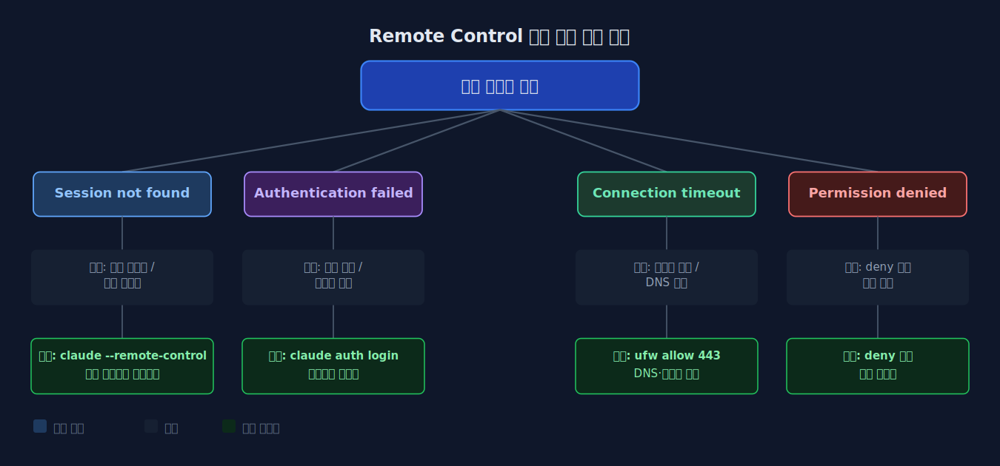
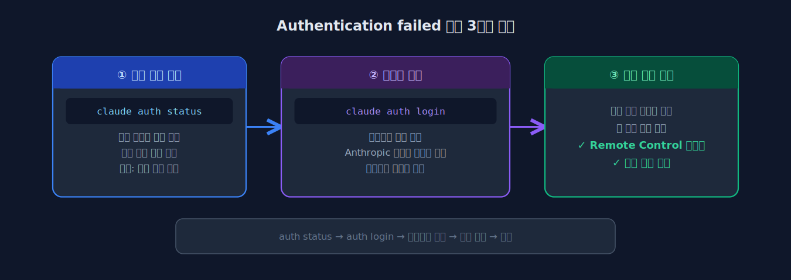
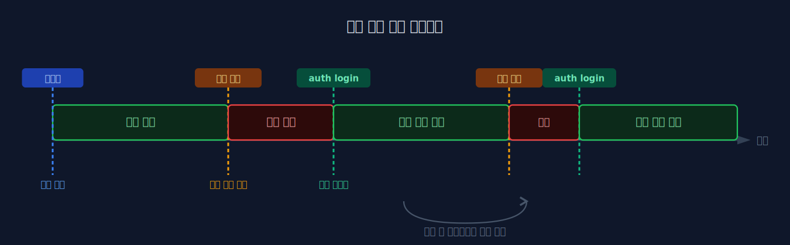
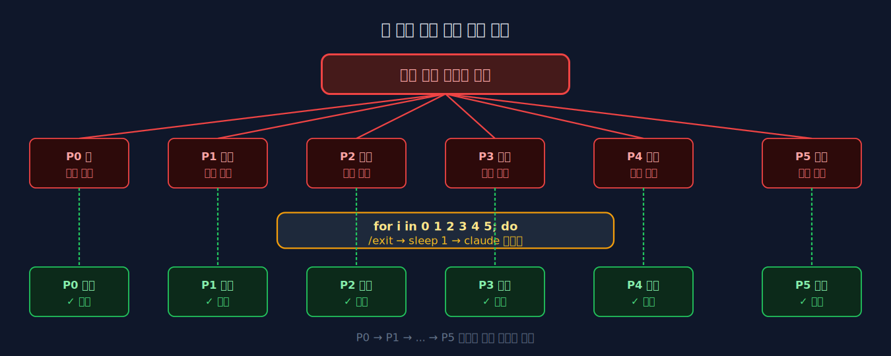
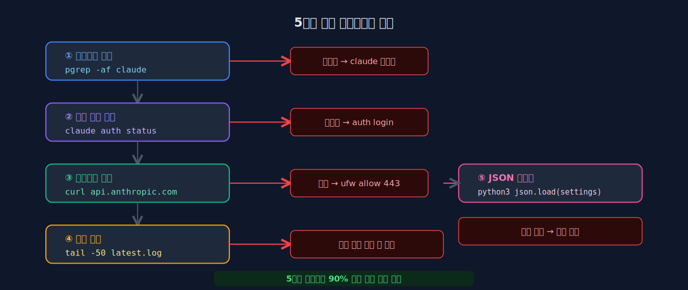

## 9-1. Remote-Control 인증 오류 해결

## 이 절에서 배우는 것

Remote Control을 사용하다 보면 인증 관련 오류를 마주칠 때가 있다. 대부분의 문제는 토큰 만료, 계정 불일치, 네트워크 설정에서 발생한다. 이 절에서는 자주 발생하는 인증 오류와 해결 방법을 증상별로 단계적으로 정리한다.

> 💡 **인증 토큰(Auth Token)이란?** 비밀번호를 매번 입력하는 대신, 로그인 후 발급받은 "임시 열쇠"입니다. 이 열쇠로 서버에 접속하는데, 일정 기간이 지나면 만료되어 새 열쇠를 발급받아야 합니다. 토큰이 만료되면 갑자기 연결이 거부되는 것처럼 보일 수 있습니다.



<hr>

## 증상별 진단 가이드

### 1. "Session not found" — 세션을 찾을 수 없음

모바일에서 세션 목록이 비어있거나 연결 시 "Session not found" 오류가 표시된다.

**원인과 해결:**

| 원인                    | 확인 방법                      | 해결                          |
| --------------------- | -------------------------- | --------------------------- |
| Claude Code가 실행 중이 아님 | `pgrep -f claude`          | Claude Code 재실행             |
| 서버 모드가 아님             | 터미널에서 Remote Control 상태 확인 | `--remote-control` 플래그로 재시작 |
| 다른 Anthropic 계정       | 모바일과 서버의 계정 비교             | 동일 계정으로 로그인                 |
| 세션 이름 불일치             | `claude --resume`          | 올바른 세션 이름으로 접속              |

**확인 절차:**

**1단계: Claude Code 실행 여부 확인**
```bash
pgrep -f claude
# 숫자(프로세스 ID)가 출력되면 실행 중, 아무것도 안 나오면 실행 중이 아님
```

**2단계: 서버 모드로 재시작**
```bash
claude --remote-control
```

> 💡 **`pgrep -f`란?** 현재 실행 중인 프로세스 중에서 이름에 특정 단어가 포함된 것을 찾는 명령어입니다. `pgrep -f claude`는 "claude"라는 단어가 포함된 프로세스 번호를 출력합니다. 번호가 나오면 실행 중, 아무것도 나오지 않으면 종료된 것입니다.

### 2. "Authentication failed" — 인증 실패

연결 시도 시 인증 실패 오류가 발생한다.

**해결 과정:**

**1단계: 현재 로그인된 계정 확인**
```bash
claude auth status
```

**2단계: 인증 토큰이 만료되었으면 재인증**
```bash
claude auth login
```

**3단계: 브라우저 인증 완료**

브라우저가 자동으로 열리며 Anthropic 계정으로 로그인한다. 로그인 후 터미널에 표시되는 인증 코드를 입력하면 새 토큰이 발급된다.



### 3. "Connection timeout" — 연결 시간 초과

모바일에서 세션을 선택했지만 연결이 되지 않고 타임아웃이 발생한다.

**원인과 해결:**

**1단계: 네트워크 연결 확인**
```bash
ping -c 3 api.anthropic.com
```

**2단계: DNS 확인**
```bash
nslookup api.anthropic.com
```

**3단계: 방화벽이 HTTPS 아웃바운드를 차단하는 경우 허용**
```bash
sudo ufw allow out 443/tcp
```

WSL2 환경에서는 Windows 방화벽이 아웃바운드 연결을 차단하는 경우가 있다. Windows Defender 방화벽 설정에서 WSL2 관련 규칙을 확인한다.

> 💡 **포트 443이란?** 인터넷에서 HTTPS(암호화된 웹 통신)가 사용하는 문 번호입니다. `ufw allow out 443/tcp`는 "이 포트를 통한 외부 연결을 허용하라"는 뜻입니다. Claude Code는 Anthropic 서버와 HTTPS로 통신하므로, 이 포트가 막히면 연결 자체가 불가능합니다.

### 4. "Permission denied" — 권한 거부

세션에는 연결되지만 도구 실행 시 "Permission denied"가 반복된다.

**1단계: 사용자 설정 파일의 deny 규칙 확인**
```bash
cat ~/.claude/settings.json | grep -A 20 "deny"
```

**2단계: 프로젝트별 설정도 확인**
```bash
cat .claude/settings.json | grep -A 20 "deny"
```

과도한 `deny` 규칙이 정상 명령어까지 차단하고 있을 수 있다. 패턴을 좁히거나 불필요한 규칙을 제거한다.

> 💡 **settings.json의 deny 규칙이란?** Claude Code가 실행할 수 있는 명령어를 제한하는 목록입니다. 보안을 위해 위험한 명령어를 차단하는 데 유용하지만, 너무 광범위하게 설정하면 정상적인 개발 명령어까지 막힐 수 있습니다. `grep -A 20 "deny"`는 "deny" 단어 이후 20줄을 출력해 규칙을 확인합니다.

<hr>

## 인증 토큰 관리

### 토큰 만료 주기

Anthropic 인증 토큰은 일정 기간이 지나면 만료된다. 장기간 실행 중인 Claude Code 세션에서 갑자기 인증 오류가 발생한다면 토큰 만료를 의심한다.

**인증 상태 확인:**
```bash
claude auth status
# 출력 예시:
# Logged in as: user@example.com
# Token expires: 2026-05-15T00:00:00Z
```

**토큰 갱신:**
```bash
claude auth login
```



### 여러 계정 사용 시

팀 환경에서 여러 Anthropic 계정을 사용하는 경우 계정 전환에 주의한다.

**현재 계정 확인:**
```bash
claude auth status
```

**로그아웃 후 다른 계정으로 전환:**
```bash
claude auth logout
claude auth login
```

<hr>

## TMUX 팀 환경에서의 인증 문제

### 모든 파인이 동시에 인증 실패하는 경우

팀 세션의 모든 파인이 같은 계정을 사용한다면, 토큰 만료 시 전체가 동시에 실패한다.

> 💡 **파인(Pane)이란?** TMUX 화면을 여러 구역으로 나눈 각각의 창입니다. 6명 팀을 운용할 때는 화면을 6개 파인으로 분할하여 각 파인에서 Claude Code가 실행됩니다. 모든 파인이 같은 계정을 쓰므로, 토큰이 만료되면 6개 파인이 동시에 인증 오류를 냅니다.

**모든 파인 일괄 재시작:**
```bash
for i in 0 1 2 3 4 5; do
  tmux send-keys -t team:0.$i "/exit" Enter
  sleep 1
  tmux send-keys -t team:0.$i "claude" Enter
done
```



### 특정 파인만 인증 실패하는 경우

하나의 파인만 문제가 있다면 해당 파인의 Claude Code 프로세스를 개별적으로 재시작한다.

**문제 파인(예: Pane 3) 개별 재시작:**
```bash
tmux send-keys -t team:0.3 "/exit" Enter
sleep 2
tmux send-keys -t team:0.3 "claude" Enter
```

<hr>

## 진단 명령어 모음

문제 발생 시 아래 5단계 순서로 진단하면 원인을 빠르게 찾을 수 있다.

**1단계: Claude Code 프로세스 확인**
```bash
pgrep -af claude
```

**2단계: 인증 상태 확인**
```bash
claude auth status
```

**3단계: 네트워크 연결 확인**
```bash
curl -s -o /dev/null -w "%{http_code}" https://api.anthropic.com/v1/messages
# 200 또는 401이면 네트워크 정상 (401은 인증만 실패)
```

> 💡 **curl 응답 코드 읽는 법** `200`은 "정상", `401`은 "인증 실패(네트워크는 됨)", `000`은 "서버에 도달 자체가 안 됨"을 의미합니다. 401이 나오면 네트워크는 정상이고 인증 토큰만 갱신하면 됩니다.

**4단계: 로그 확인**
```bash
ls -lt ~/.claude/logs/ | head -5
tail -50 ~/.claude/logs/latest.log
```

**5단계: 설정 파일 유효성 확인**
```bash
python3 -c "import json; json.load(open('$HOME/.claude/settings.json'))" \
    && echo "유효한 JSON" \
    || echo "JSON 구문 오류"
```



<hr>

## 요약

Remote Control 인증 문제의 90%는 **토큰 만료**, **계정 불일치**, **네트워크 차단** 중 하나다. `claude auth status`로 인증 상태를 확인하고, `pgrep`으로 프로세스 생존을 확인하고, `curl`로 네트워크 연결을 확인하는 세 단계 진단만으로 대부분의 문제를 해결할 수 있다.
