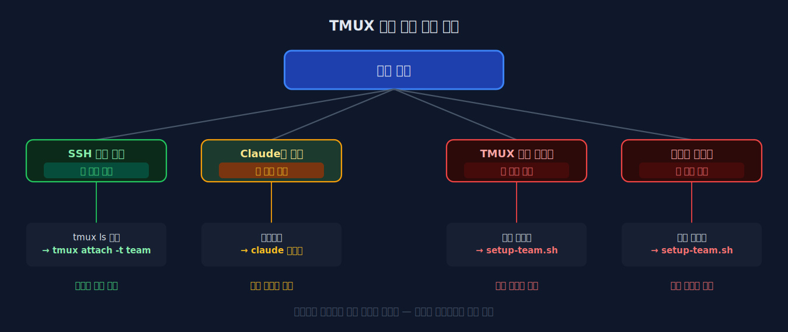
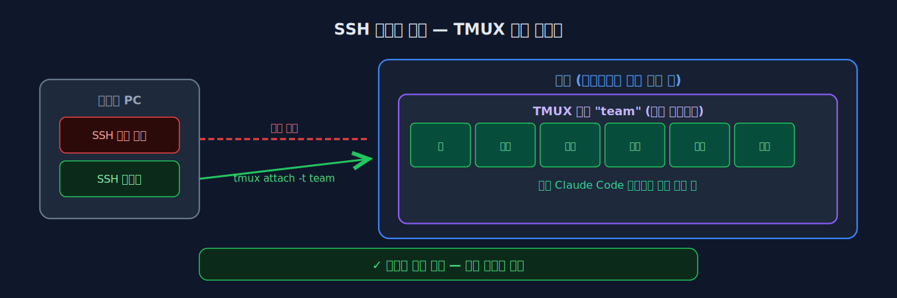
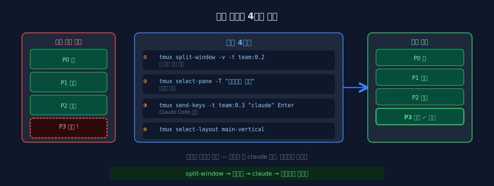
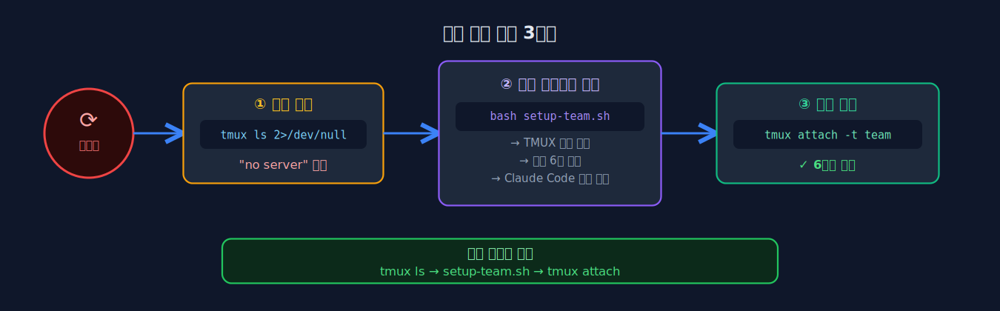
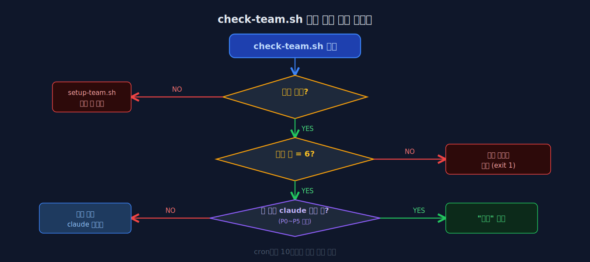
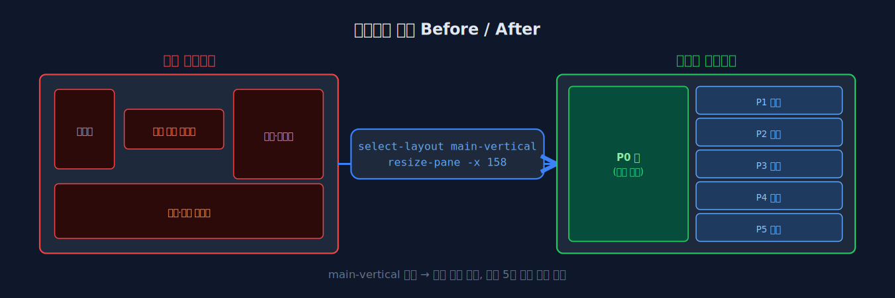
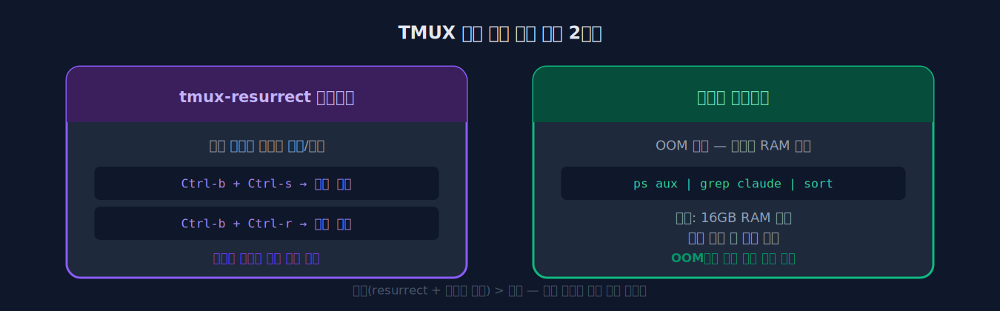

## 9-2. TMUX 세션 복구 및 재연결

## 이 절에서 배우는 것

TMUX 기반 팀 환경을 운용하다 보면 세션이 끊기거나, 파인이 사라지거나, 레이아웃이 깨지는 상황이 발생한다. 이 절에서는 상황별 원인을 파악하고 팀 세션을 빠르게 복구하는 단계별 방법을 다룬다.

> 💡 **TMUX 세션이 SSH와 독립적인 이유** TMUX는 "터미널 멀티플렉서"로, 서버 위에서 독자적으로 실행됩니다. SSH는 사용자 PC와 서버를 연결하는 통로일 뿐입니다. SSH 연결이 끊겨도 서버 위의 TMUX는 계속 살아있으므로, 재접속하면 그대로 이어서 작업할 수 있습니다.

<hr>

## 흔한 문제 상황

| 상황 | 원인 | 위험도 |
|------|------|--------|
| SSH 연결 끊김 | 네트워크 불안정 | 낮음 — 세션은 살아있음 |
| 특정 파인의 Claude 종료 | OOM, 수동 종료 | 중간 — 해당 파인만 복구 |
| TMUX 서버 크래시 | 시스템 리소스 부족 | 높음 — 전체 재구성 필요 |
| 시스템 재부팅 | 업데이트, 정전 | 높음 — 전체 재구성 필요 |

> 💡 **OOM(Out of Memory)이란?** 프로그램이 필요한 메모리보다 시스템 여유 메모리가 부족할 때, 운영체제가 강제로 프로세스를 종료하는 현상입니다. Claude Code는 6개가 동시에 실행되면 상당한 메모리를 소모하므로, 메모리가 부족한 환경에서 갑작스럽게 종료될 수 있습니다.



<hr>

## 상황 1: SSH 연결이 끊어졌을 때

가장 흔하고 가장 안전한 상황이다. TMUX 세션은 SSH 연결과 독립적으로 유지된다.

**1단계: SSH 재접속 후 세션 목록 확인**
```bash
tmux ls
# 출력: team: 1 windows (created Mon Apr 28 10:00:00 2026)
```

**2단계: 세션에 재연결**
```bash
tmux attach -t team
```

연결만 끊어진 것이므로 모든 파인의 Claude Code는 그대로 실행 중이다. 아무런 데이터 손실 없이 그대로 이어서 작업할 수 있다.



<hr>

## 상황 2: 특정 파인의 Claude가 종료되었을 때

한 팀원의 Claude Code가 종료되었지만 파인 자체는 살아있는 경우이다.

### 진단

파인에서 Claude Code가 종료되면 일반 쉘 프롬프트(`$`)가 표시된다.

```bash
# 각 파인의 실행 중인 프로세스 확인
for i in 0 1 2 3 4 5; do
  echo -n "Pane $i: "
  tmux send-keys -t team:0.$i "" 2>/dev/null \
    && echo "활성" \
    || echo "비활성"
done
```

### 복구

**1단계: 해당 파인에서 Claude Code 재실행**
```bash
tmux send-keys -t team:0.3 "claude" Enter
```

**2단계: 이전 세션 복구 (히스토리가 있는 경우)**

Claude Code는 이전 대화 히스토리를 로컬에 저장하므로, 재실행 후 `/resume` 명령으로 이전 세션을 이어갈 수 있다.

```bash
tmux send-keys -t team:0.3 "/resume" Enter
```


<hr>

## 상황 3: 파인 자체가 사라졌을 때

TMUX 파인이 닫히면 복구할 수 없다. 새 파인을 생성하고 재설정해야 한다.

### 현재 파인 구조 확인

```bash
tmux list-panes -t team:0 -F "#{pane_index}: #{pane_title} (#{pane_pid})"
# 출력 예시:
# 0: 쭌 (1234)
# 1: 민준 PM·아키텍트 (1235)
# 2: 지훈 리서쳐 (1236)
# 4: 서연 개발자 (1238)
# 5: 태양 리뷰어 (1239)
# → 파인 3(수아)이 없음
```

### 파인 재생성 절차

**1단계: 기존 파인 옆에 새 파인 분할**
```bash
tmux split-window -v -t team:0.2
```

**2단계: 새 파인에 타이틀 설정**
```bash
tmux select-pane -t team:0.3 -T "디자이너 수아"
```

**3단계: Claude Code 실행**
```bash
tmux send-keys -t team:0.3 "claude" Enter
```

**4단계: 레이아웃 재정렬**
```bash
tmux select-layout -t team:0 main-vertical
```



<hr>

## 상황 4: TMUX 세션 전체가 소실되었을 때

시스템 재부팅이나 TMUX 서버 크래시로 세션이 완전히 사라진 경우이다. 셋업 스크립트로 전체를 재구성한다.

**1단계: 세션 존재 여부 확인**
```bash
tmux ls 2>/dev/null || echo "세션 없음"
```

**2단계: 셋업 스크립트로 전체 재구성**
```bash
bash /mnt/c/work/Team/setup-team.sh
```

**3단계: 새로 생성된 세션에 접속**
```bash
tmux attach -t team
```

셋업 스크립트는 TMUX 세션 생성, 파인 분할, 타이틀 설정, Claude Code 실행을 자동으로 수행한다.



<hr>

## 자동 복구 스크립트

수동 복구가 번거롭다면 상태를 점검하고 자동 복구하는 스크립트를 작성할 수 있다.

```bash
#!/bin/bash
# check-team.sh — 팀 세션 상태 점검 및 복구

SESSION="team"
EXPECTED_PANES=6
TITLES=("쭌" "민준 PM·아키텍트" "지훈 리서쳐" "디자이너 수아" "서연 개발자" "태양 리뷰어")

# 1. 세션 존재 확인
if ! tmux has-session -t $SESSION 2>/dev/null; then
  echo "세션이 없습니다. 재구성합니다..."
  bash /mnt/c/work/Team/setup-team.sh
  exit 0
fi

# 2. 파인 수 확인
CURRENT_PANES=$(tmux list-panes -t $SESSION:0 | wc -l)
if [ "$CURRENT_PANES" -ne "$EXPECTED_PANES" ]; then
  echo "파인 수 불일치: $CURRENT_PANES / $EXPECTED_PANES"
  echo "전체 재구성을 권장합니다."
  exit 1
fi

# 3. 각 파인에서 Claude 실행 상태 확인
for i in 0 1 2 3 4 5; do
  PANE_CMD=$(tmux list-panes -t $SESSION:0 -F "#{pane_index} #{pane_current_command}" \
    | grep "^$i " | awk '{print $2}')
  
  if [ "$PANE_CMD" != "claude" ] && [ "$PANE_CMD" != "node" ]; then
    echo "Pane $i (${TITLES[$i]}): Claude 미실행 — 재시작합니다"
    tmux send-keys -t $SESSION:0.$i "claude" Enter
  else
    echo "Pane $i (${TITLES[$i]}): 정상"
  fi
done

echo "점검 완료"
```



이 스크립트를 cron에 등록하면 주기적으로 팀 상태를 점검할 수 있다.

```bash
# 매 10분마다 팀 상태 점검
crontab -e
# 추가:
# */10 * * * * /home/user/check-team.sh >> /tmp/team-check.log 2>&1
```

> 💡 **cron이란?** 리눅스의 예약 작업 시스템입니다. `*/10 * * * *`는 "매 10분마다 실행"을 의미합니다. `crontab -e`로 편집기를 열어 위 줄을 추가하면, 10분마다 check-team.sh가 자동으로 실행되어 팀 상태를 점검하고 이상이 있으면 자동 복구합니다.

<hr>

## 레이아웃 복구

파인 수는 맞지만 레이아웃이 깨진 경우이다.

**main-vertical 레이아웃 재적용:**
```bash
tmux select-layout -t team:0 main-vertical
```

**Pane 0 너비를 158로 고정:**
```bash
tmux resize-pane -t team:0.0 -x 158
```

**파인 테두리에 타이틀 표시 재설정:**
```bash
tmux set-option -t team pane-border-status top
```



<hr>

## 예방 조치

### TMUX 자동 저장 플러그인

tmux-resurrect 플러그인을 사용하면 세션 상태를 파일로 저장하고 복원할 수 있다.

**설치:**
```bash
git clone https://github.com/tmux-plugins/tmux-resurrect \
    ~/.tmux/plugins/tmux-resurrect
```

**~/.tmux.conf에 추가:**
```bash
# ~/.tmux.conf
run-shell ~/.tmux/plugins/tmux-resurrect/resurrect.tmux
```

> 💡 **~/.tmux.conf란?** TMUX의 설정 파일입니다. 이 파일에 옵션을 추가하면 TMUX를 시작할 때마다 자동으로 적용됩니다. `run-shell` 명령으로 플러그인을 로드합니다.

| 키 바인딩 | 동작 |
|-----------|------|
| `Ctrl-b` + `Ctrl-s` | 현재 세션 상태 저장 |
| `Ctrl-b` + `Ctrl-r` | 마지막 저장된 상태 복원 |

### 시스템 리소스 모니터링

Claude Code는 메모리를 많이 사용한다. 6개 인스턴스를 동시에 실행하면 상당한 메모리가 필요하다.

**Claude Code 프로세스별 메모리 사용량 확인:**
```bash
ps aux | grep claude | grep -v grep | awk '{print $6/1024 "MB", $0}' | sort -rn
```

메모리 부족으로 Claude가 OOM(Out of Memory)으로 종료되는 것을 방지하려면 충분한 RAM(16GB 이상 권장)을 확보하거나, 동시 실행 파인 수를 줄이는 것을 고려한다.



<hr>

## 요약

TMUX 세션 복구의 핵심은 **단계별 진단**이다. SSH 끊김은 재연결만 하면 되고, 파인 내 Claude 종료는 재실행으로 해결되고, 파인 소실은 재생성이 필요하고, 세션 전체 소실은 셋업 스크립트로 재구성한다. `check-team.sh` 같은 자동 점검 스크립트와 tmux-resurrect 플러그인을 활용하면 복구 시간을 크게 줄일 수 있다.
