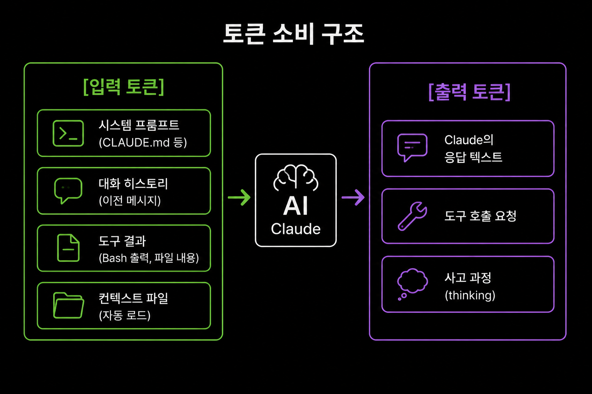

## 8-3. 토큰 최적화 심화

6장에서 RTK를 통한 기본적인 토큰 절약을 다루었다. 이 절에서는 RTK를 넘어서 Claude Code 자체의 설정과 사용 습관을 통해 토큰 소비를 최소화하는 심화 전략을 다룬다.

<hr>

## 토큰이 소비되는 곳

Claude Code에서 토큰이 소비되는 주요 경로를 이해해야 최적화 포인트를 찾을 수 있다.

```
토큰 소비 구조
─────────────────────────────────────
[입력 토큰]
  ├── 시스템 프롬프트 (CLAUDE.md 등)
  ├── 대화 히스토리 (이전 메시지)
  ├── 도구 결과 (Bash 출력, 파일 내용)
  └── 컨텍스트 파일 (자동 로드)

[출력 토큰]
  ├── Claude의 응답 텍스트
  ├── 도구 호출 요청
  └── 사고 과정 (thinking)
```



이 중 가장 큰 비중을 차지하는 것은 **도구 결과**와 **대화 히스토리**다.

<hr>

## 전략 1: CLAUDE.md 최적화

CLAUDE.md는 매 요청마다 시스템 프롬프트에 포함된다. 내용이 길수록 매번 더 많은 토큰이 소비된다.

### 비효율적인 예

```markdown
# CLAUDE.md
이 프로젝트는 2026년 1월에 시작된 웹 애플리케이션입니다.
React와 TypeScript를 사용하며, 백엔드는 Node.js Express입니다.
데이터베이스는 PostgreSQL을 사용합니다.
테스트는 Jest와 React Testing Library를 사용합니다.
린트는 ESLint, 포맷터는 Prettier를 사용합니다.
CI/CD는 GitHub Actions를 사용합니다.
배포 대상은 AWS ECS입니다.
...
(50줄의 일반적인 설명)
```

### 최적화된 예

```markdown
# CLAUDE.md
## 스택
React 19 + TS, Express, PostgreSQL, Jest

## 규칙
- 테스트: `npm test -- --watch`
- 린트: `npm run lint`
- 커밋 전 `npm run check` 필수
```

프레임워크 이름이나 라이브러리 목록은 `package.json`을 읽으면 알 수 있다. CLAUDE.md에는 **코드에서 알 수 없는 규칙과 관례**만 기록한다.

<hr>

## 전략 2: 대화 세션 관리

대화가 길어질수록 히스토리가 누적되어 입력 토큰이 증가한다.

### 작업 단위로 세션 분리

```bash
# 나쁜 예: 하나의 세션에서 모든 작업
claude
> 기능 A 구현해줘
> ...100턴의 대화...
> 기능 B도 해줘
> ...또 100턴...

# 좋은 예: 작업별 세션 분리
claude   # 세션 1: 기능 A
> 기능 A 구현해줘
> ...완료...
> /exit

claude   # 세션 2: 기능 B
> 기능 B 구현해줘
```

### /compact 명령어 활용

대화 중간에 컨텍스트를 압축하여 토큰 사용량을 줄일 수 있다.

```
> /compact
# Claude가 이전 대화를 요약하여 컨텍스트를 압축한다
# 이후 요청부터 입력 토큰이 줄어든다
```

긴 작업 중간에 주기적으로 `/compact`를 실행하면 누적 토큰을 억제할 수 있다.

<hr>

## 전략 3: 도구 출력 최적화

도구 실행 결과는 입력 토큰의 가장 큰 부분을 차지한다.

### 파일 읽기 범위 지정

```bash
# 나쁜 예: 전체 파일 읽기 (2000줄)
# Claude가 Read 도구로 전체 파일을 읽음

# 좋은 예: 필요한 부분만 읽기
# "main.py의 45~60번 줄을 확인해줘"라고 지시
```

지시를 구체적으로 하면 Claude가 파일의 필요한 부분만 읽는다.

### 검색 범위 제한

```bash
# 나쁜 예: 전체 프로젝트 검색
grep -r "function" .

# 좋은 예: 디렉토리와 파일 형식 제한
grep -r "function" src/services/ --include="*.ts"
```

### .claudeignore 활용

불필요한 파일을 Claude의 탐색 범위에서 제외한다.

```
# .claudeignore
node_modules/
dist/
build/
coverage/
*.min.js
*.map
*.lock
```

특히 `node_modules/`, `dist/` 같은 대용량 디렉토리를 제외하면 `ls`나 `find` 명령어의 출력이 크게 줄어든다.

<hr>

## 전략 4: 프롬프트 캐싱 활용

Anthropic API는 프롬프트 캐싱을 지원한다. Claude Code에서는 자동으로 적용되지만, 그 원리를 이해하면 더 효과적으로 활용할 수 있다.

```
캐시 적중 조건:
─────────────────────────────────────
시스템 프롬프트가 동일 + 대화 시작 부분이 동일
→ 캐시된 토큰은 비용 90% 할인

캐시가 깨지는 조건:
─────────────────────────────────────
CLAUDE.md 수정 → 시스템 프롬프트 변경 → 캐시 무효화
```

CLAUDE.md를 자주 수정하면 캐시가 무효화되어 비용이 증가한다. 안정적인 내용은 CLAUDE.md에, 자주 변하는 지시는 대화에서 직접 전달하는 것이 유리하다.

<hr>

## 전략 5: 팀 환경 토큰 관리

6개의 Claude Code 인스턴스를 동시 실행하면 토큰 소비가 6배로 늘어난다. 팀 환경에서의 토큰 관리 전략이다.

### 필요한 파인만 활성화

모든 팀원이 항상 필요한 것은 아니다.

```bash
# 현재 작업에 불필요한 파인의 Claude Code를 일시 중지
# 파인 자체는 유지하되 Claude를 종료
tmux send-keys -t team:0.3 "/exit" Enter
```

### 역할별 CLAUDE.md 최적화

각 팀원의 CLAUDE.md를 역할에 맞게 최소화한다.

```markdown
# 리뷰어 전용 CLAUDE.md (짧게)
## 역할
코드 리뷰어. 보안·성능·코드 품질 중심 리뷰.

## 명령어
- `gh pr diff {번호}` — PR 변경 사항 확인
```

PM에게는 아키텍처 문서 경로만, 개발자에게는 빌드 명령어만 포함하는 식으로 각 역할에 필요한 최소한의 정보만 담는다.

### RTK 팀 전체 적용

RTK 훅은 각 파인에서 독립적으로 동작한다. 모든 파인에 RTK가 적용되어 있는지 확인한다.

```bash
# 각 파인의 RTK 설정 확인
for i in 0 1 2 3 4 5; do
  echo "=== Pane $i ==="
  tmux send-keys -t team:0.$i "rtk --version" Enter
done
```

<hr>

## 토큰 사용량 모니터링

### RTK gain으로 확인

```bash
rtk gain
# 명령어별 토큰 절약량 확인

rtk gain --history
# 시간대별 추이 확인
```

### Claude Code 내장 사용량

대화 중 `/cost` 명령어로 현재 세션의 토큰 사용량을 확인할 수 있다.

```
> /cost
Input tokens:  45,230
Output tokens: 12,100
Cache read:    38,000 (84% hit rate)
Estimated cost: $0.42
```

<hr>

## 최적화 효과 비교

| 전략 | 절약률 | 적용 난이도 |
|------|--------|-------------|
| RTK 적용 | ~63% | 낮음 (설치 후 자동) |
| .claudeignore 설정 | ~20-40% | 낮음 |
| CLAUDE.md 간소화 | ~10-15% | 낮음 |
| 세션 분리 + /compact | ~30-50% | 중간 (습관 필요) |
| 구체적 지시 습관 | ~20-30% | 중간 (습관 필요) |
| 불필요 파인 비활성화 | 해당 파인 100% | 낮음 |

이 전략들은 중첩 적용이 가능하다. RTK + .claudeignore + CLAUDE.md 간소화만 적용해도 전체 토큰 소비를 절반 이하로 줄일 수 있다.

<hr>

## 요약

토큰 최적화는 RTK 같은 도구 적용만으로 끝나지 않는다. CLAUDE.md를 간결하게 유지하고, 대화 세션을 작업 단위로 분리하고, 도구 출력 범위를 제한하고, .claudeignore로 불필요한 파일을 제외하는 종합적인 접근이 필요하다. 팀 환경에서는 필요한 파인만 활성화하고 역할별로 최적화된 설정을 적용하면 6배의 토큰 소비를 효율적으로 관리할 수 있다.
