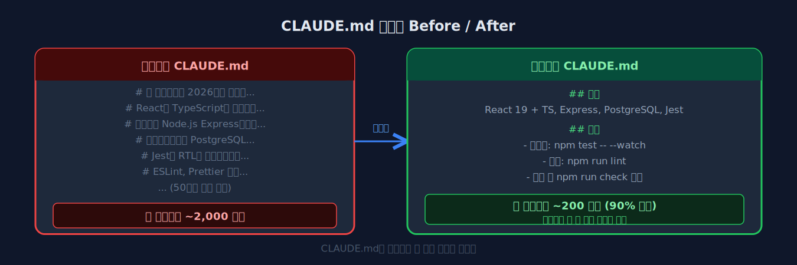
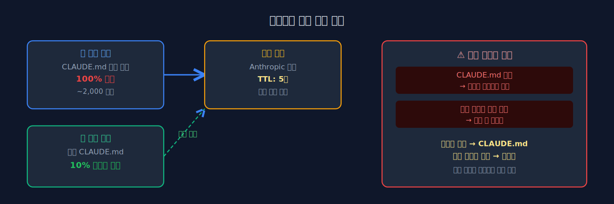
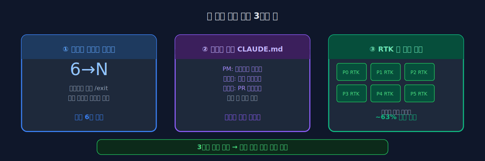

## 09-3. 토큰 최적화 심화

## 이 절에서 배우는 것

6장에서 RTK로 토큰을 기본적으로 아끼는 법을 다뤘다. 이 절에서는 RTK를 넘어서 Claude Code 자체의 설정과 사용 습관까지 손봐 토큰 소비를 최소화하는 심화 전략을 다룬다. 전략을 조합하면 RTK 단독보다 훨씬 높은 절약률을 달성할 수 있다.

> 💡 **왜 토큰 최적화가 중요한가?** Claude Code는 API를 호출할 때마다 토큰 수에 비례해 비용이 발생합니다. 6명 팀이 하루 종일 작업하면 수백만 토큰을 소비할 수 있습니다. 최적화하면 같은 일을 비용 절반으로 처리할 수 있어, 장기 프로젝트에서 비용 차이가 상당히 커집니다.

> 💡 **택시 요금 비유** 토큰은 택시 미터기와 비슷합니다. Claude에게 무언가를 요청할 때마다 미터기가 올라갑니다. 짧고 정확한 경로(지시)를 선택하면 요금이 낮고, 빙 돌아가는 경로(불필요한 파일 전체 읽기)를 선택하면 요금이 올라갑니다. 최적화는 "최단 경로 찾기"입니다.

<hr>

## 토큰이 소비되는 곳

Claude Code에서 토큰이 소비되는 주요 경로를 이해해야 최적화 포인트를 찾을 수 있다.

```
토큰 소비 구조
─────────────────────────────────────
[입력 토큰]
  ├── 시스템 프롬프트 (CLAUDE.md 등)
  ├── 대화 히스토리 (이전 메시지)
  ├── 도구 결과 (Bash 출력, 파일 내용)
  └── 컨텍스트 파일 (자동 로드)

[출력 토큰]
  ├── Claude의 응답 텍스트
  ├── 도구 호출 요청
  └── 사고 과정 (thinking)
```

여기서 제일 무거운 건 **도구 결과**와 **대화 히스토리**다. 이 둘만 줄여도 전체 토큰 소비의 60~70%를 절감할 수 있다.

결국 시스템 프롬프트, 대화 히스토리, 도구 결과, 컨텍스트 파일 이 네 갈래가 최적화의 급소다.

<hr>

**현재 토큰 소비 빠른 확인**

```bash
# 현재 세션에서 직접 확인
> /cost
```

출력 예시:
```
Input tokens:  45,230
Output tokens: 12,100
Cache read:    38,000 (84% hit rate)
Estimated cost: $0.42
```

이 수치를 기준으로 어떤 전략이 가장 효과적인지 판단한다.

<hr>

## 전략 1: CLAUDE.md 최적화

CLAUDE.md는 매 요청마다 시스템 프롬프트에 포함된다. 내용이 길수록 매번 더 많은 토큰이 소비된다.

### 비효율적인 예

```markdown
# CLAUDE.md
이 프로젝트는 2026년 1월에 시작된 웹 애플리케이션입니다.
React와 TypeScript를 사용하며, 백엔드는 Node.js Express입니다.
데이터베이스는 PostgreSQL을 사용합니다.
테스트는 Jest와 React Testing Library를 사용합니다.
린트는 ESLint, 포맷터는 Prettier를 사용합니다.
CI/CD는 GitHub Actions를 사용합니다.
배포 대상은 AWS ECS입니다.
...
(50줄의 일반적인 설명)
```

### 최적화된 예

```markdown
# CLAUDE.md
## 스택
React 19 + TS, Express, PostgreSQL, Jest

## 규칙
- 테스트: `npm test -- --watch`
- 린트: `npm run lint`
- 커밋 전 `npm run check` 필수
```

프레임워크 이름이나 라이브러리 목록은 `package.json`을 읽으면 알 수 있다. CLAUDE.md에는 **코드에서 알 수 없는 규칙과 관례**만 기록한다.

> 💡 **CLAUDE.md에 넣을 것 vs 빼야 할 것** 넣어야 할 것: 팀 규칙("PR에 반드시 테스트 포함"), 비표준 경로("로그는 /var/log/app에만"), 주의사항("X 함수는 스레드 불안전"). 빼야 할 것: 스택 목록(package.json에 있음), 일반 설명(Claude가 코드를 보면 알 수 있음), 주석으로 설명된 내용.



<hr>

**실전 CLAUDE.md 다이어트 절차**

1. 현재 CLAUDE.md의 줄 수 확인: `wc -l ~/.claude/CLAUDE.md`
2. 각 항목에 "Claude가 코드를 보면 알 수 없나?" 자문
3. 알 수 있는 항목 제거
4. 제거 전후 토큰 수 비교: 대화에서 `/cost` 비교

<hr>

## 전략 2: 대화 세션 관리

대화가 길어질수록 히스토리가 누적되어 입력 토큰이 증가한다.

### 작업 단위로 세션 분리

```bash
# 나쁜 예: 하나의 세션에서 모든 작업
claude
> 기능 A 구현해줘
> ...100턴의 대화...
> 기능 B도 해줘
> ...또 100턴...

# 좋은 예: 작업별 세션 분리
claude   # 세션 1: 기능 A
> 기능 A 구현해줘
> ...완료...
> /exit

claude   # 세션 2: 기능 B
> 기능 B 구현해줘
```

> 💡 **세션을 분리해야 하는 시점** 작업이 완전히 다른 영역으로 넘어갈 때(인증 구현 완료 → 결제 로직 시작), 이전 대화의 맥락이 더 이상 필요 없을 때, `/cost` 확인 시 히스토리 토큰이 전체의 50% 이상을 차지할 때입니다.

### /compact 명령어 활용

대화 중간에 컨텍스트를 압축하여 토큰 사용량을 줄일 수 있다.

```
> /compact
# Claude가 이전 대화를 요약하여 컨텍스트를 압축한다
# 이후 요청부터 입력 토큰이 줄어든다
```

긴 작업 중간에 주기적으로 `/compact`를 실행하면 누적 토큰을 억제할 수 있다.

> 💡 **/compact와 /clear의 차이** `/compact`는 대화를 요약·압축하여 맥락을 유지하면서 토큰을 줄입니다. `/clear`는 대화를 완전히 초기화합니다. 작업 중간에 맥락을 유지하면서 토큰만 줄이고 싶을 때는 `/compact`, 새 작업을 시작할 때는 `/clear`를 사용합니다.

<hr>

**세션 분리 타이밍 기준**

| 대화 길이 | 권장 액션 |
|-----------|---------|
| 20턴 이하 | 계속 진행 |
| 20~50턴 | `/compact`로 압축 |
| 50턴 이상 | `/exit` 후 새 세션 시작 |
| 작업 완료 | 반드시 `/exit` 후 새 세션 |

위 예처럼 하나의 긴 세션에 모든 작업을 몰면 히스토리가 누적되지만, 작업별로 세션을 분리하면 토큰을 크게 아낄 수 있다.

<hr>

## 전략 3: 도구 출력 최적화

도구 실행 결과는 입력 토큰의 가장 큰 부분을 차지한다.

### 파일 읽기 범위 지정

```bash
# 나쁜 예: 전체 파일 읽기 (2000줄)
# Claude가 Read 도구로 전체 파일을 읽음

# 좋은 예: 필요한 부분만 읽기
# "main.py의 45~60번 줄을 확인해줘"라고 지시
```

2000줄짜리 파일 전체를 읽으면 약 50,000 토큰이 소비될 수 있다. 같은 파일의 특정 구간 20줄만 읽으면 약 500 토큰이다. 지시만 구체적으로 해도 100배 차이가 난다.

### 검색 범위 제한

```bash
# 나쁜 예: 전체 프로젝트 검색
grep -r "function" .

# 좋은 예: 디렉토리와 파일 형식 제한
grep -r "function" src/services/ --include="*.ts"
```

전체 프로젝트 `grep`은 `node_modules` 안의 수천 개 파일까지 스캔해 결과가 수백 줄이 될 수 있다. 디렉터리와 확장자를 제한하면 결과가 핵심만 남는다.

### .claudeignore 활용

불필요한 파일을 Claude의 탐색 범위에서 제외한다.

```
# .claudeignore
node_modules/
dist/
build/
coverage/
*.min.js
*.map
*.lock
```

> 💡 **.claudeignore란?** `.gitignore`와 비슷한 개념으로, Claude Code가 파일을 탐색하거나 `ls`, `find` 명령을 실행할 때 제외할 경로를 지정합니다. `node_modules/`는 수천 개의 파일이 있어 탐색 결과가 매우 길어질 수 있습니다. 이 파일을 제외하면 파일 탐색 출력이 크게 줄어듭니다.

특히 `node_modules/`, `dist/` 같은 대용량 디렉토리를 제외하면 `ls`나 `find` 명령어의 출력이 크게 줄어든다.

<hr>

**.claudeignore 효과 측정**

```bash
# 설정 전: 전체 파일 수
find . | wc -l

# .claudeignore 설정 후: 탐색 대상 파일 수
# (Claude가 실제로 보는 파일 수와 비례)
find . -not -path "*/node_modules/*" -not -path "*/dist/*" | wc -l
```

전후 숫자 차이가 Claude에게 전달되는 출력 크기 차이다.

<hr>

## 전략 4: 프롬프트 캐싱 활용

Anthropic API는 프롬프트 캐싱을 지원한다. Claude Code에서는 자동으로 적용되지만, 원리를 알아 두면 더 잘 써먹을 수 있다.

```
캐시 적중 조건:
─────────────────────────────────────
시스템 프롬프트가 동일 + 대화 시작 부분이 동일
→ 캐시된 토큰은 비용 90% 할인

캐시가 깨지는 조건:
─────────────────────────────────────
CLAUDE.md 수정 → 시스템 프롬프트 변경 → 캐시 무효화
```

> 💡 **프롬프트 캐싱이란?** Claude에게 같은 내용(CLAUDE.md 등)을 매번 새로 전송하는 대신, 첫 번째 전송 후 Anthropic 서버가 그 내용을 5분간 "기억"하는 기능입니다. 같은 내용을 다시 보낼 때는 캐시에서 읽어 비용의 10%만 청구합니다. CLAUDE.md를 자주 수정하면 캐시가 무효화되어 이 혜택을 받지 못합니다.

CLAUDE.md를 자주 수정하면 캐시가 무효화되어 비용이 증가한다. 안정적인 내용은 CLAUDE.md에, 자주 변하는 지시는 대화에서 직접 전달하는 것이 유리하다.

<hr>

**캐시 히트율 높이는 실천 방법**

| 행동 | 캐시 효과 |
|------|----------|
| CLAUDE.md를 안정적으로 유지 | 캐시 유지 (90% 할인) |
| 작업 시작 직후 CLAUDE.md 수정 | 캐시 무효화 → 비용 증가 |
| 같은 세션에서 반복 요청 | 캐시 적중률 상승 |
| `/clear` 후 새 작업 | 캐시 새로 시작 (첫 요청만 비용 full) |



<hr>

## 전략 5: 팀 환경 토큰 관리

6개의 Claude Code 인스턴스를 동시 실행하면 토큰 소비가 6배로 늘어난다. 팀 환경에서의 토큰 관리 전략이다.

### 필요한 파인만 활성화

모든 팀원이 항상 필요한 것은 아니다.

```bash
# 현재 작업에 불필요한 파인의 Claude Code를 일시 중지
# 파인 자체는 유지하되 Claude를 종료
tmux send-keys -t team:0.3 "/exit" Enter
```

예를 들어 백엔드 API만 작성하는 스프린트라면, 디자이너(수아, Pane 3)는 활성화할 필요가 없다. 해당 파인의 Claude를 종료해 두면 그 파인의 토큰 소비가 0이 된다.

### 역할별 CLAUDE.md 최적화

각 팀원의 CLAUDE.md를 역할에 맞게 최소화한다.

```markdown
# 리뷰어 전용 CLAUDE.md (짧게)
## 역할
코드 리뷰어. 보안·성능·코드 품질 중심 리뷰.

## 명령어
- `gh pr diff {번호}` — PR 변경 사항 확인
```

PM에게는 아키텍처 문서 경로만, 개발자에게는 빌드 명령어만 포함하는 식으로 각 역할에 필요한 최소한의 정보만 담는다.

**역할별 최소 CLAUDE.md 예시:**

```markdown
# 개발자(서연) CLAUDE.md
## 환경
npm run dev, npm test, npm run lint

## 규칙
TypeScript strict mode. 타입 any 금지.
```

```markdown
# PM(민준) CLAUDE.md
## 역할
아키텍처 설계, 칸반 관리

## 참고
설계 문서: /docs/architecture.md
```

### RTK 팀 전체 적용

RTK 훅은 각 파인에서 독립적으로 동작한다. 모든 파인에 RTK가 적용되어 있는지 확인한다.

```bash
# 각 파인의 RTK 설정 확인
for i in 0 1 2 3 4 5; do
  echo "=== Pane $i ==="
  tmux send-keys -t team:0.$i "rtk --version" Enter
done
```



<hr>

## 토큰 사용량 모니터링

### RTK gain으로 확인

```bash
rtk gain
# 명령어별 토큰 절약량 확인

rtk gain --history
# 시간대별 추이 확인
```

출력 예시:
```
Command          Calls  Saved Tokens  Saved Cost
git status       142    28,400        $0.14
git diff         89     44,500        $0.22
ls -la           201    10,050        $0.05
────────────────────────────────────────────────
Total            432    82,950        $0.41  (63% saved)
```

### Claude Code 내장 사용량

대화 중 `/cost` 명령어로 현재 세션의 토큰 사용량을 확인할 수 있다.

```
> /cost
Input tokens:  45,230
Output tokens: 12,100
Cache read:    38,000 (84% hit rate)
Estimated cost: $0.42
```

> 💡 **Cache read 84% hit rate란?** 전체 입력 토큰 중 84%가 캐시에서 읽혀 10% 비용만 청구되었다는 의미입니다. CLAUDE.md가 안정적이고 대화 시작 부분이 반복될수록 히트율이 높아집니다.

<hr>

**주간 비용 추적 스크립트**

RTK 히스토리를 파일로 저장해 두면 주간 절감 추이를 확인할 수 있다.

```bash
# 주간 절감 현황 저장
rtk gain --history >> ~/token-savings-$(date +%Y%m%d).log
```

<hr>

## 최적화 효과 비교

| 전략 | 절약률 | 적용 난이도 |
|------|--------|-------------|
| RTK 적용 | ~63% | 낮음 (설치 후 자동) |
| .claudeignore 설정 | ~20-40% | 낮음 |
| CLAUDE.md 간소화 | ~10-15% | 낮음 |
| 세션 분리 + /compact | ~30-50% | 중간 (습관 필요) |
| 구체적 지시 습관 | ~20-30% | 중간 (습관 필요) |
| 불필요 파인 비활성화 | 해당 파인 100% | 낮음 |

이 전략들은 겹쳐 쓸 수 있다. RTK + .claudeignore + CLAUDE.md 간소화만 적용해도 전체 토큰을 절반 밑으로 떨어뜨릴 수 있다.

<hr>

**전략 적용 우선순위**

한꺼번에 모든 전략을 적용하려 하면 부담이 크다. 아래 순서로 하나씩 적용하면서 효과를 확인하는 것을 권장한다.

1. **RTK 설치** — 설치 후 자동 동작, 즉각적인 63% 절감
2. **.claudeignore 설정** — 파일 하나 추가, 20~40% 추가 절감
3. **CLAUDE.md 간소화** — 한 번 정리 후 유지
4. **세션 분리 습관** — 작업 완료 시 `/exit` 습관화
5. **구체적 지시 습관** — 파일 범위, 검색 범위 명시

위 표처럼 전략마다 절약률이 다르며, RTK·.claudeignore·CLAUDE.md 간소화만 겹쳐 써도 전체 소비를 절반 밑으로 떨어뜨릴 수 있다.

<hr>

## 요약

토큰 최적화는 RTK 같은 도구 적용만으로 끝나지 않는다. CLAUDE.md를 간결하게 유지하고, 대화 세션을 작업 단위로 분리하고, 도구 출력 범위를 제한하고, .claudeignore로 불필요한 파일을 제외하는 종합적인 접근이 필요하다. 팀 환경에서는 필요한 파인만 활성화하고 역할별로 최적화된 설정을 적용하면 6배의 토큰 소비를 효율적으로 관리할 수 있다. `/cost`와 `rtk gain`으로 주기적으로 소비량을 확인하면서 어느 전략이 가장 효과적인지 데이터로 판단하는 것이 핵심이다.
