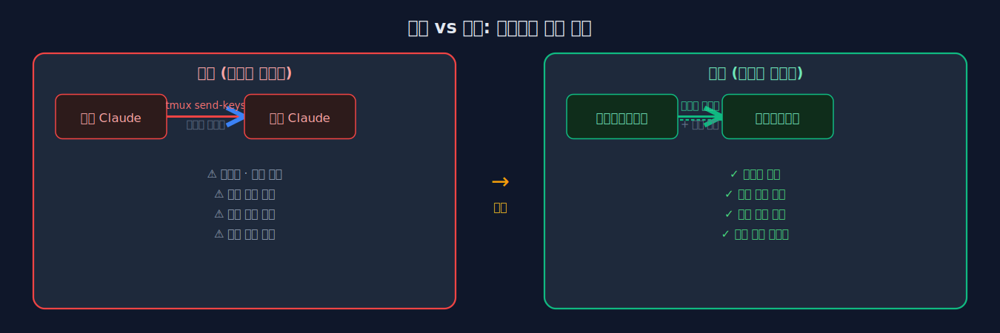
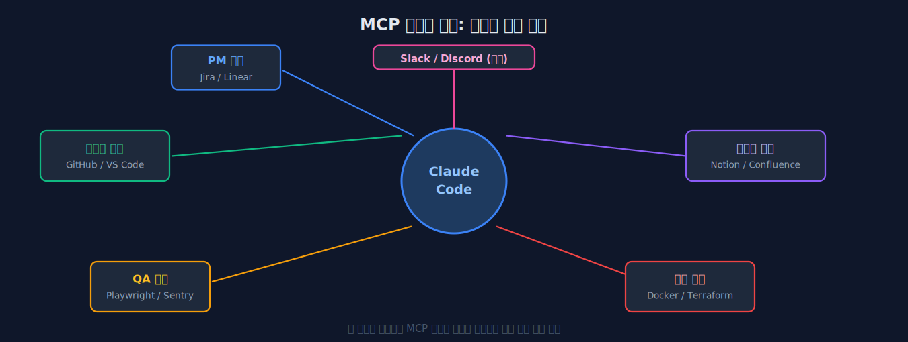
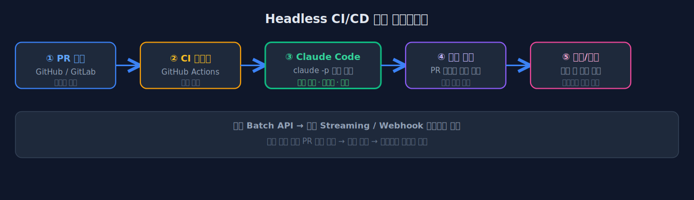
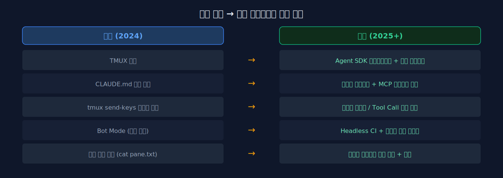
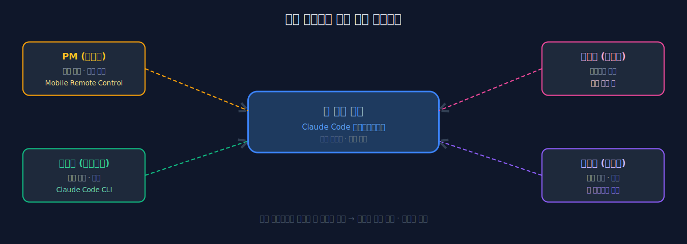
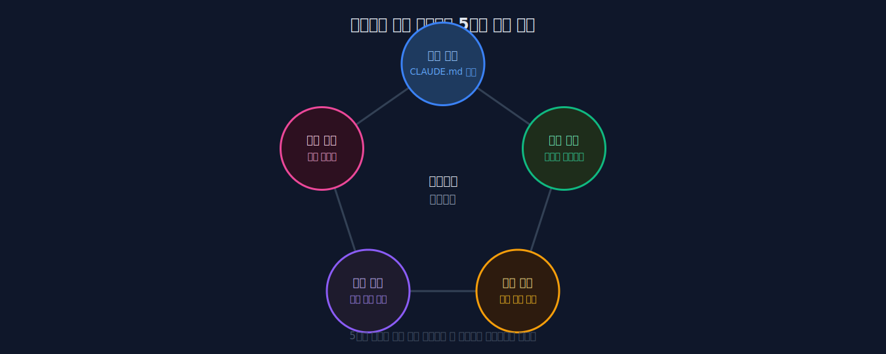

## 10-1. 앞으로의 발전 방향

## 이 절에서 배우는 것

이 책에서 다룬 TMUX + Claude Code + Remote Control 팀 에이전트 구성은 현재 시점에서 가능한 하나의 조합이다. AI 코딩 도구와 에이전트 기술은 빠르게 발전하고 있으며, 여기서 소개한 방법론의 각 구성 요소도 진화할 것이다. 이 절에서는 앞으로 주목할 발전 방향을 전망하고, 지금 익혀둔 기술이 미래에도 유효한 이유를 살펴본다.

<hr>

## Claude Code의 진화

### 에이전트 간 직접 통신

현재 팀 에이전트 간 통신은 `tmux send-keys`를 통한 텍스트 전달 방식이다. 향후 Claude Code가 에이전트 간 직접 통신 프로토콜을 지원하면 더 구조화된 협업이 가능해진다.

```
현재:
  팀장 → tmux send-keys → 팀원 (텍스트 기반)

미래:
  팀장 → Agent Protocol → 팀원 (구조화된 메시지)
  팀원 → Agent Protocol → 팀장 (구조화된 결과)
```

> 💡 **Agent Protocol이란?** 에이전트들이 서로 통신하기 위한 표준 규격입니다. 사람들이 공통 언어로 대화하듯, 에이전트들이 정해진 형식으로 작업을 주고받는 프로토콜입니다. 텍스트 기반 메시지보다 오류가 적고, 결과를 자동으로 처리할 수 있습니다.



### MCP (Model Context Protocol) 확장

MCP는 Claude Code가 외부 도구와 데이터 소스에 접근하는 표준 프로토콜이다. MCP 서버가 더 풍부해지면 각 팀원이 자신의 역할에 맞는 전문 도구를 직접 활용할 수 있다.

| 역할 | 현재 | MCP 확장 후 |
|------|------|-------------|
| PM | 파일 기반 문서 관리 | Jira/Linear MCP로 직접 티켓 관리 |
| 리서쳐 | 웹 검색 + 정리 | 사내 위키/Confluence MCP로 지식 검색 |
| 디자이너 | 마크다운 와이어프레임 | Figma MCP로 디자인 파일 직접 접근 |
| 개발자 | 코드 편집 + 테스트 | DB MCP로 스키마 직접 관리 |
| 리뷰어 | PR diff 읽기 | SonarQube MCP로 정적 분석 연동 |

> 💡 **MCP(Model Context Protocol)란?** Claude Code가 외부 서비스(Jira, Figma, 데이터베이스 등)와 직접 연결되도록 해주는 플러그인 규격입니다. USB처럼 다양한 도구를 꽂아 Claude Code의 기능을 확장합니다. MCP 서버가 늘어날수록 에이전트가 직접 할 수 있는 일이 많아집니다.



### Headless 모드 고도화

Claude Code의 비대화형 실행(`-p` 플래그, Stream JSON)이 더 성숙해지면 CI/CD 파이프라인과의 통합이 자연스러워진다.

```
GitHub PR 생성
    → CI 트리거
    → Claude Code 자동 실행 (코드 리뷰)
    → 결과를 PR 코멘트로 게시
    → 리뷰어에게 알림
```

> 💡 **Headless 모드란?** 사람이 직접 입력하지 않아도 Claude Code를 자동으로 실행하는 방식입니다. `claude -p "이 코드를 리뷰해줘"` 처럼 명령줄에서 바로 실행하면, 결과를 출력하고 종료합니다. CI 서버에서 자동으로 코드 리뷰를 실행하는 데 활용됩니다.



<hr>

## 멀티에이전트 프레임워크의 등장

현재 우리는 TMUX 파인으로 에이전트를 물리적으로 분리하고, 셸 스크립트로 조율하고 있다. 전용 멀티에이전트 프레임워크가 등장하면 이 과정이 더 체계적으로 변할 수 있다.

### 기대되는 기능

- **역할 정의 DSL**: 코드로 팀 구조와 역할을 정의
- **작업 큐**: 팀원 간 작업을 구조화된 큐로 전달
- **상태 추적**: 각 에이전트의 작업 상태를 대시보드로 확인
- **자동 조율**: 의존성 기반으로 작업 순서를 자동 결정

> 💡 **DSL(Domain Specific Language)이란?** 특정 목적을 위해 만들어진 전용 언어입니다. 예를 들어 "팀 구성을 코드로 정의한다"면, `agent("서연", role="developer", files=["src/"])` 같은 형태로 에이전트 설정을 표현하는 전용 문법이 될 수 있습니다.

### 현재 접근 방식의 가치

프레임워크가 등장하더라도 이 책에서 익힌 개념은 유효하다.

| 이 책에서 배운 것 | 프레임워크에서의 대응 |
|-------------------|----------------------|
| TMUX 파인 = 에이전트 격리 | 컨테이너/프로세스 격리 |
| CLAUDE.md = 역할 정의 | 에이전트 설정 파일 |
| tmux send-keys = 지시 전달 | 메시지 큐 / API 호출 |
| Bot Mode = 외부 연동 | 웹훅 / 이벤트 시스템 |

도구가 바뀌어도 **역할 분리, 작업 분배, 충돌 관리, 결과 종합**이라는 팀 운용의 본질은 동일하다.



<hr>

## Remote Control의 확장

### 멀티 디바이스 협업

현재 Remote Control은 단일 사용자가 모바일에서 접속하는 모델이다. 향후 여러 사용자가 동시에 같은 세션을 관찰하거나 제어할 수 있다면, 실시간 팀 협업 도구로 진화할 수 있다.

```
PM (태블릿) ──→ 아키텍처 문서 확인
    ↕ 동일 세션
개발자 (데스크톱) ──→ 코드 구현
    ↕
리뷰어 (모바일) ──→ 실시간 리뷰 코멘트
```

### 음성 제어

모바일 환경에서 텍스트 입력 대신 음성으로 지시를 전달하는 인터페이스가 추가되면, 이동 중이나 회의 중에도 팀을 제어할 수 있다.



<hr>

## 우리가 준비할 것

기술이 발전해도 기본기가 중요하다. 이 책을 통해 익힌 다음 능력은 어떤 도구에서도 통용된다.

1. **역할 설계**: 작업을 분해하고 적절한 역할에 배정하는 능력
2. **지시 작성**: 모호하지 않고 실행 가능한 지시를 작성하는 능력
3. **충돌 관리**: 병렬 작업에서 발생하는 충돌을 예방하고 해소하는 능력
4. **결과 검증**: 에이전트의 출력물을 평가하고 피드백하는 능력
5. **비용 인식**: 토큰 소비를 이해하고 최적화하는 습관

이것들은 특정 도구에 종속되지 않는 **에이전트 운용 리터러시**다.

> 💡 **에이전트 운용 리터러시란?** 글을 읽고 쓰는 능력인 "리터러시"처럼, AI 에이전트를 효과적으로 지휘하고 활용하는 능력을 뜻합니다. 특정 도구 사용법이 아니라, "역할을 어떻게 나누고, 어떻게 지시하고, 결과를 어떻게 검증할지"에 대한 근본 역량입니다. 도구가 바뀌어도 이 역량은 그대로 적용됩니다.



<hr>

## 요약

AI 에이전트 기술은 MCP 확장, 에이전트 간 직접 통신, 전용 멀티에이전트 프레임워크 등의 방향으로 발전하고 있다. 도구와 프로토콜은 바뀌지만, 이 책에서 다룬 역할 분리, 작업 분배, 충돌 관리의 원칙은 변하지 않는다. 현재의 TMUX + Claude Code 조합으로 실전 경험을 쌓는 것이 미래의 어떤 도구에서도 팀 에이전트를 효과적으로 운용하는 최선의 준비다.
