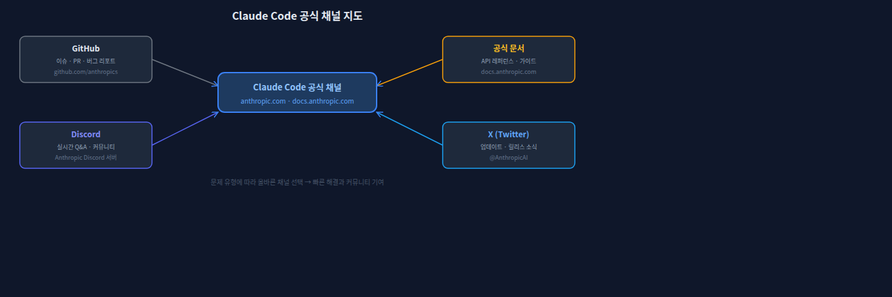
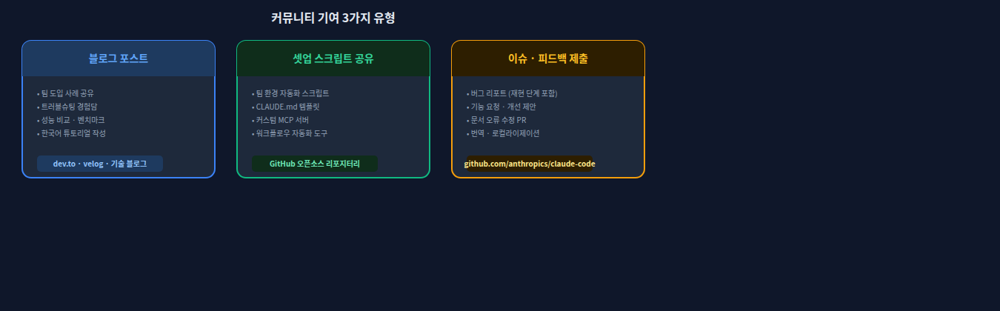
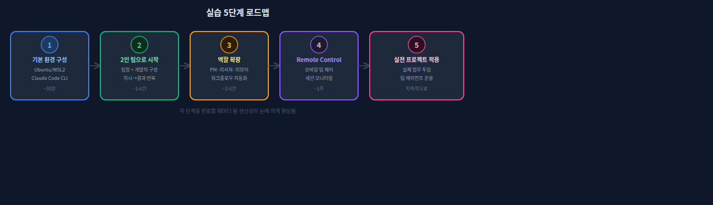

## 10-2. 커뮤니티 참여

## 이 절에서 배우는 것

혼자 배우는 것보다 커뮤니티에서 경험을 공유하고 피드백을 받는 것이 훨씬 빠르다. Claude Code와 AI 에이전트 분야는 활발하게 발전 중이며, 관련 커뮤니티도 빠르게 성장하고 있다. 이 절에서는 주요 커뮤니티와 참여 방법, 그리고 이 책의 내용을 효과적으로 실습하는 순서를 안내한다.

<hr>

## Claude Code 공식 채널

### GitHub 저장소

```
https://github.com/anthropics/claude-code
```

Claude Code의 공식 저장소다. 이슈 트래커에서 버그 리포트, 기능 요청, 질문을 할 수 있다.

| 활동 | 방법 |
|------|------|
| 버그 리포트 | Issues → New Issue → Bug Report |
| 기능 요청 | Issues → New Issue → Feature Request |
| 질문 | Issues → New Issue → Question |
| 코드 기여 | Fork → 수정 → Pull Request |

> 💡 **Pull Request(PR)로 기여하는 방법** 저장소를 본인 계정으로 복사(Fork)한 뒤, 수정사항을 커밋하고, 원본 저장소에 "이 변경을 반영해 달라"고 요청하는 것이 PR입니다. 오타 수정처럼 작은 기여부터 시작할 수 있습니다.

### Anthropic 공식 문서

```
https://docs.anthropic.com/en/docs/claude-code
```

Claude Code의 공식 문서다. Remote Control, 설정, 플래그, 권한 등 모든 기능의 상세 문서가 있다. 새 버전이 출시될 때마다 업데이트된다.

### Anthropic Discord

Anthropic 공식 Discord 서버에서 Claude Code 관련 채널을 찾을 수 있다. 실시간으로 질문하고 다른 사용자의 경험을 확인할 수 있다.

> 💡 **Discord란?** 음성·텍스트·커뮤니티 기능을 갖춘 채팅 플랫폼입니다. 개발자 커뮤니티에서 널리 사용되며, 채널별로 주제가 나뉘어 있어 Claude Code 관련 채널에서 실시간 질문·답변이 이루어집니다.



<hr>

## 관련 도구 커뮤니티

이 책에서 다룬 도구들의 개별 커뮤니티도 유용하다.

### TMUX

```
https://github.com/tmux/tmux
```

TMUX의 공식 저장소이자 커뮤니티. 고급 설정, 플러그인 개발, 성능 최적화 관련 이슈와 위키가 풍부하다.

### RTK (Rust Token Killer)

RTK 저장소의 이슈 트래커에서 새로운 명령어 필터 요청, 절약률 개선 아이디어, 훅 통합 관련 논의에 참여할 수 있다.

### gstack / superpowers / GSD

Claude Code 플러그인 생태계의 도구들이다. 각 저장소에서 플러그인 사용법, 커스텀 스킬 작성, 워크플로우 공유가 이루어진다.

<hr>

## 경험 공유 방법

### 블로그 포스트

자신만의 팀 에이전트 구성과 운용 경험을 블로그에 기록하면 커뮤니티에 큰 도움이 된다. 특히 다음 주제가 인기 있다.

- 실제 프로젝트에서의 팀 에이전트 적용 사례
- 토큰 최적화 전/후 비용 비교
- 특정 워크플로우 자동화 레시피
- 충돌 관리 실패와 교훈

### 셋업 스크립트 공유

팀 환경 셋업 스크립트를 공개 저장소에 공유하면 다른 사용자가 빠르게 시작할 수 있다.

```bash
# 예시: 셋업 스크립트 저장소 구조
team-agent-starter/
├── setup-team.sh        # 팀 환경 구성
├── check-team.sh        # 상태 점검
├── claude-md/
│   ├── leader.md        # 팀장 CLAUDE.md
│   ├── pm.md            # PM CLAUDE.md
│   ├── developer.md     # 개발자 CLAUDE.md
│   └── reviewer.md      # 리뷰어 CLAUDE.md
├── workflows/
│   ├── feature-dev.sh   # 기능 개발 워크플로우
│   ├── hotfix.sh        # 핫픽스 워크플로우
│   └── code-review.sh   # 코드 리뷰 워크플로우
└── README.md
```

### CLAUDE.md 템플릿 공유

역할별로 검증된 CLAUDE.md 템플릿을 공유하면 다른 팀이 시행착오를 줄일 수 있다. 어떤 규칙이 효과적이었는지, 어떤 규칙이 불필요했는지 경험을 포함하면 더 가치있다.



<hr>

## 학습 리소스

### 공식 자료

| 자료 | 내용 |
|------|------|
| Anthropic 문서 | Claude Code 전체 기능 레퍼런스 |
| Claude Code 릴리즈 노트 | 버전별 변경 사항 |
| Anthropic 블로그 | 새 기능 소개, 사용 사례 |

### 실습 권장 순서

이 책의 내용을 실습할 때 권장하는 5단계 순서다. 한 단계씩 완료를 확인하며 다음으로 넘어가는 것이 중요하다.

**1단계: 기본 환경 구성**
```
Ubuntu + Claude Code + TMUX 설치 완료 확인 (2~3장 참고)
```

**2단계: 2인 팀으로 시작**
```
팀장(Pane 0) + 개발자(Pane 1) 구성
간단한 작업 지시 → 결과 확인 반복
```

> 💡 **왜 2인 팀부터 시작할까요?** 6인 팀을 바로 구성하면 복잡도가 높아 문제가 생겼을 때 원인을 찾기 어렵습니다. 팀장과 개발자 2명으로 먼저 통신과 작업 분배를 익히고, 점진적으로 역할을 추가하면 학습 곡선이 훨씬 완만해집니다.

**3단계: 역할 확장**
```
PM, 리서쳐, 리뷰어 순서로 추가
각 역할 추가 후 워크플로우 자동화 실습
```

**4단계: Remote Control 연동**
```
모바일에서 팀 제어 실습
세션 목록 확인 → 지시 전달 → 결과 모니터링
```

**5단계: 실전 프로젝트 적용**
```
실제 업무 프로젝트에 팀 에이전트 투입
1개 Phase를 팀과 함께 완주
```



2인 팀부터 시작하여 점진적으로 확장하는 것이 학습 곡선을 완만하게 한다.

<hr>

## 피드백과 개선

이 책의 내용에 대한 피드백, 오류 제보, 개선 제안도 환영한다. 실제 운용 경험에서 발견한 더 나은 방법이 있다면 공유해주길 바란다.

AI 에이전트 팀 운용은 아직 초기 단계다. 정답이 확립되지 않은 분야이기에 각자의 시행착오와 발견이 모두에게 가치 있다. 커뮤니티에 참여하여 함께 이 분야를 발전시켜 나가길 바란다.

<hr>

## 요약

Claude Code와 AI 에이전트 커뮤니티는 GitHub, Discord, 블로그 등 여러 채널에서 활발하게 운영되고 있다. 자신의 경험을 공유하고, 다른 사용자의 사례에서 배우고, 셋업 스크립트와 CLAUDE.md 템플릿을 교환하면 개인과 커뮤니티 모두가 성장한다. 2인 팀부터 시작하여 점진적으로 확장하는 것이 가장 효과적인 학습 경로다.
